# А

## АБАК*А*

текстильный банан (_Musa textilis_), многолетнее травянистое растение рода банан. Родина — Филиппинские о-ва; культивируют гл. обр.
там же для получения из влагалищ листьев прочного волокна, наз. также А., или манильской пенькой.

## АББРЕВИ*А*ЦИЯ

(от лат. abbreviatio — сокращение, укорочение), сокращение числа стадий развития органов или их частей у животных организмов. Термин
«А.» ввёл Б. С. Матвеев (1930), А. Н. Северцов называл это явление отрицат. _анаболией_. А. происходит в результате выпадения конечных стадий онтогенеза
при _неотении_ или _фетализации_ и приводит к недоразвитию или редукции органов в филогенезе.

## АБДОМИН*А*ЛЬНЫЙ

(от лат. abdomen — живот, брюхо), относящийся к животу, расположенный на брюшной стороне (у членистоногих — на брюшке).
Напр., А. поры — отверстия целома, находящиеся на брюшной стороне тела у круглоротых и рыб. Ср. _Вентральный_.

## АБИОГЕНЁЗ

(от греч. а — отрицат. частица, 0и0... И ...2енез), образование
органич. соединений, распространённых
в живой природе вне организма, без уча-
стия ферментов. В широком смысле А.—
возникновение живого, т. е. исходная
гипотеза совр. теории происхождения
жизни. В сер. 20 в. экспериментально
осуществлён абиогенный синтез белково-
подобных и др. органич. веществ в усло-
виях, воспроизводящих условия перво-
бытной Земли. Ср. Биогенез.

## АБИОТИЧЕСКАЯ СРЕДА

(от греч. а — отрицат. частица и РЮИКо$ — жизнен-
ный, живой), совокупность неорганич.
условий (факторов) обитания организ-
мов. Факторы А. с. можно разделить на
химич. (состав атмосферного воздуха,
содержание в нём разл. примесей, состав
мор. и пресных вод, донных отложений,
грунта, почвы) и физич. (темп-ра возду-
ха, воды, барометрич. давление, господ-
ствующие ветры, течения, инсоляция,
характер субстрата, радиац. фон ит. д.).
Численность и распределение живых
форм в пределах их ареала часто зависят
от лимитирующих абиотич. факторов, не-
обходимых для существования организ-
мов, но представленных в минимуме,
напр. вода в пустыне (см. Либиха закон).
Организмы в результате историч. разви-
тия в конкретных условиях А. с. приспо-
сабливаются к опрелел. комплексу фак-
торов (к-рые становятся порой непремен-
ными условиями их существования) и
в процессе жизнедеятельности сами из-
меняют А. с. (поддержание в атмосфере
соотношения СО? и О»>, очистка воды жи-
вотными-фильтраторами от взвесей, из-
менение гидротермич. режима под поло-
том леса, образование почв и т. д.).

## АБИССАЛЬ

(от греч. &Бу$$05 — бездонный), зона мор. дна, соответствующая
глубинам океанич. ложа (3000—6000 м).
Занимает более 75% площади дна океа-
на. Условия жизни в А. устойчивы, ха-
рактеризуются отсутствием света, посто-
янными темп-рой (1—2 °С), солёностью
(ок. 35%) и гидростатич. давлением
(30—60 МПа, или 300—600 атм), преоб-
ладанием илистых грунтов. Животный
мир А. (бентос) существует за счёт орга-
нич. вещества, поступающего из поверх-
ностных слоёв океана в виде детрита,
фекалий и остатков отмирающих живот-
ных (т. н. дождь трупов), а вблизи кон-
тинентального склона Также за счёт сно-
са растит. и животных остатков с богатых
жизнью мелководий. Большинство по-
стоянных обитателей А., особенно её
ниж. горизонтов, стенобатны, т. к. не мо-
гут выдерживать сильных изменений
гидростатич. давления и существовать на
меньших глубинах. Из-за высокого дав-
ления и скудности пищ. ресурсов фауна
А. сильно обеднена. Хотя в А. представ-
лено большинство крупных систематич,
групп мор. животных, число видов не
превышает неск. тысяч (1,5—3% видов
мор. фауны). Наиболее характерны для
А. голотурии (особенно отряда Е!аз!ро4а),
мор. звёзды РогсеПапазегЧае, стебель-
чатые мор. лилии, нек-рые двустворча-
тые моллюски, многощетинковые черви,
равноногие раки, бокоплавы, стеклянные
губки, ряд рыб. У мн. абиссальных ви-
дов выработались нек-рые общие особен-
ности, напр. низкая плодовитость, позд-
нее созревание, большая продолжитель-
ность жизни и др. Биомасса бентоса в А.
эвтрофных р-нов обычно не превышает
1 г/м?, в А. олиготрофных падает до
0,01—0,05 г/м? и менее. Фотосинтези-
рующих растит. организмов в А. нет,
микрофлора представлена гетеротрофны-
ми и хемосинтезирующими бактериями
и низшими грибами. Толщу воды в пре-
делах глубин А., населённую пелагич.
животными, наз. абиссопелаги-
алью. См. схему 1 при ст. Экологиче-
ская зональность водоёмов.

## АБОРАЛЬНЫЙ

(от лат. аБ — от и 05,род. п. ог15 — рот), обращённый в сто-
рону, противоположную ротовому отвер-
стию, находящийся на противоположной
рту стороне. Напр., А. орган — орган
равновесия гребневиков, находящийся на
полюсе, противоположном тому, на к-ром
расположен рот. Аборально-оральная
ось — задне-передняя ось тела. Ср.
Оральный.

## АБОРИГЕНЫ

(от лат. аБ огеше — от начала), коренные обитатели (люди, жи-
вотные, растения) к.-л. территории, стра-
ны. См. Автохтоны.

## АБРИКОС (Аттетаса)

род деревьев и_ кустарников сем. розовых. Выс. до
15 м. Листья от удлинённо-овальных до
сердцевидных, с зубцами на вершине, на
длинных черешках, цветки одиночные,
белые или розовые, распускаются раньше
листьев. Плод — сочная костянка. 10
видов, преим. в горных р-нах умеренного
пояса Азии. В СССР — 6 видов, в Ср.
Азии, Вост. Сибири, на Д. Востоке.
Неск. видов широко культивируют. А.
обыкновенный, или культурный (А. ои1-
9а75), разводят во мн. странах умерен-
ного пояса, в СССР — в Ср. Азии, на
Кавказе, в Крыму и др. р-нах на Ю.
Украины, в Молдавии. Растения свето-
и теплолюбивые, жаровыносливые, засу-
хоустойчивые. А. сибирский (А. са)
и А. маньчжурский (А. тапазвитса) —
морозостойки. Плоды употребляются в
свежем, сушёном виде и идут на перера-
ботку. В Китае, в Ср. Азии в культуре
св. о тыс. лет, в Юж. Европе — 2 тыс.
лет. А. обыкновенный (дикий) и А. мань-
чжурский — в Красной книге СССР.

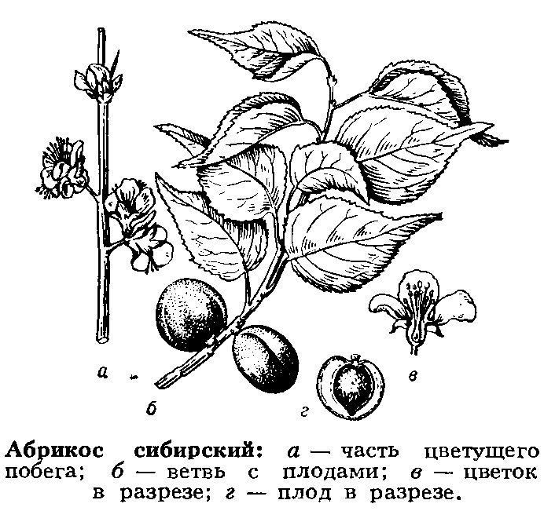

## АБСЦИЗОВАЯ КИСЛОТА

гормон растений. По химич. природе — изопрено-
ид. Индуцирует и увеличивает период
покоя, ускоряет образование отделитель-
ного слоя при опадении листьев, тормо-
зит рост отрезков стеблей и колеоптилей.
Накапливается осенью в семенах и поч-
ках. Уровень А. к. в тканях зависит от
соотношения её синтеза и распада (окис-
ления) или связывания (гликозидирова-
ния). Биосинтез А. к. и гормонов роста —
гиббереллинов происходит из общего ме-
таболич. предшественника — мевалоно-
вой к-ты. Предполагают, что существует
система переключения путей превраще-
ния мевалоновой к-ты в А. к. или в гиб-
береллины, регулируемая избытком од-
ного из этих продуктов. Препарат А. к. ис-
пользуется для изучения Торможения
ростового процесса.

## АБУТИЛОН (АБиёоп)

род растений сем. мальвовых. Травы (6. ч. многолет-
ние), кустарники, полукустарники, ред-
ко небольшие деревья. Листья обычно
цельные. Цветки 6. ч. крупные, одиноч-
ные или в пазушных соцветиях, у мн.
видов опыляются колибри. Плод дроб-
ный. Св. 100 видов, в тропич., субтропич.
и отчасти умеренных поясах. А. Теофра-
ста, канатник, или китайский джут
(А. Теорйгази),— однолетнее самоопы-
ляющееся растение выс. до 1,5 м (в куль-
туре до 4 м), с крупными сердцевидными
листьями и жёлтыми цветками. Растёт
от Средиземноморья до вост. побережья
Азии, интродуцирован в Сев. Америку и
Австралию; в СССР — единств. вид рода,
на юге Европ. части, на Кавказе, в Ср.
Азии и на юге Д. Востока, засоряет посе-
вы. С древности культивируется в Китае
и ряде др. стран для получения волок-
на. Из семян добывают технич. масло.
Нек-рые виды А. разводят как декоратив-
ные.

## АВДОТКОВЫЕ (Вог ш!9ае)

семейство журавлеобразных (иногда относят к
ржанкообразным). Дл. 40—57 см. Ноги
трёхпалые. Оперение защитной «пустын-
ной> окраски. Обитатели степей, пустынь,
берегов рек и морей. Активны в сумерки
и ночью, хорошо бегают и летают. Моно-
гамы. 3 рода, 9 видов, в осн. в тропиках
и субтропиках (кроме Сев. Америки);
в СССР 1 вид — авдотка (Вит тиб оеа:-
спетиз), на песчаных пустошах и по
берегам рек и озёр от Ю. Белоруссии до
оз. Зайсан. Перелётные птицы. В кладке
2 яйца. Питается пасекомыми.

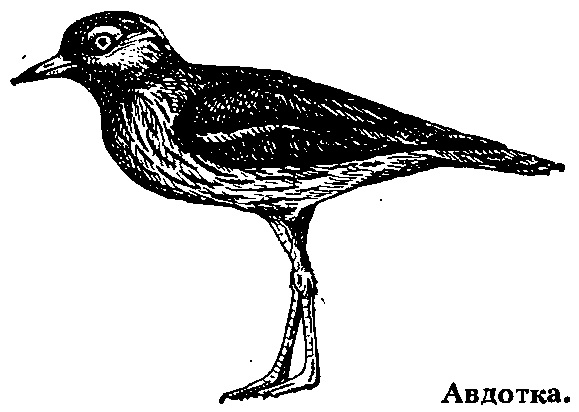

## АВИДНОСТЬ

антител (от лат. ау1-
4и5 — жадный), мера способности гетеро-
генной смеси антител связываться с соот-
ветствующим макромолекулярным (поли-
детерминантным) антигеном; осн. ха-
рактеристика иммунных сывороток, напр.
антитоксических. Характеризуется проч-
ностью образующихся комплексов анти-
ген — антитело. А. иммунной сыворот-
ки зависит от аффинности содержащих-
ся в ней антител, т. е. является усреднён-
ной аффинностью.

## АВОКАДО

персея американская (Ретзеа атейсапа), растение сем.
лавровых. Вечнозелёные деревья выс.
8—10 (ло 20—25) м, с крупными (до
600 г) грушевидными плодами, исполь-
зуемыми в пищу. Внутри мякоти нахо-
дится косточка величиной с крупный
грецкий орех. Для плодов и семян ха-
рактерно высокое содержание жиров
(до 30%). Растёт на Ю. Сев. Америки и
в Юж. Америке, в лесах по склонам гор.
Возделывают в тропиках и субтропи-
ках — в США (Калифорния, Флорида),
Бразилии, Аргентине, Австралии, на Ку-
бе, Гавайских о-вах и др.; в СССР, —
на Черномор. побережье Кавказа.

## АВРАН (СтаНоа)

род растений сем. норичниковых. Травы с супротивными ли-
стьями, одиночными цветками в пазухах
листьев. Ок. 20 видов, в умеренных поя-
сах и горах тропиков, в СССР — 2 вида.
Евразиатский вид А. лекарственный (С.
оста) встречается на сырых местах;
все части растения ядовиты (содержат
гликозид грациолин); применяется в ме-
дицине. и

## АВСТРАЛИЙСКИЕ СТРАННИКИ (РеЧ1опотАае)

семейство журавлеобразных. Близки к трёхперстковым, но в от-
личие от них имеют задний палец, яйца
грушевидной, а не овальной формы. Дл.
15—17 см. Крылья и хвост короткие,
летают плохо. Единств. вид — Рефопо-
ти; Ютдиа из. Населяет сухие степи
Ю.-В. Австралии. Образ жизни назем-
ный, скрытный. Часть популяции миг-
рирует (отсюда назв.). Питаются семе-
нами и насекомыми. В кладке обычно
А яйца. Насиживает и водит птенцов
самец. о ,

## АВСТРАЛИЙСКОЕ ФЛОРИСТИЧЕСКОЕ ЦАРСТВО (Ацз{га!1$)

занимает Австралию и прилежащие острова. Фло-
ра отличается высоким  эндемизмом,
включая 12 эндемичных семейств — пла-
тизомовые (Р1эуготабасеае), давидсо-
ниевые (Бау!4зотасеае), цефалотовые
(Серва|обасеае), брунониевые (Вгапоша-
сеае) и др. В состав флоры царства вхо-
дит ок. 1500 родов, в т. ч. 115 родов
папоротников, 4 саговников, 11 голосе-
менных, 320 однодольных, ок. 1000 дву-
дольных; 30% родов и св. 80% видов —
эндемики. Ядро австрал. флоры возник-
ло из элементов древней голантарктич.
флоры, но изоляция Австралии с эоцена
и ксерофилизация флоры привели к вы-
работке эндемичных видов и групи в сем.
питтоспоровых (РИбозрогасеае), эпакри-
довых (Ерасг!Часеае), миопоровых (Муо-
рогасеае) и др. Свидетельством связи
с флорой Юж. Америки (через Антарк-
тиду) является существование общих для
обоих континентов семейств (араукарие-
вые, подокарповые, винтеровые, протей-
ные) и родов (нотофагус, Небе, опапа).
Связи с флорой Юж. Африки, видимо,
прервались ещё в меловом периоде и
в очень слабой мере могли продолжаться
позднее через Мадагаскар и Индию. На
С. царства заметно влияние палеотро-
пич. флоры. Во флоре А. Фф. ц. домини-
руют акации и эвкалилты; большую
роль играют многочисл. представители
сем. миртовых (ок. 1300 видов), бобовых
(ок. 1500), осоковых (530), а также ор-
хидных, рутовых, стеркулиевых и др.
Нек-рые эндемики, в осн. засухоустойчи-
вые деревья и кустарники (почти весь
род эвкалинтов и мн. акации), распро-
странены в культуре по всему миру.
А. Ф. ц. разделяется на 3 области: Северо-
восточноавстралийскую, Юго-западноав-
стралийскую, Центральноавстралийскую
(Эремейскую). См. карту при ст. Фло-
ристическое районирование.

## АВСТРАЛОПИТЕКОВЫЕ (Ацз{га]10рИБестае)

подсемейство вымерших человекообразных обезьян, обычно вклю-
чаемое в сем. гоминид. 3 вида — зинд-
жантрои, парантроп, плезиантроп. Геол.
возраст находок А. датируется концом
плиоцена и началом плейстоцена. Костные
остатки обнаружены (начиная с 1924)
в Юж. Африке, в Вост. Африке —
в ущелье Олдовай (Танзания), в долине
р. Омо и в местности Хадар (Эфиопия),
в р-не оз. Рудольф (Кения). А. имели
небольшое тело (дл. 120—130 см), массу
30—40 кг, объём мозга составлял 500—
600 смз; передвигались на двух ногах.
Наряду с растительной потребляли мяс-
ную пищу. Обитали в открытой местно-
сти типа саванн. В качестве орудий защи-
ты, нападения и добывания пищи могли
использовать палки, камни. А., вероят-
но, жили группами, в к-рых существо-
вало распределение обязанностей, напр.
самки заботились о детёнышах, самцы
охотились, охраняли группу. По мнению
мн. антропологов, наиболее прогрессив-
ные А. (презинджантропы) перешли к из-
готовлению орудий, создав самую ран-
нюю культуру каменного века — олдо-
вайскую, или галечную, и стали, Т. о.,
древнейшими людьми. А. рассматривают
и как стадию эволюции человека, непос-
редственно предшествовавшую  возник-
новению древнейших людей (архантро-
пов); вопрос остаётся дискуссионным.

## АВТО...

азуто... (от греч. аиб0$ —
сам), часть сложных слов, соответствую-
щая по значению основе «само...» или сло-
вам «свой», «собственный», «автома-
тический» (напр., автогамия, автолиз).

## АВТОГАМИЯ

(от авто... и ...гамия)
1) одна из форм самоопыления и самооп-
лодотворения у высших растений; 2) са-
мооплодотворение у одноклеточных ор-
ганизмов (гл. обр. у простейших), при
к-ром сливаются два сестринских гапло-
идных ядра в общей цитоплазме.

## АВТОГЕНЁЗ

(от авто... и ...генез), идеалистич. концепция в эволюц. учении,
рассматривающая эволюцию как процесс
развёртывания предсуществующих  за-
датков, носящий целенаправленный ха-
рактер и происходящий на основе изна-
чальных внутренних потенциальных воз-
можностей. Автогенетич. характер носят
учения о градации Ж. Б. Ламарка,
аристогенез Г. Осборна, батмогенез
Э. Копа, ортогенез Т. Эймера, номогенез
Л. С. Берга и др. Доказательства автоге-
нетич. тенденций эволюции сторонники
А. видят в явлениях эволюц. паралле-
лизма и конвергенции. А. противопостав-
ляется эктогенезу.

● Ф Завадский К. М., Развитие эво-
люционной теории после Дарвина (1859—
1920-е 1г.), Л., 1973; Филипчен-
ко Ю. А., Эволюционная идея в биологии,
3 изд., М., 1977.

## АВТОЛИЗ

зутолиз (от авто... и ...Лиз), самопереваривание тканей,
клеток или их частей под действием их
собственных ферментов у животных, рас-
тений и микроорганизмов. А. происхо-
дит в организме при ряде физиол. про-
цессов, напр. при метаморфозе, автото-
мии, инволюции матки после родов,
молочных желёз после окончания секре-
ции молока, при воспалит. и иммуноло-
гич. реакциях, в очагах омертвения,
в клетках злокачеств. новообразований,
при разложении тканей, а также при
механич. измельчении тканей. А. микро-
организмов наблюдается при старении
микробной культуры, повреждении кле-
ток биол., химич., физич. агентами.
При делении клеток А. подвергаются
отд. участки цитоплазматич, мембран.
А. происходит и при технологич. процес-
сах — ферментации табака, чая, сило-
совании кормов и др.

## АВТОМАТИЗМ

(от греч. аиёбта0$ — самодействующий, самопроизвольный),
способность клеток, органов или целост-
ного организма к ритмич. деятельности
при отсутствии внешних побудит. факто-
ров. Примерами А. могут служить дви-
жение протоплазмы в растит. клетках,
мерцание ресничного аппарата у беспоз-
воночных, сокращения сердца, извлечён-
ного из организма, в присущем ему рит-
ме. В основе А. лежит цикличность мета-
болич. процессов в клетках или деятель-
ности систем возбудимых клеток (нерв-
ных, мышечных). У высокоразвитых жи-
вотных А. проявляется также в виде
стереотипных действий (напр., движения
конечностей, шеи, туловища при ходьбе),
последовательность которых определя-
ется работой соотв. отделов ЦНС. А.
поведенческих актов животных и чело-
века связан с выработкой в процессе
научения динамич. стереотипа условных
рефлексов, к-рый лежит в основе при-
способления организма к постоянным
факторам внеш. среды. См. также Био-
логические ритмы.

## АВТОСПОРЫ

(от авто... и споры), апланоспоры у нек-рых хлорококковых
водорослей, формирующиеся бесполым
путём внутри материнской клетки и
подобные ей по форме.

## АВТОТОМИЯ

аутотомия (от авто... и греч. {офё — отсечение), само-
произвольное отбрасывание конечностей,
хвоста или др. частей тела, наблюдаемое
у мн. животных при резком их раздра-
жении, напр. при схватывании хищни-
ком. А. свойственна мн. беспозвоночным;
нек-рые гидроидные полипы и актинии
могут отбрасывать щупальца, немертины
и кольчатые черви — конец тела, морские
лилии, морские звёзды и др. иглоко-
жие — лучи, моллюски — сифоны, рако-
образные — клешни и целые конечности.
Из позвоночных А. наблюдается лишь у
нек-рых ящериц, к-рые могут отбрасы-
вать хвост. А.— защитная реакция, в
основе к-рой лежит рефлекторный про-
цесс. У ящериц, напр., А. управляется
нервным центром, расположенным в
спинном мозге, а отделение хвоста про-
исходит при резком сокращении мышц
в том месте позвоночника, где находится
поперечная хрящевая пластинка. А.
обычно связана со способностью восста-
навливать утраченные части тела — ре-
генерацией, к-рая легче всего происхо-
дит_в месте А.

## АВТОТРОПИЗМ

(от авто... и тропизм), самопроизвольное устранение излишнего
изгиба осевых органов растений после
прекращения действия фактора, вызвав-
шего его (геотропич. или тигмотропич.
индукция). Напр., выпрямление стеблей
злаков, полёгших от дождя.

## АВТОТРОФНЫЕ ОРГАНИЗМЫ

автотрофы (от авто... и ...троф),
организмы, использующие для построе-
ния своего тела СО»2 в качестве единст-
венного или гл. источника углерода и
обладающие как системой ферментов
для ассимиляции СО:, так и способ-
ностью синтезировать все компоненты
клетки. Нек-рые А. о. могут нуждаться
в экзогенных (поступающих извне) ви-
таминах или факторах роста. А. о. про-
тивопоставляются гетеротрофным орга-
низмам, использующим экзогенные орга-
нич. вещества. К А. о. относятся назем-
ные зелёные растения, водоросли, фото-
трофные бактерии, способные к фотосин-
тезу, а также нек-рые бактерии, исполь-
зующие окисление неорганич. веществ —
кемоавтотрофы (см. Хемосинтез). По-
давляющее большинство А. о. ассимили-
рует СО» через восстановительный пенто-
зофосфатный путь. У нек-рых бактерий,
напр. метанобразующих, СО2 ассими-
лируется иным путём. Обсуждается воз-
можность отнесения к А. о. бактерий,
использующих в качестве источника угле-
рода метан. А. о.— первичные проду-
центы органич. вещества в биосфере,
образующие первый трофич. уровень
в сообществах. Роль фотосинтезирую-
щих А. о. в природе является опреде-
ляющей, т. к. они образуют осн. массу
органич. вещества в биосфере — ок.
162. 10° т/год, в т. ч. 2/з дают наземные
растения (см. Первичная продукция).
Вклад др. групи А. 0. количественно не-
велик. Деятельностью А. о. определяется
как существование всех др. организмов,
так и ход биогеохимич. циклов в круго-
вороте веществ в природе.

## АВТОХОРИЯ

(от авто... и ...хория),
распространение диаспор без участия
к.-л. агентов. Осуществляется в двух
осн. формах: 1) самопроизвольное опа-
дение спелых диаспор (плодов, семян
и т. п.) под собственной тяжестью (ба-
рохория); 2)активное разбрасывание се-
мян (в радиусе от 1 до 15 м) при внезап-
ном вскрывании плодов вследствие высо-
кого и неравномерного напряжения тка-
ней в околоплоднике (автомеханохория).
Эта форма А. присуща и сочным плодам
(нек-рые тыквенные, бальзаминовые), но
чаще сухим (бобовые, гераниевые, виды
фиалки и др.). Ср. Аллохория.

## АВТОХТОНЫ

(от авто... и греч. с фоп — земля), аборигены, орга-
низмы, со времени своего становления
обитающие в данной местности. Напр.,
утконос, эвкалипт — А. Австралии, ди-
кий картофель — А. Юж. Америки.
обычно составляют древнее ядро к.-л.
флоры или фауны. Вопрос об А. может
рассматриваться на разном систематич.
уровне: так, виды-А. могут принадлежать
к родам-аллохтонам, напр. для Кавказа
ряд видов аллохтонного рода первоцвет
являются А. Ср. Аллохтоны.

## АГАВА (Адаое)

род растений сем. агавовых. Стебель укороченный, с розеткой
‚ крупных колючих листьев. Цветёт один
раз в жизни, на 6—15-м году (редко поз-
же), образуя цветонос дл. до 12 м с мно-
гочисл. цветками (до 17 тыс.), после
чего отмирает. У нек-рых А. от корневищ
отрастают новые растения. Св. 300 ви-
дов, в Мексике и прилегающих р-нах. А.
американская (А. атемсапа) завезена
в Европу вскоре после открытия Амери-
ки. Культивируется как декор. растение
’ в Средиземноморье, в СССР — на Юж.
_ берегу Крыма и Черномор. побережье
Кавказа. Из сладкого сока, собранного
перед цветением, готовят пульке — нац.
напиток Мексики. Мн. виды, особенно
А. сизалевая (А. 5щапа), используются
для получения волокна, изготовления бу-
маги, а также в медицине.

## АГАВОВЫЕ (Авауасеае)

семейство 6. ч. древовидных растений порядка лилей-
ных. Листья обычно сидячие, у основа-
ния стебля или близ него, узкие, часто
мясистые. Цветки, как правило, обоепо-
лые, крупные, в колосьях, кистях или
метёлках. 20 родов, в т. ч. агава, юк-
ка, драцена; ок. 700 видов, в тропич. и
субтропич. поясах обоих полушарий,
преим. в сухих р-нах Америки. Иног-
да нек-рые роды А. включают в сем.
лилейных, другие — в сем. амарилли-
совых.

## АГАМОВЫЕ (Абап!Чае)

семейство ящериц. Дл. тела до 45 см. Голова покрыта
мелкими роговыми щитками или чешуй-
ками. Хвост обычно длинный, неломкий.
35 родов (круглоголовки, драконы, ка-
лоты, молохи, плащеносные ящерицы
и др.), св. 300 видов, в Африке (на Ма-
дагаскаре нет), Юго-Вост. Европе, Азии,
Австралии и на Нов. Гвинее; в СССР
2 рода — агамы (Адата) и круглоголов-
ки, 14 видов, в Ср. Азии. Ведут назем-
ный, скальный или древесный образ
жизни. Многие способны изменять окрас-
ку тела. Насекомоядные, реже расти-
тельноядные. Руинная агама (А. гиаета-
1а), обитающая на Ю. Азербайджана, — в
Красной книге СССР. См. рис. 6—11,
18 в табл. 42.

## АГАР

агар-агар, полисахаридный
препарат, получаемый из нек-рых крас-
ных мор. водорослей. Состоит из агаро-
зы, линейные молекулы к-рой построены
из чередующихся остатков О- и Г.-галак-
тозы, и агаропектина, в к-ром остатки
галактозы частично этерифицированы
серной к-той. Один из лучших природных
гелеобразователей. Используется в мик-
робиологии, биохимии, лабораторной тех-
нике и пищ. пром-сти.

## АГАРИКОВЫЕ (Аваг!саез)

пластинчатые грибы, порядок гимено-
мицетов. Плодовые тела мясистые, реже
упругие, перепончатые или кожистые;
состоят из шляийки и ножки (обычно цент-
ральной). Гименофор в виде радиально
расходящихся пластинок, иногда сливаю-
щихся, или в виде трубочек и ячеек. Ба-
зидии одноклеточные, 4(2)-споровые. Ча-
сто плодовые тела на ранних стадиях
развития одеты общим (одевает всё пло-
довое тело) или частным (соединяет
края шляпки с ножкой, прикрывая фор-
мирующийся гименофор с гимением) по-
крывалом. 12 сем., наиболее крупные —
агариковые, или шампиньоновые (Ава-
г!сасеае), и болетовые (в наст. время вы-
деляют в самостоят. порядок Вое(а[ез).
Ок. 8000 видов, во всех климатич. поясах
обоих полушарий. Развиваются как сап-
ротрофы на почве, отмершей древесине,
реже как паразиты на живых деревьях,
плодовых телах др. А. Микоризообразо-
ватели. Съедобные (белый, подосино-
вик, подберёзовик, маслята, шампиньо-
ны и др.) и ядовитые виды.

● Вассер С. П., Агариковые грибы СССР, К., 1985.

## АГАТИС

даммара (4945), род растений сем. араукариевых. Преим.
высокие деревья (до 60 м) с колонновид-
ным стволом (диам. 2—3 м и более) и
густой раскидистой кроной. Листья плос-
кие, 6. ч. крупные, дл. до 15—18 см, шир.
до 6 см, от эллиптических до продолго-
ватых. Микростробилы цилиндрические,
дл. до 6 см; шишки 6. ч. шаровидные,
диам. 6—15 см. Ок. 20 видов, в Нов. Зе-
ландии, на о-вах Меланезии, в Юго-
Вост. Азии и Вост. Австралии. Образуют
чистые или смешанные леса в горах.
Наиболее известен новозеландский вид —
А. южный, или каури (А. аизтай5),—
дерево выс. до 60 м, диам. ствола до
6—10 м. Даёт смолу (как и нек-рые дру-
гие виды), т. н. каури-копал, используе-
мую для изготовления лаков. Ценная дре-
весина А. идёт на изготовление мебели,
чертёжных досок. А. белый (А. даттага,
или А. аа) и др. виды разводят в оран-
жереях.

## АГГЛЮТИНАЦИЯ

(от лат. авеШита-{10 — приклеивание), склеивание и агре-
гация антигенных частиц (напр., бакте-
рий, эритроцитов, лейкоцитов и др. кле-
ток), а также любых инертных частиц,
нагруженных антигенами, под действием
специфич. антител — агглютининов. Про-
исходит в организме и может наблюдать-
ся в пробирке. При А. двухвалентные
антитела одним активным центром при-
соединяются к детерминантной группе
одной из антигенных частиц, а другим —
к другой, образуя решётку антиген—анти-
тело. Помимо специфич. антител, А.
эритроцитов и лейкоцитов может быть
вызвана нек-рыми вирусами и лектина-
ми. А. используется для выявления ан-
тигенов и антител (идентификации воз-
будителей инфекц. заболеваний, опреде-
ления групп крови и т. п.).

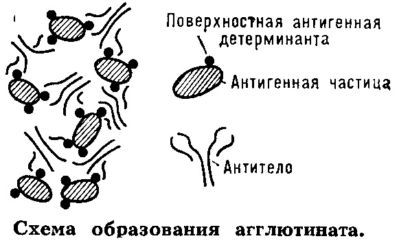

## АГЛИКОН

неуглеводная часть моле-
кулы гликозида.

## АГОНИСТИЧЕСКОЕ ПОВЕДЁНИЕ

у животных (от греч. ав0п1$ИК6$ —
способный к борьбе, воинственный),
сложный комплекс действий, наблюдае-
мый во время конфликтов между особя-
ми одного вида и включающий взаимные
угрозы, нападения на соперника, бегство
от него, преследования и демонстрации
подчинения. См. также Агрессивное по-
ведение. ,

## АГРАНУЛОЦИТЫ

(от греч. а — отрицат. частица, лат. огапаит — зёрныш-
ко и ...цит), незернистые лей-
коциты, белые кровяные клетки, не
содержащие в цитоплазме зёрен (гра-
нул). У болышинства беспозвоночных
А. одного вида — амёбоциты, у позво-
ночных двух — лимфоциты и моноциты.

## АГРЕССИВНОЕ ПОВЕДЕНИЕ

у животных (франц. — аветезз{! — напа-
дающий, воинственный, от лат. австеЧ:-
ог — нападаю), действия животного, ад-
ресованные др. особи и приводящие к её
запугиванию, подавлению или нанесе-
нию ей физич. травм. Обычно А. п.
рассматривается как составная часть
внутривидового агонистического пове-
дения, но иногда говорят и об агрессив-
ности хищника по отношению к жертве
и т. п. Так, птенец медоуказчика в пер-
вые часы после вылупления из яйца уби-
вает птенцов птицы-хозяина, в гнезде
к-рой он вывелся. Внутривидовое А. п.
способствует формированию иерархии
при высокой плотности популяции и тер-
риториальности при низкой её плотно-
сти. Часто А. п. проявляется уже на ран-
них стадиях онтогенеза (напр., у личи-
нок  паразитич. перепончатокрылых,
вступающих в смертоносные драки друг
с другом). А. п. птенцов у мн. видов
хишных птиц (сов, поморников, цапель и
др.) приводит к уничтожению младшего
из них (Каинизм), а иногда — и к
поеданию его собратьями (каннибализм).
На почве А. п. возможно также дето-
убийство (иИнфантицид) у чайко-
вых птиц, хищных млекопитающих
(львы), грызунов (суслики) и т. д. При
защите групповой территории наблюда-
ется коллективное А. п. хозяев по отно-
шению к чужакам. Во мн. случаях А. п.
стимулируется половыми гормонами.

## АГРЕССИНЫ

вещества, выделяющиеся
в результате жизнедеятельности или при
распаде патогенных бактерий и способст-
вующие их размножению в тканях хозяи-
на. По химич. природе — белки, поли-
сахариды. Подавляют механизмы проти-
воинфекц. иммунитета: нарушают функ-
цию клеток иммунной системы, неспеци-
фически связывают антитела, не прояв-
ляя при этом прямого токсич. действия.

## АГРОБИОЦЕНОЗ

агроценоз (от греч. абго5 — поле и биоценоз), совокуп-
ность организмов, обитающих на землях
с.-х. пользования, занятых посевами или
посадками культурных растений. В А.,
как и в любом биоценозе. комплексы
организмов, входящие в его состав, ха-
рактеризуются разл. взаимоотношениями.
в т. ч. трофич. (пищевыми) связями,
образующими трофические цепи. В ес-
теств. биоценозах сложный растит. пок-
ров, включающий множество видов рас-
тений, слагается исторически, а в А.
(на полях, плантациях, в садах) растит.
покров создаётся человеком и пред-
ставлен обычно одним видом или даже
сортом культивируемого растения и со-
путствующими сорными видами. Комп-
лексы организмов, кроме культивируе-
мого растения, в А. формируются, как и
в естеств. биоценозах, в результате
естеств. отбора. Человек, создавая возде-
лываемому виду благоприятные условия
произрастания, подавляет др. виды (в А.
регулирующая деятельность человека ста-
новится дополнительным жёстким фак-
тором отбора). Виды растительноядных
животных, не способные питаться возде-
лываемым растением и переносить усло-
вия его культуры, подавляются, а способ-
ные — находят благоприятные условия,
размножаются и могут  повреждать
культивируемые растения. Смена растит.
покрова (а при защите урожая — и ком-
плекса консументов) в А. происходит
по воле человека.

Степень устойчивости отд. типов А.
зависит от частоты и радикальности изме-
нений, к-рым подвергается режим зе-
мель с.-х. пользования. Комплексы орга-
низмов - обитателей земель под разл.
с.-х. культурами, особенно в полевых
севооборотах, — аналоги этапов сукцессии
биоценозов. Наиболее устойчивы в А.
обитатели почвы.

Интенсивная хоз. деятельность челове-
ка ведёт к замене естеств. биоценозов
агробиоценозами, становящимися всё бо-
лее важными регуляторами газового ре-
жима атмосферы. Поэтому для охраны
окружающей среды важна правильная
организация с.-х. ландшафта, обеспечи-
вающая макс. усвоение растениями СО»,
ведущая к повышению первичной про-
дуктивности А., т. е. росту урожайно-
сти с.-х. культур. Изучение структуры,
устойчивости и продуктивности А. вы-
делилось в самостоят. раздел биогеоце-
нологии — агробиоценологию.

## АГРОФИТОЦЕНОЗ

(от греч. авгоз — поле и фитоценоз), растит. сообщегтво,
создаваемое человеком путём посева или
посадки возделываемых растений. В со-
став А. входят культурные и сорные рас-
тения. А. обладают осн. признаками фи-
тоценозов — взаимодействием между рас-
тениями и между ними и средой и явля-
ются частью более сложных систем —
агробиогеоценозов.

## АГУТИЕВЫЕ (ПазургосЧае)

семейство грызунов. Дл. тела 32—80 см, хвоста
1—7 см; масса 1—10 кг. Имеют защёчные
мешки. Конечности относительно длин-
ные, особенно задние. Околоанальные
железы выделяют резко пахнущий сек-
рет. 4 рода: паки, агути и др., 16 видов,
преим. в тропич. лесах Сев. и Юж. Аме-
рики, М. Антильских о-вов. Образ жизни
одиночный, активны как днём, так и но-
чью. Быстро бегают. Роют норы, обитают
около водоёмов, хорошо плавают. Расти-
тельноядны. Два раза в год рождают
по 1—6 детёнышей. Объект охоты (ради
мяса). У агути (Дазуртоста) дл. тела
41—62 см, хвоста 1—3,5 см; масса 1,3—
А кг; задние конечности трёхпалые, с ко-
пытовидными когтями, 12 видов, во
влажных лесах и сухих саваннах Юж.
Америки. Активны днём. Иногда запа-
сают корма. Два раза в год рождают по
2—4 детёныша. Нек-рые зоологи разде-
ляют А. на два семейства.

## АДАМАНТОБЛАСТЫ

(от греч. а4Атаз, род. п. а4Атапоз — сталь и ...бласт),
амелобласты, ганобласты,
специальные клетки зубной пластинки,
вырабатывающие эмаль в коронке зуба.

## АДАПТАЦИОННЫЙ СИНДРОМ

обший адаптационный синд-
ром, совокупность изменений, возни-
каюших в организме при состоянии стрес-
са. У человека и высших животных вы-
деляют три фазы А. с.: тревоги, сопротив-
ления и истошения. Для фазы тре-
воги — первичного ответа организма
на действие  стрессоров — характерны
увеличение и повыш. Деятельность коры
надпочечников, усиленная секреция ад-
реналина, повышение концентрации са-
хара в крови (гипергликемия), а также
сморщивание тимуса. В желудочно-ки-
шечном тракте появляются кровоточащие
язвочки. Активация системы гипотала-
мус — гипофиз — кора — надпочечников
вызывает гормональные сдвиги и обесие-
чивает мобилизацию защитных сил орга-
низма в ответ на действие стрессоров.
Происходящие на этой фазе изменения
функционально неоднозначны и не всег-
да полезны для организма (напр., повы-
шение артериального давления — необ-
ходимый компонент физиол. мобилиза-
ции — при нек-рых сердечно-сосудистых
заболеваниях может привести к инсуль-
ту или инфаркту). В фазе сопро-
тивления усиливается секреция кор-
тикостероидов, изъязвления исчезают; ор-
ганизм обнаруживает повыш. устойчи-
вость (адаптируется) к действию стрессо-
ра. При длительном и интенсивном дей-
ствии стрессора фаза сопротивления сме-
няеття фазой истощения, к-рая
сопровождается резким снижением соп-
ротивляемости организма, ухудшением
его физиол. характеристик, возникнове-
нием разл. заболеваний; вновь появля-
ются язвы в желудочно-кишечном трак-
те. При продолжающемся воздействии
стрессоров может наступить гибель. Меха-
низмы, переводящие организм из фазы
сопротивления в фазу истощения, до сих
пор не установлены. Принадлежность
фазы истощения к А. с. иногда считают
спорной. См. также Стресс.

● Селье Г., Очерки об адаптационном
синдроме, пер. с англ., М., 1960; Па-
нин Л. Е., Биохимические механизмы
стресса, Новосиб., 1983; Зе1уе Н., Ног-
топе ап тез15вапсе, В.— М, У., 1971.

## АДАПТАЦИЯ

(позднелат. ЗН — приспособление, прилаживание, от лат.
а4аро — прилаживаю), совокупность
морфофизиол., поведенческих, популя-
ционных и др. особенностей данного би-
ол. вида, обеспечивающая возможность
специфич. образа жизни в определ.
условиях внеш. среды. А. формируются
на протяжении всех стадий жизненного
цикла особей вида (А. к условиям заро-
дышевого и личиночного развития наз.
эмбриоадаптациями). Различают, о б-
щие А. (приспособления к жизни
в обширной зоне среды, напр. конечно-
сти наземных позвоночных) и част-
ные А. (специализации к определ. об-
разу жизни, напр. специализир. формы
конечностей копытных). Совокупность
А. придаёт строению и жизнедеятель-
ности организмов черты целесообразно-
сти. Механизм эволюц. развития А.—
одна из центральных проблем биологии.
Материалистич. решение проблемы раз-
вития А. впервые предложил Ч. Дарвин,
показав, что А. возникают в результате
действия естеств. отбора. Совершенство
любой конкретной А. относительно, т. к.
всегда возможны и более совершенные
А. к данной среде обитания. Классич.
теория естеств. отбора встретила затруд-
нения при объяснении формирования
сложных А., к-рые могут функциониро-
вать лишь при достаточной степени
своего развития, напр. крылья итиц
или насекомых и т. п. Решение пробле-
мы А. в современной эволюц. теории дано
материалистич. трактовкой концепций
преадаптации и мультифункциональ-
ности органов. А. наз. также сам процесс
выработки приспособлений организмов
к условиям их существования.

## АДАПТИВНАЯ ЗОНА

1) определённый тип местообитаний с характерной
совокупностью специфич. экологич. ус-
ловий (море, пресные водоёмы, суша,
почва и т. п.), представляющий среду
обитания для разл. групп организмов,
вырабатывающих соответствующие адап-
тации. 2) Совокупность адаптивных воз-
можностей, характеризующая группу ор-
ганизмов (определ. типы адаптаций, осн.
способы использования ресурсов внеш.
среды, общие черты образа жизни, ха-
рактерные для таксона в целом). В этом
смысле говорят, напр., об А. з. класса
птиц, отряда змей, семейства кошачьих
ит. п. Сменой А. з. объясняют макроэво-
лю. преобразования (см. Макроэволю-
ция

## АДАПТИВНАЯ РАДИАЦИЯ

разветвление предкового ствола группы орга-
низмов в ходе приспособит. эволюции на
обособленные ветви (филетич. линии),
связанное с развитием адаптаций к раз-
ным условиям внеш. среды и способам
использования её ресурсов (освоение
разл. местообитаний, убежищ, кормов,
способов добывания пищи и т. ип.). А. р.
проявляется в разнообразии подчинён-
ных таксономич. групп в пределах лю-
бого крупного таксона, напр. разл. ви-
ды кошачьих, разл. семейства хищных
млекопитающих и т. п. А. р. начинается
в пределах биол. вида в форме разли-
чий между популяциями, с обособлени-
ем подвидов, в результате действия
дизруптивного отбора и происходит в
эволюции любой длительно существую-
щей группы организмов, поэтому её
рассматривают как одну из законо-
мерностей филогенеза. Концепция А. р.,
сформулированная В. О. Ковалевским
(1875) и Г. Осборном (1915) независимо
друг от друга, расширяет представления
о дивергенции.

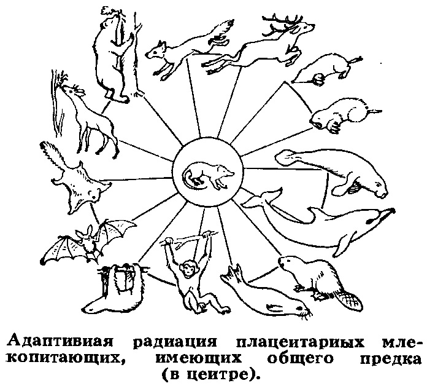

## АДВЕНТИЦИЯ

(новолат. адуепи а, от лат. аЧуеп!с1а$ — внешний), внешняя
оболочка стенки кровеносных сосудов,
образованная в основном соединительной
тканью. В А. артерий и вен проходят
кровеносные сосуды, питающие стен-
ку — <сосуды сосудов> (уаза уазогит).
вен и артериол относительно тол-
ще, чем А. артерий. Нек-рые авторы
наз. А. соединительнотканные клетки,
окружающие капилляры. А. наз. также
наружный слой надкостницы.

## АДГЕЗИЯ

клеток (от лат. аЯБаезю—прилипание), способность их слипаться
друг с другом и с разл. субстратами. А.
обусловливается, по-видимому, гликока-
ликсом и липопротеидами плазматич.
мембраны. Для большинства клеток ха-
рактерна избират. А.: после искусств.
диссоциации клеток из разных организ-
мов или тканей из суспензии собираются
(агрегируют) в обособленные скопления
преим. однотипные клетки. А. нарушается
при удалении из среды ионов Са?", обра-
ботке клегок специфич. ферментами
(напр., трипсином) и быстро восстанав-
ливается после удаления диссоциирую-
щего агента. С нарушением избират. А.
связана способность опухолевых клеток
к метастазированию.

## АДДАКС (Аааах пазотасшагиб)

антилопа-мендес, млекопитающее
сем. полорогих. Единств. вид рода. Дл.
тела 150—170 см, выс. в холке 995—115 см.
Рога у самцов и самок винтообразно за-
крученные (дл. 60—109 см). Средние ко-
пыта низкие, уплощённые, боковые —
большие (приспособление к передвиже-
нию в песках). В Сев. Африке, в пусты-
нях и полупустынях. Детёныш чаще
один. В Красной книге МСОП.

## АДЕНИЛАТЦИКЛАЗА

фермент класса лиаз. МЛокализован в цЦитоплазматич,
мембранах живых клеток; катализирует
образование циклич. 3’,5’-аденозинмоно-
фосфата (цЦАМФ) из АТФ. Активность
А. регулируется гормонально: адреналин,
глюкагон и ряд гормонов гипофиза ак-
тивируют А., а инсулин и простагландины
ингибируют. Благодаря этому цЦАМФ
опосредует действие гормонов и, дейст-
вуя на активность ЦАМФ-зависимых
протеинкиназ, осуществляет регуляцию
важнейших биохимич. процессов: обмена
гликогена, синтеза белка, катаболизма
липидов, образования стероидов, влияет
на проницаемость мембран и т. д. См.
также Циклические нуклеотиды.

## АДЕНИН

б-аминопурин, пури-
новое основание. Наряду с гуанином
и пиримидиновыми основаниями содер-
жится во всех живых клетках в составе
нуклеиновых к-т (ДНК и РНК). Струк-
турный компонент аденозинфосфорных
к-т, играющих первостепенную роль
в биоэнергетике клетки, циклического
3”,5’-аденозинмонофосфата (цАМФ) —
важного звена гормональной регуляции,
коферментов (НАД, НАДФ, ФАД) и
др. Под действием фермента аденозинде-
заминазы удаляется 6-аминогруппа А.
и образуется гипоксантин. Формулу см.
при ст. Нуклеотиды.

## АДЕНОВИРУСЫ (АЧепоун1@ае)

семейство ДНК-содержащих сферич. виру-
сов, лишённых внешней липопротеидной
оболочки. Диам. вирусных частиц 70—
90 нм, капсид икосаэдрический. Содер-
жат единичную линейную двухцепочеч-
ную молекулу ДНК (мол. м. 20—29 млн.).
Размножаются в клеточных ядрах позво-
ночных. В заражённых клетках подав-
ляют синтезы ДНК, РНК и белков. Рас-
пространяются без переносчиков. Пора-
жают разл. органы (большинство А. свя-
зано с респираторными инфекциями) мле-
копитающих (в Т. ч. человека), птиц, мо-
гут вызывать образование опухолей.

## АДЕНОЗИН

нуклеозид, состоящий из
пуринового основания аденина и углево-
да рибозы. Обнаружен во всех живых
клетках в составе РНК и нек-рых кофер-
ментов (НАД, НАДФ, КоА, ФАД).
Фосфорные эфиры А.Ш— аденозинфос-
форные к-ты — играют первостепенную
роль в обмене веществ и энергии живого
организма. Свободный А. образуется при
распаде РНК и адениновых нуклеотидов.
Ферментативное  дезаминирование А.
приводит к образованию инозина.

## АДЕНОЗИНДИФОСФАТ

АДФ, нуклеотид, состоящий из аденина, рибозы
и двух остатков фосфорной к-ты. В жи-
вых клетках находится преим. в комплек-
се с ионами МЕ?+. Образуется при фос-
форилировании аденозинмонофосфата
(АМФ) или при дефосфорилировании
аденозинтрифосфата (АТФ). Являясь
акцептором фосфорильной группы в про-
цессах окислит. и фотосинтетич. фосфори-
лирования, а также фосфорилирования
на уровне субстрата и биохимич. пред-
шественником АТФ — универсального ак-
кумулятора энергии, А. играет важную
роль в энергетике живой клетки. Произ-
водное А.— АДФ-глюкоза — участвует в
синтезе крахмала. См. также Аденозин-
фосфорные кислоты.

## АДЕНОЗИНМОНОФОСФАТ

АМФ, адениловая кислота, нуклео-
тид, состоящий из аденина, рибозы и
одного остатка фосфорной к-ты. В ор-
ганизме А. содержится в составе РНК,
коферментов и в свободном виде. Конце-
вой остаток А., всегда присутствующий
в транспортных РНК, является сущест-
венным для связывания аминокислот,
участвующих в синтезе белка. В клетках
обнаружены полинуклеотиды, содержа-
щие длинные последовательности остат-
ков А. или целиком состоящие из остат-
ков А. Синтез А. осуществляется из ино-
зиновой к-ты за счёт энергии ГТФ при
Участии аспарагиновой к-ты. А. образу-
ется Также при дефосфорилировании
АДФ или в реакциях, сопровождающих-
ся отщеплением пирофосфата от АТФ.
Фосфорилирование А., последовательно
приводящее к АДФ (в аденилаткиназ-
ной реакции), а затем к АТФ, сопровож-
дается аккумуляцией энергии. Наряду
с 5’-АМФ («мышечной> адениловой к-той)
обнаружена 3’-АМФ («дДдрожжевая» аде-
ниловая к-та), а также 2’-АМФ. О цик-
лич. АМФ см. вст. Циклические нуклео-
тиды. См. также Аденозинфосфорные
кислоты.

## АДЕНОЗИНТРИФОСФАТ

АТФ, аденилиюиирофосфорная
кислота, нуклеотид, содержащий
аденин, рибозу и три остатка фосфор-
ной к-ты; универсальный переносчик и
осн. аккумулятор химич. энергии в жи-
вых клетках, выделяющейся при пере-
носе электронов в дыхат. цепи после
окислит. расщепления органич. веществ.
В мышцах и др. Тканях на долю А.
приходится ок. 75% кол-ва всех адени-
ловых нуклеотидов, при этом большая
часть свободного А. находится в комп-
лексе с ионами Ме?+. Энергия А. заклю-
чена в 2 пирофосфатных связях (т. н.
высокоэнергетич., или  макроэргичес-
ких) — между а- и В-, а также между
В- и уфосфатными остатками. При гид-
ролизе концевой пирофосфатной связи
А. РН=7,0, Р= 37 °С, избыток М8?,
концентрация 1 М) освобождается
8,4 ккал/моль. В реальных условиях жи-
вой клетки эта величина колеблется. Эта
энергия может быть передана молекуле-
акцептору фосфорильной группы и ис-
пользована для биосинтеза разл. веществ,
активного транспорта ионов, движения
(включая мышечное сокращение), хемо-
люминесценции, производства электрич.
энергии (напр., у рыб) идр. процессов
жизнедеятельности. Расщепление АТФ
может сопровождаться не только перено-
сом на молекулу-акцептор фосфатной
группы (в реакциях, катализируемых ки-
назами), но и переносом пирофосфатной
группы (напр., в синтезе пуринов), ос-
татка адениловой к-ты (при активации
аминокислот в синтезе белка) или аде-
нозина (образование $-аденозилметио-
нина). А. синтезируется из АДФ и неор-
ганич. фосфата. Ресинтез АТФ из АДФ
и неорганич. фосфага, сопровождающий-
ся накоплением энергии, сопряжён с окис-
лит. и’ фотосинтетич. фосфорилирова-
нием или фосфорилированием на уровне
субстрата. Источниками АТФ являются
также богатые энергией фосфаты (напр.,
креатинфосфат) и реакция, катализируе-
мая аденилаткиназой. Все процессы в ор-
ганизме, происходящие с запасанием энер-
гии, в конечном счёте ведут к образова-
нию АТФ. Т.0., А. — основное связующее
звено между процессами, протекающими
с потреблением энергии, и процессами,
сопровождающимися выделением и на-
коплением энергии. А.— субстрат для
синтеза РНК. См. также Аденозинфос-
форные кислоты, Окислительное фос-
форилирование.

## АДЕНОЗИНТРИФОСФАТАЗЫ

АТФазы, ферменты класса гидролаз; катали-
зируют отщепление остатка фосфор-
ной к-ты от молекулы АТФ. Широко
распространены в живых клетках (осо-
бенно в их мембранах). Расщепляя бога-
тые энергией (макроэргические) связи
АТФ, А. обеспечивают использование
этой энергии для разл. процессов жизне-
деятельности: движения, биосинтеза разл.
соединений, транспорта веществ через
мембраны ит. д. Активный перенос ионов,
аминокислот, нуклеотидов, сахаров и др.
через мембраны, создание и поддержание
ионных градиентов осуществляют транс-
портные А. (наиболее распространена
Ма+/К+-АТФаза). Типичный представи-
тель Са?+ — активируемой АТФазы —
мышечный белок миозин (всего в мыш-
цах содержится ок. 10 АТФ-гидролизу-
ющих ферментов). У растений присутст-
вует фермент АТФ-дифосфогидролаза,
отщепляющий от молекулы АТФ два
остатка ортофосфата; найдены Также
ферменты, катализирующие гидролиз
АТФ на АМФ и пирофосфат (АТФ-пи-
рофосфатазы).

## АДЕНОЗИНФОСФОРНЫЕ КИСЛОТЫ

аденозинфосфаты, нуклео-
тиды, 5’-фосфорные эфиры аденозина.
Содержат аденин, рибозу и один (адено-
зинмонофосфат, АМФ), два (аденозин-
дифосфат, АДФ) или три (аденозинтри-
фосфат, АТФ) остатка фосфорной к-ты.
Присутствуют во всех живых клетках
(суммарная концентрация 2—15 мМ,ок.
87% общего фонда свободных нуклео-
тидов), образуют адениловую систему,
играющую важную роль в обмене веществ
и энергии. Содержатся не только в раст-
воримой фракции цитоплазмы, но и В
нек-рых органоидах (митохондриях, яд-
рах). Пара АДФ/АТФ служит осн. сис-
темой переноса энергии в клетке. Пере-
нос фосфорильных групп на АМФ и
АДФ сопровождается  аккумуляцией
энергии, а их отщепление от АТФ и
АДФ — выделением энергии, исполь-
зуемой для разл. процессов жизнедея-
тельности. Концентрации А. к. в клет-
ке в норме поддерживаются на постоян-
ном уровне: соотношение А. к., характе-
ризующее энергетич. заряд и отражающее
физиол. состояние клетки, является фак-
тором, обеспечивающим регуляцию мета-
болизма и связь между АТФ-производя-
шими и АТФ-использующими процесса-
ми. Существ. роль в поддержании рав-
новесия между А. к. играет обратимая
реакция, катализируемая ферментом аде-
нилаткиназой: АТФ + АМФ = 2 АДФ.
Кроме АТФ, АДФ и АМФ, в живых
организмах содержится циклич. АМФ
(см. Циклические нуклеотиды).

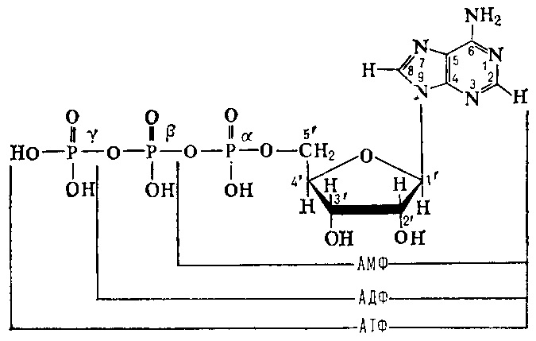

## АДЕНОМЁР

(от греч. аФёп — железа и п16гоз — часть, доля), концевой отдел
многоклеточных желёз у животных, где
образуется секрет. А. может быть трубко-
видным (трубчатые железы) и шаровид-
ным, или ацинусом (альвеолярные
железы).

## АДЕНОФОРЕИ (АдепорБогеа,  АрВазпиЧ1а)

афазмидиевые, подкласс
нематод. Органы осязания (щетинки, ре-
же папиллы) — по всему телу. Обонят.
амфиды крупные, по бокам головы (у па-
разитов животных могут быть редуци-
рованы). У нек-рых видов имеются глаз-
кй. Фазмиды отсутствуют (отсюда вто-
рое назв.). Выделит. шейная железа мас-
сивная, с коротким каналом. Вдоль те-
ла — боковые гиподермальные железы.
Есть хвостовые железы; ректальных же-
лёз нет. 10 (по др. данным, 5) отрядов,
ок. 8000 видов. Преим. свободноживущие
формы, в морях, реже в пресных водах
и почве. Нек-рые виды А.— паразиты
(см. Мононхи. Свайники, Власоглавы,
Трихинеллы).

## АДИАНТУМ (Афаптит)

род папоротников сем. адиантовых (А Фащасеае). Назем-
ные или наскальные растения с длинно-
ползучими или восходящими корневища-
ми. Листья одно- или пятикратноперис-
тые, с тёмными блестящими черешками,
водоотталкивающие. Сорусы — вдоль
жилок, на внутр. стороне отогнутых
сегментов, служащих одновременно и в
качестве индузиев. Ок. 200 видов, в те-
нистых влажных лесах тропич. (гл. обр.
в Америке) и субтропич., реже уме-
ренных поясов; в СССР — 2 вида:
А. стоповидный (А. редатит), растущий
на Д. Востоке, и венерин волос. А.—
наиболее изящные и декоративные из па-
поротников, издавна выращивают в оран-
жереях.

## АДМИРАЛ (Уапезза аап!а)

бабочка сем. нимфалид. Крылья в размахе до
6 см, передние — сверху чёрные, с бе-
лыми пятнами и красной косой пере-
вязью, задние — чёрные, с красной крае-
вой полосой. Распространён почти по-
всюду в Европе и умеренных широтах
Азии. Гусеницы живут на крапиве
в закрытых «пакетах» из листьев, окукли-
вание нередко также в свёрнутом листе.
Может давать 2 поколения (на Ю.); лёт
весной (после зимовки) и в июле — сен-
тябре. Совершает дальние миграции.
См. рис. 11, 11а в табл. 26.

## АДОКСА (Адоха)

единственный род растений сем. адоксовых порядка вор-
сянковых. Неск. видов (ранее род счи-
тался монотипным). А. мускусная, или
мускусница (А. тозсййеШта),— неболь-
шое (выс. 5—15 см) многолетнее травяни-
стое растение; листья со слабым мускус-
ным запахом. Опыляется насекомыми,
мелкими улитками, возможно самоопы-
ление. Произрастает в умеренном и хо-
лодном поясах Сев. полушария, в го-
рах — до альй. пояса; в СССР — в Ев-
роп. части, Сибири, Ср. Азии, на Д. Вос-
токе и редко на Кавказе.

## АДОЛЕСКАРИЯ 

(новолат. аоезса-г1а, от лат. адоезсо — подрастаю, уве-
личиваюсь), последняя личиночная ста-
дия нек-рых трематод, напр. печёночной
двуустки. Развивается из церкарии, вы-
шедшей из промежуточного хозяина (мол-
люска) в воду, отбросившей хвост и ин-
цистировавшейся на водорослях, при-
брежной траве или др. субстрате. Процесс
превращения свободной церкарии в
наз. цистогонией. Попадая с во-
дой или пищей в организм окончат. хо-
зяина (копытные, иногда человек), А.
развивается в половозрелого червя.

## АДОНИС (Адоп:5)

род растений сем. лютиковых. Многолетние или однолетние
травы с рассечёнными на узкие сегменты
листьями. Цветки одиночные, крупные,
правильные, жёлтые или красные.
Плод — многоорешек. Св. 20 видов, в
умеренном поясе Евразии и в Сев. Аф-
рике, растут по сухим открытым местам;
в СССР — 17 видов, преим. в юж. р-нах.
В степных и лесостепных р-нах Европ.
части, в Сибири, на Кавказе встречается
А. весенний, или горицвет весенний
(А. оетпай5); пветёт весной, опыляется
пчёлами и шмелями, возможно самоопы-
ление; плоды разносят муравьи. Лекар-
ственное (трава содержит сердечные гли-
козиды) и декор. растение. В связи с не-
правильным сбором сырья запасы этого
и ряда др. видов истощаются. А. золо-
тистый (А. сртузосужйа)—в Красной
книге СССР. См. рис. 7 в табл. 22.

## АДРЕНАЛИН

эпинефрин, гормон, медиатор нервной системы из груп-
пы катехоламинов. В качестве гормона
А. синтезируется у позвоночных в хро-
маффинных клетках, содержащих фер-
менты для синтеза биохимич. предшест-
венников А.— дофамина и норадренали-
на, а также фермент, катализирующий
образование А. из норадреналина. Осн.
источник гормонального А. у млекопи-
тающих — мозговое вещество надпочеч-
ников. В 1-Й пол. 20 в. А. приписывали
большое значение как гормону мозгово-
го вещества надпочечников и медиатору
постганглионарных симпатич. нейронов,
совместное действие к-рых, как считали,
обеспечивает адаптивную перестройку
физиол. функций организма позвоночных
в критич. ситуациях (отсюда понятия:
симпато-адреналовая система, адреноре-
цепторы, адренергич. иннервация ит. п.).
В дальнейшем выяснилось, что А. выра-
батывается лишь частью хромаффинных
клеток (др. часть этих клеток, вт. ч.
в надпочечниках, вырабатывает норадре-
налин). Секреция А. надиочечниками в
кровь усиливается в ситуациях, требую-
щих адаптивных перестроек метаболиз-
ма — при стрессе, гипогликемии и т. п.
В связи с этим А. оказывает гл. обр. ме-
таболич. эффекты (повышает потребле-
ние кислорода, концентрацию глюкозы
в крови, кровоток в печени ит. д.).
В др. критич. ситуациях надпочечники
секретируют норадреналин. Оказалось,
что медиатором, опосредующим эффек-
ты симпатич. нервных окончаний у поз-
воночных (кроме бесхвостых земновод-
ных), является норадреналин, а нед.
В головном мозге млекопитающих имеет-
ся небольшое число нейронов, к-рые син-
тезируют А. и, по-видимому, используют
его как медиатор.

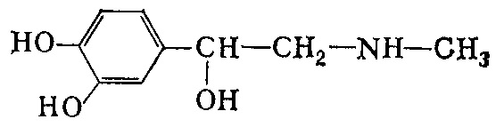

## АЗАЛЁЯ

азалия, виды рода родо-
дендрон; назв. обычно употребляется
в цветоводстве. ,

## АЗИАТСКИЕ ОЛЕНЬКИ (Ттадщ 5)

канчили, род оленьковых. Окраска
светло- или тёмно-бурая. Безрогие. Од-
ни из самых мелких копытных. Дл. тела
малого оленька (Т. 7ачаптсиз) ок. 40 см,
выс. в плечах ок. 20 см, масса 2—2,5 кг.
3 вида, в Юж. и Юго-Вост. Азии. Наибо-
лее известен большой оленёк (Т, пари).
Активны ночью. Живут скрыто в лесах.
Детёнышей обычно 2.

## АЗИГОТА

(от греч. а — отрицат. части-
ца и зигота) партеноспора,
спора нек-рых грибов и водорослей, об-
разующаяся из гаметы и внешне напоми-
нающая зиготу; развивается в новую особь
без слияния с др. гаметой.

## АЗИМИНА (АЯтта)

асимина, единственный внетропич. род растений
сем. анноновых. Вечнозелёные или листо-
падные кустарники и невысокие деревья.
8 видов, в Сев. Америке. Крупные соч-
ные плоды невысокого листопадного де-
рева — А. трёхлопастной (А. Иофа)
съедобны. В СССР этот вид изредка куль-
тивируют как декоративный на Кавказе
и в Крыму.

## АЗОЛЛА (АгоПа)

род папоротников
сем. азолловых (А2оПасезе). Мелкие
плавающие растения с ветвяшимися
корневищами (до 25 см), сверху чере-
питчато покрытыми  двухлопастными
листьями дл. 0,5—1 мм, а снизу — пуч-
ками придаточиых корней. 6 видов, в
тропических, субтропических, реже уме-
ренных поясах, 2— натурализовались
в Зап. и Центр. Европе. Быстро разрас-
таясь, А. иногда плотной массой закры-
вают поверхность водоёмов. Для А. ха-
рактерен симбиоз с синезелёной азот-
фиксирующей —водорослью анабеной
(Апафаепа агоПае). На этом основано ис-
пользование А. в Японии и Индокитае
в качестве зелёного удобрения для рисо-
вых полей (на 1 га развивается до 10т
А., дающие до 25 кг азота). Нек-рые ви-
ды А. разводят в аквариумах.

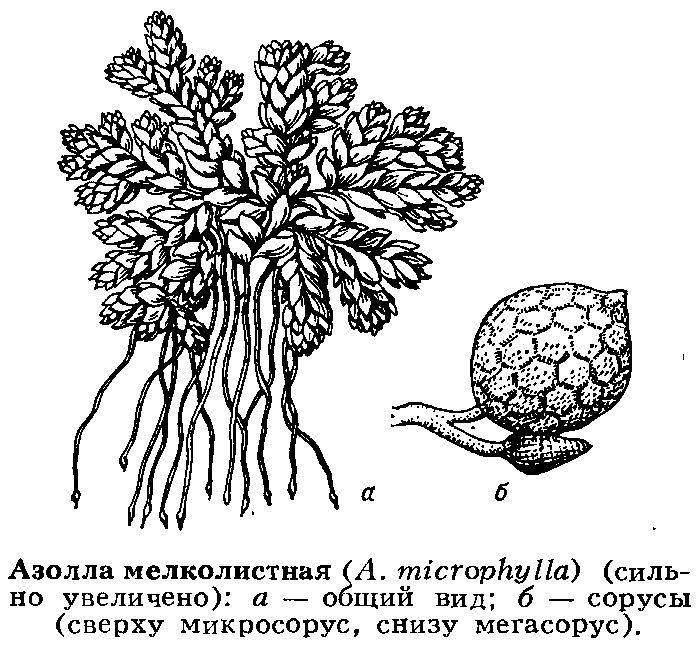

## АЗОНАЛЬНАЯ РАСТИТЕЛЬНОСТЬ

естественная растительность, встречаю-
шаяся во всех зонах на неплакорных ме-
стообитаниях. Термин «А. р.>, введённый
Ю. Пачоским (1915), ныне использу-
ется редко. См. Интразональная расти-
тельность.

## АЗОРЁЛЛА (АготеЙа)

род растений
сем. зонтичных. Многолетние травы или
полукустарники с кожистыми листьями,
образующие плотные, часто твёрдые по-
душки (иногда диам. до 1м и массой до
150 кг). Ок. 100 видов, в Юж. Америке
(особенно в высокогорьях Анд), на Фолк-
лендских о-вах, о. Кергелен и в Нов. Зе-
ландии. Нередко А.— важнейшие эди-
фикаторы растит. покрова.

## АЗОТОБАКТЕР (Агогобасет)

род свободноживущих аэробных азотфиксирую-
щих бактерий. Форма овальная или кок-
ковидная (размеры 2 Х 5 мкм), подвиж-
ные или неподвижные, грамотрицатель-
ные, неспорообразующие. При росте свя-
зывают до 20 мг мол. азота на 1 гис-
пользованного углевода. 4 вида, в почве,
воде. Наиболее часто встречается на хоро-
шо окультуренных почвах А. сйтоосос-
сит. А.— продуцент ряда витаминов,
ростовых вешеств типа ауксинов, нек-рых
антибиотиков, чем в значит. степени
объясняется его положит. действие на
с.-х. культуры.

## АЗОТФИКСАЦИЯ

биологическая, усвоение мол. азота воздуха
азотфиксируюшими бактериями с обра-
зованием соединений азота, доступных
для использования др. организмами.
Один из важнейших процессов в кругово-
роте азота в природе; показатель плодо-
родия почвы. А. осуществляется как сво-
бодноживушими азотфиксируюшими бак-
териями — азотобактером,  цианобакте-
риями, азоспириллами и др. (несимбио-
тич. А.), так и симбиотич. азотфиксато-
рами, живущими в симбиозе с высшими
растениями (напр., клубеньковые бакте-
рии). Происходит © участием фермента
нитрогеназы, к-рая катализирует восста-
новление № до МНз в присутствии АТФ
(источника энергии) и восстановителя,
напр. ферредоксина. В атмосфере со-
держится над 1 га почвы более 70 тыс. т
свободного азота, и только в результате
А. часть этого азота становится доступ-
ной для питания высших растений (со-
держание доступного растениям азота
в почве обычно невелико). При связыва-
нии М» клубеньковыми бактериями в сим-
биозе с растениями сем. бобовых 1 га
почвы ежегодно может обогащаться на
200—300 кг азота, а свободноживущими
бактериями — на 15—30 кг азота (в уме-
ренных широтах). Выяснение мол. ме-
ханизмов и условий А.— одна из важней-
ших проблем совр. биологии, связанная
с повышением плодородия почв. Ведутся
работы по перенесению генов (методом
тенетич. инженерии), от к-рых зависит
синтез нитрогеназы, из азотфиксирующих
бактерий в другие почвенные микроорга-
низмы.

## АЙР (Асогиз)

род многолетних трав сем.
аронниковых. Листья (дл. до 1 м) мече-
видные, корневище толстое, ползучее.
Цветки собраны в початок. Цветёт с на-
чала лета до осени. Размножается вегета-
тивно, корневищами. 2 вида, широко
распространённых во внетропич. обла-
стях Сев. полушария. А. обыкновенный,
или ирный корень (А. саати$), из Вост.
Азии (родина А.) в 16 в. был завезён
в Зап. Европу, откуда распространился
по всему Сев. полушарию. Растёт по бере-
гам и на мелководьях стоячих и проточ-
ных водоёмов, в болотах, иногда образует
сплошные заросли. Лекарств., ароматич.
(пряное), дубильное растение, исполь-
зуемое с древности. Из корневищ до-
бывают эфирное масло, употребляемое
в пром-сти (парфюмерной, кондитерской
и др.)-

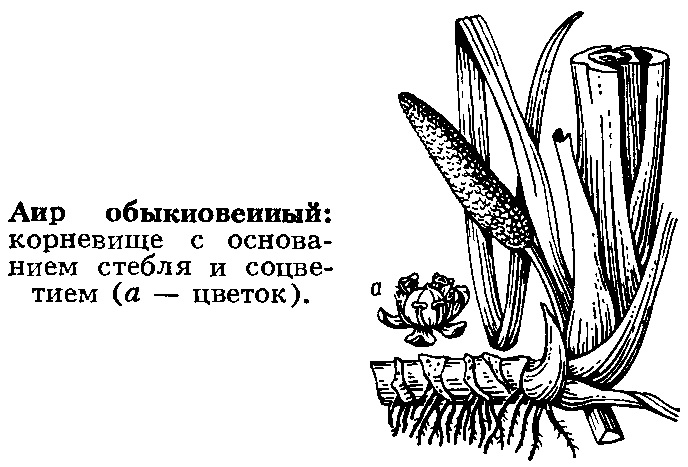

## АИСТНИК (ЕтоФит)

журавельник, род растений сем. гераниевых.
Однолетние или многолетние травы. Ли-
стья супротивные, перистые или: лопаст-
ные. Более 80 видов, гл. обр. в умерен-
ном поясе Евразии и в Средиземноморье.
В СССР -— 20 видов. Однолетний сорняк
А. пикутовый, или грабельки (Е. ссила-
пит), растёт на сухих лугах, в степях, как
сорное на полях и огородах; цветёт с кон-
ца весны до осени. Доли зрелого коро-
бочковидного плода снабжены длинной
остью, в ниж. части спирально закручен-
ной. Плоды распространяются ветром; при
поглощении влаги ости раскручиваются и
доли плода зарываются в землю. Одно
растение даёт 200—600 семян. Эндемики
Кавказа А. Бекетова (Е. Бекеюший) и
А. Стевена (Е. 5&{еепй) — в Красной кни-
ге СССР.

## АИСТОВЫЕ (С!сопИ4ае)

семейство аистообразных. Дл. 76—152 см. Клюв
длинный, прямой или слегка загнут квер-
ху или книзу. Крылья длинные и широ-
кие, нек-рые А. могут подолгу парить.
Большинство видов лишены голоса (нет
голосовых мускулов ниж. гортани) и из-
дают звуки, шёлкая клювом (резонатором
служит горловой мешок). 11 родов,
17 видов, преим. в тропиках, немногие
виды заходят в умеренные пояса. В
СССР, как и во всей Палеарктике, только
1 род — аист (С1соша) —с 3 видами:
белый аист, чёрный аист (С. тата), спо-
радично в лесной зоне от Эстонии и Бело-
руссии до Юж. Приморья, и дальневосточ-
ный, или черноклювый, аист (С. фоиса-
па), в лесах Приамурья. Гнёзда на де-
ревьях, скалах, строениях. После гнез-
дования часто собираются в стаи. Кор-
мятся на сырых лугах, болотах. Нек-рые
А. (марабу) питаются отбросами. Чёрный
аист — в Красной книге СССР, дальне-
восточный аист — в Красных книгах
МСОП и СССР.

## АИСТООБРАЗНЫЕ (С1соп!огте$)

голенастые, отряд птиц. Филогене-
Тически близки к пеликанообразным,
предковые формы известны с олигоцена.
Средних и крупных размеров. Шея и
ноги длинные; задний палец постав-
лен низко и служит опорой при ходьбе
и для обхватывания ветвей и стеблей бо-
лотных растений. Хорошю развита пнев-
матичность скелета. Есть копчиковая же-
леза. 7 семейств, в т. ч. 6 современных:
цаплевые, челноклювовые, китоглаво-
вые, молотоглавовые, аистовые и ибисо-
вые; 118 видов (иногда относят к А.
и фламинго). Распространены широко
(кроме Арктики и Антарктики), наиболее
разнообразны в тропиках и субтропи-
ках. В СССР — 17 гнездящихся вилов
и 7 залётных. Моногамы. Колониальные,
реже гнездятся одиночно. Насиживают
самка и самец. Птенцовые. Животноялд-
ные. 12 видов и 3 подвида в Красных
книгах МСОП и СССР.

## АЙВА (Судотга)

род растений сем. розовых. Единственный вид — А, обыкно-
венная‚ или продолговатая (С. о/опда),
дерево или кустарник выс. 1,5—7 м с гус-
той кроной. Цветки крупные, одиночные.
Растёт на востоке М. Азии, в Иране,
в СССР — на Кавказе и в Ср. Азии,
по опушкам и в лесах, в зарослях кустар-
ников, иногда образует подлесок вместе
с гранатом, мушмулой и др. Живёт 50—
60 лет. Размножается семенами и корне-
выми отпрысками. В Передней Азии
в культуре св. 4 тыс. лет, в Грецию попа-
ла'в 1 в. дон. э. Культивируется в Сре-
диземноморье, Сев. Америке, Японии и
др.; в СССР — в Ср. Азии, Закавказье,
Молдавии, на Украине. Используется
как плодовая культура, а также как кар-
ликовый подвой для груши и в декор.
целях. Японской А. наз. кустарники, де-
ревья рода хеномелес (Сваепоте[е;) того
же семейства.

## АЙЛАНТ (АПап!и5)

род высоких (до 20—30 м) листопадных деревьев сем. си-
марубовых порядка рутовых. Листья
сложные, непарноперистые. Цветки мел-
кие, в метельчатом соцветии. Ок. 10 ви-
дов, в Юж. и Вост. Азии и на С. Австра-
лии; в СССР — 3 вида, в культуре. А.
высочайший, или китайский ясень (А.
ай5;та), быстрорастущее декор. дере-
во, разводимое на Ю. Европ. части, на
Кавказе ив Ср. Азии. В Китае его ли-
стья служат кормом для айлантового
шелкопряда. Лекарств. растения. Дре-
весина А. используется в строительстве,
для поделок, изготовления бумаги.

## АЙЛАНТОВЫЙ ШЕЛКОПРЯД (Р#:озапёа супИЙча)

бабочка сем. павлино-
глазок. Крылья в размахе 110—130 мм.
Распространён в Юго-Вост. Азии, заве-
зён в Юж. Европу. Гусеница питается
листьями айланта, сирени, клещевины
и др. Зимует куколка. Кокон даёт ок.
60 м шёлковой нити. А. ш. разводят
в Китае, Японии, Индии, хотя широкого
пром. значения он не имеет. Выкарм-
ливается легко, поэтому используется
как лабораторное животное.

## АЙОВАН (Ттасйузреттит)

ажгон, род однолетних трав сем. зонтичных.
Листья дважды- или триждыперистые.
Плоды мелкие, густо покрытые беловаты-
ми сосочками. Ок. 20 видов, в Африке и
Азии; в СССР один культивируемый
вид — А. душистый, или индийский тмин
(Т. аттг), разводится гл. обр. в Ср.
Азии. Родина его — Индия, где он издав-
на возделывается (как и в ряде др. тро-
пич. стран). Применяется как пряность
и для получения (гл. обр. из плодов)
эфирного масла, содержашего тимол,
к-рый используется как антисептик.

## АКАНТАРИИ (АсапТагеа)

класс простейших подтипа саркодовых (по др.
системе — отряд подкласса радиолярий).
Размеры обычно 0,1—0,3 мм. Имеют
минеральный скелет и длинные тон-
кие псевдоподии (аксоподии), способные
удлиняться и укорачиваться в состоя-
нии парёния. Основу скелета А. состав-
ляют 10 диаметральных или 20 радиаль-
ных игл. У молодых особей ядро одно,
у нек-рых видов оно многократно делится
и взрослые особи многоядерны. При даль-
нейшем делении ядра образуются ядра
двужгутиковых зооспор. Перед спороге-
незом обычно образуются цисты. Зооспо-
ры могут сливаться и давать зиготу.
Жизненный цикл А., так же как радиоля-
рий, изучен не полностью. 17 сем., 49 ро-
дов, св. 140 видов. А.— исключительно
морские планктонные формы (гл. обр.
океанические), после гибели организма
скелет А., состоящий из эг5О4, растворя-
ется в мор. воде, поэтому в ископаемом
состоянии А. неизвестны. Могут аккуму-
лировать 965г.

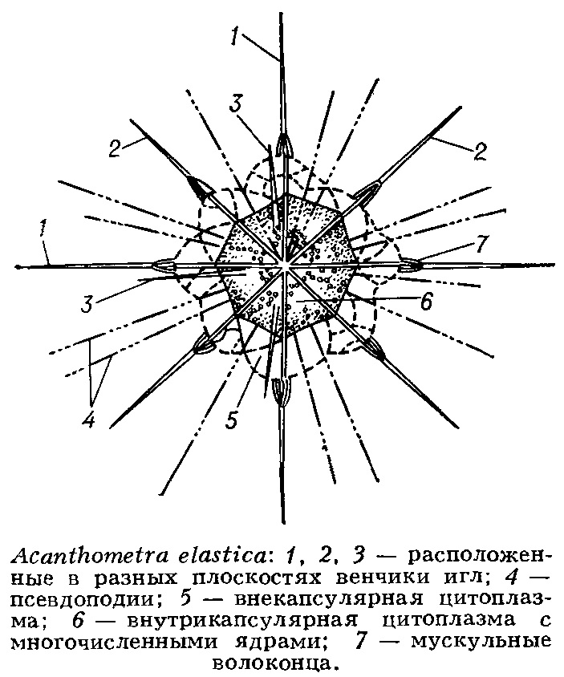

## АКАНТОВЫЕ (АсапЪасеае)

семейство двудольных растений порядка норични-
ковых. Преим. травы, полукустарники и
кустарники, иногда деревья; есть среди
А. лианы, ксерофиты и водно-болотные
растения. У многих имеется спец. меха-
низм для выбрасывания семян из пло-
дов — отвердевающие упругие крючко-
видные выросты семяножки. Ок. 250 ро-
дов, ок. 2600 видов, распространены ши-
роко, в тропиках и субтропиках обоих
полушарий. Многие — декоративные (во
внетропич. областях — гл. обр. в оранже-
реях). Форма листьев аканта (АсапЁйи5)
легла в основу орнамента коринфских и
композитных капителей, а также др. ар-
хитектурных украшений.

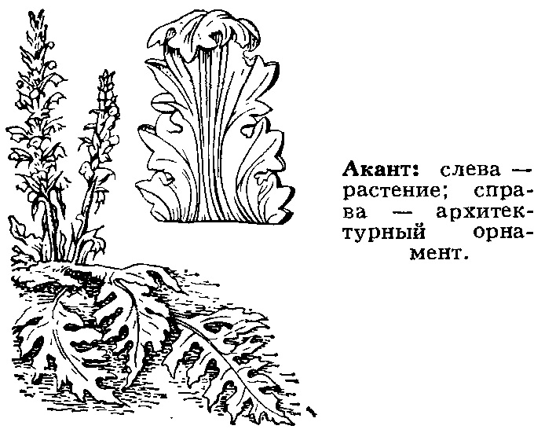

## АКАНТОДЫ (Асаппо4е!)

колючкозубые, класс вымерших рыб. Из-
вестны из позднего силура — ранней пер-
ми Евразии. Сев. Америки, Австралии,
Антарктиды, в СССР — Прибалтики, Ту-
вы и Минусинской котловины. Дл. до
0,5 м. Одна из древнейших групи челюст-
норотых, сочетающая черты строения
неск. классов рыб: плакодерм, хряще-
вых и костных. Веретеновидное или
удлинённое (у более поздних) тело покры-
то чешуёй ганоидного типа (голова —
костными пластинками), перед всеми
плавниками, кроме хвостового, находи-
лись костные шипы — ихтиодорулиты.
У нек-рых древних родов А. между груд-
ными и брюшными плавниками имелись
промежуточные плавники с ихтиодору-
литами, что подтверждает теорию проис-
хождения парных плавников из боковых
складок. Обитали преим. в реках с быст-
рым течением, реже в лагунах и морях.
В осн. планктофаги. 4 отряда. Возмож-
но, от примитивных А. обособились хря-
щевые и костные рыбы.

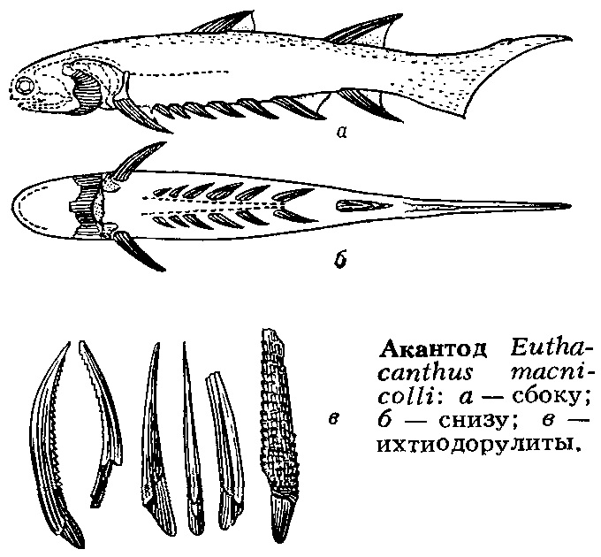

## АКАНТОЛИМОН (Асаптойтоп)

род растений сем. плюмбаговых. Б. ч. колю-
чие, часто подушковидные кустарнички
или полукустарнички. Цветки пурпуро-
вые, красные или розовые, в одно- или
многоцветковых колосках, собранных
в колосовидное или щитковидное соцве-
тие. Св. 250 (по др. данным, ок. 150)
видов, от Ю. Балканского п-ова до Центр.
Азии; в СССР — ок. 90 видов, в Ср.
Азии и на Кавказе, 6. ч. по сухим каме-
нистым склонам. См. рис. 1 при ст.
Плюмбаговые.

## АКАРОЛОГИЯ

(от греч. АКаг! — клеш и ...логия) раздел зоологии, изучающий
клещей.

## АКАЦИЯ (Асас:а)

род растений сем. бобовых. Преим. вечнозелёные деревья,
кустарники, редко травы.’Листья дваж-
дыперистые, с многочисл. мелкими листоч-
ками. У одних видов (австралийских)
развивается только черешюк листа (фил-
лодий), у других — только прилистники,
видоизменённые в колючки. У ряда амер.
видов колючки очень крупные и засе-
ляются муравьями. Цветки 6. ч. обоепо-
лые, преим. жёлтые или белые, мелкие,
в головчатых или колосовидных соцве-
тиях, собранных в общую метёлку; в ос-
новании лепестков — нектароносные же-
лёзки. 750—800 видов, в тропиках и суб-
тропиках обоих полушарий, более по-
ловины — в Австралии, где они (как
и в Африке) — существенный элемент
саванн; в СССР — 8 видов, в культуре.
А. опыляются насекомыми, иногда пти-
пами. Размножаются семенами и корне-
выми отпрысками; распространяются во-
дой и животными. Ветки А. серебристой
(А. аещфаа) — т. н. мимозу — приво-
зят в январе — марте в города ср. поло-
сы с Черномор. побережья Кавказа. Бе-
лой А. часто наз. растения из рода роби-
ния, жёлтой — из рода карагана, а шёл-
ковой — из рода альбиция (А112а). Ряд
видов А. дают дубильные вещества и
гуммиарабик. Мн. А. разводят как деко-
ративные. См. рис. 2 в табл. 20.

## АКВАРИУМНЫЕ РЫБЫ

преимущественно мелкие формы, часто ярко окра-
шенные, с разнообразной формой тела,
способные жить и размножаться в аква-
риумах. В естеств. условиях большинство
А. р. обитает в тропич. и субтропич.
пресных водоёмах. К ним относится неск.
сотен видов, гл. обр. из карповых (бар-
бусы, данио, кардинал и др.), харацино-
вых (неоны, тетры и др.), карпозубооб-
разных (гамбузия, гуппи, платипецилии,
афиосемионы и др.), окунеобразных (гу-
рами, нитеносцы, петушки, скалярии;
центрарховые, цихлидовые и др.), сомо-
образных (каллихтовые). Крупных А. р.,
переносящих значит. понижения темп-ры,
в тёнлое время года содержат в прудах
и открытых бассейнах. В совр. пресно-
водных и мор. аквариумах с науч. целями
разводят разл. рыб, в т. ч. крупных (акул
и др.), для наблюдения за их образом
жизни и поведением, выведения новых
форм. А. р. служат объектами биол. экс-
периментов.

● Полканов Ф., Подводный мир в комнате, М., 1966; Ильин М. Н., Аквариумное рыбоводство, [2 изд. М., 1968; Егеу Н., Шаз СтоВе Гехлсоп Чег Аацаг-$, Гр2. — [а. а.], [1976].

## АКИНЁТА

(от греч. аКпб0$ — неполвижный, малоподвижный), клетка нит-
чатых зелёных водорослей с утолщённой
оболочкой, большим кол-вом запасных
питат. веществ и пигментов; образуются
из вегетативных клеток и служат для
переживания неблагоприятных условий
и размножения.

## АККЛИМАТИЗАЦИЯ

(от лат. а4 — к, для и греч. КИта — климат), приспособ-
ление организмов к новым или изменив-
шимся условиям существования, в к-рых
они проходят все стадии развития и дают
жизнестойкое потомство. А. происходит
при переселении организмов как в со-
вершенно новые для них места, так и в об-
ласти, где они ранее жили, но по разным
причинам исчезали (реакклиматизация).
При А. растений большое значе-
ние имеют климатич. факторы (темп-ра
и влажность воздуха, кол-во и распреде-
ление осадков, световой режим и пр.),
тип почв, состав населяющей её микро-
флоры и др. При А. живогных,
кроме климатических, важны такие фак-
торы, как наличие врагов, конкурентов по
кормам, сезонным убежишам и др. Ак-
климатизироваться могут как дикие виды
при случайном переселении в новые мес-
тообитания, напр. при миграции живот-
ных, переносе семян водными течения-
ми (естеств. А.), так и домашние живот-
ные или культурные растения (искусств.
А.). А. можно считать завершённой, ког-
да популяция обретает способность под-
держивать свою численность в новых ус-
ловиях среды и восстанавливать её после
периодов депрессии. Примером удачной
А. является распространение каштана и
белой акации в Европе, амер. норки,
нутрии в СССР. Благодаря А. происхо-
дит восстановление исходного ареала жи-
вотных, напр. в СССР бобра и соболя.
Вселение нового вида обычно нарушает
экологич. равновесие, изменяет сложив-
шиеся цепи питания, ведёт к вытеснению
местных видов. Не исключено образова-
ние новых видов и поглощение местных
форм в результате гибридизации. Поэто-
му вселение видов в новые для них место-
обитания с целью А. требует чрезвычай-
ной осторожности, учёта возможных по-
следствий не только для акклиматизируе-
мых видов, но и для новой для них при-
родной среды.

## АККЛИМАЦИЯ

экспериментальная адаптация,  приспо-
собление организма к искусственно соз-
данным условиям. Иногда термин «А.»
употребляется как синоним акклимати-
зации.

## АККОМОДАЦИЯ

(от лат. ассотодао — приспособление), термин, традици-
онно применяемый по отношению к разл.
органам и тканям. А. глаза — при-
способление его к ясному вйдению пред-
метов, находяшихся на разных расстоя-
ниях, посредством фокусировки изобра-
жения на сетчатке. У головоногих мол-
люсков глаз в покое установлен на близ-
кое видение и А. достигается перемеще-
нием шарообразного хрусталика назад;
у земноводных и пресмыкающихся глаз
установлен на далёкое видение и А. до-
стигается выдвижением хрусталика вие-
рёд; у птиц и млекопитающих — измене-
нием кривизны хрусталика. А. физио-
логическая — приспособление воз-
будимых тканей (мышечной, нервной)
к действию медленно нарастающего по си-
ле раздражителя. Наипр., изолированное
нервное волокно можно возбудить быст-
рым охлаждением или ударом, а мед-
ленное охлаждение или постепенное на-
давливание возбуждения не вызывают.
А. гистологи ческая — изме-
нение формы и соотношения тканевых
элементов, в частности клеток, в процессе
приспособления к изменившимся усло-
виям. Напр., превращение кубич. эпи-
телия капсулы клубочков почки в высо-
кие цилиндрич. клетки при уменьшении
объёма клубочка. Гистологич. А. часто
трудно отделить от др. процессов (мета-
плазии, атрофии). ,

## АКОНИТ (Асовйит)

борец, род рас-
тений сем. лютиковых. Многолетние тра-
вы с клубневидными корнями и пальча-
тораздельными или рассечёнными листь-
ями. Цветки в кистях, неправильные,
б. ч. синие, фиолетовые или жёлтые,
протандричные; опыляются шмелями.
Плод — многолистовка. Ок. 300 видов,
в умеренном поясе Сев. полушария;
в СССР — св. 90 видов. Наиболее рас-
пространён А. высокий (А. ехсебит),
растущий по лесам, лугам, берегам рек.
Все А. ядовиты, т. к. содержат (гл. обр.
в клубнях) алкалоиды, используемые в
медицине. Мн. виды разводят как деко-
ративные. Неск. узкоэндемичных видов
А. нуждаются в охране. См. рис. 2
в табл. 22.

## АКРИТАРХИ

(от греч. АКгИо$ — сомнительный, неясный и агсЬё — проис-
хождение), одноклеточные или кажу-
щиеся одноклеточными микроскопич. ис-
копаемые остатки организмов неопреде-
лённого систематич, положения (гл. обр.
водоросли), имеющие органич. оболочку
и центр. полость. Известны с протерозоя;
как составная часть входят в палино-
морфы. )

## АКРОПЕТАЛЬНЫЙ

(от греч. АКгог — вершина, конеп и лат. реёо — устрем-
ляюсь, стараюсь достать), направленный
от основания к вершине, напр. последо-
ват. заложение листьев и пазушных почек
на конусе нарастания или порядок рас-
пускания цветков у ряда ботрич. соцве-
тий (кисть, колос, щиток). Ср. Базипе-
тальный.

## АКРОСОМА

(от греч. АКгоп — вершина, конец и сома), перфораторий,
органоид сперматозоида, расположенный
на вершине его головки. Обычно имеет
копьевидную или чашевидную форму.
Образуется в процессе спермиогенеза из
элементов комплекса Гольджи. При оп-
лодотворении в момент соприкоснове-
ния сперматозоида с яйцом содержащие-
сявА. ферменты высвобождаются и раст-
воряют яйцевые оболочки, обеспе-
чивая проникновение сперматозоида в
яйцо; мембрана А. образует трубчатые
выпячивания, к-рые проникают через
растворённый участок оболочек в корти-
кальный слой ооплазмы, осушествляя
активацию яйца. У нек-рых кишечнопо-
лостных, плоских червей, нек-рых насе-
комых, костистых рыб А. отсутствует.
См. рис. при ст, Сперматозоид.

## АКРОТОРАЦИКОВЫЕ (АстоПогас1са)

отряд ракообразных подкласса усо-
ногих. Известковый домик редуцирован
до хитиновой пластинки (на передней
части головы), используемой наряду с ве-
ществом, растворяющим соли кальция,
для сверления раковин брюхоногих и пан-
цирных моллюсков, стволов кораллов.
А пары грудных ног. Кишечник без задне-
го отдела и ануса, с ветвящимися отрост-
ками, заходящими в голову, в грудные
ноги и др. части тела. Св. 10 видов, рас-
пространены широко (вслед за своими
хозяевами). Большинство А. раздельно-
полы; самцы карликовые (дл. 0,4— 2 мм).

## АКСИС (Сетоиз ах15)

млекопитающее рода оленей. У самцов рога с тремя от-
ростками. Окраска у детёнышей и у
взрослых красноватая с белыми пятнами.
Дл. тела до 150 см, масса 75—100 кг. Рас-
пространён в Индии, на о. Шри-Ланка
и в Юго-Вост. Азии, в тропич. и субтро-
пич. лесах, обычно вблизи водоёмов; ак-
климатизирован в Нов. Зеландии, Авст-
ралии, на Гавайских о-вах ив Юж. Аме-
рике (Бразилия, Аргентина). Содержат
в охотничьих парках Зап. Европы и Сев.
Америки. Иногда А. выделяют в род
Ал15. Два подвида в Красной книге
МСОП.

## АКСОЛОТЛЬ

(аптекск., букв.— водяная игрушка), личинка тигровой амбисто-
мы; способна к размножению (см. Нео-
тения). А.— один из классич. объектов
эксперим. биологии. Превращение А. во
взрослую форму можно вызвать гормо-
ном щитовидной железы (добавление в
пищу, инъекция). См. рис. 41 при ст.
Личинка.

## АКСОН

(от греч. Ахбп — ось), нейрит, осевой цилиндр, одиноч-
ный, редко ветвящийся, удлинённый (до
1 м) цитоплазматич. отросток нейрона,
проводящий нервные импульсы от тела
клетки и дендритов к др. нейронам или
эффекторным органам. Цитоплазма (а к-
соплазма) А. ограничена мембраной
(аксолеммой) и содержит микро-
трубочки, нейрофиламенты, митохонд-
рии, эндоплазматич. сеть, синаптич.
пузырьки и плотные тельца. Перемещение
аксоплазмы в нейронах (1—5 мм в сут)
способствует непрерывному обновлению
структурных белков (напр., при регене-
рации А.). Диаметр А. относительно по-
стоянен по всей длине, прямо пропорцио-
нален размеру тела нейрона и зависит от
его функций. Начальный сегмент А.—
аксонный холмик — наиболее возбудим и
является местом генерации нервных им-
пульсов. Конпевые разветвления А. (тер-
минали) образуют синаитич. контакты
с др. нейронами, мышечными или желе-
зистыми клетками (см. Синапсы). Пуч-
ки А. образуют нервные волокна. См.
рис. при ст. Нейрон.

## АКТИВАЦИЯ ЯЙЦА

(от лат. ас уи$ — действенный, деятельный), переход зре-
лого яйца из состояния покоя к развитию;
происходит при оплодотворении и парте-
ногенезе. При оплодотворении
А. я. вызывается контактом головки спер-
матозоида (обычно её акросомы) с плаз-
матич. мембраной яйца и включает комп-
лекс явлений: распространение импульса
активации, к-рое у мн. животных сонро-
вождается выделением содержимого кор-
тикальных телец (см. Кортикальная
реакция); вовлечение сперматозоида в
цитоплазму; стимуляцию ядра яйца,
заторможённого на определённой, различ-
ной для разных видов животных, стадии
мейоза; ооплазматич. сегрегацию: спе-
цифич. биохимич. изменения. При и с-
к усств. партеногенезе А. я. вы-
зывают разл. химич. и физич. воздейст-
виями, что говорит о наличии пускового
(триггерного) механизма А. я., к-рый
может быть приведён в действие неспеци-
фич. ‚агентами.

## АКТИВНЫЙ ЦЕНТР

в энзимологии, часть молекулы фермента, ответст-
венная за присоединение и преврашение
субстрата. Образуется функциональны-
ми группами аминокислотных остатков,
расположенными строго определённым
образом в пространстве за счёт сближения
отд. участков полипептидной цепи. Струк-
тура А. ц. соответствует (комплементар-
на) химич. строению субстрата, благодаря
чему достигается специфичность действия
ферментов. Часто в построении А. ц.
участвуют коферменты или атомы метал-
лов. В одной молекуле фермента может
быть неск. А. ц. В иммунологии
А. ц.— участки молекул антитела, свя-
зывающиеся с бактериями, вирусами или
др. антигенами.

## АКТИН

белок мышечных волокон.
Мол. м. 42 000. Две формы: глобулярная
(Г-А.) и фибриллярная (Ф-А.), к-рая об-
разуется при полимеризации Г-А. в при-
сутствии АТФ и ионов М8\*+. На каждой
молекуле А. имеются участки, компле-
ментарные определённым участкам на
головках молекул миозина ‘и способные
взаимодействовать с ними с образованием
актомиозина — осн. сократит. белка
мыпщ. В 1 смз мышцы содержится ок.
0,04 гА. Система актин-миозин является
общей для сократит. структур как поз-
воночных, так и беспозвоночных живот-
ных. См. Микрофиламенты, Мышечное
сокращение.

## АКТИНИДИЯ (Асйто1а)

род растений сем. актинидиевых порядка вересковых.
Вьющиеся или лазящие кустовидные лиа-
ны, цветки двудомные или полигамные
(редко однодомные). Ок. 40 видов, в Ги-
малаях, Юго-Вост. и Вост. Азии; в СССР
А—5 видов, в лесах Д. Востока. Возделы-
ваются 4 вида, вт. ч. как ягодные расте-
ния (витамина С в 5 раз больше, чем в
чёрной смородине). Наиболее распрост-
ранена А. коломикта, или амурский
крыжовник (А. кота). Виды А. нуж-
даются в охране. Мн, виды декоративны.
Пергоносы.

## АКТИНИИ (Асеишама)

морские анемоны, отряд шестилучевых корал-
лов. Одиночные (редко колониальные)
бесскелетные полипы. Тело от неск. мм
до 1,5м в поперечнике, с венчиком щупа-
лец, обычно ярко окрашено. Ок. 1500
видов, во всех морях, от литорали до глу-
бин 8000 м; в морях СССР — ок. 50 ви-
дов (нет в Аральском и Каспийском мо-
рях). Прикреплённые, есть медленно
передвигающиеся по субстрату, закапы-
вающиеся в грунт, редко плавающие ви-
ды. Нитаются беспозвоночными и даже
мелкими рыбами, есть планктоноядные.
Размножение половое и бесполое, путём
продольного и поперечного деления. Для
мн. А. характерен симбиоз с раками-от-
шельниками и др. беспозвоночными.
Прикосновение щупалец А. может выз-
вать у человека болезненный ожог.

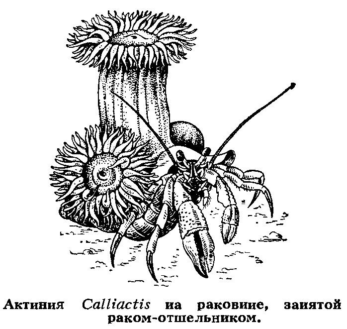

## АКТИНОМИКСИДИИ (Асппотух!А1)

класс миксоспоридий; ранее рассматри-
вались как отряд простейших класса
книдоспоридий. 4 сем., 9 родов, более 20
видов. Паразиты кольчатых червей и
сипункулид. Вегетативные паразитич.
стадии (трофонты) развиты слабо (состо-
ят из 2—6 соматических и 2 пропагатив-
ных клеток). Из пропагативных клеток
образуются споры с 3 створками, 3 по-
лярными капсулами со стрекат. нитями,
1—3 клетками внутр. оболочки и с разл.
числом (1—128) амёбоидных зароды-
шей, дающих начало новому поколе-
нию трофонтов. Животные-хозяева за-
ражаются зрелыми спорами А.

## АКТИНОМИЦЁЕТЫ (АсЕшотусеаез)

порядок бактерий, образующих клетки
или гифы с истинным ветвлением. Диам.
клеток 0,5—2,0 мкм. 8 семейств: мико-
бактерии, нокардии, стрептомицеты,
Асипотусебасеае, РгапК1асеае, Асешо-
р!апасеае, ПОегтаборюЙасеае, М1сгото-
позрогасеае; 49 родов, ок. 670 видов.
У мн. А. ветвление слабо выражено, ги-
фы образуются только на определ, ста-
дии развития и быстро распадаются на
палочки и кокки. У ряда А., напр.
стрептомицетов, развивается обильный
субстратный и (или) воздушный мицелий.
Размножаются делением клеток или гиф
множественными поперечными перегород-
ками с последующим их распадом на
фрагменты разл. величины и формы
(фрагментация) и (или) путём образова-
ния спор. Споры — одиночные, парные,
в цепочках или спорангиях — образуются
на мицелии. Вегетативные клетки и спо-
ры отд. А. подвижны. Грамположительны.
Аэробы, но ряд видов — анаэробы или
факультативные анаэробы. Большинство
А.— мезофилы (оптим. темп-ры роста
25—35 °С). А. широко распространены в
природных субстратах; преим. сапрофи-
ты, участвующие в разложении веществ
растит. и животного происхождения.
Имеются А.— симбионты растений и ви-
ды, патогенные для человека, животных,
растений. Споры А. могут вызывать ал-
лергич. заболевания. Мн. А. вырабаты-
вают физиологически активные соедине-
ния, в Т. ч. антибиотики (напр., стрепто-
мицин, тетрациклин).

● Калакуцкий Л. В., Лгре Н. С., Развитие актиномицетов, М., 1977; Определитель актиномицетов, М., 1983.

## АКТИНОМОРФНЫЙ ЦВЕТОК

(от греч. аКЫз — луч и шогрВё — форма),
правильный цветок, имеет более двух
плоскостей симметрии (симметрия опре-
деляется по околоцветнику, чаще всего —
по венчику). Характерен для мн. семейств
двудольных и однодольных. А. ц. могут
быть раздельнолепестными (у гвоздич-
ных, розовых, зонтичных) или спайно-
лепестными (у бурачниковых, паслёно-
вых, колокольчиковых). Часто опыляются
насекомыми, поэтому иногда у А. ц., как
и у зигоморфных цветков, вырабатыва-
ются разл. приспособления для опыления
специализир. опылителями (чешуйки
в зеве у разл. бурачниковых, очень
длинная трубка венчика у табака, дур-
мана и др.).

## АКТИНОСТЁЛА

(от греч. аКИз — луч и стела), один из типов центр. цилиндра
(стелы) стебля и корня высших растений;
состоит из ксилемы, имеющей на попереч-
ном разрезе вид звезды (протоксилема
закладывается экзархно — от конца луча
к центру), и флоэмы, расположенной
между лучами ксилемы. Характерна для
плауновидных, вымерших хвощевидных.
См. рис. при ст. Стелярная теория.

## АКТИНОТРОХА

(от греч. аКЫ$ — луч и 40сВ0$ — колесо, круг, кольцо),
свободноплавающая личинка форонид.
Предротовая лопасть с теменной пластин-
кой и, нередко, глазными пятнами; по
её краю проходит предротовое реснич-
ное кольцо — гомолог прототроха тро-
хофоры. За ртом на брюшном валике —
от 12 до 50 длинных шупалец. При ме-
таморфозе посторальная область пре-
вращается в щупальценосец (лофофор),
личиночные щупальца замещаются де-
финитивными. Впервые А. описана
И. Мюллером (1846) как взрослое живот-
ное, А. О. Ковалевским (1867) признана
личинкой. С тех пор описано неск. десят-
ков разл. А.— значительно больше, чем
известно взрослых форонид. См. рис.
36 при ст. Личинка.

## АКТИНОФАГИ

(от актиномицеты и ...фаг), вирусы актиномицетов. Наносят
значит. ущерб при пром. получении анти-
биотиков.

## АКТИНУЛА

(от греч. аК1$ — луч), по-
липообразная плавающая личинка
нек-рых книдарий (сем. ТибагНЧае из
отр. лептолид, а также отр. трахилид).
Имеет рот, окружённый щупальцами, по-
крыта ресничками. А. тубуляриид фор-
мируется в гонофоре колонии, где про-
ходит стадию планулы, освободившись,
ведёт плавающий образ жизни, затем
прикрепляется аборальным полюсом к
субстрату и развивается в полин. А. тра-
хилид развивается из планулы и превра-
щается в медузу; у паразитич. трахиме-
дуз А. способна размножаться путём
почкования. См. рис. 1 при ст. Личинка.

## АКТОМИОЗИН

комплексный белок мышечных волокон; состоит из актина и
миозина; осн. структурный компонент
мышц и др. сократит. структур, опреде-
ляющий их способность к сокращению.
См. Мышечное сокращение.

## АКТУАЛИЗМ

актуалистический метод (от позднелат. асфаа$—
современный, фактически существую-
щий), сравнительно-историч. метод иссле-
дования в естествознании, исходящий из
того, что факторы, к-рые действуют и
ныне, определяли развитие природы в
прошлом. Как науч. принцип А. развит
в 1-Й пол. 19 в. Ч. Лайелем в геологии.
В экологии и палеонтологии метод А.
применяют при реконструкции процессов
захоронения организмов.

## АКУЛЫ (Зе!аспотогрва, Зеасв1о!4е!)

надотряд пластиножаберных рыб. Из-
вестны со ср. девона, мн. совр. группы
возникли в верх. юре — верх. мелу. Те-
ло удлинённое, веретеновидное, от 20—
30см (нек-рые куньи и катрановые А.) до
20 м, наиб. измеренная масса — до 14 т
(гигантская и китовая А.). Чешуя пла-
коидная. Жаберных щелей обычно 5
(редко 6—7), расположены по бокам го-
ловы. Есть анальный плавник (нет у кат-
рановых А.). Хвостовой плавник мощный,
гетероцеркальный. Зубы сплошные (ос-
теодентиновые) или имеющие полости и
лакуны (ортодентиновые). 8 отр., 21 сем.
(молотоголовые, пилоносовые, ‘сельде-
вые, катрановые и др.), ок. 85 родов, ок.
250 видов. Преим. мор. рыбы, живут в
толще воды или у дна (до глуб. 3000 м),
нек-рые глубоководные А. имеют органы
свечения — фотофоры. Немногие живут
в пресных водах (рр. Ганг, Амазонка, 03.
Никарагуа). Большинство А.— хищники,
гигантская и китовая А.—планктофаги.
Живородящие, _ яйцеживородящие или
яйцеродящие. Плодовитость от 2 до 100
эмбрионов. Обитают во всех океанах,
особенно разнообразны в тропиках.
В СССР — ок. 10 видов: колючая А., или
катран (бдиа!и5 асапта;),— в Чёрном,
Баренцевом и дальневост. морях; по-
лярная А. (ботитози;х пистосерйа и) —
в басс. Сев. Ледовитого ок.; сельдевые А.
(Гатпа пазиз и Г. айтор15) — в Барен-
певом м. и в водах Д. Востока. В зал.
Петра Великого отмечены заходы тепло-
водных серых (из рода Сагсйатйтиз),
куньих (из рода Мите! и5) и молотоголо-
вых (сем. брруттаае) А. Мн. А.— объект
промысла. Нек-рые виды нападают на
человека. См. табл. 38 А.

## АКЦЕЛЕРАЦИЯ

акселерация (от лат. ассегаймю — ускорение) в
антропологии, ускорение сома-
тич. развития и физиол. созревания детей
и подростков за последние 100—150 лет.
Наиболее полно изучено увеличение раз-
меров тела. В экономически развитых
странах масса тела новорождённых воз-
росла на 100—300 г, годовалых детей—
на 2 кг; дл. тела годовалых детей увели-
чилась на 5 см, школьников — на 19—
15 см. Раньше происходит прорезывание
молочных и постоянных зубов, половое
созревание, ускорилось развитие психо-
моторных функпий, сократился период
роста. Ср. возраст начала менструирова-
ния у женщин Европы изменился с 16,5
лет в нач, 19 в. до 12,5—13 лет (в крупных
городах). У взрослых за последние 100—
150 лет увеличились размеры тела (но
меньше, чем у детей и подростков), у
женщин позже наступает менопауза.
Комплекс этих изменений в соматич. и
физиол. развитии взрослых часто обо-
значают термином «секулярный
трен д» (вековая тенденция), к-рый
включает в себя и А. развития полрастаю-
щего поколения. Причины А. связывают
как с факторами внеш. среды, действую-
щими в течение индивидуальной жизни
человека, так и с эндогенными, обуслов-
ленными изменением наследственности.
Общепринятой теории, — объясняющей
причины А., нет; на человека действует
сложный комплекс различных биол. и
социальных факторов, многие из к-рых
обусловлены изменением образа жизни
человека (урбанизация, развитие техни-
ки, изменение питания и др.).

Иногда термин «А.» употребляется и в
др. разделах биологии, в частности в био-
логии развития А. — ускорение формиро-
вания отд. частей зародыша на определ.
стадии развития. А. Н. Северцов обозна-
чил этим термином более раннюю заклад-
ку того или иного органа в онтогенезе и
более быстрое его развитие по сравнению
с другими, напр. раннее развитие ротово-
го аппарата у рыб и бесхвостых земновод-
ных, развитие молочных зубов у млекопи-
тающих.

● Карсаевская Т. В., Социальнаяи биологическая обусловленность изменений в физическом развитии человека, Л., 1970; Властовский В. Г., Акцелерация роста и развития детей, эпохальная и внутригрупповая, М., 1976.

## АЛАКУРТ (УегпирзуЦа @аситг)

насекомое отряда блох. Дл. самки ок. 6 мм,
самца — меньше. Распространён в Ср.
и Центр. Азии. Яйца откладывает зимой
на поверхность почвы, развитие — в тече-
ние лета. Осенью А. присасывается к
покровам животных (дикие и домашние
копытные, особенно овцы и козы) и зи-
мует на них. Вызывает вермипсиллёз
(поражение кожного и волосяного пок-
ровов, истощение молодняка).

## АЛАНИН

аминопропионовая к-та.
В природе широко распространены два
изомера. Г-а-А.— заменимая аминокис-
лота. Входит в состав разл. белков (в фиб-
роине шёлка до 40% ), содержится в сво-
бодном состоянии в плазме крови. В сос-
таве муреина бактериальных клеточных
стенок присутствуют Г-и О-формы А.
Биосинтез А. из пирувата путём переами-
нирования тесно связан с обменом др.
аминокислот в организме. А.— один из
источников глюкозы в организме (путём
глюконеогенеза). В-А. в белках не встре-
чается; входит в состав дипептидов анзе-
рина и карнозина, пантотеновой к-ты и
ацетилкофермента А. Образуется при ра-
спаде урацила и декарбоксилировании
аспарагиновой к-ты. См. формулу в ст.
Аминокислоты.

## АЛАРИЯ (А1апа)

род ламинариевых водорослей. Слоевище дл. 1—4 (до 40) м,
имеет ствол с ризоидами при основании и
большую пластину с продольным ребром.
По бокам ствола расположены спорофил-
лы — небольшие пластинки с зооспоран-
гиями. Ок. 10 видов, в холодных морях
Сев. полушария; в СССР — 5 видов. В Ат-
лантич. ок. широко распространена А.
съедобная (А. езсшета), в Тихом — А.
окаймлёнпая (А. тагдтаа). Наиболее
крупное слоевище у А. полой (А. [25ёи-
105а), образующей заросли у Курильских,
Командорских, Алеутских о-вов, вдоль
Тихоокеанского побережья Аляски. Не-
к-рые виды употребляют в пищу. См.
рис. 3 в табл. 9.

## АЛЕЙРОДИДОВЫЕ (А[еуго4теа)

белокрылковые, подотряд равно-
крылых пасекомых. Дл. 1—2 мм. Тело
желтоватое, с мучнистым налётом (отсюда
назв. А., от греч. «меигоп — мука). Ноги
длинные, 2 пары белых крыльев (отстода
2-е назв.) одинаковой длины, с реду-
цированным жилкованием, иногда с
тёмными пятнами. Св. 200 видов, боль-
шинство в тропиках (мировая фауна А.
изучена недостаточно); в СССР — ок. 25
видов. Родом из Центр. Америки. С-рас-
тениями распространились по всему ми-
ру. Присасываются к ниж. стороне
листьев, соком к-рых питаются, там же
откладывают яйца. Дают неск. поколеций
в год. Зимуют в стадии ложного кокона
(пупария). Иногда вредят цитрусо-
вым, плодоягодным, пропашным культу-
рам; нек-рые — переносчики возбудите-
лей вирусных заболеваний растений.

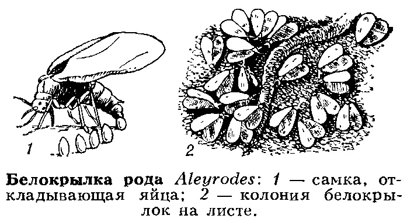

## АЛЕЙРОНОВЫЕ ЗЁРНА

(от греч. &еигоп — мука), зёрна запасного белка в
клетках запасающих тканей семян бобо-
вых, гречишных, злаков и др. растений.
Встречаются в виде аморфных или крис-
таллич. отложений (от 0,2 до 20 мкм)
разнообразной формы и строения. Обра-
зуются при созревании семян из высы-
хающих вакуолей и окружены элемен-
тарной мембраной-тонопластом. Крупные
сложные А. з. состоят из белкового крис-
таллоида и небелковой части (фитина),
нек-рые из них содержат кристаллы ок-
салата кальция. При прорастании семян
А. з. набухают и подвергаются фермеп-
тативному расщеплению, продукты к-рого
используются растущими частями заро-
дыша.

## АЛЕКТОРИЯ (А!естопа)

род лишайников семейства уснеевых (Озпеасеае).
Таллом кустистый, прямостоячий или
повисающий в виде буро-чёрных, се-
ровато или желтовато окрашенных
«бород», с тонкими угловатыми веточ-
ками, покрыт хорошо развитым ко-
ровым слоем; сердцевина однородная,
с рыхло расположенными гифами; пло-
довые тела — апотеции. Ок. 100 видов,
в Сев. и Юж. полушариях; в СССР —
ок. 20 видов; растут на стволах и ветвях
деревьев, на скалах, камнях и почве.
В тундре широко распространена А.
жёлто-белая (А. осйтфеиса) — корм се-
верных оленей. Содержит до 8% уснино-
вой к-ты, используется для получения
антибиотиков. См. рис. 12 в табл. 10.

## АЛЕЦИТАЛЬНЫЕ ЯЙЦА

(от греч. а — отрицат. частица и 16КИБоз — желток),
не содержат обособленных желточных
включений или имеют незначит. кол-во
желтка. По типу дробления (полное) от-
носятся к голобластическим. Встречают-
ся редко, напр. у нек-рых паразитич.
перепончатокрылых (яйцеедов).

## АЛКАЛОИДЫ

азотсодержащие органич.
основания природного (преим. раститель-
ного) происхождения. Выделено неск.
тысяч А.(у животных обнаружено лишь
ок. 50); особенно богаты ими растения
сем. бобовых, маковых, паслёновых, лю-
тиковых, маревых, сложноцветных. В хо-
де эволюции высшие растения выработа-
ли т. н. метаболич. экскрецию, делающую
возможным накопление вторичных соеди-
нений в продуцирующем их организме, но
вне метаболически активных центров —
обычно в вакуолях и клеточной стенке.
А., обнаруживаемые у животных, не
всегда синтезируются самим организмом;
иногда их происхождение связано с ха-
рактером пищи. Так, бобры накапливают
А. касторамин, к-рый очень близок к А.
дезоксинуфаридину, содержащемуся в
корневищах кубышки жёлтой, используе-
мой ими в пищу.

Как правило, в растениях содержится
смесь неск. А., иногда до 15—20, часто
близких по своему строению (в маке спот-
ворном, коре хинного дерева), однако у
нек-рых растений находят всего один А.
(напр., рицинин в клещевине). Мн. А..,
особенно сложного строения (напр., мор-
фин, хинин), специфичны для определ.
родов и даже семейств, что широко ис-
пользуется в систематике (хемотаксоно-
мия). В большинстве случаев А. находят-
ся в растении в виде солей органич. и не-
органич. к-т. Локализуются преим. в оп-
редел. частях (органах) растений, напр.
у хинного дерева — гл. обр. в коре, у ако-
нита — вклубнях, у кокаипового куста —
в листьях. Содержание А. в тканях обыч-
но составляет десятые — сотые доли про-
цента и редко доходит до 10—15% (кора
хинного дерева).

Долгое время биол. функции А. в рас-
тительном организме были неясны. Чаще
их считали конечными продуктами обме-
на веществ, или иными экскретами. Одна-
ко было показано, что А. активно вов-
лекаются в обменные процессы. Возмож-
но, А. также защищают растения от пое-
дания животными, т. е. являются анти-
фидантами. А. обычно присваивают наз-
вание по продуцирующим их растениям.
Наиболее распространённая классифика-
ция основана на строении углерод-азот-
ного скелета молекулы (напр., пурино-
вые А. и т.д.). Классифицируют А.
также по происхождению, объединяя в
одну группу все соединения, выделепиые
из растений одного рода (напр., А. ипе-
какуаны ит. д.). Мн. А.— сильные яды,
в лечебных дозах обладают специфиче-
ским, зачастую уникальным физиол.
действием и используются в медицине.

● Лукнер М., Вторичный метаболизм У микроорганизмов, растений и животных, пер. с англ., М., 1979.

## АЛЛАНТО*И*Н

продукт аэробного распада пуриновых оснований. Обнаружен
у животных и человека (в жидкости
аллантоиса, амниотич. жидкости, моче
ит. д.), а также в растениях. Образуется
при окислении мочевой к-ты ферментом
уриказой и является конечным продук-
том обмена пуринозых оснований у боль-
шинства млекопитающих (кроме челове-
ка и др. приматов), а также у нек-рых
растений. Для ряда бактерий А.— источ-
ник углерода и азота. У земноводных и
большинства рыб А. превращается в ал-
лантоиновую к-ту, а затем в мочевину
и глиоксалат.

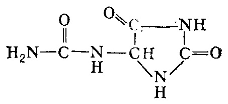

## АЛЛАНТОИС

(новолат. аПШапбо!, от греч. а]аптое14ё5 — колбасовидный), одна
из зародышевых оболочек у высших поз-
воночных животных — пресмыкающихся,
птиц и млекопитаюших. Подробнее см.
Зародышевые оболочки.

## АЛЛЕЛОПАТИЯ

(от греч. аП&бп — взаимно и ра{№о$ — страдание, испытыва-
емое воздействие), взаимодействие расте-
ний посредством выделения биологически
активных веществ (фитонцидов, коли-
нов, антибиотиков и др.) во внеш. среду.
Иногда А. определяют только как вред-
ное влияние одних растений на друкие,
но в более широком понимании А.— как
отрицательное, так и положительное вза-
имодействие растений друг с другом пу-
тём выделения хим. веществ. А., как и др.
взаимоотношения растений, лежит в оспо-
ве возгикновения, развития и смены рас-
тит. группировок, играет важную роль в
почвообразоват. процессе. Растения с вы-
сокой аллелопатич. активностью (напр.,
пырей, ясень, лох) легко внедряются в
сообщества, подавляя др. виды, но вызы-
вают при этом почвоутомление и не могут
быть доминантами. Большинство культи-
вируемых растений относятся к аллело-
патически слабоактивным. Роль А. не-
обходимо учитывать при создании сме-
шанных посевов и посадок при обоспова-
нии севооборотов (чтобы избежать почво-
утомления).

● Иванов В. П., Растительные выделения и их значение в жизни фитоценозов, М., 1973; Райс Э., Аллелопатия, пер. с англ., М., 1978.

## АЛЛЁЛЬ

(от греч. аП&5и — друг друга, взаимно) аллеломорфа, одно из
возможных структурных состояний гена.
Любое изменение структуры гена в ре-
зультате мутаций или за счёт внутриген-
ных рекомбинаций у гетерозигот по двум
мутантным А. приводит к появлению но-
вых А. этого гена (число А. каждого
гена практически неисчислимо). Термин
«А.» предложен В. Иогансеном (1909).
Распространённые в природных популя-
циях А., обусловливающие развитие при-
знаков. характерных для вида, называют
А. «дикого типа», а происходящие от них
А.— мутантными. Разл. А. одного гена
могут приводить к одинаковым или раз-
ным фенотипич. эффектам, что послужи-
ло основанием для представления о мно-
жественном аллелизме. По-
скольку одинаковый фенотипич. эффект
могут вызывать мутантные А. как одного,
так и разных генов, для определения ал-
лельности рецессивных мутаций исполь-
зуют функциональный тест на аллелизм
(см. Цис-транс-тест), к-рый неприме-
ним для доминантных мутаций. Наличие
неск. А. каждого гена в популяциях обес-
печивает определ. уровень генетич. по-
лиморфизма (напр., три А. обусловли-
вают существование четырёх групп кро-
ви у человека) и комбинативной изменчи-
вости (закон независимого наследования
признаков, см. Менделя законы), к-рые
служат исходным материалом для эво-
люц. преобразований. Множественный
аллелизм для генов‚контролирующих сис-
темы несовместимости (напр., резус-фак-
тор у человека), выступает как фактор
отбора, препятствующий образованию зи-
гот и организмов определ. генотипов.
А. одного геиа могут обусловливать су-
ществование отличающихся пруг от друга
форм одного и того же заболевания, напр.
разл. А. гена, контролирующего синтез
В-цепи гемоглобина, вызывают разл.
ормы анемий.

## АЛЛЕНА ПРАВИЛО

отражает закономерность изменения размеров поверхности
тела гомойотермных (теплокровных) жи-
вотных с изменением климатич. условий.
Согласно А. п., у животных, населяю-
ших более холодные участки ареала, выс-
тупаюшие части гела (конечности, хвост,
ушные раковины и т. д.) меньше, чем у
представителей того же вида (или близ-
ких видов) из более тёплых местностей.
Установлено Дж. Алленом (1877). А. п.,
как и Бергмана правило, вытекает из
принципа уменьшения теплоотдачи при
сокращении отношения поверхности тела
к объёму. Исключения из А. п. доволь-
но часты (напр., длина клюва у птиц
обычно связана с характером питания).

## АЛЛЕРГИЯ

(от греч. а&110$ — иной, другой и 6гвоп — действие), форма иммуно-
логич. ответа, проявляющаяся в повыш.
чувствительности организма к разнооб-
разным антигенам (т.н. аллергенам —
пыльпе растений, домашней пыли, опре-
дел. видам пищи, перхоти животных, ле-
карств. препаратам и т. д.). Широко рас-
прослранена у человека, известна у птиц
и млекопитающих. Развивается не у всех
индивидуумов данной популяции и, как
правило, при повторном, а не при первич-
ном контакте с аллергеном. При А. орга-
низм отвечает на специфич. аллерген
чрезмерной реакпией, повреждающей его
собств. клетки и ткани в результате отёка
и воспаления, спазма и расслабления
гладкой мускулатуры, нарушений микро-
циркуляции и гемодинамики. Биол. зна-
чение А. не известно. Её рассматривают
как патологич. нарушение иммунитета.

● Воспаление, иммунитет и гиперчувствительность, пер. с англ., М., 1975; Мехавизмы иммунопатологии, пер. с англ., М., 1983.

## АЛЛИГАТОРЫ (АШватогЧае)

аллигаторовые, семейство крокодилов.
Дл. от 1,5 до 6,3 м, масса до 85 кг. 4 рода:
собственно А. (АШдаго!г), а также Стаи,
Меаптозисйи; и Раеозисйиз, объединяе-
мые под общим назв. кайманы; 7 видов.
Обитают в пресных водах юж. части Сев.
Америки ив Юж. Америке. Китайский А.
(А. ятеп55) живёт в низовьях р. Янцзы;
длина его до 2,5 м. Редок. Миссисипский
А. (А. т1555ярртеп;15) отличается от др.
А. перепонкой между пальцами передних
ног. Самка откладывает от 20 до 60 яиц
в построенное гнездо, а после вылупления
молодых А. заботится о потомстве. Про-
должительность жизни до 85 лет. Взрос-
лые А. питаются рыбами, лягушками
и др. позвоночными, молодь — водными
насекомыми, моллюсками и др. беспозво-
ночными. Самцам А. свойственно терри-
ториальное поведение. Интенсивная охо-
та на А. (ради кожи) снизила их числен-
ность. Все виды в Красной книге МСОП.
В США ина Кубе миссисипского А. разво-
дят на фермах. См. рис. 2, 3, 4 в табл. 45.
АЛЛО... (от греч. &10з — другой, иной),
часть сложных слов, соответствующая
словам «иной», «инородный» (напр., алло-
генез, аллохтоны).

## АЛЛОГАМИЯ

(от алло... и ...гамия) у растений — то же, что перекрёстное опы-
ление. У одноклеточных организмов
(гл. обр. у простейших) — популяция га-
мет разного происхождения (т. е. от раз-
ных особей).

## АЛЛОГЕНЁЗ

(от алло... и ...генез), направление эволюции группы организмов,
при к-рой.у близких видов происходит
смена одних частных приспособлений
другими, а общий уровень организации
остаётся прежним. А. выражается в адап-
тивных преобразованиях (при смене сред
обитания, напр. наземной на водную) —
алломорфозах, или идиоадаптациях.
При А. одни органы прогрессивно разви-
ваются и дифференпируются, другие —
теряют функциональное значение и реду-
цируются; при этом происходит гармо-
ничное преобразование всех стадий онто-
генеза. Ср. Ароморфоз. См. также
Адаптивная радиация, Кладогенез.

## АЛЛОМЕТРИЯ

(от алло... и греч. тё{топ — мера), гетерогония, нерав-
номерный рост частей тела в процессе
развития организма. А. бывает отрица-
тельной, напр. замедленный рост головы
по отношению ко всему телу у ребёнка, и
положительной, напр. ускоренный рост
рогов у жвачных. А. выражается в изме-
нении пропорций тела и темпов развития
органов.

## АЛЛОМОНЫ

(от алло... и греч. №огтаб — привожу в движение, возбуждаю),
вырабатываемые организмом вещества,
к-рые оказывают направленное действие
на представителей др. видов, вызывая у
них поведенч. или физиологич. реакции,
адаптивно выгодные для выделяющего
А. организма. К А. относят вещества,
регулирующие взаимодействие организ-
мов при симбиозе, цветочные запахи и
нектар, привлекающие насекомых и др.
опылителей, защитные выделения (репел-
ленты) растений и животных, антиби-
отики микроорганизмов, ядовитые вещес-
тва, используемые для обездвижива-
ния или умерщвления добычи и др. Роль
А. могут играть также гормоны и феромо-
ны. Так, У нек-рых тараканов и термитов
гормон линьки является одновременно
А., регулирующим размножение обитаю-
щих в кишечнике одноклеточных сим-
бионтов. См. также Аллелопатия.

## АЛЛОПАТРИЯ

(от алло... и греч. ра{г15 — родина), обитание разных групп
организмов (в т. ч. популяций одного
вида) в различных географич. р-нах. Дей-
ствием естеств. отбора каждая популяция
данного вида приспосабливается к спе-
цифич. условиям её местообитания. Ге-
нетически это выражается в присущей
каждой популяции характерной частоте
встречаемости разных аллелей, а фено-
типически — в имеющих приспособит.
значение особенностях строения, физио-
логии, экологии, поведения входящих в
её состав особей. А. лежит в основе
аллопатрич. видообразования. Ср. Сим-
патрия. 

## АЛЛОПРИНИНГ

(от алло... и англ. ргееп — чистить оперение) у птиц, ком-
фортное поведение, связанное с уходом
за оперением и адресованное другой осо-
би. Внутривидовой А. наиболее харак-
терен для видов, живущих мелкими со-
обществами (напр., австралийские слав-
ки, Ма|агтае), но нередко наблюдается
между половыми партнёрами у моногам-
но-территориальных птиц (стервятники,
клушицы, мн. попугаи). А. часто рас-
сматривают как форму «умиротворяюще-
го» поведения. Особая поза приглашения
к А., демонстрируемая воловьей птицей
особям видов-хозяев, может служить сти-
мулом, снижающим их агрессивность по
отношению к паразиту. У млекопитающих
аналогичное поведение наз. грумингом.

## АЛЛОСТЕРИЧЕСКАЯ РЕГУЛЯЦИЯ

(от алло .... и греч. ${егеб$ — пространст-
венный), контроль за скоростью протека-
ния отдельных метаболич. процессов в
организме за счёт изменевия активности
регуляторных (аллостерических) фермен-
тов. Направлена на наиболее экономич-
ное использование материальных и энер-
гетич. ресурсов клетки. Аллостерич. фер-
менты обладают четвертичной структу-
рой (состоят из неск. полипептидных пе-
пей) и помимо активного центра имеют
обособленные «аллостерические» центры
(один или неск.) на поверхности своих
молекул. К этим центрам присоединяются
специфич. регуляторы, т. н. эффекторы,
изменяющие активность фермента, а сле-
довательно, и всего метаболич. процесса
в целом. В качестве эффекторов часто
выступают нуклеотиды (напр., аденило-
вая к-та, АТФ ит. п.), аминокислоты (в
реакциях биосинтеза др. аминокислот)
и др. А. р. анаболич. (биосинтетических)
путей осуществляется в осн. по принципу
обратной связи, когда конечный продукт
биосинтетич. цепи подавляет действие
фермента, катализирующего начальную
сталию всего процесса (т. н. ретроинги-
бированне). В катаболич. путях, обеспе-
чивающих клетку энергией, активность
первого фермента контролируется соеди-
нениями, к-рые показывают уровень
эпергетич. состояния клетки в каждый
данный момент, напр. фосфатами и алде-
ниловыми нуклеотидами. Для нек-рых
метаболич. путей известна ситуация,
когда первый метаболит в цепи после-
доват. реакций активирует фермент, ката-
лизирующий последнюю стадию, обеспе-
чивая т. н. активацию предшественником.
См. также Ферментативный катализ.

● Курганов Б. И., Аллостерические ферменты; М., 1978.

## АЛЛОХОРИЯ

(от алло... и ...хория), распространение диаспор внеш. агентами:
ветром (анемохория), животными (300-
хория), водой (гидрохория) и др. Ср. Ав-
тохория.

## АЛЛОХТОНЫ

(от алло... и греч. своп — земля), организмы, появившиеся
в данной флоре или фауне в результате
расселения. Напр., опоссум — А. Сев.
Америки, проникший сюда из Юж. Амери-
ки. Выделение А. важно при анализе к.-л.
флоры или фауны. Ср. Автохтоны.

## АЛОЗЫ (4[05а)

рол рыб семейства сельдёвых. Тело сжатое с боков, дл. от
18—20 до 75—80, редко до 100 см. Вдоль
ср. линии брюха зубчатый киль, у основа-
ния хвостового плавника пара удлинён-
ных чешуй — «крылышек», за верх. уг-
лом жаберной крышки одно или неск.
тёмных пятен. 14 видов (много подвидов
и рас), в умеренно тёплых и субтропич.
водах Сев. полушария; в СССР — 6 видов
с 11 подвидами, в Чёрном, Азовском, Кас-
пийском и Балтийском морях. Проход-
ные, полупроходные, солоноватоводные
и пресноводные озёрные. Живут 6—11
лет, созревают на 2—5-м году. Плодови-
тость 70—700 тыс. икринок. Нерест пор-
циониый, икринки всплывающие на те-
чении или донные, слабоклейкие. Объект
промысла (в Т. ч. шэд, пузанки и др.) и
разведения. Численность проходных
форм сократилась из-за нарушения усло-
вий размножения. См. рис. 8, 9 при ст.
Сельдеобразные.

## АЛОЭ (А1ое)

род растений сем. асфоделовых (Азрроаеасеае) порядка лилейных
(часто относят к сем. лилейных). Древо-
видные, кустарниковые или травянистые
суккулентные ксерофиты, иногда лианы.
Листья мясистые, у мн. видов с восковым
налётом и шипами по краям, обычно в гус-
тых прикорневых или верхушечных ро-
зетках. Цветки 6. ч. трубчатые или узко-
колокольчатые, обычно красные, оранже-
вые или жёлтые, в кистевидном или ме-
тельчатом соцветии, богаты нектаром.
Большинство А. опыляется птицами
нектарницами. Размножаются в осн. се-
менами, а также вегетативно. Св. 350 ви-
дов, в засушливых областях Южной и
тропич. Африки, на Маскаренских о-вах,
Мадагаскаре и прилежащих о-вах, на Ю.
Аравийского п-ова. А. древовидное (А. аг-
Фотезсеп;) — сильно ветвящееся деревце
выс. до эм или кустарник, декор. расте-
ние. В оранжерейной и комнатной куль-
туре (т. н. столетник) цветёт крайне ред-
ко, на родине (в Юж. и тропич. Африке —
ежегодно. Листья содержат гликозиды,
смолистые вещества и эфирные масла.
В СССР выращивают как лекарственное
на Черномор. побережье Кавказа.

## АЛЫЧА (Ртгипи; Фоапсаёа, или Р. сета4Ёета)

дерево или кустарник сем. розо-
вых. Неск. подвидов, в т. ч. ткемали.
Выс. 4—10 м, крона от узкопирамидаль-
ной до широкояйпевидной. Одна из ис-
ходных форм сливы домашней. В Европе,
Ср. и Перелней Азии; в СССР — преим.
на Кавказе, в горных р-нах Ср. Азии
на выс. до 2 тыс. м, вподлеске дубовых,
грабовых, ольховых и иногда пихтовых
лесов, среди зарослей кустарников и на
опушках. Используется как плодовая
культура и как подвой для сливы, абри-
коса, персика и др. Декоративна. А. наз.
и др. виды рода слива.

## АЛЬБАТРОСОВЫЕ (П:оте4е!ае)

семейство буревестникообразных. Дл. 85—
140 см. Крылья узкие, в размахе до 3,6 м
(у нек-рых — до 4,25 м). Поднимаются
в воздух только с гребня волны или бере-
гового обрыва. Исключительно развита
способность к планируюшему полёту.
2 рода, 13 видов, на морях Юж. полуша-
рия, немногие виды на С. Тихого ок.;
в СССР —- на Д. Востоке 3 залётных ви-
да. Часто держатся стаями. Гнездятся ко-
лониями на океанич. о-вах. Питаются ры-
бой, головоногими моллюсками, часто
кормятся в море по ночам. Мн. виды сле-
дуют за кораблями, питаясь отбросами.
Размножаться начинают сравнительно
поздно — в возрасте 5—10 лет. В кладке
1 яйцо. Белоспинный А. (Гёотеаеа а-
Битиз) — в Красных книгах МСОП и
СССР. ,

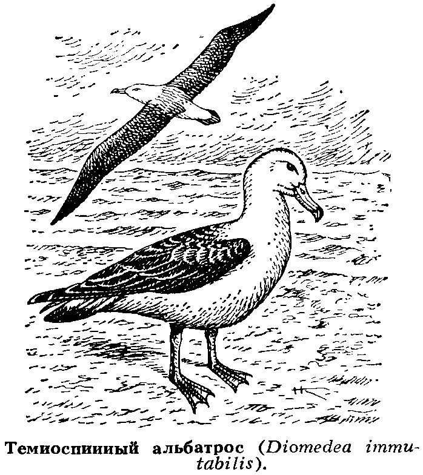

## АЛЬБИНИЗМ

(от лат. а!Биз$ — белый), врождённое отсутствие ‚пигментации пок-
ровов, радужной оболочки глаз у живот-
ных и человека; у высших растений — зе-
лёной окраски всего растения или его отд.
частей. Особь, лишённую окраски, наз.
альбиносом. А.— наследственный приз-
нак, зависящий от наличия рецессивпого
гена, блокирующего в гомозиготном сос-
тоянии синтез пигментов (меланина, хло-
рофилла). Иногда А. возникает как про-
явление гена пятнистости (5) — вся по-
верхность тела оказывается как бы белым
пятном (в этом случае у альбиносов сохра-
няется окраска радужки). У растений А.
может быть обусловлен также наследств.
изменением хлоропластов (см. Наследо-
вание цитоплазматическое), кроме того,
проращивание побегов в темноте ведётк
функциональному А. (этиолированные
побеги), исчезающему на свету. У челове-
ка частота появления альбиносов —
1:20000—1:40000. Чистые линии альби-
носов лабораторных животных — кроли-
ков, крыс, мышей и др. — разводят для
исследовательских целей.

## АЛЬБУМИНЫ

простые глобулярные белки, хорошо растворимые в воде, соле-
вых растворах, разбавленных к-тах и
шелочах; выпадают в осадок при насыще-
нии раствора сульфатом аммония выше
50%. Содержатся в молоке (лактальбу-
мин), яичном белке (овальбумин), сыво-
ротке крови (сывороточный альбумин),
семенах растений и т. д. Осн. резервные
белки организма. Способность к комплек-
сообразованию помогает А. осуществлять
трансп. функцию — связывание и перенос
кровью витаминов, гормонов (напр.,
сА. связано 75—82% кортикостероидов,
98—99% эстрогенов, определяемых в
крови), микроэлементов.

## АЛЬВЕОЛА

(от лат. ауео1и$ — ячейка,
лунка, пузырёк), 1) пузыревидные вы-
пячивания в лёгких млекопитающих на
концах тончайших разветвлений бронхов,
выстланные респираторным эпителием.
КА. прилегают кровеносные капилляры,
что обеспечивает газообмен между альвео-
лярным воздухом и кровью. 2) Углубле-
ния в челюстях, в к-рых помещаются кор-
ни зубов у млекопитающих. 3) То же, что
шаровидный аденомер, или ацинус.

## АЛЬГИНОВЫЕ КИСЛОТЫ

структурные полисахариды, содержащиеся в бу-
рых водорослях и нек-рых бактериях. Ли-
нейные молекулы А. к. построены из
остатков В-О-маннуроновой и а-Г.-гулуро-
новой К-Т, связанных 1 ->4 гликозидны-
ми связями, и включают блоки, состоящие
из одной уроновой к-ты, а также участки
с б. или м. регулярным чередованием ос-
татков обеих к-т. Применяют как геле-
образователи в пищ. пром-сти и для от-
делки и крашения тканей. Соли А. к.—
альгинаты — используют для изготовле-
ния искусств. шёлка.

## АЛЬГОЛОГИЯ

(от лат. ава — водоросль и ...логия} фикология, раз-
дел ботаники, изучающий водоросли.

## АЛЬДОЗЫ

моносахариды, содержащие в своей молекуле альдегидную группу (-COH):
глюкоза, галактоза, рибоза и др.

## АЛЬДОЛАЗЫ

ферменты класса лиаз.
Широко распространены у животных, рас-
тений и микроорганизмов. Участвуют
в процессах анаэробного расщепления уг-
леводов, напр. гликолизе (наиболее ак-
тивна А. мышц, где она составляет 10%
всех растворимых белков), в темновых
реакциях фотосинтеза у растений.

## АЛЬДОСТЕРОН

стероидный гормон,
вырабатываемый корой надпочечников
позвоночных (в осн. наземных). Регули-
рует минеральный обмен (наиболее актив-
ный минералокортикоид) в организме: сти-
мулирует задержку ионов Ма+ в крови и
выведение ионов К и Н\*+. Биологически
активен только свободный А. (ок. 50—
70% А. крови связано с белками). Влия-
ние на ионный баланс А. реализует через
почки, кишечник, потовые и слюнные
железы, жабры и др. Цитоплазматич. ме-
мбраны железистых клеток этих органов
солержат фермент Ма*/К*.АТФазу.
наз. натриевым насосом, к-рый, по совр.
представлениям, и осуществляет транс-
порт ионов (см. Ионные насосы). Секре-
ция А. регулируется ренин-ангиотензин-
ной системой, концентрацией ионов Ма+
и К1, а также кортикотропином, серо-
тонином.

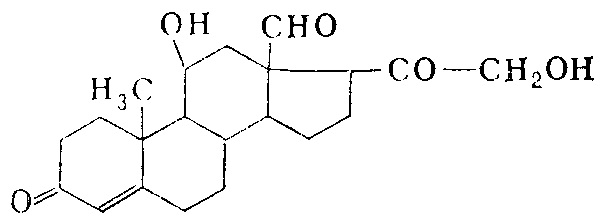

## АЛЬДРОВАНДА (А/атооапаа)

род насекомоядных водных растений семей-
ства росянковых. Единственный вид —
А. пузырчатая (А. 3есшоба), расте-
ние с плавающими нитевидными стеб-
лями без корней. Листья по 7—9 в му-
товках, с длинными шиловидными
щетинками на верхушке пширокого че-
решка. Листовая пластинка со множест-
вом волосков и желёзок, состоит из двух
полукруглых складывающихся полови-
нок, образующих ловушку для рачков и
др. мелких обитателей водоёмов. Цветки
белые, мелкие, одиночные, опыляются
насекомыми. Размножается А. гл. обр. с
помощью зимующих почек, распростра-
няемых водоплаваюшими птицами. Рас-
тёт в пресных водоёмах Евразии, Австра-
лии, Африки; в СССР — в Европ. час-
ти, на Кавказе, Д. Востоке, в Ср. Азии
в озерках стариц. См. рис. 8 в табл. 15.

## АЛЬПАКА

млекопитающее рода лам.
Вероятно, произошла в результате скре-
щивания домалней ламы, с викуньей.

## АЛЬПИЙСКАЯ РАСТИТЕЛЬНОСТЬ

тип высокогорной растительности, пред-
ставленный гл. обр. низкотравными луга-
ми. Развивается в условиях глубокого
снежного покрова, быстрой суточной сме-
ны темп-ры и влажности, короткого веге-
тац. периода. Распространена гл. обр. в
горах умеренных широт (Альпы, Карнпа-
ты, Кавказ, Алтай, Тянь-Шань), в Гимала-
ях и нек-рых др. высокогорьях субтро-
пиков и тропиков. Альп. растения (злаки,
горечавки, примулы, камнеломки и др.) в
осн. низкорослые (10—15 см), дерновин-
ные или подушковидные, с небольшими,
часто прижатыми к стеблю листьями.
Яркая окраска цветков — приспособление
к опылению насекомыми; общий тон ок-
раски растений голубовато-зелёный (Аль-
пы, Гималаи) или желтовато-зелёный
(Памир). Альт. луга, богатые кормо-
выми травами, издавна используются
как летние пастбища.

## АЛЬТРУИСТИЧЕСКОЕ ПОВЕДЁНИЕ

альтруизм (франц. аЙги1зще, от
лат. аЦег — другой), действие (совокуп-
ность действий) индивида (группы осо-
бей), приводяшее к увеличению приспо-
собленности др. индивида (группы) за
счёт снижения собств. приспособленнос-
ти. Впервые представление об А. п. введе-
но Дж. Б. Холдейном и затем наиб. по-
следовательно развивалось Р. Триверсом.
Всякое поведение особи, снижающее её
репродуктивный потенциал и повышаю-
шее репродуктивный потенциал др. чле-
нов популяции, может рассматриваться
как проявление альтруизма. К А. п.,
напр., можно отнести реакцию «окрики-
вания хищника> — поведение, при к-ром
стайные особи сигнализируют о прибли-
жении врага, тем самым предупреж-
дая стаю и подвергая себя опасности.

Согласно имеющимся в социобиологии
представлениям. А. п. может сушество-
вать в форме родственного — А. п. по от-
ношению к родственникам (механизм по-
вышения совокупной приспособленности),
а гакже в форме реципрокного (взаим-
ного) альгруизма — А. п. по отношению
к неродственным особям своего вида или
особям иного вида. При этом предполага-
ется. что в дальнейшем аналогичное по-
веление будет продемонстрировано эти-
ми особями по отношению к альтруисту
или его родственпикам. А. п. может быть
неосознанным (преобладает у животных)
или носить осознанный (формирующийся
в человеческом обществе) характер, когда
альтруист ожидает ответных благ для
себя или родственников. А. п. может
играть важную роль в эволюпии, если ему
следует значит. часть популяции; в этом
случае польза от А. п. превосходит причи-
няемый алътруисту вред.

Концепция А. п. в сопиобиологии не
является общепринятой, а сам термин в
сов. биологии рассматривается как ме-
тафорический.

## АЛЬФАВИРУСЫ (Арйаотизез)

род РНК-содержащих вирусов сем. тогавиру-
сов. Диам. вирусных частиц 50—70 нм.
Размножаются в цитоплазме клеток чле-
нистоногих, пресмыкающихся, птиц,
млекопитающих. Передаются комарами.
Вызывают обычно бессимптомные ин-
фекции. А. наз. также арбовирусы груп-
пы А.

## АМАЗОНСКИЕ ПОПУГАИ (4Атагопа)

амазоны, род попугаеобразных.
Дл. ок. 30 см. Хвост довольно короткий.
26 видов, в лесах Антильских о-вов,
Центр. и Юж. Америки. А. п. ценятся
как хорошие имитаторы речи человека и
часто содержатся в неволе (размножаются
редко). 7 видов и 2 подвида — в Красной
книге МСОП. См. рис. 19 в табл. 47.

## АМАКР*И*НОВЫЕ КЛ*Е*ТКИ

амакринные нейроны (от греч. а — отрицат. частица, makros — длинный и is, род. падеж inos — волокно), интернейроны сетчатки глаза позвоночных.
Тела А. к. располагаются во внутреннем зернистом слое, а отросток, не покидая пределов сетчатки, ветвится в
области синаптич. контактов биполярных ганглиозных нейронов. А. к. изменяют характер распространения возбуждения по нервным клеткам ганглиозного
слоя. Число А. к. особенно велико у животных с высокой остротой зрения, напр. у птиц.

## АМАРАНТ (Атагатйиз)

ширица, род преим. однолетних трав сем. амаран-
товых. Листья очередные. Цветки б. ч.
однополые, ветроопыляемые. Ок. 60 ви-
дов, в тропиках, субтропиках и отчасти
умеренных поясах; в СССР — 15 видов,
гл. обр. заносных. А. запрокинутый
(А. тетоНехи;), А. белый (А. а@фи$) и
А. жминдовидный (А. БИ о14е;) растут
как сорные на полях, ж.-д. насыпях, за-
несены из Сев. Америки. Как декоратив-
ные разводят А. багряный (А. сгиеп!из) с
красными соцветиями и А. хвостатый,
или лисий хвост (А. саида!и5), с длинны-
ми (иногда св. 1 м) свисающими тёмно-
красными или зелёными соцветиями. А.
багряный и А. хвобтатый с древности куль-
тивировали как зерновые раетения в
Центр. и Юж. Америке (были гл. продук-
том питания ацтеков и играли важную
роль в религиозных обрядах, пока в нач.
16 в. исп. колонизаторы не запретили вы-
ращивание А.), а также в нек-рых р-нах
Азии. Благодаря высокой питательности,
засухоустойчивости, простоте выращива-
ния широко вводится в культуру во мн.
странах (особенно тропических).

## АМАРАНТОВЫЕ (АтагапВасеае)

щирицевые, семейство двудольных
растений порядка, гвоздичных. Травы, ре-
же полукустарники, иногла лианы и це-
большие деревья. Листья очередные или
супротивные, цельные. Цветки мелкие,
б.ч. обоеполые, безлепестные, насеко-
мо- или ветроопыляемые, 6. ч. в клубоч-
ках, образующих колосовидные, метель-
чатые и др. соцветия. Плод 6. ч. орехо-
видный. 65 родов, ок. 850—900 видов, в
субтропиках и тропиках (преим. в Амери-
ке и Африке), реже в теплоумеренных и
как заносные в умеренных поясах.
В СССР ок. 20 видов из 4—5 ролов, в
т. ч. амарант, целозия (к-рые во мн. стра-
нах используют как пищ. растения), а
также сорные, рудеральные и декор. рас-
тения.

## АМАРИЛЛИСОВЫЕ (АтагуП!Часеае)

семейство однодольных растений поряд-
ка лилейных. Многолетние травы с луко-
вицами, реже с корневищами или клубне-
луковицами. Листья 6. ч. линейные. Круп-
ные цветки обычно собраны в зонтик,
завязь нижняя (осн. отличие А. от близ-
кого сем. лилейных). Плод — коробоч-
ка, реже — ягода. Ок. 85 родов, ок.
1100 видов, преим. в тропич., субтропич.
и отчасти умеренных областях, но гл. обр.
в Юж. Африке и Юж. Америке, в засуш-
ливых р-нах тропиков и субтропиков;
в СССР — 7 родов, ок. 35 видов. Мн.
А.— декоративные (подснежник, нар-
цисс, амариллис, белоцветник, кринум,
гиппеаструм, кливия и др.) и лекарств.
растения. В роде амариллис (Атагу!15)
1 вид — А. белладонна (А. беНааоппа),
в Юж. Африке. Цветки колокольчатые,
с сильным ароматом, белые, красные или
иной окраски. В тёплых странах выращи-
вают как декоративные, много садовых и
гибридных форм; в СССР — только оран-
жерейная и комнатная культура. Амарил-
лисом часто наз. гиппеаструм, широко
разводимый в комнатах. 11 видов почти
из всех дикорастущих в СССР родов —
в Красной книге СССР.

● Ф Артюшенко 3. Т., Амариллисовые СССЬ, Л., 1970.

## АМБАРНЫЕ КЛЁЩИ (АсагЧае)

мучные, или хлебные, семейство кле-
шей отр. акариформных (в литературе
часто упоминаются как акароидные или
тироглифоидные клещи). Дл. 0,2—0,5 мм,
тело полупрозрачное, беловатое, покровы
мягкие, кожистые; хелицеры трызущие.
В СССР — 56 видов, в т.ч. из родов
Тутодурвиз, СаНойурйиз и др. Обита-
тели почвы и гниющих растит. остатков.
Важная биол. особенность — наличие в
цикле развития гипопуса — непитаюшей-
ся нимфальной стадии, к-рая служит для
пассивного расселения или переживания
неблагоприятных условий. При достаточ-
ной влажности, темп-ре и наличии пи-
ши А. к. способны к быстрому массовому
размножению. Могут вызвать порчу
с.-х. продуктов, особенно зерна, муки,
круп. См. рис. 1 в табл. 30 А.

● Захваткин А. А., Тироглифопдные клещи (Тугов|урБо!Чеа), М.— Л., 1941 (Фауна СССР, т. 6, в. 1).

## АМБИСТОМОВЫЕ (АтЬузюотайдае)

(ранее неправильно — амблистомовые),
семейство хвостатых земноводных. Дл.
от 8 до 30 см. Похожи на саламанлр. 4 ро-
да, 35 видов, в Сев. Америке. Взрослые
обитают по берегам водоёмов, во влажных
местах прибрежных лесов, нек-рые ла-
зают по деревьям или роются в почве.
Питаются беспозвоночными. Осеменение
внутреннее. Самка откладывает 50—500
яиц, Чаще в воду. Личинки с ветвистыми
наруж. жабрами, развиваются в воде; по-
ловой зрелости достигают на суше. Широ-
ко распространена тигровая А. (АтЬузто-
та Нопптит), дл. до 28 см, личинка к-рой
(аксолотль) способна к размножению.
Неотения характерна и для др. А. 5 ви-
дов и подвидов в Красной книге МСОП.
АМБРА, воскоподобное вешество, обра-
зующееся в пищеварит. тракте кашалота;
иногда А. находят в воде или на берегу.
Специфич. запах обусловлен продуктами
окисления тритерпенового спирта амбреи-
на. Используют в парфюмерии как за-
крепитель духов.

## АМБРОЗИЕВЫЕ ЛИСТОЁДЫ (2уодо-ататта)

род жуков сем. листоедов. Ок.
0 видов, распространены в Сев. Америке,
особенно в Мексике. Мн. виды питаются
исключительно амброзией, в связи с чем
их используют для биол. защиты посевов
с.-х. культур от засорения амброзией.
Наиболее обычен полосатый А. л. (7. 5и-
нигай5), дл. ок. 5 мм, бронзово-бурый,
с жёлтыми надкрыльями, имеющими
тёмные продольные полоски. Встречается
на С. Мексики, в СИТА и на Ю. Канады.
Полосатый А. л. успешно акклиматизи-
рован в Ставропольском, Краснодарском
краях и Абх. АССР для борьбы с широко
распространёнными там нек-рыми видами
амброзии.

## АМБРОЗИЯ

1) род (Атётояда) преим. травянистых растений сем. сложноцвет-
ных. Корзинки мелкие, однополые: несу-
ше тычиночные цветки в колосовидных
или кистевидных общих соцветиях, у их
основания среди прицветных листьев на-
холятся одиночные или клубочками по
2—5 пестичные цветки, иногда они рас-
положены в пазухах верх. листьев. Се-
мянки без хохолка, заключены внутри
обёртки, впоследствии твердеющей. 35—
40 видов. гл. обр. в Америке, заносные
во мн. странах; в СССР —4—5 видов, на
Ю. Европ. части СССР, в Прибалтике,
Приморском крае. Карантинные сорняки,
для борьбы с к-рыми могут быть исполь-
зованы нек-рые амброзиевые листоеды.
Пыльца А. (в массе) — сильный аллер-
ген. 2) Белые или розоватые налёты ми-
целия нек-рых сумчатых грибов (напр.,
Масторйота), выстилающие в древе-
сине ходы, в которых живут личинки
жуков короедов, питающиеся этим ми-
пелием.

## АМБУЛАКРАЛЬНАЯ СИСТЁМА

(от лат. ат биасгит — место для хождения,
хождеиие), система заполненных жидко-
стью сосудов (каналов) у иглокожих,
служащая для движения, а также для
дыхания, выделения и осязания. Разви-
вается из зачатков целома. Состоит из
околоротового кольца и радиальных ка-
налов, боковые ветви к-рых входят в ам-
булакральные ножки — цилиндрич. тру-
бочки с ампулой у основания и с присос-
кой или подошвой на наруж. конце
(у морских звёзд, морских ежей и др.),
либо остроконечные (у морских лилий,
офиур и др.). При наполнении жид-
костью ножки вытягиваются по направ-
лению движения и присасываются к разл.
подводным предметам; при сокрашении
ножек тело животного несколько пере-
мещается. С внеш. средой А. с. сообща-
ется пористой (мадрепоровой) пластин-
кой каменистого канала.

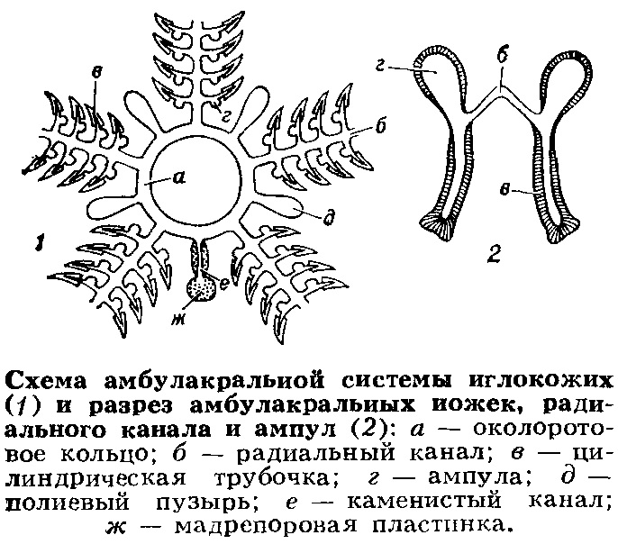

## АМЁБОЦИТЫ

(от амёбы и ... цит), бесцветные подвижные клетки внутр.
среды беспозвоночных. Соответствуют
лейкоцитам позвоночных. Для А. харак-
терны пиноцитозные пузырьки и лизосо-
мы. Защищают организм от разл. инород-
ных частиц, захватывая и переваривая их
(фагопитоз), участвуют в переваривании
пищи, экскрепии. Способны к агглютина-
ции.

## АМЁБЫ (ТоБозеа)

класс наиболее просто организованных простейших над-
класса корненожек. Лишены внутр. ске-
лета и наруж. раковины. Форма тела
непостоянна, размеры обычно от 20 до
700 мкм, реже несколько более. Форма
и размеры псевдоподий характерны для
определ. видов А. Передвигаются А.,
«перетекая» с одного места на другое
(т. н. амёбоидное движение). Ядро обыч-
но одно. Неск. сем., включающих боль-
шое число видов, широко распространены
в пресных, солоноватых, иногда морских
водах, часто в прибрежном песке, есть
виды. живущие в почве. Питаются бакте-
риями, одноклеточными водорослями,
мелкими простейшими. Размножение бес-
полое (делением надвое). При неблаго-
приятных условиях образуют цисты. Сем.
ЕпдатоеЬ !Чае включает исключительно па-
разитич. виды, среди представителей сем.
РагатоеБ!Чае паразиты — лишь нек-рые.
А. этих семейств паразитируют у членис-
тоногих, рыб, земноводных, пресмыкаю-
щихся, птиц, млекопитающих. Нек-рые
мелкие свободноживущие А. также могут
переходить к факультативному парази-
тизму и вызывать заболевания человека и
животных. Наиболее типичные предстА-
вители: свободноживущая А. протей
(Атоефа ртойеиу) и паразитич. дизеите-
рийная А.

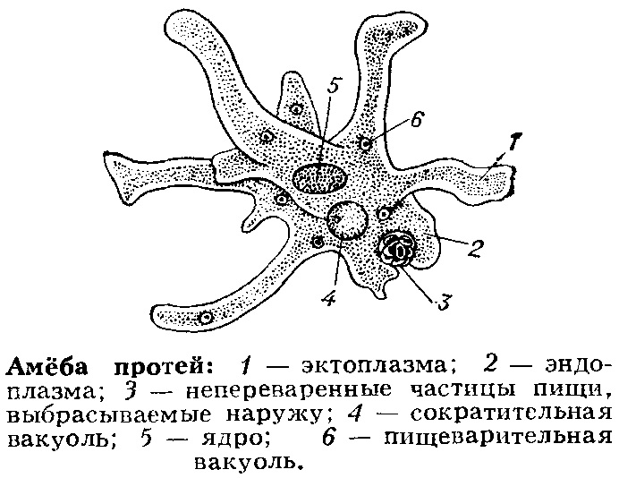

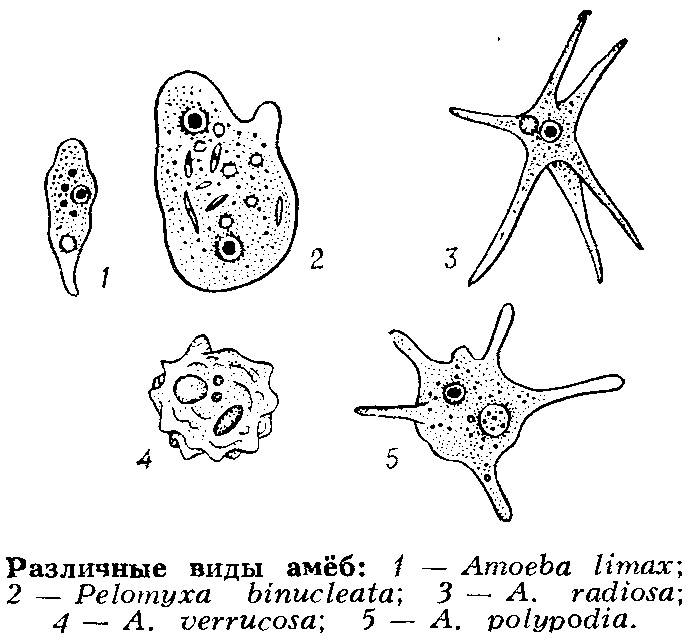

## АМЕРИКАНСКИЕ ГРИФЫ (Сафагае)

подотряд соколообразных. Наиболее
примитивные хищные птицы, сохраняю-
шие нек-рые особенности строения, свойст-
венные аистообразным и пеликанообраз-
ным. Внешне сходны с грифами Ст. Све-
та; имеют широкие крылья (в размахе
до Зм) и могут часами парить, высмат-
ривая добычу; голова и часть шеи голые,
что предохраняет от загрязнения при
поелании внутренностей трупов. Задний
палец маленький, прикренлён выше дру-
гих, благодаря чему все А. г. хорошо хо-
дят и бегают, но не могут схватить добы-
чу лапой. Когти тупые, слабоизогиутые.
Мускулатура пиж. гортани (сиринкса) не-
доразвита, поэтому А. г. лишены голоса.
3 семейства, в Т. ч. современное Са(фаг-
{1Чае с 5 родами, 7 видами; наиб. изве-
стен кондор. Распространены от юж. ча-
сти Канады до Огненной Земли. Пита-
ются рыбой и падалью. Птенцы вылупля-
ются зрячими, но развиваются медленно.
Калифорнийский гриф (Сутподурз сай-
огиаптиз) на грани исчезновения (в 1983
насчитывалось 26 птиц), в Красной книге
МСОП.

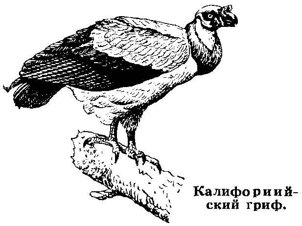

## АМЕРИКАНСКИЕ ДИКОБРАЗЫ (Еге№12опИЧае)

древесные дикобразы, семейство грызунов. Дл.
тела 64—103 см, хвоста 14—30 см; масса
до 18 кг. Верх. часть тела покрыта корот-
кими острыми иглами с зазубренным коп-
цом, брюшная -— щетиной или грубым
волосом. Конечности, а у нек-рых видов
и хвост, хватательные. 3 рода (или 5),
11—12 видов, в лесах умеренного, суб-
тропич. и тропич. поясов Сев. и Юж.
Америки. Образ жизни древесно-назем-
ный. Живут обычно поодиночке; убежи-
ща в дуплах. пещерах, расселинах скал;
в горах до выс. 2000 м. Активиы ночью и
в сумерки, зимой активность пониженная.
Растительноядны. Раз в год рождают 1—
А детёнышей. Могут повреждать лесные
посадки. 1 вид — в Красной книге МСОП.
См. рис. 29 при ст. Грызуны.

## АМЕРИКАНСКИЕ ЛИСТОНОСЫ (РАуПозота14ае)

семейство летучих мышей. На конце морды вертикальный,
заострённый к вершине кожный придаток
(«листок»). Разнообразное по характеру
адаптаций и богатое видами семейство.
48 родов, в т. ч. ложные вампиры, 135
видов. Эндемики тропич. и субтропич.
поясов Америки. Нек-рые питаются насе-
комыми, мелкими позвоночными, многие
частично или полностью — мякотью
плодов, нектаром и пыльцой цветков, эко-
логически замещая отсутствующих в Зап.
полушарии крыланов. В помёте обычно
один детёныш.

## АМЕРИКАНСКИЕ ОЛЁНИ (Одосо:еи5)

род оленевых. Дл. тела 110—200 см;
масса 22—205 кг. Окраска от серо-жёлтой
до тёмно-рыжей. 6 видов, в Америке (от
62° с. ш. до 48° ю. ш.). Обитают гл. обр.
в лесах, на равнинах и в горах. Рождают
1—4 детёнышей. 3 подвида — в Крас-
ной книге МСОП.

## АМЕРИКАНСКИЕ СЛАВКОВЫЕ (Раго]1Чае)

лесные певуны, семейство певчих воробьиных. Дл. 10—18 см.
Клюв тонкий, острый, реже уплощённый,
со шетинками у основания. Оперение
оливковое или серое в сочетании с жёл-
тым, красным, чёрным или серо-голубым.
27 родов, 124 вида, в Америке от Аляски и
Лабрадора до Сев. Аргентины. В СССР
вида залетали на Чукотский п-ов.
Преим. древесные птицы. Питаются насе-
комыми. В кладке 2—5 яиц. У нек-рых
красивая песня. 3 вида и 2 подвида — в
Красной книге МСОП.

## АМЕРИКАНСКИЕ ЦВЕТОЧНИЦЫ (СоегеБ!Чае)

семейство певчих воробьи-
ных, в к-рое ранее выделяли птиц со
сходными приспособлениями к питанию
нектаром: считается искусственным, по-
этому часть видов А. ц. отнесли к сем.
танагровых, а часть — к сем. американ-
ских славковых.

## АМИДАЗЫ

ферменты класса гидролаз;
катализируют расшепление связи меж-
ду углеродом и азотом в веществах типа
кислотных амидов с образованием молеку-
лы аммиака. А. регулируют азотистый
обмен в живых организмах и широко
распространены в природе. Осн. предста-
вители — уреаза, глутаминаза и аспара-
гиназа. Препараты последней исполь-
зуют в медицине.

## АМИЕОБРАЗНЫЕ (Ат!огтез)

отряд ганоидных рыб. Известны с верх. перми,
были многочисленны в середине мезо-
зоя. Близки к панцирникообразным.
Единств. совр. вид — ильная рыба (Ата
саоа). Дл. до 75 см. Тело вальковатое,
рыло короткое. Осевой скелет окостенев-
ший, на голове кожные кости — признак
примитивных рыб. Чешуя циклоидная;
спинной плавник длинный, хвостовой —
симметричный, округлый. Брызгальца
нет. Рот конечный, челюсти с зубами.
Обитает в Сев. Америке в Великих озё-
рах и в неглубоких, заросших или забо-
лоченных водоёмах к Ю. от них. Способ-
на дышать атм. воздухом (плават. пузырь
функцнонирует как лёгкое), остаётся
живой вне воды в течение суток. Хищник,
питается беспозвоночными и мелкой ры-
бой. Плодовитость до 70 тыс. икринок.
Нерест весной; самец строит гнездо,
охраняет икру и молодь. Промыслового
значения не имеет, интересна как «живое
ископаемое».

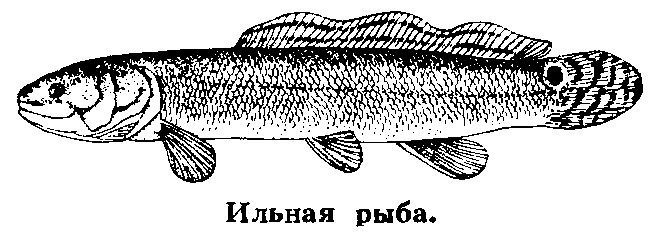

## АМИЛАЗЫ

ферменты класса гидролаз;
катализируют гидролиз резервных поли-
сахаридов (крахмала, гликогена). А. об-
наружёны у животных (слюна, поджелу-
дочная железа), у высших растений (про-
росшие зёрна) и в микроорганизмах. В за-
висимости от характера действия на суб-
страт различают а-А. {расщепляют внутр.
а-1,4-связи в молекуле полисахарида),
В-А. (последовательно отщепляют остат-
ки мальтозы от нередуцирующих концов
цепей полимера) и глюко-А. (расщепляют
полисахарид с образованием свободной
глюкозы). А. применяют для осахарива-
ния крахмалистого сырья в пивоваренной,
спиртовой, хлебопекарной пром-сти, при
произ-ве глюкозы и др.

## АМИЛОЗА

полисахарид, линейные мо-
лекулы к-рого построены из остатков
о — О-глюкозы; компонент крахмала.
Мол. м. до 200 000.

## АМИЛОПЕКТИН

полисахарид, много-
кратно разветвлённые молекулы к-рого
построены из остатков а —- О-глюкозы;
компонент крахмала. Мол. м. до неск.
миллионов.

## АМИЛОПЛАСТЫ

(от греч. атуоп — крахмал и р!аз0$ — вылепленный), плас-
тиды (из группы лейкопластов) растит.
клетки, синтезирующие и накапливаю-
щие крахмал.

## АМИНОКИСЛОТЫ

органические (карбоновые} кислоты, содержашие, как пра-
вило, одну или две аминогруппы (— МН>).
В зависимости от положения амино-
группы в углеродной цепи по отношению
к карбоксилу различают о-, В-, \-
и т.д. А. природе широко распро-
странены @а-А., имеющие (кроме гли-
пина) один или два асимметрических
атома углерода и, в основном, .-конфи-
гурацию. В построении молекул белка
участвуют обычно ок. 20 Г—=а—А.
(пролин — а-иминокислота). Специфич.
последовательность чередования А. в
пептидных цепях, определяемая гене-
тическим кодом, обусловливает первич-
ную структуру белка. Высшие расте-
ния и хемосинтезирующие организмы
все необходимые им А. синтезируют из
аммонийных солей и нитратов (в растит.
клетке они восстанавливаются до МНз)
и кето- или оксикислот — продуктов ды-
хания и фотосинтеза. Человек и животные
синтезируют большинство г. н. замени-
мых А. из обычных безазотистых продук-
тов обмена и аммонийного азота; Незаме-
нимые аминокислоты должны поступать
с пищей. Занимают центр. местд в обмене
азотистых веществ (входят в состав бел-
ков, пептидов, участвуют в биосинтезе
пуринов, пиримидинов, витаминов, ме-
диаторов, алкалоидов и др. соединений).
В организме окислит. распад А. путём
дезаминирования (особенно интенсивно
идёт в почках и печени) гл. обр. глутами-
новой к-ты, образовавшейся путём пере-
аминирования, приводит к образованию
кето- иоксикислот — промежуточных про-
дуктов цикла трикарбоновых к-т. Далее
они превращаются в углеводы, новые А.
и т. п. или окисляются до СО) и Н›О с
выделением энергии. При этом азот в виде
аммонийных солей, мочевины и мочевой
к-ты выводится из организма. У растений
связанный азот используется более полно
и азотистые отходы практически отсутст-
вуют. В тканях живых организмов встре-
чаются А. (св. 100), не входящие в состав
белков. Среди них важные промежуточ-
ные продукты обмена веществ (орнитин,
цистатионин и др.), а также редкие А.,
биол. функции к-рых неясны. В микро-
биол. пром-сти используют способность
мутантных штаммов нек-рых микроор-
ганизмов продупировать отд. А. (глута-
миновую к-ту, лизип и др.). А., а также
их смеси, применяют в медицине, живот“
новодстве (для обогашения кормов), как
исходные продукты для пром. синтеза по-
лиамидов, красителей. Мн. А. получе-
ны абиогенным путём в условиях, мо-
делирующих атмосферу первобытной
Земли.

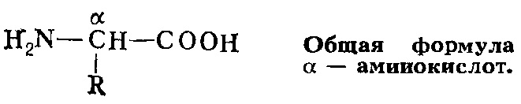

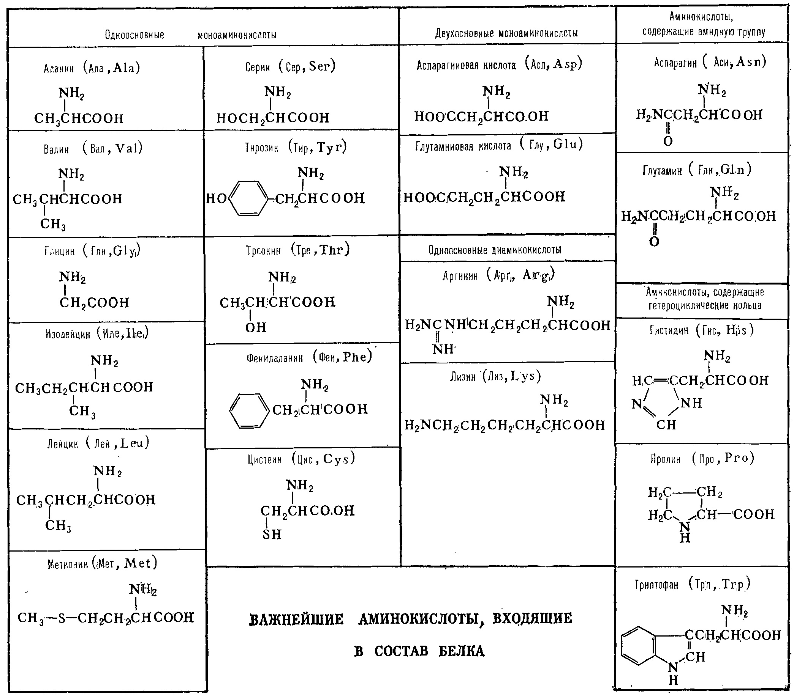

## АМИНОПЕПТИДАЗЫ

протеолитич. ферменты, отпепляющие М-концевые ос-
татки аминокислот от пептидов и белков.
Обнаружены в тканях животных, высших
растений, а также у микроорганизмов.
Наиболее изучена лейцинаминопептида-
за, выделенная в чистом виде из почек и
хрусталика глаза и отшепляющая преим.
остатки аминокислот гидрофобного ха-
рактера; используют при исследовании
первичной структуры белков.

## АМИНОТРАНСФЕРАЗЫ

трансаминазы, ферменты класса трансфе-
раз, катализирующие обратимые реакции
трансаминирования, т. е. перенос амино-
группы (— МН2) и водорода от одной мо-
лекулы субстрата к другой без проме-
жуточного образования аммиака. Кофер-
менты А.— пиридоксальфосфат и пири-
доксаминофосфат. А. участвуют в азо-
тистом обмене, особенно в обмене амино-
кислот. Определение активности аланино-
вой и аспарагиновой А. в сыворотке кро-
ви человека используют в диагностике
заболеваний печени и сердца.

## АМИТОЗ

(от греч. а — отрицат. частица и митоз), прямое деление интерфаз-
ного ядра путём перетяжки без образова-
ния хромосом, вне митотич. цикла. А.
может сопровождаться делением клетки,
а также ограничиваться делением ядра без
разделения цитоплазмы, что ведёт к об-
разованию дву- и многоядерных клеток.
А. встречается в различных тканях в спе-
циализированных обречённых на гибель
клетках, особенно в клетках зародыше-
вых оболочек млекопитающих. Клетка,
претерпеваюткая А., в дальнейшем не спо-
собна вступить в нормальный митотич.
цикл. Прежний взгляд на А. как примитив-
ную форму деления ядра, на основе к-рой
развился митоз, не подтвердился. Прямое
деление вегетатив. ядра (макронуклеуса)
инфузорий, внешне напоминающее А.,
представляет собой качественно своеоб-
разную форму деления ядра, возникшую
на основе преобразования митоза.

## АММИ (Атт:)

род двулетних трав сем.
зонтичных. Листья дважды- или трижды-
перистые. Зонтики в сильно рассечённой
оберткой. 10 видов, на Азорских о-вах,
0. Мадейра, в Средиземноморье и Зап.
Азии. В СССР Ё вид — А. зубная (А.
обпада), растёт на Кавказе в солонце-
ватых степях и на сухих склонах. Культи-
вируется как лекарственное в Молдавии,
на Украине и Сев. Кавказе; размножает-
ся семенами. В Краснодарском крае вы-
рашивают А. большую (А. та]ли5),
дико произрастающую в Сев. Африке и
Зап. Азии.

## АММИАК

МНз, простейшее химич. сое-
динение азота с водородом. Конечный
продукт распада и исходное соединение
при биосинтезе азотсодержащих веществ
в живых клетках. Конпентрация свобод-
ного А. в живых Тканях в виде иона аммо-
ния (МН.) невелика. А. токсичен для
организма и обезвреживается в процессе
биохимич. реакций. У животных А. обра-
зуется при распаде белков и нуклеиновых
к-т и обезвреживается путём синтеза
мочевой к-ты (ут. н. урикотеличе-
ских животных — наземных на-
секомых, птиц, мн. пресмыкающихся) или
мочевины (у уреотелических
животных — взрослых земновод-
ных, мн. млекопитаюших), к-рые затем
выводятся из организма; мн. водные жи-
вотные (напр., костистые рыбы} выделяют
МН, непосредственио (аммониоте-
лические организмы). У рас-
тевий А. обезвреживается в процессе син-
теза амидов (аспарагина, глутамина, мо-
чевины) — соединений, запасаюших и
транспортируюших азот в организме.
При связывании азота воздуха клубень-
ковыми и свободноживущими азотфик-
сирующими бактериями первичным про-
дуктом является А. Выделяемый живот-
ными или образовавшийся в результате
аммонификации и азотфиксации А. час-
тично окисляется нитрифицирующими
бактериями до нитратов и нитритов и ис-
пользуется растениями для биосинтеза
азотсодержащих соединений. Т.о., А.
играет важную роль в круговороте азота
в природе.

## АММОНИФИКАЦИЯ

разложение мик-
роорганизмами азотсодержащих органич.
соединений (белков, мочевины, нуклеи-
новых к-т и др.) с образованием свобод-
вого аммиака; один из важнейших этапов
круговорота азота в природе, приводящий
к обогащению почвы усвояемыми форма-
ми азота. В результате жизнедеятельно-
сти и гибели организмов в почву и водоёмы
попадает много азотсодержащих органич.
вешеств, к-рые благодаря А. минерали-
зуются и могут быть вновь использованы
растениями и разл. микроорганизмами.
При А. соединения вначале гидролизу-
ются при Участии соответствующих фер-
ментов до более простых соединений, ис-
пользуемых клеткой в процессах метабо-
лизма. Микроорганизмы, участвующие
в А. белков, наз. гнилостными (см. Гние-
ние), мочевины — уробактериями. Не-
к-рые бактерии в процессе нитратного ды-
хания восстанавливают до аммиака нит-
раты.

## АММОНОИДЁИ (Атшопоеа)

аммониты, подкласс (или надотряд)
вымерших головоногих моллюсков. Из-
вестны с девона до конца мела по всему
земному шару. Наруж. раковина от
неск. см до 2м в диам., у многих спираль-
нозавитая в одной плоскости (похожа на
раковину наутилуса), разделена попереч-
ными перегородками на ряд камер, в пос-
ледней (жилой) помещалось тело моллюс-
ка, а предыдущие («воздушные») играли
роль гидростатич. аппарата. От жилой
через все остальные камеры проходил
сифон, обеспечивающий регуляцию пла-
вучести. Отличия сложнорассечённых
краёв перегородок в месте прикрепления
их к стенке раковины (т. н. лопастпая
линия) — систематич. признак. Отряды
СошайИЧа и АдошайИЧа характерны
для палеозоя, СегаНИЧа — для перми-
триаса Губосега Ча, РьуНосега& а,
Аттоп Ча — для юры — мела. Ок.
1500 видов. Хишники. Обитали в морях.
У форм со спиральнозавитой раковиной
легко проследить индивидуальное раз-
витие, внутр. обороты раковины Дают
представление о филогенетич. ряде дан-
ной формы. А.— классич. руководящие
ископаемые. См. рис. 37 в табл. 32 и рис.
5 при ст. Моллюски.

## АММОФИЛЫ (АтторййЙа)

песчаные осы, род насекомых сем. рою-
щих ос. Брюшко длинное, красное, с
тонким стебельком. Гнездо с единств.
ячейкой в земле, закрывает пробочкой
из камешков. Одна оса может иметь
одновременно неск. гнёзд. Яйца откла-
дывает на запасённую парализованпую ею
крупную гусеницу, к-рой питается ли-
чинка. 250 видов, распространены ши-
роко; в СССР — св. 30 видов, в т. ч.
повсеместно встречается А. песчаная (А.
аби оза), дл. 12—28 мм.

## АМНИОН

(греч. атп!оп), одна из заро-
дышевых оболочек у пресмыкающихся,
птиц и млекопитающих. По наличию или
отсутствию А. позвоночных делят на две
группы: амниоты, или высшие, и анам-
нии, или низшие. А. имеется у ряда групп
беспозвоночных (насекомые, скорпионы,
пемертины). Подробнее см. Зародыше-
гые оболочки.

## АМНИОТЫ (Атпюоа)

высшие позвопочные, для к-рых характерно образова-
ние зародышевых оболочек вокруг эмб-
риоиов, в т. ч. амниона (отсюда назв.).
КА. относятся пресмыкающиеся, птицы
и млекопитающие. В отличие от анамний
(круглоротые, рыбы, земноводные), эмб-
риовальное развитие А. протекает в яй-
цах, откладываемых на суше, или разви-
вающихся в организме матери.

## АМУРЫ

общее назв. 2 видов рыб: белого амура и чёрного амура.

## АМФИ...

(от греч. ашрШЫ — вокруг,
около, с обеих стороп), часть сложных
слов, соответствующая словам «с обеих
сторон», «вокруг», «двоякий> (напр.,
амфибластула).

## АМФИБЛАСТУЛА

(от амфи... и бластула), бластулообразная личинка ие-
к-рых известковых губок с резкими разли-
чиями анимальных и вегетатив. клеток.
Развивается из стомобластулы в парен-
химе материнской губки, из тела к-рой
наружу выходит через водоносные кана-
лы. А. прикрепляется к субстрату и
образует молодую губку — олинтус.
См. также Целобластула. См. рис. 2 при
ст. Личинка.

## АМФИДИПЛОИД

(от амфи..., . греч. 41р!60$ — двойной и 6140$ — вид), ал-
лотетраплои д, организм, возник-
ший на основе межвидовой гибридиза-
ции и имеющий два диплоидных набора
хромосом (по одному диплоидному на-
бору от каждого вида). Впервые меж-
родовой плодовитый аллотетраплоид —
рафанобрассика — получен в нач. 20-х
гг. Г. Д. Карпеченко от скрещивания
редьки и капусты. Затем были выведены
А. между рожью и пшеницей — тритика-
ле, пшеницей и пыреем — пшенично-
пырейные гибриды и др., к-рые соче-
тают морфологич. признаки исходных
видов. Б. Л. Астаурову удалось получить
А. у животных скрещиванием гибридов
двух видов шелкопрядов (Вотбух точ
и В. тапаамва). А. плодовиты, посколь-
ку у них каждая хромосома имеет гомо-
логичную себе; мейоз у А. протекает, как
правило, нормально. В селекции А. ис-
пользуют для преодоления стерильности
межвидовых гибридов. А. имеют важное
значепие в видообразовании, используют-
ся в ресинтезе (воссоздании) старых вн-
дов. Нацр., экспериментадьно в резуль-
тате скрещивания тёрна (Ргипиу зр1то5а)
салычой (Р. гоайсаа) получена культур-
ная слива (Р. дотёзНса), что служит до-
казательством её исходного происхожде-
ния путём межвидовой гибридизации.

## АМФИЛИНИДЫ (АтрЬШа)

класс плоских червей. Небольшая архаичная
группа полостных паразитов рыб и чере-
пах. Рассматривались ранее как неотенич.
личинки (плероцеркоиды) ленточных чер-
вей. Тело листовидное или ремневидное,
нерасчленённое дл. 2—38 см. Органов
прикрепления и кишечника нет. 1 семей-
ство, 6 родов, 8 вилов. Гермафродиты с
одним половым комплексом. Цикл разви-
тия со сменой хозяев. Яйцеживородящи.
Ресничная плавающая личинка (ликофо-
ра), с 5 парами крючьев на заднем конце
тела, проникает в промежуточных  хо-
зяев — рачков-бокоплавов или десяти-
ногих ракообразных. В полости их тела
ликофора претерпевает метаморфоз и
развивается в личинку, морфологически
близкую к половозрелой особи. Попадая
в желудок окончат. хозяина, личинка миг-
рирует в полость тела, где растёт и дости-
гаег половой зрелости. В СССР наиболее
обычна АтрёЙта  ГоЙасеа — паразит
осетровых.

● Дубинина М, Н., Паразитические ЧерВН абв АюрЬНИни4а (РаВепилез),

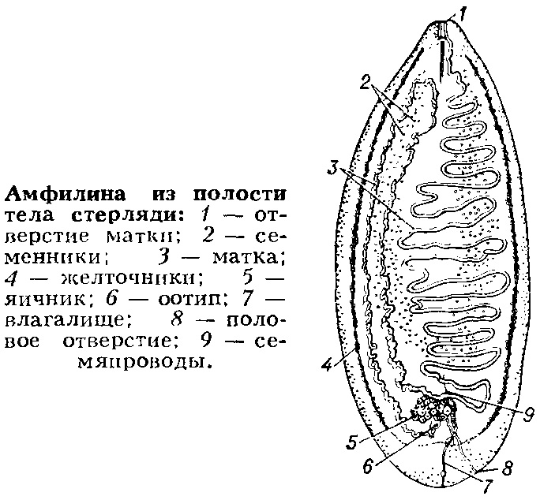

## АМФИМИКСИС

(от амфи... и греч. 11х15 — смешение), способ полового
размножения растений и животных, при
к-ром новый организм образуется в ре-
зультате слияния отцовской и материн-
ской гамет. Формы полового процесса
при А., напр. у низших растений, чрез-
вычайно разнообразны: изо-, гетеро-,
оогамия и др. У цветковых растений А.
происходит в форме двойного оплодотво-
рения. В широком смысле А. противо-
поставляют апомиксису. См. также Опло-
ботворение.

## АМФИСБЕНЫ (АтрЬ1зБаега)

подотряд чешуйчатых. Близки к яшерицам.
Дл. до 70 см, тело цилиндрическое, чер-
веобразное, с коротким хвостом. Покрыто
цельной роговой плёнкой с узкими попе-
речными кольцами и продольными
бороздками. Конечности у большинства
отсутствуют. Неск. семейств, 23 рода, 140
(по др. данным, 120) видов. Обитают
гл. обр. в Юж. и Центр. Америке, Зап.
Азии, один вид в Юж. Европе, один —
на Ю.-В. Сев. Америки. Самое обшир-
ное семейство — двуходки (АтрЬ1зраеп:-
Чае) — включает св. 100 видов. А. ведут
роющий образ жизни. Питаются гл. обр.
муравьями, термитами и их личинками
(Часто поселяются в муравейниках и тер-
митниках). Могут передвигаться в зем-
ляных норах хвостом вперёд.

## АМФИСТИЛИЯ

(от амфи... И ...стилия), двойное малоподвижное соединение
нёбноквадратного хряща (первичной
верх. челюсти) с мозговым черепом у
древнейших акул, костных ганоидов,
многопёров и кистепёрых рыб. Осущест-
вляется посредством специального одно-
го или двух отростков этого хряща и гио-
мандибулярного элемента подъязычной
дуги, выполняющего функцию подвеска.
А. возникла из протостилии в связи
с необходимостью укрепления челюст-
ного сустава. Ср. Аутостилия, Гиости-
лия.

## АМФИУМОВЫЕ (АтшрЬ!ит!Чае)

семейство хвостатых земноводных. Дл.
80—100 см. Тело угревидное, с 2 парами
рудиментарных конечностей с 2—3 нв-
доразвитыми пальцами. Глаза скрыты
под кожей. Личинки дышат наруж. жаб-
рами, взрослые — лёгкими. 1 род, 3 ви-
да, на Ю.-В. Сев. Америки, в заболочен-
ных водоёмах, в озёрах, на рисовых по-
лях. Взрослые могут долго находиться
вне воды. Питаются водными беспозво-
ночными, реже — мелкими рыбами и
земноводными. Самка откладывает на
суше во влажных местах ок. 50 яиц, об-
вивая их своим телом. Эмбриональное
развитие длится ок. 150 сут, а личиноч-
ное — 80—100 сут. У взрослых А. сох-
раняются нек-рые личиночные признаки
(частичная неотения).

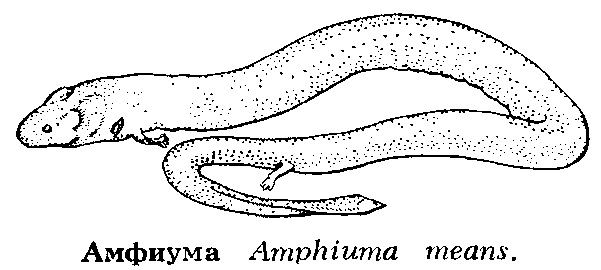

## АНАБАЗИН

алкалоид, содержащийся в ежовнике безлистном (Апаба515 арву1-
1а), а также во мн. растениях рода табак.
Но химич. строению и физиол. действию
близок никотину.

## АНАБАСЫ (Апа5а5)

рыбы-ползуны, род рыб сем. лабиринтовых. Дл.
10—25 см. Ок. 10 видов, в пресных водах
Юж., Юго-Вост. Азии и Филиппин. Наи-
более обычна рыба-ползун (А. {е51иа:-
пеиз). Окраска спины и боков буровато-
зелёная, брюхо желтоватое. Можег до
8 ч оставаться вне воды. Переселяется из
водоёма в водоём в сезон дождей, поль-
зуясь для передвижения плавниками.
В сухой сезон впадает в спячку, зарыва-
ясь в ил. Во время нереста А. гнёзд не
строят, икру и личинок не охраняют.
Хищники. Объекты местного промысла
и разведения.

## АНАБЁНА (Апафаепа)

род гормогониевых водорослей. Одиночные или в виде
плёнчатых  дерновинок. Размножение
обрывками нитей и акинетами. Ок. 100
видов, в пресных и солёных континенталь-
ных водоёмах, опреснённых участках
морей, горячих источниках, на почве.
Способна фиксировать мол. азот. Вызы-
вает «цветение» воды.

## АНАБИОЗ

(от греч. апаБ!0$!5 — оживление, возвращение к жизни), состояние
организма, при к-ром жизненные процес-
сы (обмен веществ и др.) настолько за-
медлены, что отсутствуют все видимые
проявления жизни. А. наблюдается при
резком ухудшении условий существова-
ния (низкая темп-ра, отсутствие влаги и
др.); при наступлении благоприятных ус-
ловий происходит восстановление нор-
мального уровня жизненных процессов.
Т. о., А.— приспособление организма к
неблагоприятным внеш. условиям, . вы-
работанное в процессе эволюции. Наи-
более стойки к высушиванию, охлажде-
иию, нагреванию спорообразующие бак-
терии, микроскопич. грибы и простей-
шие (образующие цисты). У мн. организ-
мов угнетение жизнедеятельности и её
почти полная остановка вошли в нормаль-
ный цикл развития (семена, споры, ‘Ци-
сты). Типичным примером А. при высу-
шивании (ангидробиозе) служит т. н.
скрытая жизнь семян мн. растений, к-рые
могут в сухом состоянии длительно сох-
ранять всхожесть. А. у животных открыл
А. Левенгук (1701). Беспозвоночные —
гидры, черви, усоногие раки, водные и
наземные моллюски, нек-рые насекомые,
впадая в А., могут терять !/› и даже 3/.
заключённой в их тканях воды. А. лежит
в основе диапаузы. А. при темп-ре ниже
0° наблюдается в ряде случаев при зимней
спячке млекопитающих. Однако А. (по
сравнению с оцепенением и спячкой) соп-
ровождается более глубоким подавлением
жизнедеятельности.

Явлением А. при высушивании и ох-
лаждении пользуются для изготовления
сухих живых вакцин, длительного сох-
ранения клеточных культур, консервиро-
вания тканей и органов. См. также Покой
у растений.

● Ф Майстрах Е. В., Гипотермия и анабиоз, М.— Л.. 1964 (лит.); Голдовский А. М.. Анабиоз, Л., 1981 (лит. ).

## АНАБОЛИЗМ

(от греч. апаБо!ё — полъём), ассимиляция, совокупность
химич, процессов в живом организме, на-
правленных на образование и обновление
структурных частей клеток и тканей.
Противоположен катаболизму (диссими-
ляции), заключается в синтезе сложных
молекул из более простых с накоплением
энергии. Необходимая для_ биосинтеза
энергия (гл. обр. в форме АТФ) поставля-
ется катаболитич. реакциями биологи-
ческого окисления (см. Окисление био-
логическое). Очень интенсивно А. про-
исходит в периоды роста: у животных —
в молодом возрасте. у растений — в те-
чение вегетац. периода. Наиболее важный
пропесс А., имеющий планетарное зна-
чение, — фотосинтез.

## АНАБОЛИЯ

надставка, добавление новой стадии в конце морфогенеза
к.-л. органа с соответствующим удлинени-
ем его онтогенетич. развития; одна из
форм (модусов) филэмбриогенезов. Тер-
мин «А.» предложен А. Н. Северцовым
(1912). При эволюции по пути А. более
ранние стадии морфогенеза не изменяют-
ся, а стадия, непосредственно предшест-
вующая новой, рекапитулирует позднюю
стадию эмбрионального развития предко-
вой формы, т. е. близка к состоянию ор-
гана у взрослого предка. Т.о., в резуль-
тате А. проявляется биогенетический за-
кон, особенно чётко это происходит при
длительной эволюции данного органа
по пути А. Посредством А. происходили,
напр., эволюц. преобразования конеч-
ностей лошадей: в их филогенетич. ряду
осуществлялось усиленное развитие сред-
него пальца при постепенной редукции 60-
ковых. Эти изменения рекапитулируют
в онтогенезе совр. форм. Выпадение
конечных стадий оитогенеза — отрица-
тельная А., или аббревиация. Ср. Архал-
лаксис, Девиация.

## АНАГЕНЁЗ

(от греч. апа- — вновь и ...2енез), направление в адаптивных пре-
образованиях организмов, ведушее к об-
щему усовершенствованию их строения и
функционирования и открывающее путь
к дальнейшей прогрессивной эволюции
всей филогенетич. ветви. Термин «А.»
предложил А. Хайатт (1866) для обозна-
чения начальной стадии развития круп-
ных систематич. групи органич. мира.
В 1947 Б. Ренш термином «А.» обозна-
чил появление новых органов и совершен-
ствование структурных тинов в ходе эво-
люции крупных групп организмов. В оте-
честв. литературе в таком понимании ис-
пользуют термины ароморфоз и арогенез,
являющиеся по существу синонимами
термина «морфофизиологический прог-
ресс>. Ср. Кладогенез.

## АНАКАРДИЕВЫЕ (АпасагЧасеае)

сумаховые, фисташковые, семейство двудольных растений порядка
рутовых. Деревья, кустарники, иногда
лианы, редко полукустарники. Листья
обычно перистые или пальчатые. Цветки
мелкие, 6. ч. однополые (иногда полигам-
ные), обычно в метельчатых соцветиях.
Плод 6. ч. костянковидный. Ок. 600 ви-
дов (до 60 родов), гл. обр. в тропиках и
субтропиках, но проникают на Ю. Европы
и в умеренный пояс Азии, Юж. и Сев.
Америки; в СССР 3 рода: сумах, фисташ-
ка, скумпия. У мн. А. съедобные плоды
или семена (манго, фисташка, анакар-
диум и др.), нек-рые дают пенную дре-
весину, дубильные вещества (сумах, кве-
брахо — виды рода 5сй110р515), лаки (су-
мах), смолы, камеди, растит. воск и
технич. масло; нек-рые виды — лекар-
ственные и декоративные.

## АНАКАРДИУМ (Апасагит)

род древесных растений (выс. 10—15 м) сем. ана-
кардиевых. Листья простые. Цветки по-
лигамные. Плод с твёрдой оболочкой,
содержащей едкий бальзам; плодонож-
ка разрастается в сочное грушевидное
образование («яблоко»). Ок. 15 ви-
дов, в тропиках Америки. А. западный
(А. осчаетеие), произрастающий в Бра-
зилии и Вест-Индии, культивируют в тро-
пиках обоих полушарий ради семян, из-
вестных под назв. орех-кешью, или ака-
жу, и разросшихся плодоножек («яблоки>
акажу, или кешью), из к-рых приготов-
ляют маринады, джемы, напитки. Сте-
бель даёт камедь, подобную гуммиара-
бику. Лекарств. растения.

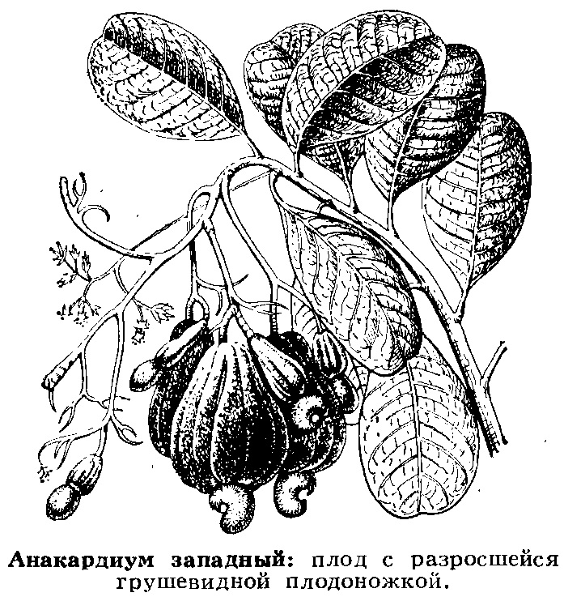

## АНАКОНДЫ (Еипес!ез)

род удавов.
Крупнейшие из совр. змей — дл. обычно
до 10 м (зарегистрирована длина
11,43 м). Окраска сверху оливково-серая,
вдоль спины — два ряда больших округ-
лых бурых пятен, по бокам ряд мелких
светлых пятен, окружённых чёрной поло-
сой. Звида, по всей тропич. зоне Юж. Аме-
рики. Наиболее известна обыкновенная
А. (Е. тимйпиз). Обитают А. по берегам
рек. озёр, у болот; ноздри с клапанами,
хорошо плавают и ныряют, подолгу оста-
ваясь под водой. Питаются разл. позво-
ночными (грызуны, мелкие копытные,
черепахи. водоплавающие птицы, рыбы).
Иногда жертвами А. становятся домащ-
ние животные. На человека нападают ред-
ко. В засуху могут впадать в оцепенение,
зарываясь в ил, Яйцеживородящие. (от
28 до 42 дегёнышей), но могут отклады-
вать и яйца. В неволе живут 5—6 лет
(максимально — до 28 лет). Объект про-,
мысла (используются кожа, мясо, жир).
См. рис. 10 в табл. 43.

## АНАЛГИЯ

(от греч. ап — отрицат. частица и 4150$ — боль), отсутствие болевой
чувствительности при нанесении орга-
низму человека повреждающего (ноцицел:
тивного) раздражения. Возможно, что
А. существует и у животных. См. также
Боль, Ноцицептивная чувствитель-
ность.

## АНАЛИЗАТОРЫ

системы чувствительных нервных образований, воспринимаю-
щие и анализирующие разл. внешние и
внутренние раздражения. А. обеспечива-
ют приспособит. реакции организма к из-
менениям во внешней и внутренней среде.
Термин введён в физиологию И. П. Пав-
ловым (1909). В совр. физиологии вместо
него чаще употребляют попятие сенсор-
ные системы.

## АНАЛИЗИРУЮЩЕЕ СКРЕЩИВАНИЕ

скрещивание гибридной особи с особью,
гомозиготной по репессивным аллелям,
т.е. «анализатором». Смысл А. с. заклю-
чается в том, что потомки от А. с. обяза-
тельно несут один рецессивный аллель от
«анализатора», на фоне к-рого должны
проявиться аллели, полученные от апа-
лизируемого организма. Для А. с. (иск-
лючая случаи взаимодействия генов) хё-
рактерно совпадение ‘расщепления ‘по 'фе-
нотипу с расшеплением по генотипу сре-
ди потомков. Т. о., А. с. позволяет опре-,
делить генотип и соотношение гамет раз-
ного типа, образуемых анализируемой
особью. .”

## АНАЛОГИЯ

(греч. апа1оз{а — соответствие, сходство, подобие), вторичное
(не унаследованное от обших предков)
морфологич. схолство органов у организ-
мов разных систематич. групп, обуслов-
ленное сходством выполняемых этими
органами функций. Термин «А.», введён-
ный Аристотелем, в указанном зиачении,
впервые был использован Р. Оуэном
(1843). А. развивается в результате кон-.
вергениии. Обычно аналогичное сходство.
не бывает глубоким.и его вторичный ха-.
рактер легко распознать (напр., А. кры-
льев птиц и насекомых), но иногда анало-
гичные органы могут приобрести пора-
зительно сходное строение (напр., глаза
позвоночных й головоногих моллюсков
очень сходны как по общему плану строе-
ния, так и по многим структурным эле-
ментам, хотя совершенно по-разному раз-
виваются в онтогенезе). При параллелиз-
ме родств. групи организмов может воз-
никнуть А. гомологичных органов и струк-
тур — гомойология. Ср. Гомология.

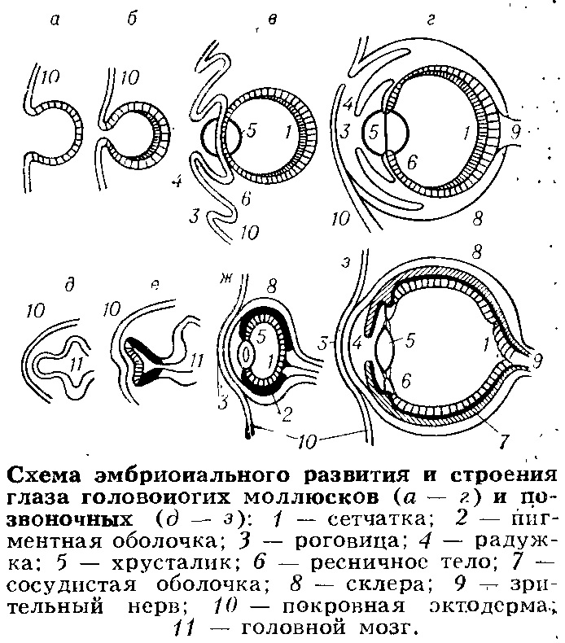

## АНАЛЬНЫЕ ЖЕЛЕЗЫ

(от лат. апи$ — анальное, или заднепроходное, отверстие),
кожные железы млекопитающих, откры-
вающиеся в области анального отверстия
или в полость задней кишки. У нек-рых
животных (броненосцы, нек-рые беличьи,
гиена) могут выпячиваться наружу. У
сумчатых, неполнозубых и хишных в
анальной области, в толше стенки пря-
мой кишки, расположены особые желези-
стые органы — анальные мешки с крунп-
ными потовыми и сальными железами.
Полость мешка служит резервуаром
секрета, к-рый обладает резким, стой-
ким запахом (особенно у скунса, норки,
хорька) и используется для мечения тер-
ритории и отпугивания вратов (особенно
куньими).

## АНАМНИИ (Алапп!а)

низшие позвоночные — круглоротые, рыбы, земновод-
ные. В отличие от амниот, у А. в процес-
се эмбриогенеза не возникает зародыше-
вой оболочки — амниона и особого заро-
дышевого органа — аллантоиса. А. свя-
заны в своём существовании с водной сре-
дой в течение всего жизненного цикла или
на отдельных его стадиях.

## АНАНАС (Апапа5)

род многолетних травянистых растений сем. бромелиевых.
Короткий стебель несёт розетку сук-
кулентных, колючезубчатых листьев (дл.
до 90 см), у основания к-рой развивают-
ся многочисл. отпрыски. Цветки собраны
на верхушке стебля в плотное головчатое
соцветие. Сочные, ароматные плоды —
ягоды — срастаются с мясистыми при-
цветниками и осью стебля в шишковидное
соплодие. Гл. ось соплодия продолжает
расти и образует на верхушке розетку ли-
стьев (корону). 8—9 видов, в тропич.
Америке. А. культивируют с древности,
в 16 в. распространился в большинстве
тропич. стран. Культурный А. относится
к виду А. крупнохохолковый (А. сото-
5и5), с неколючими листьями и крупными
бессемянными соплодиями до 2—15 кг,
дико произрастающему в Юж. Бразилии.
Размножают вегетативно — отпрысками
или верхушечными черенками. Плоды А.
используют в пищу в сыром и перерабо-
танном виде. Из волокон листьев изготов-
ляют тонкие ткани. Самые крупные план-
тации — на Гавайских (ок. !/з мирового
урожая) и Филиппинских о-вах, в Ма-
лайзии, Мексике, Бразилии, на Кубе.
В Европе выращивают в теплицах и
оранжереях с сер. 17 в.

## АНАПСИДЫ (Апарз1Ча)

подкласс пресмыкающихся. Известны со ср. карбона.
Характерен череп с нередуцированными
или слабо редуцированными покровными
костями. Височные впадины и ограничи-
вающие их височные дуги неразвиты. Ко-
нечности имеются. 2 отряда: совр. черепа-
хи и вымершие котилозавры.

## АНАСПИДАЦЕИ (Апазр!Часеа)

отряд высших раков. Известны с девона. Тело
вытянутое (дл. до 5 см). Карапакс от-
сутствует. На голове стебельчатые или
сидячие глаза (у подземных видов глаз
нет). С головой срастается первый груд-
ной сегмент, но его конечности остаются
ходильными или роюшими. Эпиподиты
выполняют роль жабр. Брюшные ножки
плавательные, две передние пары у сам-
цов преобразованы в копулятивный ап-
парат. Уроподы палочковидные, вместе
с тельсоном образуют хвостовой веер.
Развитие прямое. 5 совр. видов; обитают
в высокогорных озёрах и ручьях Тасма-
нии, 1 вид — в грунтовых водах Авст-
ралии. Ископаемые остатки А. найдены
в Европе и Сев. Америке. Совр. А. счи-
таются остатками древней, некогда про-
цветавшей группы, по-видимому, морской.

## АНАСПИДЫ (Апазр!А4а)

беспанцирные, подкласс вымерших бесче-
люстных. Известны с раннего силура —
позднего девона Англии, Норвегии, Ка-
нады, СССР (0. Сааремаа в Эстонии).
Дл. ло 25 см, тело удлинённо-веретеновил-
ное, с выпуклым брюхом и гипоцеркным
хвостом. Рот конечный, глаза по бокам.
Голова покрыта мелкими пластинками,
туловище — 4—5 рядами высоких узких
чешуй (у нек-рых редуцированы). Оби-
тали в дельтах или лагунах. По образу
жизни были, вероятно, близки к совр.
мияогам. 3 отряда, 10 родов. Интересны
как возможные предки совр. кругло-
ротых.

## АНАСТОМОЗ

(от греч. апаз 00318 — отверстие, выход) у животных —
соединение между двумя кровеносными
или лимфатич. сосудами или двумя нер-
вами. У высших растений —
соединение между трубчатыми структу-
рами, напр. жилками в листьях, раз-
ветвлениями млечников и т. д. У гри-
бов — соединение или срастание двух
гиф мицелия. ,

## АНАТОМИЯ

(от греч. апафотё — рассечение, расчленение }, раздел морфологии,
изучающий форму и строение отд. орга-
нов, систем и организма в целом. Осн.
метод, применяемый в А.,— метод рассе-
чения; используют также морфометрию,
рентгенографию, разл. методы гистоло-
гич. и биохимич. анализа и др. Различают
А. животных (зоотомию), выделяя из неё
А. человека и обычно применяя к ней
термин «А.», и анатомию растений (фи-
тотомию), изучающую тканевое строение
растений. Изучением сходства и различия
в строении животных занимается сравни-
тельная анатомия животных.

## АНАТОМИЯ РАСТЁНИЙ

раздел ботаники (точнее, морфологии растений),
изучающий внутр. строение растений.
Возникновение А. р. связано с изобрете-
нием микроскопа и работами М. Маль-
пиги и Н. Грю, к-рые впервые провели
полное микроскопич. изучение растит.
объектов (кон. 17 в.). В 19в. исследова-
ния растит. клетки были использованы
Т. Шванном при создании клеточной тео-
рии (1839). Во 2-й пол. 19—20 вв. изуче-
ние растит. тканей, клеток и их органои-
дов ведётся (часто уже в рамках цитоло-
гии растений, к-рая выделилась из А. р.)
в тесной связи с изучением их роста, раз-
вития и дифференцировки в процессе
онтогенеза, а также с учётом выполняе-
мых ими функций. Существ. значение из
методов А. р. приобретает электронная
микроскопия, а из подходов — эволюци-
онный и экологический. Данные А. р.
используются не только в биологии, но и
в агрономии, технике (напр., в древеси-
новедении), истории и археологии (в ден-
дрохронологии), а также в фармацевтич.,
пип:., цел.-бум., деревообр. и др. отрас-
лях пром-сти. См. также ст. Морфология
растений и лит. при ней.

● Эзау К., Анатомия семенных растений, пер. сангд., кн. 1—2, М., 1980.

## АНАЭРОБНЫЕ ОРГАНИЗМЫ

анаэр об ы (от греч. ап — отрицат.
частица, аёг — воздух и 610$ — жизнь),
организмы, способные жить и развивать-
ся при отсутствии в среде свободного кис-
лорода. Термин «анаэробы> ввёл Л. Па-
стер, открывший в 1861 бактерии масля-
нокислого брожения. А. 0. распростра-
нены гл. обр. среди прокариот; среди
эукариот к жизни без свободного О»
(анаэробиозу) способны лишь немногие
формы, вторично приспособившиеся к
отсутствию О›,— дрожжи, нек-рые про-
стейшие, в т. ч. обитатели кишечника
членистоногих и рубца жвачных; среди
многоклеточных анаэробиоз свойствен
нек-рым кишечным паразитам, напр.
лентецам, аскаридам. Метаболизм А. о.
обусловлен необходимостью — использо-
вать иные окислители, чем О2. Мн.
А. о., использующие органич. вещества
(все эукариоты, получающие энергию
в результате гликолиза), осуществляют
разл. типы брожений, при к-рых обра-
зуются восстановленные соединения —
спирты, жирные к-ты. Другие А. о. \[де-
нитрифицирующие (часть из них восста-
навливает окисное железо), сульфатвос-
станавливающие, метанобразующие бак-
терии\] используют неорганич. окислители:
нитрат, соединения серы, СО2. Аназроб-
ные бактерии разделяются на группы мас-
лянокислых, молочнокислых, пропионово-
кислых ит. д., в соответствии с осн. про-
дуктом обмена. Особую группу анаэро-
бов составляют фототрофные бактерии.
По отношению к О). А. 0. делятся на обли-
гатных, к-рые неспособны использовать
О› в обмене, и факультативных (напр.,
денитрифицирующие), к-рые могут пере-
ходить от анаэробиоза к росту в среде
с О2. Поскольку энергия реакций окисле-
ния в среде без Оз заметно меньше, чем
с О», А. о. на единицу биомассы образу-
ют много восстановленных соединений,
осн. продуцентами к-рых в биосфере они
и являются. Последовательность обра-
зования восстановленных продуктов (М2,
Ее?+, Н.5, СН4), наблюдаемая при пере-
ходе к анаэробиозу, напр. в донных отло-
жениях, определяется энергетич. выходом
соответств. реакций. А. о. развиваются
в условиях, когда О? полностью исполь-
зуется аэробными организмами, напр.
в сточных водах, илах. А. о. широко ис-
пользуются в технич. микробиологии для
произ-ва спирта, органич. к-т, в очистке
сточных вод. Нек-рые А. о. патогенны
и вызывают тяжёлые инфекции (столб-
няк, газовая гангрена). Помимо собствен-
но А. 0., имеется ряд беспозвоночных,
способных переносить временное отсутст-
вие Оз; нек-рые же облигатные А. 0. чрез-
вычайно чувствительны даже к следам Оз;
в присутствии к-рого быстро погибают.
Термофильные А. 0., найденные в гид-
ротермах. в т. ч. глубоководных, воз-
можно относятся к древнейшим обитате-
лям Земли.

## АНГИОТЕНЗИН

ангиотонин, гипертензин, гормон млекопитаю-
щих. Повышает кровяное давление, вы-
зывает сокращение матки и стимулирует
секрецию ряда гормонов (альдостерона,
вазопрессина и др.). По химич. приро-
де — октапептид. Биохимич. предшест-
венник активного А. (т. н. АП) — неак-
тивный А. (А Г), образующийся в организ-
ме из глобулярного белка крови ангио-
тензиногена под действием протеолитич.
фермента ренина. В тканях А. связыва-
ется рецепторами и разрушается ангио-
тензиназой. Содержание А. в пртернить,
ной крови человека в норме 2,5х 10-8
мг/100 мл. При возбуждении симпатоадре-
наловой системы, кровопотерях и нару-
шении кровообращения в почках концёнт-
рация А. в крови повышается (диагно-
стич. тест на гипертонию) за счёт увели-
чения секреции и повышения активности
ренина. Синтезированы физиологически
активные аналоги А. См. также Ренин-
ангиотензинная система.

## АНДРЕЕВЫЕ МХИ (Апагеае!Чае)

подкласс листостебельных мхов. Одно- или
двудомные многолетние растения, мелкие,
жёсткие, красно-бурые (до чёрных). Стеб-
ли прямостоячие, вильчато ветвящиеся.
Листья из одного слоя толстостенных кле-
ток, эллиптические или ланцетные,
иногда серповидноизогнутые. Споро-
гон — из коробочки и стопы (ножки нет).
Коробочка удлинённо-яйцевидная, на
ложноножке, раскрывается 4—8
створками. Споры прорастают, в от-
личие от печёночных мхов, только
после выпадения из коробочки. Одно
семейство — андреевые (Апагеаеасеае),
2 рода. В роде андрея (Апагеаеа) ок.
120 видов, в СССР — ок. 10 видов. Распространены в высоко-
горных областях всего земного шара, но
гл. обр. в арктич. и антарктич. зонах;
растут на каменистом субстрате подушеч-
ками, являясь часто пионерами зараста-
ния камней и скал. В роде невролома
(Меитоюта) 1 вид, на Огненной Земле.

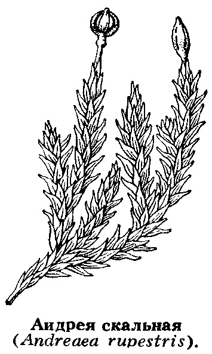

## АНДРОГЕНЕЗ

(от греч. апёг, род. падеж ап@го5 — мужчина и ...генез), фор-
ма размножения организмов, при к-рой
в развитии зародыша участвует мужское
ядро, привнесённое в яйцо сперматозои-
дом, а женское — не участвует. А. отме-
чен у немногих видов животных (напр.,
наездников Набтобгасоп) и растений (ку-
куруза, виды табака) в тех случаях, ког-
да ядро яйца погибает до оплодотворения,
к-рое при этом является ложным (псев-
догамия). Частный случай А.— мерогония
(от греч. пёгоз — часть и #0поз — потом-
ство), развитие оплодотворённого фрагмен-
та яйца, лишённого жен. ядра. А. можно
получить искусственно, механически уда-
лив или инактивировав физич. или химич.
агентами жен. ядро. Полученные гаплоид-
ные зародыши обычно мало жизнеспо-
собны. Для получения диплоидного А.
необходимо подавить цитотомию одного
из первых делений дробления или соеди-
нить 2 муж. пронуклеуса при полисперм-
ном осеменении. Явление А. используют
при исследовании роли ядра в наследст-
венности, изучении ядерно-цитоплазма-
тич. взаимодействия, для получения стро-
го гомозиготных организмов, а также жи-
вотных одного пола. Ср. Гиногенез.

## АНДРОГЕНЫ

мужские половые гормоны позвоночных, вырабатываемые
преим. интерстициальными клетками се-
менников, а также корой надпочечников
и яичниками. Осн. А.: тестостерон, анд-
ростерон (в 10 раз менее активен, чем те-
стостерон), дегидроэпиандростерон (в 100
раз менее активен), андростендион, де-
гидротестостерон, андростендиол. В эм-
бриональный период А., секретируемые
семенниками, регулируют развитие пло-
да по муж. типу. Затем секреция А. се-
менниками снижается и возрастает в пу-
бертатный период, когда А. обеспечива-
ют развитие первичных и формирование
вторичных муж. половых признаков
(при недостаточной секреции А. может
развиться жен. тип телосложения).
А. стимулируют Также мейоз в процессе
сперматогенеза. Воздействуя на ЦНС,
А. вызывают у самцов (преим. в брачный
период, когда секреция А. возрастает)
влечение к самке, ухаживание, агрессив-
ность по отношению к самцам. А. оказы-
вают многостороннее влияние на обмен
веществ, стимулируют анаболич. процес-
сы во всём организме. У взрослых самок
анаболич. действие А. обеспечивает рост
репродуктивных органов, влияет на пове-
денч. реакции. А. стимулируют выработ-
ку гемоглобина, эритроцитов, появление
характерной пигментации у рыб, а также
пигментации оперения и клюва у птиц.
Синтез и секреция А. регулируются гона-
дотропными гормонами гипофиза. А.
в свою очередь обеспечивают нормальное
функционирование системы  типотала-
мус—гипофиз—гонады. По химич. приро-
де А.— стероиды, образуются из холесте-
рина. Продукты обмена А.— 17-кетостеро-
иды, выделяемые с мочой, нек-рые из ме-
Таболитов превращаются в печени в анд-
ростендион. Мол. механизм действия осн.
на регуляции синтеза и активности соот-
ветствующих ферментных систем. А. и
их производные — анаболич. — стерои-
ды — применяют в медицине и животно-
водстве. А. обнаружены в гонадах мн.
беспозвоночных и в семенах нек-рых ра-
стений.

● Меянуоринг У., Механизмы действия андрогенов, пер. с англ., М., 1979.

## АНДРОГИНОФОР

(от греч. апёг, род. падеж апЧгоз — мужчина, супе — жен-
щина и рЬогоз — несущий), участок обое-
полого цветка, разросшийся в длину и не-
сущий в виде тонкого стебелька тычинки
и пестик над чашей околоцветника. В ре-
зультате создаются лучшие условия для
опыления и распространения семян. Ха-
рактерен для сем. каперсовых, гвоздич-
ных, страстоцвета и нек-рых др. У одно-
полых жен. и муж. цветков этот участок
цветоложа наз. соответственно гино- и
андрофором.

## АНДРОСТЕРОН

мужской половой гормон (андроген), осн. продукт метаболиз-
ма тестостерона. Обладает биол. дейст-
вием тестостерона (в 10 раз менее акти-
вен), способен стимулировать развитие
вторичных половых признаков у позво-
ночных. Гормональная активность А.,
выделяемого в значит. кол-вах с мочой,
используется для оценки уровня продук-
ции андрогенов в организме и положена
в основу количеств. оценки биол. дейст-
вия муж. половых гормонов.

## АНДРОЦЕЙ

(от греч. апёг, род. падеж ап4го$ — мужчина и оШ1а — жилище),
совокупность всех муж. органов цветка—
тычинок.

## АНЕМОФИЛИЯ

(от греч. аАпетоз — ветер и ...филия) анемогамия,
приспособленность растений к опылению
с помощью ветра. А.— единств. способ
опыления у хвойных, характерна также
для мн. цветковых. Анемофильные груп-
пы цветковых растений произошли, ве-
роятно, от энтомофильных предков вслед-
ствие адаптации их к условиям, огра-
ничивающим возможность опыления на-
секомыми. Характерна для злаков, осо-
ковых, мн. древесных двудольных ра-
стений (берёза, осина, дуб, граб, лещина
и др. ). У ветроопыляемых растений обыч-
но отсутствует или значительно редуци-
рован околоцветник, многочисленные не-
взрачные цветки лишены окраски и
аромата, образуются большие массы лёг-
кой сыпучей пыльцы и т. п. Цветение у
них часто происходит до развёртывания
листьев. См. также Опыление.

## АНЕМОХОРИЯ

(от греч. Апетоз — ветер и ...хория), перенос диаспор возд. те-
чениями. Осн. способ расселения назем-,
ных т. и. споровых растений и грибов.
Очень существеи для семенных растений.
При А. диаспоры распространяются чаще
всего по воздуху (нарящие и планирую-
щие), опавшие диаспоры могут перено-
ситься ветром пб поверхности почвы, во-
ды (на непроточных водоёмах) или по
снежному насту:

Парящие диаспоры обладают небольшой
массой (споры, мелкие пылеватые семе-
на орхидных, заразиховых, грушанко-
вых, колокольчиковых) или парашютны-
ми приспособлениями (хохолки на пло-
дах сложноцветных, семенах кипрей-
ных, ластовневых, ивовых). Планирую-
щие диаспоры снабжены крыловидными
придатками — нё вращающими их (у пло-
дов вяза, берёзы, ольхи, граба, хмеля)
и вращающими (у семян хвойных, пло-
дов клёна, ясеня, айланта). Анемохорные
диаспоры имеют обтекаемую форму с
высоким профильным сопротивлением
при малых плотности и массе (у вздутых
бобов астрагала, мешочков осоки взду-
той, плодов джузгуна, ревеня, опушён-
ных плодов и семян ивы, рогоза, трост-
ника и др. ). Анемохорные диаспоры разл.
типов приурочены к определ. фитоцено-
зам или их ярусам: в древесном ярусе
лесов — планируюгцие плоды и семена,
в травяном ярусе тайги и сфагновых
болот — мелкие пылеватые семена,
в степях, посевах, по берегам водоёмов —
парящие с парашютом и т. п. Осн. масса
диаспор разносится ветром в пределах
1 км (единичные диаспоры ‘деревъев
в бурю или по насту — до 4—10 км; спо-
ры грибов — иногда на сотни км). ‘

## АНЕУПЛОИДИЯ

(от греч. ап — отрицат. частица, 6и — хорошо, вполне,
-р100$ — кратный и 6140$ — вид), ге-
тероплоидия, явление, при к-ром
клетки организма содержат изменённое
число хромосом, не кратное гаплоидному
набору. Отсутствие в хромосомном, набо-
ре диплоида одной хромосомы наз. м о-
носомией, адвух гомологичных хро-
мосом — нуллисомией; наличие
дополнит. гомологичной хромосомы наз.
трисомией. Организмы с такими
изменениями числа хромосом наз. соот-
ветственно моносомиками, нуллисоми-
ками и трисомиками. Осн. механизм
возникновения А.— верасхождение и по-
тери отд. хромосом в митозе и мейозе.
Вследствие нарушения баланса хромосом
А. приводит к понижению жизнеспособ-
ности и нередко к гибели анеуплоидов,
особенно у животных (А. лежит в основе
ряда хромосомных болезней). В генетич.
анализе с помощью А. (скрещивая мутан-
тов с анеуплоидами по определ. хромосо-
мам) определяют, в какой группе сцеп-
ления находится исследуемый тен. .

## АНИЗОТРОПИЯ

(от греч. Ап150$ — неравный и {гброз — направление) в бо-
танике, способность разных органов
одного и того же растения принимать
разл. положения при одинаковом воздей-
ствии факторов внеш. среды. Напр,, при
одностороннем освещении растений, вер-
хушки побегов изгибаются по направле-
нию к источнику света, а листовые пла-
стинки располагаются перпендикулярно
к направлению лучей. . ...

## АНИЗОФИЛЛИЯ

(от греч.80150$ — неравный и...филл), различие в форме, ве-
личине и структуре листьев, сидящих на
одном и том же узле побега (при супротив-
ном или мутовчатом расположении).
А. характерна, как правило, для косо
или горизонтально расположенных побе-
гов. Причина А.— вероятно, в действии
силы тяжести, одностороннем освёщении
или в разл. интенсивности тока питат.
веществ. Ср. Гетерофиллия.

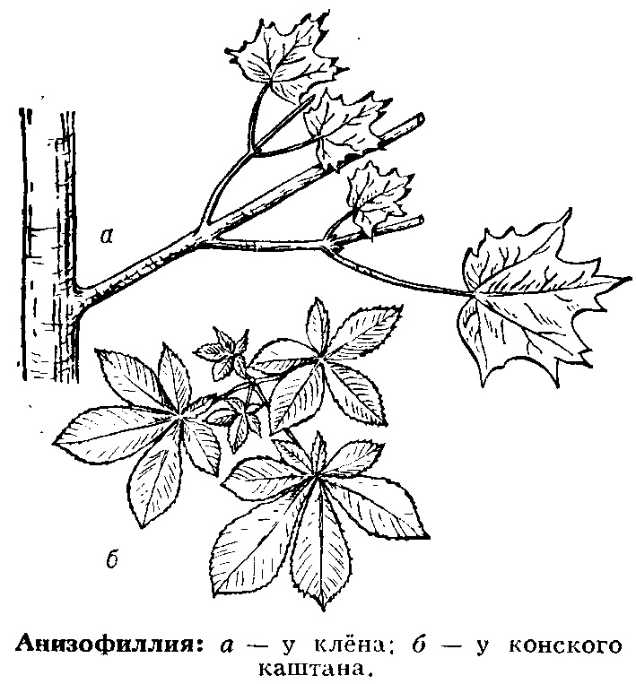

## АНИМАЛЬКУЛИЗМ

(от лат. апИта!сшШит — зверёк, микроскопич. живот-
ное), воззрение биологов 17—18 вв.
(А. Левенгук и др.) считавших, что
в муж. половых клетках содержится не-
видимое взрослое животное, а его разви-
тие сводится к увеличению в размерах.
А. является разновидностью учения о
преформации, рассматриваюшего яйцо
лишь как источник питания будущего за-
родыша. См. также Преформизм, Овизм.

## АНИМАЛЬНЫЙ

(от лат. аппза — животное), 1) животный, относящийся к жи-
вотному. Напр., органы — органы
чувств, нервная система, мускулатура.
2) А. полюс — область яйца животных,
в к-рой перед оплодотворением находит-
ся ядро.

## АНИС (Ап15ит)

род однолетних травянистых растений сем. зонтичных. 2 вида,
в Средиземноморье. А. обыкновенный
(А. ошдате) — однолетнее растение, в ди-
ком состоянии неизвестен (иногда дича-
ет), культивируют в ряде стран Евразии
(вт. ч. в СССР). Плоды используют как
пряиость и в медицине (анисовое масло).
Медонос. В культуре был известен ешё
в Др. Египте.

## АНКИЛОЗАВРЫ (Апку!озаита)

панцирные динозавры, подотряд
вымерших пресмыкающихся отр. итице-
тазовых динозавров. Известны из ср. и
верх. юры Зап. Европы и мела Сев. Аме-
рики, Зап. Европы и Австралии,
в СССР — Центр. Казахстана, Кызылку-
мов. Размеры до 6 м. Тело и голова пок-
рыты шипами и панцирными пластинка-
ми, слившимися у нек-рых в сплошной
панцирь. Растительноядные. 2 сем., ок.
25 родов, 40 видов. ‚

## АНКИЛОСТОМАТИДЫ (АпКу!озота{1Чае)

семейство нематод отр. строн-
гилид. Дл. до 21 мм. В обширной, сдви-
нутой на спинную сторону ротовой поло-
сти — кутикульные зубы, обеспечиваю-
щие прикрепленне к тканям хозяина.
Кишечные паразиты млекопитающих жи-
вотных и человека. 20 родов, ок. 70 ви-
дов, на всех материках, чаще в тропи-
ках и субтропиках; в СССР — 4 рода,
7 видов. У человека паразитируют анки-
лостома, или свайник двенадцатиперст-
ной кишки (см. Свайники), и некатор аме-
риканский (Месаог атетсапи$), дл. 6—
12 мм, у плотоядных животных — Ап-
В иШо5лота сашпит. Из яиц паразитов
во внеш. среде (в почве) развиваются
личинки, проникающие в тело хозяина
через кожу или при заглатывании.

## АННОНА (Аппопа)

род деревьев и Кустарников сем. анноновых. 110—125 ви-
дов, в тропиках и субтропиках Америки,
немногие в Африке. Многие из них —
плодовые деревья. Плоды — спиральные
сочные многолистовки — состоят из мя-
систых невскрывающихся плодиков, сли-
вающихся вединую ягодообразную мас-
су. Плоды А. колючей (А. тимсайёа), т. н.
сметанное яблоко, и А. четуйчатой (А.
5диатоза) — «сахарное яблоко», исполь-
зуют как деликатес и для приготовления
напитков, мороженого и пр. А. черимолу,
или А. черимойю (А. спейтопа),— древ-
нюю культуру инков, и А. сетчатую (А.
тенсшиа), плоды к-рой за форму наз.
«бычье сердце», часто культивируют
в тропиках.

## АННОНОВЫЕ (Аппопасеае)

семейство растений порядка магнолиевых. Б. Ч.
невысокие деревья, кустарники (иногда
лазящие) и древесные лианы, редко —
высокие (до 45 м) деревья или карлико-
вые кустарники, а иногда даже полуку-
старнички. Листья без прилистников,
содержат эфирные масла. Св. 120 родов,
ок. 2100 видов, в тропиках и отчасти суб-
тропиках. Обитают в ниж. древесном яру-
се и подлеске влажных тропич. лесов, а
также в сухих редколесьях и саваннах.
Для мн. А. характерна каулифло-
рия, а также дихогамия. Опыляются
преим. насекомыми, гл. обр. жуками,
у нек-рых — самоопыление. Плоды А.
ярко окрашены, сочные, с ароматной
мякотью; их охотно поедают и одновре-
менно разносят птипы (напр., попугаи),
млекопитающие (обезьяны и др.), прес-
мыкающиеся (у нек-рых видов плоды об-
разуются в ниж. части ствола). Плоды
и семена нек-рых видов рода ксилопия
(Хуюра) используют как пряность (ти-
па перца), древесина — строит. матери-
ал. Мн. А. разводят ради ароматных
цветков, напр. лепестки цветков крупного
дерева кананга душистая, или иланг-
иланг (Сапапда  одотжа),— источник
эфирного масла, используемого в парфю-
мерии. Африканская монодора мускат-
ная (Мопоаота тупзиса) — пряное (по-
добно мускатному ореху} растение. Наи-
большее значение имеют роды азимина
и аннона.

## АНОА (Вифаш5 аертезясогт5)

карликовый буйвол, млекопитающее
сем. полорогих; иногда выделяют в род
Апоа. Дл. тела ок. 170 см, выс. в холке
ок. 100 см. Рога короткие, прямые, нап-
равлены назад. Обитает в лесах о. Сула-
веси. Ведёт скрытный образ жизни. Дер-
жится чаще парами. В Красной книге
МСОП. .

## АНТАГОНИЗМ

у микроорганизмов (от греч. апбавоп!та — спор,
борьба), взаимоотношения микроорга-
низмов в природных или лабораторных
условиях, при к-рых один вид микроба
задерживает или полностью подавляет
рост другого. Антагонистами могут быть
представители всех групп микроорганиз-
мов; проявления А. зависят от условий
культивирования. Механизмы, обуслов-
ливающие А., различны; лучше изучен
А., связанный с образованием антибио-
тиков или др. продуктов обмена веществ.
Деятельность микробов-антагонистов —
одна из причин очищения почвы от пато-
генных микроорганизмов.

## АНТЕННАЛЬНЫЕ ЖЕЛЕЗЫ

(51апдиае ап(еппаез), парные выделительные
железы у ракообразных (у взрослых
форм вычпих раков, бывают и‘у личинок
остальных); видоизменённые: целомодук-
ты. Находятся в области головы, вывод-
ное отверстие открывается у основания
антенн (отсюда назв.). А. ж. состоит из
концевого замкнутого целомич. мешочка
и отходящего от него извитого канала с
железистыми стенками, к-рый иногда
образует перед выводным отверстием рас-
ширение — мочевой пузырь. В клетках
мешочка образуется первичная моча,
в отделах канала происходит реабсорбция
глюкозы, аминокислот, большинства ка-
тионов и анионов, воды и секреция орга-
нич. к-т. Ср. Максиллярные железы.
АНТЕННАТЫ (Алеппаа), сборное наз-
вание ряда групп членистоногих, для
к-рых характерно наличие усиков (тра-
хейнодышащие и ракообразные). Термин
«А.> малоудачен, т. к. и у трилобитов
была одна пара усиков, а их к А. не от-
носят.

## АНТЕННУЛЫ

(ащеппи!ае), первая пара подвижных членистых придатков головы
У ракообразных. Исходно А. одноветви-
сты, но у нек-рых высших раков вторично
расщеплены на 2—3 ветви. Иннервируют-
ся от головного мозга — надглоточного
ганглия. Обычно А. служат органами
чувств (осязания, хеморецепции) у
нек-рых низших раков превращены в при-
способления для плавания (веслоногие)
или прикрепления к субстрату (усоно-
гие).

## АНТЕННЫ

(от лат. ат(еппа — рей),
сяжки, усики, парные  много-
членистые подвижные придатки голо-
вы членистоногих (кроме паукообраз-
ных). У ракообразных А.— вторая па-
ра головных придатков (первая па-
ра — антеннулы), иннервирующаяся от
подглоточного ганглия или окологло-
точных хомиссур. У большинства ра-
кообразных служат органами чувств,
у ветвистоусых — органами движения,
у самцов веслоногих — и для удер-
живания самки при спаривании. А. тра-
хейнодышаших всегда  одноветвисты
(лишь у пауропод есть вторичное разветв-
ление А.) и связаны с надглоточным ганг-
лием. А. насекомых исключительно раз-
нообразны по форме (жгутиковидные,
гребенчатые, пластинчатые, булавовид-
ные) и величине; у самцов они обычно
крупнее и могут превышать длину тела
в неск. раз, у личинок развиты значи-
тельно слабее. Несут множество (иногда
десятки тысяч) сенсилл разного назначе-
ния и поэтому могут опосредовать все
известные виды чувствительности: обоня-
ние, осязание, вкус, восприятие звука,
темп-ры, влажности и даже света (с по-
мощью сенсил-ринарий — у тлей). Из-
редка служат для захвата добычи, удер-
живания самки, пузырька воздуха (у
жуков-водолюбов) и др.

## АНТЕРИДИЙ

(от греч. ап В6гбз — цветущий), «мужской» половой орган спо-
ровых растений (водоросли, мхи, папорот-
ники) и грибов (оомицеты, аскомицеты).
ВА. образуется большое кол-во спермато-
зоидов или спермащиев. У грибов содер-
жимое А. не дифференцировано на отд.
гаметы.

## АНТЕРИДИОЛ

стероид, гормональный регулятор (гамон), индуцирующий поло-
вое размножение у нек-рых оомицетов
(АсШуа Ы5ехиаЙ5, А. ат 5ехиаИз). Сек-
ретируется «женскими» гаметами и сти-
мулирует развитие на соседних гифах
антеридиев, содержащих сперматозоиды:
затем А. индуцирует образование ещё
одного гамона, к-рый в свою очередь уско-
ряет формирование «женских» органов —
оогониев. При слиянии антеридиев с оого-
ниями происходит оплодотворение. Этот
эффект вызывается очень малыми кон-
центрациями А. (менее 10-7мг/мл).

* * *

**-----------------------------------------------------------------------**

* * *

## АХАТИНИДЫ (АсвасииЧае)

семейство стебельчатоглазых моллюсков. Архаич-
ная группа. Ископаемые остатки извест-
ны с плейстоцена. Наиболее крупные
среди наземных улиток. Раковина удли-
нённая, высота (от 1,8 до 21 см) больше
ширины, нередко ярко окрашена. Длина
ползушего животного вместе с раковиной
до 30 см и более. Ок. 100 видов, в Африке,
на о-вах Сан-Томе и Принсипи, 1 род на
о. Мадагаскар. Наиболее известна аха-
тина гигантская (Асранпа ЁРийса), из
Вост. Африки, к-рая с кон. 18 в. с по-
мошью человека широко расселилась в
тропич. и, частично, в субтропич. зонах
земпого шара. Способна образовывать
плотные колонии. Отличаясь прожорли-
востью, наносит вред с.-х. культурам, в
частности посевам сахарного тростника,
См. рис. 11 в табл. 32.

## АЦЕРАТЕРИЙ (Асегайетит)

род вымерших безрогих носорогов. Известен из
ср. олигоцена и неогена Евразии и миоцена
Африки. Один из типичных представи-
телей гиппарионовой фауны. Дл. тела до
2,5 м, высота ок. 1 м. Обитал на откры-
тых пространствах, подобных саваннам.
Предками А. были мелкие олигопеновые
носороги. Вымер в конце неогена.

## АЦЕТАБУЛЯРИЯ (АсеЁабщата)

род зелёных водорослей класса сифоновых.
Слоевище выс. 0,4—5 (до 20) см, с верти-
кальной осью. несущей в вегетатив. состоя-
нии мутовки тонких веточек. При созрева-
нии веточки опадают и на вершине образу-
ется диск в виде зонтика, разделённый на
секторы. В основании вегетатив. слоеви-
ша — гигантское ядро (до 1,7 мм), к-рое
при образовании диска делится мейоти-
чески на большое число мелких ядер,
попадающих в диск, где появляются од-
ноядерные цисты. В цистах ядро делится,
и образуются гаметы. Зиготы без перио-
да покоя вырастают в новые слоевища.
Ок. 20 видов, в тропич. и субтропич.
морях. Классич. объект при изучении
ядерно-цитоплазматич. взаимоотношений.

## АЦЕТАТ

анион уксусной к-ты (СН-СОО-) или соль уксусной к-ты;
форма, в к-рой уксусная к-та присутст-
вует в живых клетках.

## АЦЕТИЛХОЛИН

уксуснокислый эфир холина, СНзСОО(СН>2)МОН(СН:з)з; ре-
гулятор физиол. функций в организме
животных. Образуется в организме при
ацетилировании холина под действием
фермента холинацетилтрансферазы; лег-
ко расщепляется ферментом ацетилхолин-
эстеразой. Наиболее изучена функция А.
как медиатора нервного возбуждения, до-
казанная О. Лёви в 1921 для нервных
окончаний, тормозящих биение сердца
лягушки. Это открытие позволило в
дальнейшем создать представление о хи-
мич. синапсе, лежашее в основе совр. кон-
цепций деятельности нервной системы.
Однако роль А. как медиатора первона-
чально была преувеличена. Лишь в 50—
60-х гг. 20 в. по мере открытия новых
медиаторов стало ясно, зто А. один из
мн. нейрональных веществ-посредников.
Секретирующие А. (т. н. холинергиче-
ские) нейроны имеются в нервной системе
мн. беспозвоночных (нематоды, членис-
тоногие, моллюски и др.). У позвоночных
А. служит медиатором мн. периферич.
синапсов, в т. ч. моторных окончаний на
скелетных мышцах, возбуждающих окон-
чаний на хромаффинных клетках, межней-
ронных синапсов симпатич. и парасимпа-
тич. ганглиев и др., а также медиатором
нек-рых интернейронов ЦНС. Чувстви-
тельность к А. обеспечивается холиноре-
цепторами, среди к-рых различают два
гл. тира: мускариновый (в гладких
мышцах и мозге) и никотиновый (в ске-
летной мышце и вегетативных ганглиях).
На мускариновом холинорецепторе серд-
па земноводных была впервые доказана
белковая природа рецепторных молекул,
к-рые впоследствии удалось выделить в
чистом виде. А. обнаружен в составе
нек-рых растит. ядов.

● Мшолхельсон м. я., Зеймаль Э  В., Ацетилхолин, Л., 1970; Тучек С., Синтез ацетилхолина в нейронах, пер. с англ., М., 1981.

## АЦЕТОНОВЫЕ ТЕЛА

кетоновые тела, группа промежуточных продук-
тов обмена веществ, включающая ацетон,
ацетоуксусную и В-оксимасляную к-ты.
Образуются при неполном окислении
жирных к-т и распаде кетогенных амино-
кислот. В организме А. т. окисляются
до СО2 и Н>О; частично используются
для синтеза стеринов, высших жирных
к-т, фосфатидов, аминокислот. Нормаль-
ное содержание А. т. в крови человека
1,0-2,0 мг% (по ацетону). При нек-рых
палологич. состояниях (сах. диабете
и др.) А. т. накапливаются в крови в
избытке и оказывают токсич. действие на
организм.

## АЦИДОФИЛИЯ

(от лат. ас1Чиз — кислый и ...филия), способность клеточных
структур окрашиваться кислыми краси-
телями (эозином, кислым фуксином, пик-
риновой к-той и др.), обусловленная ос-
новными (щелочными) свойствами окра-
шивающихся структур. А. используют,
в частности, для различения клеток кро-
ви. Ср. Базофилия.

## АЦИКЛИЧЕСКИЙ ЦВЕТОК

спиральный цветок, все его элемен-
ты (листочки околоцветника, тычинки,
плололистики) расположены по спирали.
Цветоложе, как правило, выпуклое, час-
то коническое. А. ц. характерны для при-
митивных цветковых растений, преим.
многоплодниковых (магнолиевые, ним-
фейные, большинство лютиковых). А. ц.
обычно актиноморфные, реже зигоморф-
ные (аконит, живокость). Из А. ц. разви-
лись гемициклич. и циклич. цветки.

## АЦИНУС

(от лат.  асшиз — ягода, гроздь), 1) то же, что шаравидный
аденомер. 2) Часть респираторного ап-
парата лёгкого, состоящая из терминаль-
ной бронхиолы и альвеолярных ходов с
альвеолами.

## АЭРЕНХИМА

(от греч. аёг — воздух и ёпспута, букв.— налитое, здесь —
ткань), воздухоносная ткань разл. орга-
нов растений, песушая вентиляционные
и, отчасти. дыхат. функции. Представляет
собой модифицированную  паренхиму,
состоящую из клеток разл. формы и круп-
ных межклетников. Иногда в состав А.
входят механич., выделительные и др.
клетки. Наиболее хорошо А. развита
у растений, обитающих в среде, затруд-
няющей газообмен и снабжение внутр.
тканей кислородом, напр. у водных и
болотных растений (кувшинки, рдест,
ситник и др.).

## АЭРОБНЫЕ ОРГАНИЗМЫ

аэробы (от греч. аёг — воздух и Ь10$ — жизнь),
организмы, способные жить и развивать-
ся только при наличии в среде свободного
кислорода, к-рый они используют в ка-
честве окислителя. К А. 0. принадлежат
все растения, большинство простейших и
многоклеточных животных, почти все
грибы, т. е. подавляющее большинст-
во известных видов живых существ.
У животных жизнь в отсутствие Оз
(анаэробиоз) встречается как вторичное
приспособление. А. о. осуществляют
биологическое окисленне гл. обр. посред-
ством системы клеточного дыхания, вклю-
чающей цитохромы. В связи с образова-
нием при окислении токсичных продуктов
неполного восстановления О.о, А. 0. об-
ладают рядом фермевтов (каталаза, су-
пероксиддисмутаза), обеспечивающих их
разложение и отсутствующих или слабо
функционирующих у облигатных анаэро-
бов, для которых Оз оказывается вследст-
вие этого токсичным. Наиболее разнооб-
разна дыхат. цепь у бактерий, обладаю-
ших не только  цитохромоксилазой,
но и др. терминальными оксидазами.
Особое место среди А. о. занимают орга-
низмы, способные к фотосинтезу, — циа-
нобактерии, водоросли, сосудистые расте-
ния. Выделяемый этими организмами
Оз обеспечивает развитие всех осталь-
ных А. 0. Организмы, способные разви-
ваться при низкой концентрации О»
(<1 мг/л), наз. микроаэрофилами. Ср.
Анаэробные организмы.

## АЭРОФИТЫ

(от греч. абг — воздух и ...фит) «<воздушные расте
ния, получающие все необходимые пи-
тат. вещества из атмосферы. К А. отно-
сятся эпифиты, а также некоторые
мхи, поселяющиеся на стволах и ветвях
деревъев (в тропиках — даже на листь-
ях), очень немногие водоросли, живу-
щие на коре деревьев, и нек-рые ли-
шайники (напр., т. н. лишайниковая
манва).
