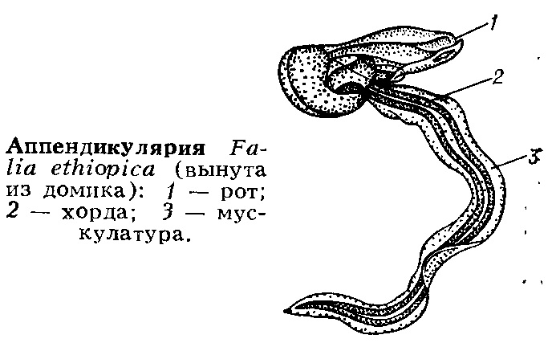
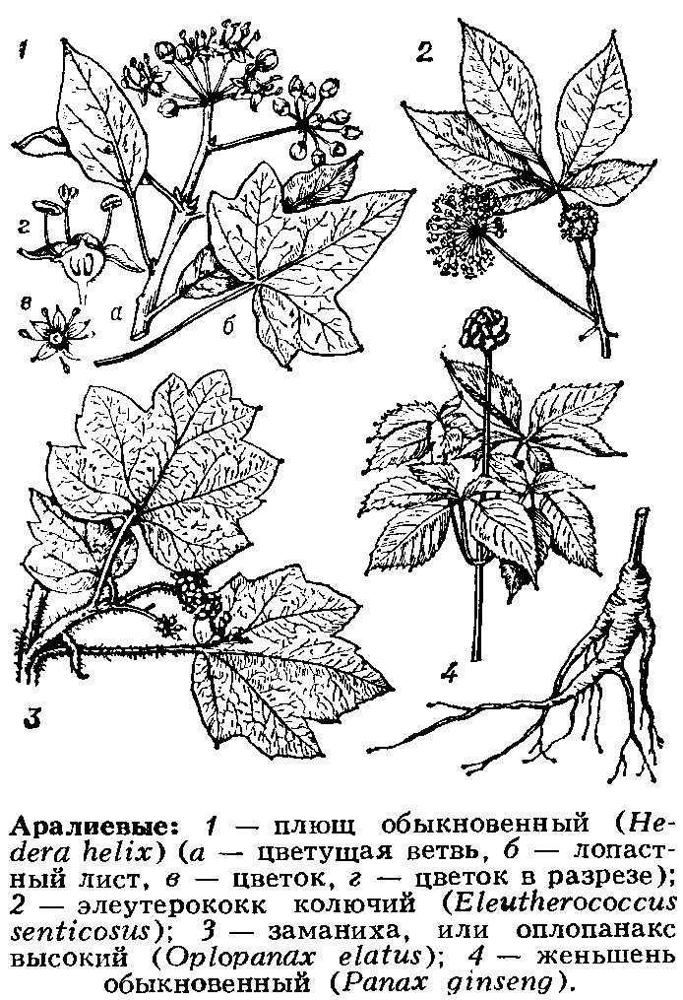

# А

## АБАК*А* (_Musa textilis_)

текстильный банан, многолетнее травянистое растение рода банан. Родина — Филиппинские о-ва; культивируют гл. обр.
там же для получения из влагалищ листьев прочного волокна, наз. также А., или манильской пенькой.

## АББРЕВИ*А*ЦИЯ

(от лат. abbreviatio — сокращение, укорочение), сокращение числа стадий развития органов или их частей у животных организмов. Термин
«А.» ввёл Б. С. Матвеев (1930), А. Н. Северцов называл это явление отрицат. _анаболией_. А. происходит в результате выпадения конечных стадий онтогенеза
при _неотении_ или _фетализации_ и приводит к недоразвитию или редукции органов в филогенезе.

## АБДОМИН*А*ЛЬНЫЙ

(от лат. abdomen — живот, брюхо), относящийся к животу, расположенный на брюшной стороне (у членистоногих — на брюшке).
Напр., А. поры — отверстия целома, находящиеся на брюшной стороне тела у круглоротых и рыб. Ср. _Вентральный_.

## АБИОГЕНЕЗ

(от греч. а — отрицат. частица, 0и0... И ...2енез), образование органич. соединений, распространённых в живой природе вне организма, без участия ферментов. В широком смысле А.—возникновение живого, т. е. исходная
гипотеза совр. теории происхождения жизни. В сер. 20 в. экспериментально осуществлён абиогенный синтез белково-подобных и др. органич. веществ в условиях, воспроизводящих условия первобытной Земли. Ср. Биогенез.

## АБИОТИЧЕСКАЯ СРЕДА

(от греч. а — отрицат. частица и РЮИКо$ — жизненный, живой), совокупность неорганич. условий (факторов) обитания организмов. Факторы А. с. можно разделить на химич. (состав атмосферного воздуха,
содержание в нём разл. примесей, состав мор. и пресных вод, донных отложений, грунта, почвы) и физич. (темп-ра воздуха, воды, барометрич. давление, господствующие ветры, течения, инсоляция,
характер субстрата, радиац. фон ит. д.). Численность и распределение живых форм в пределах их ареала часто зависят от лимитирующих абиотич. факторов, необходимых для существования организмов, но представленных в минимуме,
напр. вода в пустыне (см. Либиха закон). Организмы в результате историч. развития в конкретных условиях А. с. приспосабливаются к опрелел. комплексу факторов (к-рые становятся порой непременными условиями их существования) и
в процессе жизнедеятельности сами изменяют А. с. (поддержание в атмосфере соотношения СО? и О»>, очистка воды животными-фильтраторами от взвесей, изменение гидротермич. режима под полотом леса, образование почв и т. д.).

## АБИССАЛЬ

(от греч. &Бу$$05 — бездонный), зона мор. дна, соответствующая глубинам океанич. ложа (3000—6000 м). Занимает более 75% площади дна океана. Условия жизни в А. устойчивы, характеризуются отсутствием света, постоянными темп-рой (1—2 °С), солёностью
(ок. 35%) и гидростатич. давлением (30—60 МПа, или 300—600 атм), преобладанием илистых грунтов. Животный мир А. (бентос) существует за счёт органич. вещества, поступающего из поверхностных слоёв океана в виде детрита,
фекалий и остатков отмирающих животных (т. н. дождь трупов), а вблизи континентального склона Также за счёт сноса растит. и животных остатков с богатых жизнью мелководий. Большинство постоянных обитателей А., особенно её
ниж. горизонтов, стенобатны, т. к. не могут выдерживать сильных изменений гидростатич. давления и существовать на меньших глубинах. Из-за высокого давления и скудности пищ. ресурсов фауна А. сильно обеднена. Хотя в А. представлено большинство крупных систематич,
групп мор. животных, число видов не превышает неск. тысяч (1,5—3% видов мор. фауны). Наиболее характерны для А. голотурии (особенно отряда Е!аз!ро4а), мор. звёзды РогсеПапазегЧае, стебельчатые мор. лилии, нек-рые двустворчатые моллюски, многощетинковые черви,
равноногие раки, бокоплавы, стеклянные губки, ряд рыб. У мн. абиссальных видов выработались нек-рые общие особенности, напр. низкая плодовитость, позднее созревание, большая продолжительность жизни и др. Биомасса бентоса в А. эвтрофных р-нов обычно не превышает
1 г/м?, в А. олиготрофных падает до 0,01—0,05 г/м? и менее. Фотосинтезирующих растит. организмов в А. нет, микрофлора представлена гетеротрофными и хемосинтезирующими бактериями и низшими грибами. Толщу воды в пределах глубин А., населённую пелагич.
животными, наз. абиссопелагиалью. См. схему 1 при ст. Экологическая зональность водоёмов.

## АБОРАЛЬНЫЙ

(от лат. аБ — от и 05,род. п. ог15 — рот), обращённый в сторону, противоположную ротовому отверстию, находящийся на противоположной рту стороне. Напр., А. орган — орган равновесия гребневиков, находящийся на полюсе, противоположном тому, на к-ром
расположен рот. Аборально-оральная ось — задне-передняя ось тела. Ср. Оральный.

## АБОРИГЕНЫ

(от лат. аБ огеше — от начала), коренные обитатели (люди, животные, растения) к.-л. территории, страны. См. Автохтоны.

## АБРИКОС (Аттетаса)

род деревьев и_ кустарников сем. розовых. Выс. до 15 м. Листья от удлинённо-овальных до сердцевидных, с зубцами на вершине, на длинных черешках, цветки одиночные, белые или розовые, распускаются раньше листьев. Плод — сочная костянка. 10
видов, преим. в горных р-нах умеренного пояса Азии. В СССР — 6 видов, в Ср. Азии, Вост. Сибири, на Д. Востоке. Неск. видов широко культивируют. А. обыкновенный, или культурный (А. ои1-9а75), разводят во мн. странах умеренного пояса, в СССР — в Ср. Азии, на
Кавказе, в Крыму и др. р-нах на Ю. Украины, в Молдавии. Растения свето- и теплолюбивые, жаровыносливые, засухоустойчивые. А. сибирский (А. са) и А. маньчжурский (А. тапазвитса) — морозостойки. Плоды употребляются в
свежем, сушёном виде и идут на переработку. В Китае, в Ср. Азии в культуре св. о тыс. лет, в Юж. Европе — 2 тыс. лет. А. обыкновенный (дикий) и А. маньчжурский — в Красной книге СССР.

## АБСЦИЗОВАЯ КИСЛОТА

гормон растений. По химич. природе — изопреноид. Индуцирует и увеличивает период покоя, ускоряет образование отделительного слоя при опадении листьев, тормозит рост отрезков стеблей и колеоптилей. Накапливается осенью в семенах и почках. Уровень А. к. в тканях зависит от
соотношения её синтеза и распада (окисления) или связывания (гликозидирования). Биосинтез А. к. и гормонов роста — гиббереллинов происходит из общего метаболич. предшественника — мевалоновой к-ты. Предполагают, что существует система переключения путей превращения мевалоновой к-ты в А. к. или в гиббереллины, регулируемая избытком одного из этих продуктов. Препарат А. к. используется для изучения Торможения ростового процесса.

## АБУТИЛОН (АБиёоп)

род растений сем. мальвовых. Травы (6. ч. многолетние), кустарники, полукустарники, редко небольшие деревья. Листья обычно цельные. Цветки 6. ч. крупные, одиночные или в пазушных соцветиях, у мн. видов опыляются колибри. Плод дробный. Св. 100 видов, в тропич., субтропич.
и отчасти умеренных поясах. А. Теофраста, канатник, или китайский джут (А. Теорйгази),— однолетнее самоопыляющееся растение выс. до 1,5 м (в культуре до 4 м), с крупными сердцевидными листьями и жёлтыми цветками. Растёт от Средиземноморья до вост. побережья
Азии, интродуцирован в Сев. Америку и Австралию; в СССР — единств. вид рода, на юге Европ. части, на Кавказе, в Ср. Азии и на юге Д. Востока, засоряет посевы. С древности культивируется в Китае и ряде др. стран для получения волокна. Из семян добывают технич. масло.
Нек-рые виды А. разводят как декоративные.

## АВДОТКОВЫЕ (Вог ш!9ае)

семейство журавлеобразных (иногда относят к ржанкообразным). Дл. 40—57 см. Ноги трёхпалые. Оперение защитной «пустынной> окраски. Обитатели степей, пустынь, берегов рек и морей. Активны в сумерки и ночью, хорошо бегают и летают. Моногамы. 3 рода, 9 видов, в осн. в тропиках
и субтропиках (кроме Сев. Америки); в СССР 1 вид — авдотка (Вит тиб оеа:-спетиз), на песчаных пустошах и по берегам рек и озёр от Ю. Белоруссии до оз. Зайсан. Перелётные птицы. В кладке 2 яйца. Питается пасекомыми.

## АВИДНОСТЬ

антител (от лат. ау1-4и5 — жадный), мера способности гетерогенной смеси антител связываться с соответствующим макромолекулярным (полидетерминантным) антигеном; осн. характеристика иммунных сывороток, напр. антитоксических. Характеризуется прочностью образующихся комплексов анти-
ген — антитело. А. иммунной сыворотки зависит от аффинности содержащихся в ней антител, т. е. является усреднённой аффинностью.

## АВОКАДО

персея американская (Ретзеа атейсапа), растение сем. лавровых. Вечнозелёные деревья выс. 8—10 (ло 20—25) м, с крупными (до 600 г) грушевидными плодами, используемыми в пищу. Внутри мякоти находится косточка величиной с крупный грецкий орех. Для плодов и семян характерно высокое содержание жиров (до 30%). Растёт на Ю. Сев. Америки и в Юж. Америке, в лесах по склонам гор. Возделывают в тропиках и субтропиках — в США (Калифорния, Флорида), Бразилии, Аргентине, Австралии, на Кубе, Гавайских о-вах и др.; в СССР, — на Черномор. побережье Кавказа.

## АВРАН (СтаНоа)

род растений сем. норичниковых. Травы с супротивными листьями, одиночными цветками в пазухах листьев. Ок. 20 видов, в умеренных поясах и горах тропиков, в СССР — 2 вида. Евразиатский вид А. лекарственный (С. оста) встречается на сырых местах; все части растения ядовиты (содержат
гликозид грациолин); применяется в медицине.

## АВСТРАЛИЙСКИЕ СТРАННИКИ (РеЧ1опотАае)

семейство журавлеобразных. Близки к трёхперстковым, но в отличие от них имеют задний палец, яйца грушевидной, а не овальной формы. Дл. 15—17 см. Крылья и хвост короткие, летают плохо. Единств. вид — Рефопоти; Ютдиа из. Населяет сухие степи Ю.-В. Австралии. 
Образ жизни наземный, скрытный. Часть популяции мигрирует (отсюда назв.). Питаются семенами и насекомыми. В кладке обычно А яйца. Насиживает и водит птенцов самец.

## АВСТРАЛИЙСКОЕ ФЛОРИСТИЧЕСКОЕ ЦАРСТВО (Ацз{га!1$)

занимает Австралию и прилежащие острова. Флора отличается высоким  эндемизмом, включая 12 эндемичных семейств — платизомовые (Р1эуготабасеае), давидсониевые (Бау!4зотасеае), цефалотовые (Серва|обасеае), брунониевые (Вгапошасеае) и др. В состав флоры царства входит ок. 1500 родов, в т. ч. 115 родов папоротников, 4 саговников, 11 голосеменных, 320 однодольных, ок. 1000 двудольных; 30% родов и св. 80% видов — эндемики. Ядро австрал. флоры возникло из элементов древней голантарктич. флоры, но изоляция Австралии с эоцена и ксерофилизация флоры привели к вы-
работке эндемичных видов и групи в сем. питтоспоровых (РИбозрогасеае), эпакридовых (Ерасг!Часеае), миопоровых (Муорогасеае) и др. Свидетельством связи с флорой Юж. Америки (через Антарктиду) является существование общих для обоих континентов семейств (араукариевые, подокарповые, винтеровые, протейные) и родов (нотофагус, Небе, опапа). Связи с флорой Юж. Африки, видимо, прервались ещё в меловом периоде и в очень слабой мере могли продолжаться позднее через Мадагаскар и Индию. На С. царства заметно влияние палеотропич. флоры. Во флоре А. Фф. ц. 
доминируют акации и эвкалилты; большую роль играют многочисл. представители сем. миртовых (ок. 1300 видов), бобовых (ок. 1500), осоковых (530), а также орхидных, рутовых, стеркулиевых и др. Нек-рые эндемики, в осн. засухоустойчивые деревья и кустарники (почти весь
род эвкалинтов и мн. акации), распространены в культуре по всему миру. А. Ф. ц. разделяется на 3 области: Северо-восточноавстралийскую, Юго-западноавстралийскую, Центральноавстралийскую (Эремейскую). См. карту при ст. Флористическое районирование.

## АВСТРАЛОПИТЕКОВЫЕ (Ацз{га]10рИБестае)

подсемейство вымерших человекообразных обезьян, обычно включаемое в сем. гоминид. 3 вида — зинджантрои, парантроп, плезиантроп. Геол. возраст находок А. датируется концом плиоцена и началом плейстоцена. Костные остатки обнаружены (начиная с 1924)
в Юж. Африке, в Вост. Африке — в ущелье Олдовай (Танзания), в долине р. Омо и в местности Хадар (Эфиопия), в р-не оз. Рудольф (Кения). А. имели небольшое тело (дл. 120—130 см), массу 30—40 кг, объём мозга составлял 500—600 смз; передвигались на двух ногах.
Наряду с растительной потребляли мясную пищу. Обитали в открытой местности типа саванн. В качестве орудий защиты, нападения и добывания пищи могли использовать палки, камни. А., вероятно, жили группами, в к-рых существовало распределение обязанностей, напр.
самки заботились о детёнышах, самцы охотились, охраняли группу. По мнению мн. антропологов, наиболее прогрессивные А. (презинджантропы) перешли к изготовлению орудий, создав самую раннюю культуру каменного века — олдовайскую, или галечную, и стали, Т. о.,
древнейшими людьми. А. рассматривают и как стадию эволюции человека, непосредственно предшествовавшую  возникновению древнейших людей (архантропов); вопрос остаётся дискуссионным.

## АВТО...

азуто... (от греч. аиб0$ — сам), часть сложных слов, соответствующая по значению основе «само...» или словам «свой», «собственный», «автоматический» (напр., автогамия, автолиз).

## АВТОГАМИЯ

(от авто... и ...гамия)
1) одна из форм самоопыления и самооплодотворения у высших растений;
2) самооплодотворение у одноклеточных организмов (гл. обр. у простейших), при к-ром сливаются два сестринских гаплоидных ядра в общей цитоплазме.

## АВТОГЕНЕЗ

(от авто... и ...генез), идеалистич. концепция в эволюц. учении, рассматривающая эволюцию как процесс развёртывания предсуществующих задатков, носящий целенаправленный характер и происходящий на основе изначальных внутренних потенциальных возможностей. Автогенетич. характер носят
учения о градации Ж. Б. Ламарка, аристогенез Г. Осборна, батмогенез Э. Копа, ортогенез Т. Эймера, номогенез Л. С. Берга и др. Доказательства автогенетич. тенденций эволюции сторонники А. видят в явлениях эволюц. параллелизма и конвергенции. А. противопоставляется эктогенезу.

● Ф Завадский К. М., Развитие эволюционной теории после Дарвина (1859—1920-е 1г.), Л., 1973; Филипченко Ю. А., Эволюционная идея в биологии, 3 изд., М., 1977.

## АВТОЛИЗ

зутолиз (от авто... и ...Лиз), самопереваривание тканей, клеток или их частей под действием их собственных ферментов у животных, растений и микроорганизмов. А. происходит в организме при ряде физиол. процессов, напр. при метаморфозе, автотомии, инволюции матки после родов,
молочных желёз после окончания секреции молока, при воспалит. и иммунологич. реакциях, в очагах омертвения, в клетках злокачеств. новообразований, при разложении тканей, а также при механич. измельчении тканей. А. микроорганизмов наблюдается при старении
микробной культуры, повреждении клеток биол., химич., физич. агентами. При делении клеток А. подвергаются отд. участки цитоплазматич, мембран. А. происходит и при технологич. процессах — ферментации табака, чая, силосовании кормов и др.

## АВТОМАТИЗМ

(от греч. аиёбта0$ — самодействующий, самопроизвольный), способность клеток, органов или целостного организма к ритмич. деятельности при отсутствии внешних побудит. факторов. Примерами А. могут служить движение протоплазмы в растит. клетках,
мерцание ресничного аппарата у беспозвоночных, сокращения сердца, извлечённого из организма, в присущем ему ритме. В основе А. лежит цикличность метаболич. процессов в клетках или деятельности систем возбудимых клеток (нервных, мышечных). У высокоразвитых животных А. проявляется также в виде стереотипных действий (напр., движения конечностей, шеи, туловища при ходьбе), последовательность которых определяется работой соотв. отделов ЦНС. А. поведенческих актов животных и человека связан с выработкой в процессе научения динамич. стереотипа условных
рефлексов, к-рый лежит в основе приспособления организма к постоянным факторам внеш. среды. См. также Биологические ритмы.

## АВТОСПОРЫ

(от авто... и споры), апланоспоры у нек-рых хлорококковых водорослей, формирующиеся бесполым путём внутри материнской клетки и подобные ей по форме.

## АВТОТОМИЯ

аутотомия (от авто... и греч. {офё — отсечение), самопроизвольное отбрасывание конечностей, хвоста или др. частей тела, наблюдаемое у мн. животных при резком их раздражении, напр. при схватывании хищником. А. свойственна мн. беспозвоночным;
нек-рые гидроидные полипы и актинии могут отбрасывать щупальца, немертины и кольчатые черви — конец тела, морские лилии, морские звёзды и др. иглокожие — лучи, моллюски — сифоны, ракообразные — клешни и целые конечности. Из позвоночных А. наблюдается лишь у
нек-рых ящериц, к-рые могут отбрасывать хвост. А.— защитная реакция, в основе к-рой лежит рефлекторный процесс. У ящериц, напр., А. управляется нервным центром, расположенным в спинном мозге, а отделение хвоста происходит при резком сокращении мышц
в том месте позвоночника, где находится поперечная хрящевая пластинка. А. обычно связана со способностью восстанавливать утраченные части тела — регенерацией, к-рая легче всего происходит_в месте А.

## АВТОТРОПИЗМ

(от авто... и тропизм), самопроизвольное устранение излишнего изгиба осевых органов растений после прекращения действия фактора, вызвавшего его (геотропич. или тигмотропич. индукция). Напр., выпрямление стеблей злаков, полёгших от дождя.

## АВТОТРОФНЫЕ ОРГАНИЗМЫ

автотрофы (от авто... и ...троф), организмы, использующие для построения своего тела СО»2 в качестве единственного или гл. источника углерода и обладающие как системой ферментов для ассимиляции СО:, так и способностью синтезировать все компоненты
клетки. Нек-рые А. о. могут нуждаться в экзогенных (поступающих извне) витаминах или факторах роста. А. о. противопоставляются гетеротрофным организмам, использующим экзогенные органич. вещества. К А. о. относятся наземные зелёные растения, водоросли,
фототрофные бактерии, способные к фотосинтезу, а также нек-рые бактерии, использующие окисление неорганич. веществ — кемоавтотрофы (см. Хемосинтез). Подавляющее большинство А. о. ассимилирует СО» через восстановительный пентозофосфатный путь. 
У нек-рых бактерий, напр. метанобразующих, СО2 ассимилируется иным путём. Обсуждается возможность отнесения к А. о. бактерий, использующих в качестве источника углерода метан. А. о.— первичные продуценты органич. вещества в биосфере,
образующие первый трофич. уровень в сообществах. Роль фотосинтезирующих А. о. в природе является определяющей, т. к. они образуют осн. массу органич. вещества в биосфере — ок. 162. 10° т/год, в т. ч. 2/з дают наземные растения (см. Первичная продукция).
Вклад др. групи А. 0. количественно невелик. Деятельностью А. о. определяется как существование всех др. организмов, так и ход биогеохимич. циклов в круговороте веществ в природе.

## АВТОХОРИЯ

(от авто... и ...хория), распространение диаспор без участия к.-л. агентов. Осуществляется в двух осн. формах: 1) самопроизвольное опадение спелых диаспор (плодов, семян и т. п.) под собственной тяжестью (барохория); 2)активное разбрасывание семян (в радиусе от 1 до 15 м) 
при внезапном вскрывании плодов вследствие высокого и неравномерного напряжения тканей в околоплоднике (автомеханохория). Эта форма А. присуща и сочным плодам (нек-рые тыквенные, бальзаминовые), но чаще сухим (бобовые, гераниевые, виды фиалки и др.). Ср. Аллохория.

## АВТОХТОНЫ

(от авто... и греч. с фоп — земля), аборигены, организмы, со времени своего становления обитающие в данной местности. Напр., утконос, эвкалипт — А. Австралии, дикий картофель — А. Юж. Америки. обычно составляют древнее ядро к.-л.
флоры или фауны. Вопрос об А. может рассматриваться на разном систематич. уровне: так, виды-А. могут принадлежать к родам-аллохтонам, напр. для Кавказа ряд видов аллохтонного рода первоцвет являются А. Ср. Аллохтоны.

## АГАВА (Адаое)

род растений сем. агавовых. Стебель укороченный, с розеткой‚ крупных колючих листьев. Цветёт один раз в жизни, на 6—15-м году (редко позже), образуя цветонос дл. до 12 м с многочисл. цветками (до 17 тыс.), после чего отмирает. У нек-рых А. от корневищ
отрастают новые растения. Св. 300 видов, в Мексике и прилегающих р-нах. А. американская (А. атемсапа) завезена в Европу вскоре после открытия Америки. Культивируется как декор. растение ’ в Средиземноморье, в СССР — на Юж. берегу Крыма и Черномор. побережье
Кавказа. Из сладкого сока, собранного перед цветением, готовят пульке — нац. напиток Мексики. Мн. виды, особенно А. сизалевая (А. 5щапа), используются для получения волокна, изготовления бумаги, а также в медицине.

## АГАВОВЫЕ (Авауасеае)

семейство 6. ч. древовидных растений порядка лилейных. Листья обычно сидячие, у основания стебля или близ него, узкие, часто мясистые. Цветки, как правило, обоеполые, крупные, в колосьях, кистях или метёлках. 20 родов, в т. ч. агава, юкка,
драцена; ок. 700 видов, в тропич. и субтропич. поясах обоих полушарий, преим. в сухих р-нах Америки. Иногда нек-рые роды А. включают в сем. лилейных, другие — в сем. амариллисовых.

## АГАМОВЫЕ (Абап!Чае)

семейство ящериц. Дл. тела до 45 см. Голова покрыта мелкими роговыми щитками или чешуйками. Хвост обычно длинный, неломкий. 35 родов (круглоголовки, драконы, калоты, молохи, плащеносные ящерицы и др.), св. 300 видов, в Африке (на Мадагаскаре нет), Юго-Вост. Европе, Азии,
Австралии и на Нов. Гвинее; в СССР 2 рода — агамы (Адата) и круглоголовки, 14 видов, в Ср. Азии. Ведут наземный, скальный или древесный образ жизни. Многие способны изменять окраску тела. Насекомоядные, реже растительноядные. Руинная агама (А. гиаета1а), обитающая на Ю. Азербайджана, — в Красной книге СССР. См. рис. 6—11, 18 в табл. 42.

## АГАР

агар-агар, полисахаридный препарат, получаемый из нек-рых красных мор. водорослей. Состоит из агарозы, линейные молекулы к-рой построены из чередующихся остатков О- и Г.-галактозы, и агаропектина, в к-ром остатки галактозы частично этерифицированы
серной к-той. Один из лучших природных гелеобразователей. Используется в микробиологии, биохимии, лабораторной технике и пищ. пром-сти.

## АГАРИКОВЫЕ (Аваг!саез)

пластинчатые грибы, порядок гимено-
мицетов. Плодовые тела мясистые, реже
упругие, перепончатые или кожистые;
состоят из шляийки и ножки (обычно цент-
ральной). Гименофор в виде радиально
расходящихся пластинок, иногда сливаю-
щихся, или в виде трубочек и ячеек. Ба-
зидии одноклеточные, 4(2)-споровые. Ча-
сто плодовые тела на ранних стадиях
развития одеты общим (одевает всё пло-
довое тело) или частным (соединяет
края шляпки с ножкой, прикрывая фор-
мирующийся гименофор с гимением) по-
крывалом. 12 сем., наиболее крупные —
агариковые, или шампиньоновые (Ава-
г!сасеае), и болетовые (в наст. время вы-
деляют в самостоят. порядок Вое(а[ез).
Ок. 8000 видов, во всех климатич. поясах
обоих полушарий. Развиваются как сап-
ротрофы на почве, отмершей древесине,
реже как паразиты на живых деревьях,
плодовых телах др. А. Микоризообразо-
ватели. Съедобные (белый, подосино-
вик, подберёзовик, маслята, шампиньо-
ны и др.) и ядовитые виды.

● Вассер С. П., Агариковые грибы СССР, К., 1985.

## АГАТИС

даммара (4945), род растений сем. араукариевых. Преим.
высокие деревья (до 60 м) с колонновид-
ным стволом (диам. 2—3 м и более) и
густой раскидистой кроной. Листья плос-
кие, 6. ч. крупные, дл. до 15—18 см, шир.
до 6 см, от эллиптических до продолго-
ватых. Микростробилы цилиндрические,
дл. до 6 см; шишки 6. ч. шаровидные,
диам. 6—15 см. Ок. 20 видов, в Нов. Зе-
ландии, на о-вах Меланезии, в Юго-
Вост. Азии и Вост. Австралии. Образуют
чистые или смешанные леса в горах.
Наиболее известен новозеландский вид —
А. южный, или каури (А. аизтай5),—
дерево выс. до 60 м, диам. ствола до
6—10 м. Даёт смолу (как и нек-рые дру-
гие виды), т. н. каури-копал, используе-
мую для изготовления лаков. Ценная дре-
весина А. идёт на изготовление мебели,
чертёжных досок. А. белый (А. даттага,
или А. аа) и др. виды разводят в оран-
жереях.

## АГГЛЮТИНАЦИЯ

(от лат. авеШита-{10 — приклеивание), склеивание и агре-
гация антигенных частиц (напр., бакте-
рий, эритроцитов, лейкоцитов и др. кле-
ток), а также любых инертных частиц,
нагруженных антигенами, под действием
специфич. антител — агглютининов. Про-
исходит в организме и может наблюдать-
ся в пробирке. При А. двухвалентные
антитела одним активным центром при-
соединяются к детерминантной группе
одной из антигенных частиц, а другим —
к другой, образуя решётку антиген—анти-
тело. Помимо специфич. антител, А.
эритроцитов и лейкоцитов может быть
вызвана нек-рыми вирусами и лектина-
ми. А. используется для выявления ан-
тигенов и антител (идентификации воз-
будителей инфекц. заболеваний, опреде-
ления групп крови и т. п.).

## АГЛИКОН

неуглеводная часть молекулы гликозида.

## АГОНИСТИЧЕСКОЕ ПОВЕДЕНИЕ

у животных (от греч. ав0п1$ИК6$ —
способный к борьбе, воинственный),
сложный комплекс действий, наблюдае-
мый во время конфликтов между особя-
ми одного вида и включающий взаимные
угрозы, нападения на соперника, бегство
от него, преследования и демонстрации
подчинения. См. также Агрессивное по-
ведение.

## АГРАНУЛОЦИТЫ

(от греч. а — отрицат. частица, лат. огапаит — зёрныш-
ко и ...цит), незернистые лей-
коциты, белые кровяные клетки, не
содержащие в цитоплазме зёрен (гра-
нул). У болышинства беспозвоночных
А. одного вида — амёбоциты, у позво-
ночных двух — лимфоциты и моноциты.

## АГРЕССИВНОЕ ПОВЕДЕНИЕ

у животных (франц. — аветезз{! — напа-
дающий, воинственный, от лат. австеЧ:-
ог — нападаю), действия животного, ад-
ресованные др. особи и приводящие к её
запугиванию, подавлению или нанесе-
нию ей физич. травм. Обычно А. п.
рассматривается как составная часть
внутривидового агонистического пове-
дения, но иногда говорят и об агрессив-
ности хищника по отношению к жертве
и т. п. Так, птенец медоуказчика в пер-
вые часы после вылупления из яйца уби-
вает птенцов птицы-хозяина, в гнезде
к-рой он вывелся. Внутривидовое А. п.
способствует формированию иерархии
при высокой плотности популяции и тер-
риториальности при низкой её плотно-
сти. Часто А. п. проявляется уже на ран-
них стадиях онтогенеза (напр., у личи-
нок  паразитич. перепончатокрылых,
вступающих в смертоносные драки друг
с другом). А. п. птенцов у мн. видов
хишных птиц (сов, поморников, цапель и
др.) приводит к уничтожению младшего
из них (Каинизм), а иногда — и к
поеданию его собратьями (каннибализм).
На почве А. п. возможно также дето-
убийство (иИнфантицид) у чайко-
вых птиц, хищных млекопитающих
(львы), грызунов (суслики) и т. д. При
защите групповой территории наблюда-
ется коллективное А. п. хозяев по отно-
шению к чужакам. Во мн. случаях А. п.
стимулируется половыми гормонами.

## АГРЕССИНЫ

вещества, выделяющиеся
в результате жизнедеятельности или при
распаде патогенных бактерий и способст-
вующие их размножению в тканях хозяи-
на. По химич. природе — белки, поли-
сахариды. Подавляют механизмы проти-
воинфекц. иммунитета: нарушают функ-
цию клеток иммунной системы, неспеци-
фически связывают антитела, не прояв-
ляя при этом прямого токсич. действия.

## АГРОБИОЦЕНОЗ

агроценоз (от греч. абго5 — поле и биоценоз), совокуп-
ность организмов, обитающих на землях
с.-х. пользования, занятых посевами или
посадками культурных растений. В А.,
как и в любом биоценозе. комплексы
организмов, входящие в его состав, ха-
рактеризуются разл. взаимоотношениями.
в т. ч. трофич. (пищевыми) связями,
образующими трофические цепи. В ес-
теств. биоценозах сложный растит. пок-
ров, включающий множество видов рас-
тений, слагается исторически, а в А.
(на полях, плантациях, в садах) растит.
покров создаётся человеком и пред-
ставлен обычно одним видом или даже
сортом культивируемого растения и со-
путствующими сорными видами. Комп-
лексы организмов, кроме культивируе-
мого растения, в А. формируются, как и
в естеств. биоценозах, в результате
естеств. отбора. Человек, создавая возде-
лываемому виду благоприятные условия
произрастания, подавляет др. виды (в А.
регулирующая деятельность человека ста-
новится дополнительным жёстким фак-
тором отбора). Виды растительноядных
животных, не способные питаться возде-
лываемым растением и переносить усло-
вия его культуры, подавляются, а способ-
ные — находят благоприятные условия,
размножаются и могут  повреждать
культивируемые растения. Смена растит.
покрова (а при защите урожая — и ком-
плекса консументов) в А. происходит
по воле человека.

Степень устойчивости отд. типов А.
зависит от частоты и радикальности изме-
нений, к-рым подвергается режим зе-
мель с.-х. пользования. Комплексы орга-
низмов - обитателей земель под разл.
с.-х. культурами, особенно в полевых
севооборотах, — аналоги этапов сукцессии
биоценозов. Наиболее устойчивы в А.
обитатели почвы.

Интенсивная хоз. деятельность челове-
ка ведёт к замене естеств. биоценозов
агробиоценозами, становящимися всё бо-
лее важными регуляторами газового ре-
жима атмосферы. Поэтому для охраны
окружающей среды важна правильная
организация с.-х. ландшафта, обеспечи-
вающая макс. усвоение растениями СО»,
ведущая к повышению первичной про-
дуктивности А., т. е. росту урожайно-
сти с.-х. культур. Изучение структуры,
устойчивости и продуктивности А. вы-
делилось в самостоят. раздел биогеоце-
нологии — агробиоценологию.

## АГРОФИТОЦЕНОЗ

(от греч. авгоз — поле и фитоценоз), растит. сообщегтво,
создаваемое человеком путём посева или
посадки возделываемых растений. В со-
став А. входят культурные и сорные рас-
тения. А. обладают осн. признаками фи-
тоценозов — взаимодействием между рас-
тениями и между ними и средой и явля-
ются частью более сложных систем —
агробиогеоценозов.

## АГУТИЕВЫЕ (ПазургосЧае)

семейство грызунов. Дл. тела 32—80 см, хвоста 1—7 см; масса 1—10 кг. Имеют защёчные мешки. Конечности относительно длинные, особенно задние. Околоанальные железы выделяют резко пахнущий секрет. 4 рода: паки, агути и др., 16 видов, преим. в тропич. лесах Сев. и Юж. Америки, М. Антильских о-вов. Образ жизни одиночный, активны как днём, так и ночью. Быстро бегают. Роют норы, обитают около водоёмов, хорошо плавают. Растительноядны. Два раза в год рождают по 1—6 детёнышей. Объект охоты (ради мяса). У агути (Дазуртоста) дл. тела 41—62 см, хвоста 1—3,5 см; масса 1,3—А кг; задние конечности трёхпалые, с копытовидными когтями, 12 видов, во влажных лесах и сухих саваннах Юж. Америки. Активны днём. Иногда запасают корма. Два раза в год рождают по 2—4 детёныша. Нек-рые зоологи разделяют А. на два семейства.

## АДАМАНТОБЛАСТЫ

(от греч. а4Атаз, род. п. а4Атапоз — сталь и ...бласт), амелобласты, ганобласты, специальные клетки зубной пластинки, вырабатывающие эмаль в коронке зуба.

## АДАПТАЦИОННЫЙ СИНДРОМ

обший адаптационный синдром, совокупность изменений, возникаюших в организме при состоянии стресса. У человека и высших животных выделяют три фазы А. с.: тревоги, сопротивления и истошения. Для фазы тревоги — первичного ответа организма
на действие  стрессоров — характерны увеличение и повыш. Деятельность коры надпочечников, усиленная секреция адреналина, повышение концентрации сахара в крови (гипергликемия), а также сморщивание тимуса. В желудочно-кишечном тракте появляются кровоточащие
язвочки. Активация системы гипоталамус — гипофиз — кора — надпочечников вызывает гормональные сдвиги и обесиечивает мобилизацию защитных сил организма в ответ на действие стрессоров. Происходящие на этой фазе изменения функционально неоднозначны и не всегда полезны для организма (напр., повышение артериального давления — необходимый компонент физиол. мобилизации — при нек-рых сердечно-сосудистых заболеваниях может привести к инсульту или инфаркту). В фазе сопротивления усиливается секреция кортикостероидов, изъязвления исчезают; организм обнаруживает повыш. устойчивость (адаптируется) к действию стрессора. При длительном и интенсивном действии стрессора фаза сопротивления сменяеття фазой истощения, к-рая сопровождается резким снижением сопротивляемости организма, ухудшением его физиол. характеристик, возникновением разл. заболеваний; вновь появляются язвы в желудочно-кишечном тракте. При продолжающемся воздействии стрессоров может наступить гибель. Механизмы, переводящие организм из фазы сопротивления в фазу истощения, до сих пор не установлены. Принадлежность фазы истощения к А. с. иногда считают
спорной. См. также Стресс.

● Селье Г., Очерки об адаптационном синдроме, пер. с англ., М., 1960; Панин Л. Е., Биохимические механизмы стресса, Новосиб., 1983; Зе1уе Н., Ногтопе ап тез15вапсе, В.— М, У., 1971.

## АДАПТАЦИЯ

(позднелат. ЗН — приспособление, прилаживание, от лат. а4аро — прилаживаю), совокупность морфофизиол., поведенческих, популяционных и др. особенностей данного биол. вида, обеспечивающая возможность специфич. образа жизни в определ. условиях внеш. среды. А. формируются
на протяжении всех стадий жизненного цикла особей вида (А. к условиям зародышевого и личиночного развития наз. эмбриоадаптациями). Различают, общие А. (приспособления к жизни в обширной зоне среды, напр. конечности наземных позвоночных) и частные А. (специализации к определ. образу жизни, напр. специализир. формы конечностей копытных). Совокупность А. придаёт строению и жизнедеятельности организмов черты целесообразности. Механизм эволюц. развития А.—одна из центральных проблем биологии. Материалистич. решение проблемы развития А. впервые предложил Ч. Дарвин, показав, что А. возникают в результате действия естеств. отбора. Совершенство любой конкретной А. относительно, т. к. всегда возможны и более совершенные А. к данной среде обитания. Классич. теория естеств. отбора встретила затруднения при объяснении формирования
сложных А., к-рые могут функционировать лишь при достаточной степени своего развития, напр. крылья итиц или насекомых и т. п. Решение проблемы А. в современной эволюц. теории дано материалистич. трактовкой концепций преадаптации и мультифункциональности органов. А. наз. также сам процесс выработки приспособлений организмов к условиям их существования.

## АДАПТИВНАЯ ЗОНА

1) определённый тип местообитаний с характерной совокупностью специфич. экологич. условий (море, пресные водоёмы, суша, почва и т. п.), представляющий среду обитания для разл. групп организмов, вырабатывающих соответствующие адаптации.
2) Совокупность адаптивных возможностей, характеризующая группу организмов (определ. типы адаптаций, осн. способы использования ресурсов внеш. среды, общие черты образа жизни, характерные для таксона в целом). В этом смысле говорят, напр., об А. з. класса птиц, отряда змей, семейства кошачьих ит. п. Сменой А. з. объясняют макроэволю. преобразования (см. Макроэволюция)

## АДАПТИВНАЯ РАДИАЦИЯ

разветвление предкового ствола группы организмов в ходе приспособит. эволюции на обособленные ветви (филетич. линии), связанное с развитием адаптаций к разным условиям внеш. среды и способам использования её ресурсов (освоение разл. местообитаний, убежищ, кормов,
способов добывания пищи и т. ип.). А. р. проявляется в разнообразии подчинённых таксономич. групп в пределах любого крупного таксона, напр. разл. виды кошачьих, разл. семейства хищных млекопитающих и т. п. А. р. начинается в пределах биол. вида в форме различий между популяциями, с обособлением подвидов, в результате действия дизруптивного отбора и происходит в эволюции любой длительно существующей группы организмов, поэтому её рассматривают как одну из закономерностей филогенеза. Концепция А. р., сформулированная В. О. Ковалевским
(1875) и Г. Осборном (1915) независимо друг от друга, расширяет представления о дивергенции.

## АДВЕНТИЦИЯ

(новолат. адуепи а, от лат. аЧуеп!с1а$ — внешний), внешняя
оболочка стенки кровеносных сосудов,
образованная в основном соединительной
тканью. В А. артерий и вен проходят
кровеносные сосуды, питающие стен-
ку — <сосуды сосудов> (уаза уазогит).
вен и артериол относительно тол-
ще, чем А. артерий. Нек-рые авторы
наз. А. соединительнотканные клетки,
окружающие капилляры. А. наз. также
наружный слой надкостницы.

## АДГЕЗИЯ

клеток (от лат. аЯБаезю—прилипание), способность их слипаться
друг с другом и с разл. субстратами. А.
обусловливается, по-видимому, гликока-
ликсом и липопротеидами плазматич.
мембраны. Для большинства клеток ха-
рактерна избират. А.: после искусств.
диссоциации клеток из разных организ-
мов или тканей из суспензии собираются
(агрегируют) в обособленные скопления
преим. однотипные клетки. А. нарушается
при удалении из среды ионов Са?", обра-
ботке клегок специфич. ферментами
(напр., трипсином) и быстро восстанав-
ливается после удаления диссоциирую-
щего агента. С нарушением избират. А.
связана способность опухолевых клеток
к метастазированию.

## АДДАКС (Аааах пазотасшагиб)

антилопа-мендес, млекопитающее
сем. полорогих. Единств. вид рода. Дл.
тела 150—170 см, выс. в холке 995—115 см.
Рога у самцов и самок винтообразно за-
крученные (дл. 60—109 см). Средние ко-
пыта низкие, уплощённые, боковые —
большие (приспособление к передвиже-
нию в песках). В Сев. Африке, в пусты-
нях и полупустынях. Детёныш чаще
один. В Красной книге МСОП.

## АДЕНИЛАТЦИКЛАЗА

фермент класса лиаз. МЛокализован в цЦитоплазматич,
мембранах живых клеток; катализирует
образование циклич. 3’,5’-аденозинмоно-
фосфата (цЦАМФ) из АТФ. Активность
А. регулируется гормонально: адреналин,
глюкагон и ряд гормонов гипофиза ак-
тивируют А., а инсулин и простагландины
ингибируют. Благодаря этому цЦАМФ
опосредует действие гормонов и, дейст-
вуя на активность ЦАМФ-зависимых
протеинкиназ, осуществляет регуляцию
важнейших биохимич. процессов: обмена
гликогена, синтеза белка, катаболизма
липидов, образования стероидов, влияет
на проницаемость мембран и т. д. См.
также Циклические нуклеотиды.

## АДЕНИН

б-аминопурин, пури-
новое основание. Наряду с гуанином
и пиримидиновыми основаниями содер-
жится во всех живых клетках в составе
нуклеиновых к-т (ДНК и РНК). Струк-
турный компонент аденозинфосфорных
к-т, играющих первостепенную роль
в биоэнергетике клетки, циклического
3”,5’-аденозинмонофосфата (цАМФ) —
важного звена гормональной регуляции,
коферментов (НАД, НАДФ, ФАД) и
др. Под действием фермента аденозинде-
заминазы удаляется 6-аминогруппа А.
и образуется гипоксантин. Формулу см.
при ст. Нуклеотиды.

## АДЕНОВИРУСЫ (АЧепоун1@ае)

семейство ДНК-содержащих сферич. виру-
сов, лишённых внешней липопротеидной
оболочки. Диам. вирусных частиц 70—
90 нм, капсид икосаэдрический. Содер-
жат единичную линейную двухцепочеч-
ную молекулу ДНК (мол. м. 20—29 млн.).
Размножаются в клеточных ядрах позво-
ночных. В заражённых клетках подав-
ляют синтезы ДНК, РНК и белков. Рас-
пространяются без переносчиков. Пора-
жают разл. органы (большинство А. свя-
зано с респираторными инфекциями) мле-
копитающих (в Т. ч. человека), птиц, мо-
гут вызывать образование опухолей.

## АДЕНОЗИН

нуклеозид, состоящий из
пуринового основания аденина и углево-
да рибозы. Обнаружен во всех живых
клетках в составе РНК и нек-рых кофер-
ментов (НАД, НАДФ, КоА, ФАД).
Фосфорные эфиры А.Ш— аденозинфос-
форные к-ты — играют первостепенную
роль в обмене веществ и энергии живого
организма. Свободный А. образуется при
распаде РНК и адениновых нуклеотидов.
Ферментативное  дезаминирование А.
приводит к образованию инозина.

## АДЕНОЗИНДИФОСФАТ

АДФ, нуклеотид, состоящий из аденина, рибозы
и двух остатков фосфорной к-ты. В жи-
вых клетках находится преим. в комплек-
се с ионами МЕ?+. Образуется при фос-
форилировании аденозинмонофосфата
(АМФ) или при дефосфорилировании
аденозинтрифосфата (АТФ). Являясь
акцептором фосфорильной группы в про-
цессах окислит. и фотосинтетич. фосфори-
лирования, а также фосфорилирования
на уровне субстрата и биохимич. пред-
шественником АТФ — универсального ак-
кумулятора энергии, А. играет важную
роль в энергетике живой клетки. Произ-
водное А.— АДФ-глюкоза — участвует в
синтезе крахмала. См. также Аденозин-
фосфорные кислоты.

## АДЕНОЗИНМОНОФОСФАТ

АМФ, адениловая кислота, нуклео-
тид, состоящий из аденина, рибозы и
одного остатка фосфорной к-ты. В ор-
ганизме А. содержится в составе РНК,
коферментов и в свободном виде. Конце-
вой остаток А., всегда присутствующий
в транспортных РНК, является сущест-
венным для связывания аминокислот,
участвующих в синтезе белка. В клетках
обнаружены полинуклеотиды, содержа-
щие длинные последовательности остат-
ков А. или целиком состоящие из остат-
ков А. Синтез А. осуществляется из ино-
зиновой к-ты за счёт энергии ГТФ при
Участии аспарагиновой к-ты. А. образу-
ется Также при дефосфорилировании
АДФ или в реакциях, сопровождающих-
ся отщеплением пирофосфата от АТФ.
Фосфорилирование А., последовательно
приводящее к АДФ (в аденилаткиназ-
ной реакции), а затем к АТФ, сопровож-
дается аккумуляцией энергии. Наряду
с 5’-АМФ («мышечной> адениловой к-той)
обнаружена 3’-АМФ («дДдрожжевая» аде-
ниловая к-та), а также 2’-АМФ. О цик-
лич. АМФ см. вст. Циклические нуклео-
тиды. См. также Аденозинфосфорные
кислоты.

## АДЕНОЗИНТРИФОСФАТ

АТФ, аденилиюиирофосфорная
кислота, нуклеотид, содержащий
аденин, рибозу и три остатка фосфор-
ной к-ты; универсальный переносчик и
осн. аккумулятор химич. энергии в жи-
вых клетках, выделяющейся при пере-
носе электронов в дыхат. цепи после
окислит. расщепления органич. веществ.
В мышцах и др. Тканях на долю А.
приходится ок. 75% кол-ва всех адени-
ловых нуклеотидов, при этом большая
часть свободного А. находится в комп-
лексе с ионами Ме?+. Энергия А. заклю-
чена в 2 пирофосфатных связях (т. н.
высокоэнергетич., или  макроэргичес-
ких) — между а- и В-, а также между
В- и уфосфатными остатками. При гид-
ролизе концевой пирофосфатной связи
А. РН=7,0, Р= 37 °С, избыток М8?,
концентрация 1 М) освобождается
8,4 ккал/моль. В реальных условиях жи-
вой клетки эта величина колеблется. Эта
энергия может быть передана молекуле-
акцептору фосфорильной группы и ис-
пользована для биосинтеза разл. веществ,
активного транспорта ионов, движения
(включая мышечное сокращение), хемо-
люминесценции, производства электрич.
энергии (напр., у рыб) идр. процессов
жизнедеятельности. Расщепление АТФ
может сопровождаться не только перено-
сом на молекулу-акцептор фосфатной
группы (в реакциях, катализируемых ки-
назами), но и переносом пирофосфатной
группы (напр., в синтезе пуринов), ос-
татка адениловой к-ты (при активации
аминокислот в синтезе белка) или аде-
нозина (образование $-аденозилметио-
нина). А. синтезируется из АДФ и неор-
ганич. фосфата. Ресинтез АТФ из АДФ
и неорганич. фосфага, сопровождающий-
ся накоплением энергии, сопряжён с окис-
лит. и’ фотосинтетич. фосфорилирова-
нием или фосфорилированием на уровне
субстрата. Источниками АТФ являются
также богатые энергией фосфаты (напр.,
креатинфосфат) и реакция, катализируе-
мая аденилаткиназой. Все процессы в ор-
ганизме, происходящие с запасанием энер-
гии, в конечном счёте ведут к образова-
нию АТФ. Т.0., А. — основное связующее
звено между процессами, протекающими
с потреблением энергии, и процессами,
сопровождающимися выделением и на-
коплением энергии. А.— субстрат для
синтеза РНК. См. также Аденозинфос-
форные кислоты, Окислительное фос-
форилирование.

## АДЕНОЗИНТРИФОСФАТАЗЫ

АТФазы, ферменты класса гидролаз; катали-
зируют отщепление остатка фосфор-
ной к-ты от молекулы АТФ. Широко
распространены в живых клетках (осо-
бенно в их мембранах). Расщепляя бога-
тые энергией (макроэргические) связи
АТФ, А. обеспечивают использование
этой энергии для разл. процессов жизне-
деятельности: движения, биосинтеза разл.
соединений, транспорта веществ через
мембраны ит. д. Активный перенос ионов,
аминокислот, нуклеотидов, сахаров и др.
через мембраны, создание и поддержание
ионных градиентов осуществляют транс-
портные А. (наиболее распространена
Ма+/К+-АТФаза). Типичный представи-
тель Са?+ — активируемой АТФазы —
мышечный белок миозин (всего в мыш-
цах содержится ок. 10 АТФ-гидролизу-
ющих ферментов). У растений присутст-
вует фермент АТФ-дифосфогидролаза,
отщепляющий от молекулы АТФ два
остатка ортофосфата; найдены Также
ферменты, катализирующие гидролиз
АТФ на АМФ и пирофосфат (АТФ-пи-
рофосфатазы).

## АДЕНОЗИНФОСФОРНЫЕ КИСЛОТЫ

аденозинфосфаты, нуклео-
тиды, 5’-фосфорные эфиры аденозина.
Содержат аденин, рибозу и один (адено-
зинмонофосфат, АМФ), два (аденозин-
дифосфат, АДФ) или три (аденозинтри-
фосфат, АТФ) остатка фосфорной к-ты.
Присутствуют во всех живых клетках
(суммарная концентрация 2—15 мМ,ок.
87% общего фонда свободных нуклео-
тидов), образуют адениловую систему,
играющую важную роль в обмене веществ
и энергии. Содержатся не только в раст-
воримой фракции цитоплазмы, но и В
нек-рых органоидах (митохондриях, яд-
рах). Пара АДФ/АТФ служит осн. сис-
темой переноса энергии в клетке. Пере-
нос фосфорильных групп на АМФ и
АДФ сопровождается  аккумуляцией
энергии, а их отщепление от АТФ и
АДФ — выделением энергии, исполь-
зуемой для разл. процессов жизнедея-
тельности. Концентрации А. к. в клет-
ке в норме поддерживаются на постоян-
ном уровне: соотношение А. к., характе-
ризующее энергетич. заряд и отражающее
физиол. состояние клетки, является фак-
тором, обеспечивающим регуляцию мета-
болизма и связь между АТФ-производя-
шими и АТФ-использующими процесса-
ми. Существ. роль в поддержании рав-
новесия между А. к. играет обратимая
реакция, катализируемая ферментом аде-
нилаткиназой: АТФ + АМФ = 2 АДФ.
Кроме АТФ, АДФ и АМФ, в живых
организмах содержится циклич. АМФ
(см. Циклические нуклеотиды).

## АДЕНОМЕР

(от греч. аФёп — железа и п16гоз — часть, доля), концевой отдел
многоклеточных желёз у животных, где
образуется секрет. А. может быть трубко-
видным (трубчатые железы) и шаровид-
ным, или ацинусом (альвеолярные
железы).

## АДЕНОФОРЕИ (АдепорБогеа,  АрВазпиЧ1а)

афазмидиевые, подкласс
нематод. Органы осязания (щетинки, ре-
же папиллы) — по всему телу. Обонят.
амфиды крупные, по бокам головы (у па-
разитов животных могут быть редуци-
рованы). У нек-рых видов имеются глаз-
кй. Фазмиды отсутствуют (отсюда вто-
рое назв.). Выделит. шейная железа мас-
сивная, с коротким каналом. Вдоль те-
ла — боковые гиподермальные железы.
Есть хвостовые железы; ректальных же-
лёз нет. 10 (по др. данным, 5) отрядов,
ок. 8000 видов. Преим. свободноживущие
формы, в морях, реже в пресных водах
и почве. Нек-рые виды А.— паразиты
(см. Мононхи. Свайники, Власоглавы,
Трихинеллы).

## АДИАНТУМ (Афаптит)

род папоротников сем. адиантовых (А Фащасеае). Назем-
ные или наскальные растения с длинно-
ползучими или восходящими корневища-
ми. Листья одно- или пятикратноперис-
тые, с тёмными блестящими черешками,
водоотталкивающие. Сорусы — вдоль
жилок, на внутр. стороне отогнутых
сегментов, служащих одновременно и в
качестве индузиев. Ок. 200 видов, в те-
нистых влажных лесах тропич. (гл. обр.
в Америке) и субтропич., реже уме-
ренных поясов; в СССР — 2 вида:
А. стоповидный (А. редатит), растущий
на Д. Востоке, и венерин волос. А.—
наиболее изящные и декоративные из па-
поротников, издавна выращивают в оран-
жереях.

## АДМИРАЛ (Уапезза аап!а)

бабочка сем. нимфалид. Крылья в размахе до
6 см, передние — сверху чёрные, с бе-
лыми пятнами и красной косой пере-
вязью, задние — чёрные, с красной крае-
вой полосой. Распространён почти по-
всюду в Европе и умеренных широтах
Азии. Гусеницы живут на крапиве
в закрытых «пакетах» из листьев, окукли-
вание нередко также в свёрнутом листе.
Может давать 2 поколения (на Ю.); лёт
весной (после зимовки) и в июле — сен-
тябре. Совершает дальние миграции.
См. рис. 11, 11а в табл. 26.

## АДОКСА (Адоха)

единственный род растений сем. адоксовых порядка вор-
сянковых. Неск. видов (ранее род счи-
тался монотипным). А. мускусная, или
мускусница (А. тозсййеШта),— неболь-
шое (выс. 5—15 см) многолетнее травяни-
стое растение; листья со слабым мускус-
ным запахом. Опыляется насекомыми,
мелкими улитками, возможно самоопы-
ление. Произрастает в умеренном и хо-
лодном поясах Сев. полушария, в го-
рах — до альй. пояса; в СССР — в Ев-
роп. части, Сибири, Ср. Азии, на Д. Вос-
токе и редко на Кавказе.

## АДОЛЕСКАРИЯ 

(новолат. аоезса-г1а, от лат. адоезсо — подрастаю, уве-
личиваюсь), последняя личиночная ста-
дия нек-рых трематод, напр. печёночной
двуустки. Развивается из церкарии, вы-
шедшей из промежуточного хозяина (мол-
люска) в воду, отбросившей хвост и ин-
цистировавшейся на водорослях, при-
брежной траве или др. субстрате. Процесс
превращения свободной церкарии в
наз. цистогонией. Попадая с во-
дой или пищей в организм окончат. хо-
зяина (копытные, иногда человек), А.
развивается в половозрелого червя.

## АДОНИС (Адоп:5)

род растений сем. лютиковых. Многолетние или однолетние
травы с рассечёнными на узкие сегменты
листьями. Цветки одиночные, крупные,
правильные, жёлтые или красные.
Плод — многоорешек. Св. 20 видов, в
умеренном поясе Евразии и в Сев. Аф-
рике, растут по сухим открытым местам;
в СССР — 17 видов, преим. в юж. р-нах.
В степных и лесостепных р-нах Европ.
части, в Сибири, на Кавказе встречается
А. весенний, или горицвет весенний
(А. оетпай5); пветёт весной, опыляется
пчёлами и шмелями, возможно самоопы-
ление; плоды разносят муравьи. Лекар-
ственное (трава содержит сердечные гли-
козиды) и декор. растение. В связи с не-
правильным сбором сырья запасы этого
и ряда др. видов истощаются. А. золо-
тистый (А. сртузосужйа)—в Красной
книге СССР. См. рис. 7 в табл. 22.

## АДРЕНАЛИН

эпинефрин, гормон, медиатор нервной системы из груп-
пы катехоламинов. В качестве гормона
А. синтезируется у позвоночных в хро-
маффинных клетках, содержащих фер-
менты для синтеза биохимич. предшест-
венников А.— дофамина и норадренали-
на, а также фермент, катализирующий
образование А. из норадреналина. Осн.
источник гормонального А. у млекопи-
тающих — мозговое вещество надпочеч-
ников. В 1-Й пол. 20 в. А. приписывали
большое значение как гормону мозгово-
го вещества надпочечников и медиатору
постганглионарных симпатич. нейронов,
совместное действие к-рых, как считали,
обеспечивает адаптивную перестройку
физиол. функций организма позвоночных
в критич. ситуациях (отсюда понятия:
симпато-адреналовая система, адреноре-
цепторы, адренергич. иннервация ит. п.).
В дальнейшем выяснилось, что А. выра-
батывается лишь частью хромаффинных
клеток (др. часть этих клеток, вт. ч.
в надпочечниках, вырабатывает норадре-
налин). Секреция А. надиочечниками в
кровь усиливается в ситуациях, требую-
щих адаптивных перестроек метаболиз-
ма — при стрессе, гипогликемии и т. п.
В связи с этим А. оказывает гл. обр. ме-
таболич. эффекты (повышает потребле-
ние кислорода, концентрацию глюкозы
в крови, кровоток в печени ит. д.).
В др. критич. ситуациях надпочечники
секретируют норадреналин. Оказалось,
что медиатором, опосредующим эффек-
ты симпатич. нервных окончаний у поз-
воночных (кроме бесхвостых земновод-
ных), является норадреналин, а нед.
В головном мозге млекопитающих имеет-
ся небольшое число нейронов, к-рые син-
тезируют А. и, по-видимому, используют
его как медиатор.

## АЗАЛЕЯ

азалия, виды рода рододендрон; назв. обычно употребляется
в цветоводстве.

## АЗИАТСКИЕ ОЛЕНЬКИ (Ттадщ 5)

канчили, род оленьковых. Окраска
светло- или тёмно-бурая. Безрогие. Од-
ни из самых мелких копытных. Дл. тела
малого оленька (Т. 7ачаптсиз) ок. 40 см,
выс. в плечах ок. 20 см, масса 2—2,5 кг.
3 вида, в Юж. и Юго-Вост. Азии. Наибо-
лее известен большой оленёк (Т, пари).
Активны ночью. Живут скрыто в лесах.
Детёнышей обычно 2.

## АЗИГОТА

(от греч. а — отрицат. части-
ца и зигота) партеноспора,
спора нек-рых грибов и водорослей, об-
разующаяся из гаметы и внешне напоми-
нающая зиготу; развивается в новую особь
без слияния с др. гаметой.

## АЗИМИНА (АЯтта)

асимина, единственный внетропич. род растений
сем. анноновых. Вечнозелёные или листо-
падные кустарники и невысокие деревья.
8 видов, в Сев. Америке. Крупные соч-
ные плоды невысокого листопадного де-
рева — А. трёхлопастной (А. Иофа)
съедобны. В СССР этот вид изредка куль-
тивируют как декоративный на Кавказе
и в Крыму.

## АЗОЛЛА (АгоПа)

род папоротников
сем. азолловых (А2оПасезе). Мелкие
плавающие растения с ветвяшимися
корневищами (до 25 см), сверху чере-
питчато покрытыми  двухлопастными
листьями дл. 0,5—1 мм, а снизу — пуч-
ками придаточиых корней. 6 видов, в
тропических, субтропических, реже уме-
ренных поясах, 2— натурализовались
в Зап. и Центр. Европе. Быстро разрас-
таясь, А. иногда плотной массой закры-
вают поверхность водоёмов. Для А. ха-
рактерен симбиоз с синезелёной азот-
фиксирующей —водорослью анабеной
(Апафаепа агоПае). На этом основано ис-
пользование А. в Японии и Индокитае
в качестве зелёного удобрения для рисо-
вых полей (на 1 га развивается до 10т
А., дающие до 25 кг азота). Нек-рые ви-
ды А. разводят в аквариумах.

## АЗОНАЛЬНАЯ РАСТИТЕЛЬНОСТЬ

естественная растительность, встречаю-
шаяся во всех зонах на неплакорных ме-
стообитаниях. Термин «А. р.>, введённый
Ю. Пачоским (1915), ныне использу-
ется редко. См. Интразональная расти-
тельность.

## АЗОРЕЛЛА (АготеЙа)

род растений
сем. зонтичных. Многолетние травы или
полукустарники с кожистыми листьями,
образующие плотные, часто твёрдые по-
душки (иногда диам. до 1м и массой до
150 кг). Ок. 100 видов, в Юж. Америке
(особенно в высокогорьях Анд), на Фолк-
лендских о-вах, о. Кергелен и в Нов. Зе-
ландии. Нередко А.— важнейшие эди-
фикаторы растит. покрова.

## АЗОТОБАКТЕР (Агогобасет)

род свободноживущих аэробных азотфиксирую-
щих бактерий. Форма овальная или кок-
ковидная (размеры 2 Х 5 мкм), подвиж-
ные или неподвижные, грамотрицатель-
ные, неспорообразующие. При росте свя-
зывают до 20 мг мол. азота на 1 гис-
пользованного углевода. 4 вида, в почве,
воде. Наиболее часто встречается на хоро-
шо окультуренных почвах А. сйтоосос-
сит. А.— продуцент ряда витаминов,
ростовых вешеств типа ауксинов, нек-рых
антибиотиков, чем в значит. степени
объясняется его положит. действие на
с.-х. культуры.

## АЗОТФИКСАЦИЯ

биологическая, усвоение мол. азота воздуха
азотфиксируюшими бактериями с обра-
зованием соединений азота, доступных
для использования др. организмами.
Один из важнейших процессов в кругово-
роте азота в природе; показатель плодо-
родия почвы. А. осуществляется как сво-
бодноживушими азотфиксируюшими бак-
териями — азотобактером,  цианобакте-
риями, азоспириллами и др. (несимбио-
тич. А.), так и симбиотич. азотфиксато-
рами, живущими в симбиозе с высшими
растениями (напр., клубеньковые бакте-
рии). Происходит © участием фермента
нитрогеназы, к-рая катализирует восста-
новление № до МНз в присутствии АТФ
(источника энергии) и восстановителя,
напр. ферредоксина. В атмосфере со-
держится над 1 га почвы более 70 тыс. т
свободного азота, и только в результате
А. часть этого азота становится доступ-
ной для питания высших растений (со-
держание доступного растениям азота
в почве обычно невелико). При связыва-
нии М» клубеньковыми бактериями в сим-
биозе с растениями сем. бобовых 1 га
почвы ежегодно может обогащаться на
200—300 кг азота, а свободноживущими
бактериями — на 15—30 кг азота (в уме-
ренных широтах). Выяснение мол. ме-
ханизмов и условий А.— одна из важней-
ших проблем совр. биологии, связанная
с повышением плодородия почв. Ведутся
работы по перенесению генов (методом
тенетич. инженерии), от к-рых зависит
синтез нитрогеназы, из азотфиксирующих
бактерий в другие почвенные микроорга-
низмы.

## АИР (Асогиз)

род многолетних трав сем.
аронниковых. Листья (дл. до 1 м) мече-
видные, корневище толстое, ползучее.
Цветки собраны в початок. Цветёт с на-
чала лета до осени. Размножается вегета-
тивно, корневищами. 2 вида, широко
распространённых во внетропич. обла-
стях Сев. полушария. А. обыкновенный,
или ирный корень (А. саати$), из Вост.
Азии (родина А.) в 16 в. был завезён
в Зап. Европу, откуда распространился
по всему Сев. полушарию. Растёт по бере-
гам и на мелководьях стоячих и проточ-
ных водоёмов, в болотах, иногда образует
сплошные заросли. Лекарств., ароматич.
(пряное), дубильное растение, исполь-
зуемое с древности. Из корневищ до-
бывают эфирное масло, употребляемое
в пром-сти (парфюмерной, кондитерской
и др.)-

## АИСТНИК (ЕтоФит)

журавельник, род растений сем. гераниевых.
Однолетние или многолетние травы. Ли-
стья супротивные, перистые или: лопаст-
ные. Более 80 видов, гл. обр. в умерен-
ном поясе Евразии и в Средиземноморье.
В СССР -— 20 видов. Однолетний сорняк
А. пикутовый, или грабельки (Е. ссила-
пит), растёт на сухих лугах, в степях, как
сорное на полях и огородах; цветёт с кон-
ца весны до осени. Доли зрелого коро-
бочковидного плода снабжены длинной
остью, в ниж. части спирально закручен-
ной. Плоды распространяются ветром; при
поглощении влаги ости раскручиваются и
доли плода зарываются в землю. Одно
растение даёт 200—600 семян. Эндемики
Кавказа А. Бекетова (Е. Бекеюший) и
А. Стевена (Е. 5&{еепй) — в Красной кни-
ге СССР.

## АИСТОВЫЕ (С!сопИ4ае)

семейство аистообразных. Дл. 76—152 см. Клюв
длинный, прямой или слегка загнут квер-
ху или книзу. Крылья длинные и широ-
кие, нек-рые А. могут подолгу парить.
Большинство видов лишены голоса (нет
голосовых мускулов ниж. гортани) и из-
дают звуки, шёлкая клювом (резонатором
служит горловой мешок). 11 родов,
17 видов, преим. в тропиках, немногие
виды заходят в умеренные пояса. В
СССР, как и во всей Палеарктике, только
1 род — аист (С1соша) —с 3 видами:
белый аист, чёрный аист (С. тата), спо-
радично в лесной зоне от Эстонии и Бело-
руссии до Юж. Приморья, и дальневосточ-
ный, или черноклювый, аист (С. фоиса-
па), в лесах Приамурья. Гнёзда на де-
ревьях, скалах, строениях. После гнез-
дования часто собираются в стаи. Кор-
мятся на сырых лугах, болотах. Нек-рые
А. (марабу) питаются отбросами. Чёрный
аист — в Красной книге СССР, дальне-
восточный аист — в Красных книгах
МСОП и СССР.

## АИСТООБРАЗНЫЕ (С1соп!огте$)

голенастые, отряд птиц. Филогене-
Тически близки к пеликанообразным,
предковые формы известны с олигоцена.
Средних и крупных размеров. Шея и
ноги длинные; задний палец постав-
лен низко и служит опорой при ходьбе
и для обхватывания ветвей и стеблей бо-
лотных растений. Хорошю развита пнев-
матичность скелета. Есть копчиковая же-
леза. 7 семейств, в т. ч. 6 современных:
цаплевые, челноклювовые, китоглаво-
вые, молотоглавовые, аистовые и ибисо-
вые; 118 видов (иногда относят к А.
и фламинго). Распространены широко
(кроме Арктики и Антарктики), наиболее
разнообразны в тропиках и субтропи-
ках. В СССР — 17 гнездящихся вилов
и 7 залётных. Моногамы. Колониальные,
реже гнездятся одиночно. Насиживают
самка и самец. Птенцовые. Животноялд-
ные. 12 видов и 3 подвида в Красных
книгах МСОП и СССР.

## АЙВА (Судотга)

род растений сем. розовых. Единственный вид — А, обыкно-
венная‚ или продолговатая (С. о/опда),
дерево или кустарник выс. 1,5—7 м с гус-
той кроной. Цветки крупные, одиночные.
Растёт на востоке М. Азии, в Иране,
в СССР — на Кавказе и в Ср. Азии,
по опушкам и в лесах, в зарослях кустар-
ников, иногда образует подлесок вместе
с гранатом, мушмулой и др. Живёт 50—
60 лет. Размножается семенами и корне-
выми отпрысками. В Передней Азии
в культуре св. 4 тыс. лет, в Грецию попа-
ла'в 1 в. дон. э. Культивируется в Сре-
диземноморье, Сев. Америке, Японии и
др.; в СССР — в Ср. Азии, Закавказье,
Молдавии, на Украине. Используется
как плодовая культура, а также как кар-
ликовый подвой для груши и в декор.
целях. Японской А. наз. кустарники, де-
ревья рода хеномелес (Сваепоте[е;) того
же семейства.

## АЙЛАНТ (АПап!и5)

род высоких (до 20—30 м) листопадных деревьев сем. си-
марубовых порядка рутовых. Листья
сложные, непарноперистые. Цветки мел-
кие, в метельчатом соцветии. Ок. 10 ви-
дов, в Юж. и Вост. Азии и на С. Австра-
лии; в СССР — 3 вида, в культуре. А.
высочайший, или китайский ясень (А.
ай5;та), быстрорастущее декор. дере-
во, разводимое на Ю. Европ. части, на
Кавказе ив Ср. Азии. В Китае его ли-
стья служат кормом для айлантового
шелкопряда. Лекарств. растения. Дре-
весина А. используется в строительстве,
для поделок, изготовления бумаги.

## АЙЛАНТОВЫЙ ШЕЛКОПРЯД (Р#:озапёа супИЙча)

бабочка сем. павлино-
глазок. Крылья в размахе 110—130 мм.
Распространён в Юго-Вост. Азии, заве-
зён в Юж. Европу. Гусеница питается
листьями айланта, сирени, клещевины
и др. Зимует куколка. Кокон даёт ок.
60 м шёлковой нити. А. ш. разводят
в Китае, Японии, Индии, хотя широкого
пром. значения он не имеет. Выкарм-
ливается легко, поэтому используется
как лабораторное животное.

## АЙОВАН (Ттасйузреттит)

ажгон, род однолетних трав сем. зонтичных.
Листья дважды- или триждыперистые.
Плоды мелкие, густо покрытые беловаты-
ми сосочками. Ок. 20 видов, в Африке и
Азии; в СССР один культивируемый
вид — А. душистый, или индийский тмин
(Т. аттг), разводится гл. обр. в Ср.
Азии. Родина его — Индия, где он издав-
на возделывается (как и в ряде др. тро-
пич. стран). Применяется как пряность
и для получения (гл. обр. из плодов)
эфирного масла, содержашего тимол,
к-рый используется как антисептик.

## АКАНТАРИИ (АсапТагеа)

класс простейших подтипа саркодовых (по др.
системе — отряд подкласса радиолярий).
Размеры обычно 0,1—0,3 мм. Имеют
минеральный скелет и длинные тон-
кие псевдоподии (аксоподии), способные
удлиняться и укорачиваться в состоя-
нии парёния. Основу скелета А. состав-
ляют 10 диаметральных или 20 радиаль-
ных игл. У молодых особей ядро одно,
у нек-рых видов оно многократно делится
и взрослые особи многоядерны. При даль-
нейшем делении ядра образуются ядра
двужгутиковых зооспор. Перед спороге-
незом обычно образуются цисты. Зооспо-
ры могут сливаться и давать зиготу.
Жизненный цикл А., так же как радиоля-
рий, изучен не полностью. 17 сем., 49 ро-
дов, св. 140 видов. А.— исключительно
морские планктонные формы (гл. обр.
океанические), после гибели организма
скелет А., состоящий из эг5О4, растворя-
ется в мор. воде, поэтому в ископаемом
состоянии А. неизвестны. Могут аккуму-
лировать 965г.

## АКАНТОВЫЕ (АсапЪасеае)

семейство двудольных растений порядка норични-
ковых. Преим. травы, полукустарники и
кустарники, иногда деревья; есть среди
А. лианы, ксерофиты и водно-болотные
растения. У многих имеется спец. меха-
низм для выбрасывания семян из пло-
дов — отвердевающие упругие крючко-
видные выросты семяножки. Ок. 250 ро-
дов, ок. 2600 видов, распространены ши-
роко, в тропиках и субтропиках обоих
полушарий. Многие — декоративные (во
внетропич. областях — гл. обр. в оранже-
реях). Форма листьев аканта (АсапЁйи5)
легла в основу орнамента коринфских и
композитных капителей, а также др. ар-
хитектурных украшений.

## АКАНТОДЫ (Асаппо4е!)

колючкозубые, класс вымерших рыб. Из-
вестны из позднего силура — ранней пер-
ми Евразии. Сев. Америки, Австралии,
Антарктиды, в СССР — Прибалтики, Ту-
вы и Минусинской котловины. Дл. до
0,5 м. Одна из древнейших групи челюст-
норотых, сочетающая черты строения
неск. классов рыб: плакодерм, хряще-
вых и костных. Веретеновидное или
удлинённое (у более поздних) тело покры-
то чешуёй ганоидного типа (голова —
костными пластинками), перед всеми
плавниками, кроме хвостового, находи-
лись костные шипы — ихтиодорулиты.
У нек-рых древних родов А. между груд-
ными и брюшными плавниками имелись
промежуточные плавники с ихтиодору-
литами, что подтверждает теорию проис-
хождения парных плавников из боковых
складок. Обитали преим. в реках с быст-
рым течением, реже в лагунах и морях.
В осн. планктофаги. 4 отряда. Возмож-
но, от примитивных А. обособились хря-
щевые и костные рыбы.

## АКАНТОЛИМОН (Асаптойтоп)

род растений сем. плюмбаговых. Б. ч. колю-
чие, часто подушковидные кустарнички
или полукустарнички. Цветки пурпуро-
вые, красные или розовые, в одно- или
многоцветковых колосках, собранных
в колосовидное или щитковидное соцве-
тие. Св. 250 (по др. данным, ок. 150)
видов, от Ю. Балканского п-ова до Центр.
Азии; в СССР — ок. 90 видов, в Ср.
Азии и на Кавказе, 6. ч. по сухим каме-
нистым склонам. См. рис. 1 при ст.
Плюмбаговые.

## АКАРОЛОГИЯ

(от греч. АКаг! — клеш и ...логия) раздел зоологии, изучающий
клещей.

## АКАЦИЯ (Асас:а)

род растений сем. бобовых. Преим. вечнозелёные деревья,
кустарники, редко травы.’Листья дваж-
дыперистые, с многочисл. мелкими листоч-
ками. У одних видов (австралийских)
развивается только черешюк листа (фил-
лодий), у других — только прилистники,
видоизменённые в колючки. У ряда амер.
видов колючки очень крупные и засе-
ляются муравьями. Цветки 6. ч. обоепо-
лые, преим. жёлтые или белые, мелкие,
в головчатых или колосовидных соцве-
тиях, собранных в общую метёлку; в ос-
новании лепестков — нектароносные же-
лёзки. 750—800 видов, в тропиках и суб-
тропиках обоих полушарий, более по-
ловины — в Австралии, где они (как
и в Африке) — существенный элемент
саванн; в СССР — 8 видов, в культуре.
А. опыляются насекомыми, иногда пти-
пами. Размножаются семенами и корне-
выми отпрысками; распространяются во-
дой и животными. Ветки А. серебристой
(А. аещфаа) — т. н. мимозу — приво-
зят в январе — марте в города ср. поло-
сы с Черномор. побережья Кавказа. Бе-
лой А. часто наз. растения из рода роби-
ния, жёлтой — из рода карагана, а шёл-
ковой — из рода альбиция (А112а). Ряд
видов А. дают дубильные вещества и
гуммиарабик. Мн. А. разводят как деко-
ративные. См. рис. 2 в табл. 20.

## АКВАРИУМНЫЕ РЫБЫ

преимущественно мелкие формы, часто ярко окра-
шенные, с разнообразной формой тела,
способные жить и размножаться в аква-
риумах. В естеств. условиях большинство
А. р. обитает в тропич. и субтропич.
пресных водоёмах. К ним относится неск.
сотен видов, гл. обр. из карповых (бар-
бусы, данио, кардинал и др.), харацино-
вых (неоны, тетры и др.), карпозубооб-
разных (гамбузия, гуппи, платипецилии,
афиосемионы и др.), окунеобразных (гу-
рами, нитеносцы, петушки, скалярии;
центрарховые, цихлидовые и др.), сомо-
образных (каллихтовые). Крупных А. р.,
переносящих значит. понижения темп-ры,
в тёнлое время года содержат в прудах
и открытых бассейнах. В совр. пресно-
водных и мор. аквариумах с науч. целями
разводят разл. рыб, в т. ч. крупных (акул
и др.), для наблюдения за их образом
жизни и поведением, выведения новых
форм. А. р. служат объектами биол. экс-
периментов.

● Полканов Ф., Подводный мир в комнате, М., 1966; Ильин М. Н., Аквариумное рыбоводство, [2 изд. М., 1968; Егеу Н., Шаз СтоВе Гехлсоп Чег Аацаг-$, Гр2. — [а. а.], [1976].

## АКИНЕТА

(от греч. аКпб0$ — неполвижный, малоподвижный), клетка нитчатых зелёных водорослей с утолщённой оболочкой, большим кол-вом запасных питат. веществ и пигментов; образуются из вегетативных клеток и служат для переживания неблагоприятных условий и размножения.

## АККЛИМАТИЗАЦИЯ

(от лат. а4 — к, для и греч. КИта — климат), приспособление организмов к новым или изменившимся условиям существования, в к-рых они проходят все стадии развития и дают жизнестойкое потомство. А. происходит при переселении организмов как в совершенно новые для них места, так и в области, где они ранее жили, но по разным причинам исчезали (реакклиматизация). При А. растений большое значение имеют климатич. факторы (темп-ра и влажность воздуха, кол-во и распределение осадков, световой режим и пр.),
тип почв, состав населяющей её микрофлоры и др. При А. живогных, кроме климатических, важны такие факторы, как наличие врагов, конкурентов по кормам, сезонным убежишам и др. Акклиматизироваться могут как дикие виды
при случайном переселении в новые местообитания, напр. при миграции животных, переносе семян водными течениями (естеств. А.), так и домашние животные или культурные растения (искусств. А.). А. можно считать завершённой, когда популяция обретает способность поддерживать свою численность в новых условиях среды и восстанавливать её после периодов депрессии. Примером удачной А. является распространение каштана и белой акации в Европе, амер. норки, нутрии в СССР. Благодаря А. происходит восстановление исходного ареала животных, напр. в СССР бобра и соболя. Вселение нового вида обычно нарушает экологич. равновесие, изменяет сложившиеся цепи питания, ведёт к вытеснению местных видов. Не исключено образование новых видов и поглощение местных форм в результате гибридизации. Поэтому вселение видов в новые для них место-
обитания с целью А. требует чрезвычайной осторожности, учёта возможных последствий не только для акклиматизируемых видов, но и для новой для них природной среды.

## АККЛИМАЦИЯ

экспериментальная адаптация, приспособление организма к искусственно созданным условиям. Иногда термин «А.» употребляется как синоним акклиматизации.

## АККОМОДАЦИЯ

(от лат. ассотодао — приспособление), термин, традиционно применяемый по отношению к разл. органам и тканям. А. глаза — приспособление его к ясному вйдению предметов, находяшихся на разных расстояниях, посредством фокусировки изображения на сетчатке. У головоногих мол-
люсков глаз в покое установлен на близкое видение и А. достигается перемещением шарообразного хрусталика назад; у земноводных и пресмыкающихся глаз установлен на далёкое видение и А. достигается выдвижением хрусталика виерёд; у птиц и млекопитающих — изменением кривизны хрусталика. А. физиологическая — приспособление возбудимых тканей (мышечной, нервной) к действию медленно нарастающего по силе раздражителя. Наипр., изолированное нервное волокно можно возбудить быстрым охлаждением или ударом, а медленное охлаждение или постепенное надавливание возбуждения не вызывают. А. гистологи ческая — изменение формы и соотношения тканевых элементов, в частности клеток, в процессе приспособления к изменившимся условиям. Напр., превращение кубич. эпителия капсулы клубочков почки в высокие цилиндрич. клетки при уменьшении объёма клубочка. Гистологич. А. часто трудно отделить от др. процессов (метаплазии, атрофии).

## АКОНИТ (Асовйит)

борец, род растений сем. лютиковых. Многолетние травы с клубневидными корнями и пальчатораздельными или рассечёнными листьями. Цветки в кистях, неправильные, б. ч. синие, фиолетовые или жёлтые, протандричные; опыляются шмелями. Плод — многолистовка. Ок. 300 видов,
в умеренном поясе Сев. полушария; в СССР — св. 90 видов. Наиболее распространён А. высокий (А. ехсебит), растущий по лесам, лугам, берегам рек. Все А. ядовиты, т. к. содержат (гл. обр. в клубнях) алкалоиды, используемые в медицине. Мн. виды разводят как декоративные. Неск. узкоэндемичных видов А. нуждаются в охране. См. рис. 2 в табл. 22.

## АКРИТАРХИ

(от греч. АКгИо$ — сомнительный, неясный и агсЬё — проис-
хождение), одноклеточные или кажу-
щиеся одноклеточными микроскопич. ис-
копаемые остатки организмов неопреде-
лённого систематич, положения (гл. обр.
водоросли), имеющие органич. оболочку
и центр. полость. Известны с протерозоя;
как составная часть входят в палино-
морфы. )

## АКРОПЕТАЛЬНЫЙ

(от греч. АКгог — вершина, конеп и лат. реёо — устрем-
ляюсь, стараюсь достать), направленный
от основания к вершине, напр. последо-
ват. заложение листьев и пазушных почек
на конусе нарастания или порядок рас-
пускания цветков у ряда ботрич. соцве-
тий (кисть, колос, щиток). Ср. Базипе-
тальный.

## АКРОСОМА

(от греч. АКгоп — вершина, конец и сома), перфораторий,
органоид сперматозоида, расположенный
на вершине его головки. Обычно имеет
копьевидную или чашевидную форму.
Образуется в процессе спермиогенеза из
элементов комплекса Гольджи. При оп-
лодотворении в момент соприкоснове-
ния сперматозоида с яйцом содержащие-
сявА. ферменты высвобождаются и раст-
воряют яйцевые оболочки, обеспе-
чивая проникновение сперматозоида в
яйцо; мембрана А. образует трубчатые
выпячивания, к-рые проникают через
растворённый участок оболочек в корти-
кальный слой ооплазмы, осушествляя
активацию яйца. У нек-рых кишечнопо-
лостных, плоских червей, нек-рых насе-
комых, костистых рыб А. отсутствует.
См. рис. при ст, Сперматозоид.

## АКРОТОРАЦИКОВЫЕ (АстоПогас1са)

отряд ракообразных подкласса усо-
ногих. Известковый домик редуцирован
до хитиновой пластинки (на передней
части головы), используемой наряду с ве-
ществом, растворяющим соли кальция,
для сверления раковин брюхоногих и пан-
цирных моллюсков, стволов кораллов.
А пары грудных ног. Кишечник без задне-
го отдела и ануса, с ветвящимися отрост-
ками, заходящими в голову, в грудные
ноги и др. части тела. Св. 10 видов, рас-
пространены широко (вслед за своими
хозяевами). Большинство А. раздельно-
полы; самцы карликовые (дл. 0,4— 2 мм).

## АКСИС (Сетоиз ах15)

млекопитающее рода оленей. У самцов рога с тремя от-
ростками. Окраска у детёнышей и у
взрослых красноватая с белыми пятнами.
Дл. тела до 150 см, масса 75—100 кг. Рас-
пространён в Индии, на о. Шри-Ланка
и в Юго-Вост. Азии, в тропич. и субтро-
пич. лесах, обычно вблизи водоёмов; ак-
климатизирован в Нов. Зеландии, Авст-
ралии, на Гавайских о-вах ив Юж. Аме-
рике (Бразилия, Аргентина). Содержат
в охотничьих парках Зап. Европы и Сев.
Америки. Иногда А. выделяют в род
Ал15. Два подвида в Красной книге
МСОП.

## АКСОЛОТЛЬ

(аптекск., букв.— водяная игрушка), личинка тигровой амбисто-
мы; способна к размножению (см. Нео-
тения). А.— один из классич. объектов
эксперим. биологии. Превращение А. во
взрослую форму можно вызвать гормо-
ном щитовидной железы (добавление в
пищу, инъекция). См. рис. 41 при ст.
Личинка.

## АКСОН

(от греч. Ахбп — ось), нейрит, осевой цилиндр, одиноч-
ный, редко ветвящийся, удлинённый (до
1 м) цитоплазматич. отросток нейрона,
проводящий нервные импульсы от тела
клетки и дендритов к др. нейронам или
эффекторным органам. Цитоплазма (а к-
соплазма) А. ограничена мембраной
(аксолеммой) и содержит микро-
трубочки, нейрофиламенты, митохонд-
рии, эндоплазматич. сеть, синаптич.
пузырьки и плотные тельца. Перемещение
аксоплазмы в нейронах (1—5 мм в сут)
способствует непрерывному обновлению
структурных белков (напр., при регене-
рации А.). Диаметр А. относительно по-
стоянен по всей длине, прямо пропорцио-
нален размеру тела нейрона и зависит от
его функций. Начальный сегмент А.—
аксонный холмик — наиболее возбудим и
является местом генерации нервных им-
пульсов. Конпевые разветвления А. (тер-
минали) образуют синаитич. контакты
с др. нейронами, мышечными или желе-
зистыми клетками (см. Синапсы). Пуч-
ки А. образуют нервные волокна. См.
рис. при ст. Нейрон.

## АКТИВАЦИЯ ЯЙЦА

(от лат. ас уи$ — действенный, деятельный), переход зре-
лого яйца из состояния покоя к развитию;
происходит при оплодотворении и парте-
ногенезе. При оплодотворении
А. я. вызывается контактом головки спер-
матозоида (обычно её акросомы) с плаз-
матич. мембраной яйца и включает комп-
лекс явлений: распространение импульса
активации, к-рое у мн. животных сонро-
вождается выделением содержимого кор-
тикальных телец (см. Кортикальная
реакция); вовлечение сперматозоида в
цитоплазму; стимуляцию ядра яйца,
заторможённого на определённой, различ-
ной для разных видов животных, стадии
мейоза; ооплазматич. сегрегацию: спе-
цифич. биохимич. изменения. При и с-
к усств. партеногенезе А. я. вы-
зывают разл. химич. и физич. воздейст-
виями, что говорит о наличии пускового
(триггерного) механизма А. я., к-рый
может быть приведён в действие неспеци-
фич. ‚агентами.

## АКТИВНЫЙ ЦЕНТР

в энзимологии, часть молекулы фермента, ответст-
венная за присоединение и преврашение
субстрата. Образуется функциональны-
ми группами аминокислотных остатков,
расположенными строго определённым
образом в пространстве за счёт сближения
отд. участков полипептидной цепи. Струк-
тура А. ц. соответствует (комплементар-
на) химич. строению субстрата, благодаря
чему достигается специфичность действия
ферментов. Часто в построении А. ц.
участвуют коферменты или атомы метал-
лов. В одной молекуле фермента может
быть неск. А. ц. В иммунологии
А. ц.— участки молекул антитела, свя-
зывающиеся с бактериями, вирусами или
др. антигенами.

## АКТИН

белок мышечных волокон.
Мол. м. 42 000. Две формы: глобулярная
(Г-А.) и фибриллярная (Ф-А.), к-рая об-
разуется при полимеризации Г-А. в при-
сутствии АТФ и ионов М8\*+. На каждой
молекуле А. имеются участки, компле-
ментарные определённым участкам на
головках молекул миозина ‘и способные
взаимодействовать с ними с образованием
актомиозина — осн. сократит. белка
мыпщ. В 1 смз мышцы содержится ок.
0,04 гА. Система актин-миозин является
общей для сократит. структур как поз-
воночных, так и беспозвоночных живот-
ных. См. Микрофиламенты, Мышечное
сокращение.

## АКТИНИДИЯ (Асйто1а)

род растений сем. актинидиевых порядка вересковых.
Вьющиеся или лазящие кустовидные лиа-
ны, цветки двудомные или полигамные
(редко однодомные). Ок. 40 видов, в Ги-
малаях, Юго-Вост. и Вост. Азии; в СССР
А—5 видов, в лесах Д. Востока. Возделы-
ваются 4 вида, вт. ч. как ягодные расте-
ния (витамина С в 5 раз больше, чем в
чёрной смородине). Наиболее распрост-
ранена А. коломикта, или амурский
крыжовник (А. кота). Виды А. нуж-
даются в охране. Мн, виды декоративны.
Пергоносы.

## АКТИНИИ (Асеишама)

морские анемоны, отряд шестилучевых корал-
лов. Одиночные (редко колониальные)
бесскелетные полипы. Тело от неск. мм
до 1,5м в поперечнике, с венчиком щупа-
лец, обычно ярко окрашено. Ок. 1500
видов, во всех морях, от литорали до глу-
бин 8000 м; в морях СССР — ок. 50 ви-
дов (нет в Аральском и Каспийском мо-
рях). Прикреплённые, есть медленно
передвигающиеся по субстрату, закапы-
вающиеся в грунт, редко плавающие ви-
ды. Нитаются беспозвоночными и даже
мелкими рыбами, есть планктоноядные.
Размножение половое и бесполое, путём
продольного и поперечного деления. Для
мн. А. характерен симбиоз с раками-от-
шельниками и др. беспозвоночными.
Прикосновение щупалец А. может выз-
вать у человека болезненный ожог.

## АКТИНОМИКСИДИИ (Асппотух!А1)

класс миксоспоридий; ранее рассматри-
вались как отряд простейших класса
книдоспоридий. 4 сем., 9 родов, более 20
видов. Паразиты кольчатых червей и
сипункулид. Вегетативные паразитич.
стадии (трофонты) развиты слабо (состо-
ят из 2—6 соматических и 2 пропагатив-
ных клеток). Из пропагативных клеток
образуются споры с 3 створками, 3 по-
лярными капсулами со стрекат. нитями,
1—3 клетками внутр. оболочки и с разл.
числом (1—128) амёбоидных зароды-
шей, дающих начало новому поколе-
нию трофонтов. Животные-хозяева за-
ражаются зрелыми спорами А.

## АКТИНОМИЦЕТЫ (АсЕшотусеаез)

порядок бактерий, образующих клетки
или гифы с истинным ветвлением. Диам.
клеток 0,5—2,0 мкм. 8 семейств: мико-
бактерии, нокардии, стрептомицеты,
Асипотусебасеае, РгапК1асеае, Асешо-
р!апасеае, ПОегтаборюЙасеае, М1сгото-
позрогасеае; 49 родов, ок. 670 видов.
У мн. А. ветвление слабо выражено, ги-
фы образуются только на определ, ста-
дии развития и быстро распадаются на
палочки и кокки. У ряда А., напр.
стрептомицетов, развивается обильный
субстратный и (или) воздушный мицелий.
Размножаются делением клеток или гиф
множественными поперечными перегород-
ками с последующим их распадом на
фрагменты разл. величины и формы
(фрагментация) и (или) путём образова-
ния спор. Споры — одиночные, парные,
в цепочках или спорангиях — образуются
на мицелии. Вегетативные клетки и спо-
ры отд. А. подвижны. Грамположительны.
Аэробы, но ряд видов — анаэробы или
факультативные анаэробы. Большинство
А.— мезофилы (оптим. темп-ры роста
25—35 °С). А. широко распространены в
природных субстратах; преим. сапрофи-
ты, участвующие в разложении веществ
растит. и животного происхождения.
Имеются А.— симбионты растений и ви-
ды, патогенные для человека, животных,
растений. Споры А. могут вызывать ал-
лергич. заболевания. Мн. А. вырабаты-
вают физиологически активные соедине-
ния, в Т. ч. антибиотики (напр., стрепто-
мицин, тетрациклин).

● Калакуцкий Л. В., Лгре Н. С., Развитие актиномицетов, М., 1977; Определитель актиномицетов, М., 1983.

## АКТИНОМОРФНЫЙ ЦВЕТОК

(от греч. аКЫз — луч и шогрВё — форма),
правильный цветок, имеет более двух
плоскостей симметрии (симметрия опре-
деляется по околоцветнику, чаще всего —
по венчику). Характерен для мн. семейств
двудольных и однодольных. А. ц. могут
быть раздельнолепестными (у гвоздич-
ных, розовых, зонтичных) или спайно-
лепестными (у бурачниковых, паслёно-
вых, колокольчиковых). Часто опыляются
насекомыми, поэтому иногда у А. ц., как
и у зигоморфных цветков, вырабатыва-
ются разл. приспособления для опыления
специализир. опылителями (чешуйки
в зеве у разл. бурачниковых, очень
длинная трубка венчика у табака, дур-
мана и др.).

## АКТИНОСТЕЛА

(от греч. аКИз — луч и стела), один из типов центр. цилиндра
(стелы) стебля и корня высших растений;
состоит из ксилемы, имеющей на попереч-
ном разрезе вид звезды (протоксилема
закладывается экзархно — от конца луча
к центру), и флоэмы, расположенной
между лучами ксилемы. Характерна для
плауновидных, вымерших хвощевидных.
См. рис. при ст. Стелярная теория.

## АКТИНОТРОХА

(от греч. аКЫ$ — луч и 40сВ0$ — колесо, круг, кольцо),
свободноплавающая личинка форонид.
Предротовая лопасть с теменной пластин-
кой и, нередко, глазными пятнами; по
её краю проходит предротовое реснич-
ное кольцо — гомолог прототроха тро-
хофоры. За ртом на брюшном валике —
от 12 до 50 длинных шупалец. При ме-
таморфозе посторальная область пре-
вращается в щупальценосец (лофофор),
личиночные щупальца замещаются де-
финитивными. Впервые А. описана
И. Мюллером (1846) как взрослое живот-
ное, А. О. Ковалевским (1867) признана
личинкой. С тех пор описано неск. десят-
ков разл. А.— значительно больше, чем
известно взрослых форонид. См. рис.
36 при ст. Личинка.

## АКТИНОФАГИ

(от актиномицеты и ...фаг), вирусы актиномицетов. Наносят
значит. ущерб при пром. получении анти-
биотиков.

## АКТИНУЛА

(от греч. аК1$ — луч), по-
липообразная плавающая личинка
нек-рых книдарий (сем. ТибагНЧае из
отр. лептолид, а также отр. трахилид).
Имеет рот, окружённый щупальцами, по-
крыта ресничками. А. тубуляриид фор-
мируется в гонофоре колонии, где про-
ходит стадию планулы, освободившись,
ведёт плавающий образ жизни, затем
прикрепляется аборальным полюсом к
субстрату и развивается в полин. А. тра-
хилид развивается из планулы и превра-
щается в медузу; у паразитич. трахиме-
дуз А. способна размножаться путём
почкования. См. рис. 1 при ст. Личинка.

## АКТОМИОЗИН

комплексный белок мышечных волокон; состоит из актина и
миозина; осн. структурный компонент
мышц и др. сократит. структур, опреде-
ляющий их способность к сокращению.
См. Мышечное сокращение.

## АКТУАЛИЗМ

актуалистический метод (от позднелат. асфаа$—
современный, фактически существую-
щий), сравнительно-историч. метод иссле-
дования в естествознании, исходящий из
того, что факторы, к-рые действуют и
ныне, определяли развитие природы в
прошлом. Как науч. принцип А. развит
в 1-Й пол. 19 в. Ч. Лайелем в геологии.
В экологии и палеонтологии метод А.
применяют при реконструкции процессов
захоронения организмов.

## АКУЛЫ (Зе!аспотогрва, Зеасв1о!4е!)

надотряд пластиножаберных рыб. Из-
вестны со ср. девона, мн. совр. группы
возникли в верх. юре — верх. мелу. Те-
ло удлинённое, веретеновидное, от 20—
30см (нек-рые куньи и катрановые А.) до
20 м, наиб. измеренная масса — до 14 т
(гигантская и китовая А.). Чешуя пла-
коидная. Жаберных щелей обычно 5
(редко 6—7), расположены по бокам го-
ловы. Есть анальный плавник (нет у кат-
рановых А.). Хвостовой плавник мощный,
гетероцеркальный. Зубы сплошные (ос-
теодентиновые) или имеющие полости и
лакуны (ортодентиновые). 8 отр., 21 сем.
(молотоголовые, пилоносовые, ‘сельде-
вые, катрановые и др.), ок. 85 родов, ок.
250 видов. Преим. мор. рыбы, живут в
толще воды или у дна (до глуб. 3000 м),
нек-рые глубоководные А. имеют органы
свечения — фотофоры. Немногие живут
в пресных водах (рр. Ганг, Амазонка, 03.
Никарагуа). Большинство А.— хищники,
гигантская и китовая А.—планктофаги.
Живородящие, _ яйцеживородящие или
яйцеродящие. Плодовитость от 2 до 100
эмбрионов. Обитают во всех океанах,
особенно разнообразны в тропиках.
В СССР — ок. 10 видов: колючая А., или
катран (бдиа!и5 асапта;),— в Чёрном,
Баренцевом и дальневост. морях; по-
лярная А. (ботитози;х пистосерйа и) —
в басс. Сев. Ледовитого ок.; сельдевые А.
(Гатпа пазиз и Г. айтор15) — в Барен-
певом м. и в водах Д. Востока. В зал.
Петра Великого отмечены заходы тепло-
водных серых (из рода Сагсйатйтиз),
куньих (из рода Мите! и5) и молотоголо-
вых (сем. брруттаае) А. Мн. А.— объект
промысла. Нек-рые виды нападают на
человека. См. табл. 38 А.

## АКЦЕЛЕРАЦИЯ

акселерация (от лат. ассегаймю — ускорение) в
антропологии, ускорение сома-
тич. развития и физиол. созревания детей
и подростков за последние 100—150 лет.
Наиболее полно изучено увеличение раз-
меров тела. В экономически развитых
странах масса тела новорождённых воз-
росла на 100—300 г, годовалых детей—
на 2 кг; дл. тела годовалых детей увели-
чилась на 5 см, школьников — на 19—
15 см. Раньше происходит прорезывание
молочных и постоянных зубов, половое
созревание, ускорилось развитие психо-
моторных функпий, сократился период
роста. Ср. возраст начала менструирова-
ния у женщин Европы изменился с 16,5
лет в нач, 19 в. до 12,5—13 лет (в крупных
городах). У взрослых за последние 100—
150 лет увеличились размеры тела (но
меньше, чем у детей и подростков), у
женщин позже наступает менопауза.
Комплекс этих изменений в соматич. и
физиол. развитии взрослых часто обо-
значают термином «секулярный
трен д» (вековая тенденция), к-рый
включает в себя и А. развития полрастаю-
щего поколения. Причины А. связывают
как с факторами внеш. среды, действую-
щими в течение индивидуальной жизни
человека, так и с эндогенными, обуслов-
ленными изменением наследственности.
Общепринятой теории, — объясняющей
причины А., нет; на человека действует
сложный комплекс различных биол. и
социальных факторов, многие из к-рых
обусловлены изменением образа жизни
человека (урбанизация, развитие техни-
ки, изменение питания и др.).

Иногда термин «А.» употребляется и в
др. разделах биологии, в частности в био-
логии развития А. — ускорение формиро-
вания отд. частей зародыша на определ.
стадии развития. А. Н. Северцов обозна-
чил этим термином более раннюю заклад-
ку того или иного органа в онтогенезе и
более быстрое его развитие по сравнению
с другими, напр. раннее развитие ротово-
го аппарата у рыб и бесхвостых земновод-
ных, развитие молочных зубов у млекопи-
тающих.

● Карсаевская Т. В., Социальнаяи биологическая обусловленность изменений в физическом развитии человека, Л., 1970; Властовский В. Г., Акцелерация роста и развития детей, эпохальная и внутригрупповая, М., 1976.

## АЛАКУРТ (УегпирзуЦа @аситг)

насекомое отряда блох. Дл. самки ок. 6 мм,
самца — меньше. Распространён в Ср.
и Центр. Азии. Яйца откладывает зимой
на поверхность почвы, развитие — в тече-
ние лета. Осенью А. присасывается к
покровам животных (дикие и домашние
копытные, особенно овцы и козы) и зи-
мует на них. Вызывает вермипсиллёз
(поражение кожного и волосяного пок-
ровов, истощение молодняка).

## АЛАНИН

аминопропионовая к-та.
В природе широко распространены два
изомера. Г-а-А.— заменимая аминокис-
лота. Входит в состав разл. белков (в фиб-
роине шёлка до 40% ), содержится в сво-
бодном состоянии в плазме крови. В сос-
таве муреина бактериальных клеточных
стенок присутствуют Г-и О-формы А.
Биосинтез А. из пирувата путём переами-
нирования тесно связан с обменом др.
аминокислот в организме. А.— один из
источников глюкозы в организме (путём
глюконеогенеза). В-А. в белках не встре-
чается; входит в состав дипептидов анзе-
рина и карнозина, пантотеновой к-ты и
ацетилкофермента А. Образуется при ра-
спаде урацила и декарбоксилировании
аспарагиновой к-ты. См. формулу в ст.
Аминокислоты.

## АЛАРИЯ (А1апа)

род ламинариевых водорослей. Слоевище дл. 1—4 (до 40) м,
имеет ствол с ризоидами при основании и
большую пластину с продольным ребром.
По бокам ствола расположены спорофил-
лы — небольшие пластинки с зооспоран-
гиями. Ок. 10 видов, в холодных морях
Сев. полушария; в СССР — 5 видов. В Ат-
лантич. ок. широко распространена А.
съедобная (А. езсшета), в Тихом — А.
окаймлёнпая (А. тагдтаа). Наиболее
крупное слоевище у А. полой (А. [25ёи-
105а), образующей заросли у Курильских,
Командорских, Алеутских о-вов, вдоль
Тихоокеанского побережья Аляски. Не-
к-рые виды употребляют в пищу. См.
рис. 3 в табл. 9.

## АЛЕЙРОДИДОВЫЕ (А[еуго4теа)

белокрылковые, подотряд равно-
крылых пасекомых. Дл. 1—2 мм. Тело
желтоватое, с мучнистым налётом (отсюда
назв. А., от греч. «меигоп — мука). Ноги
длинные, 2 пары белых крыльев (отстода
2-е назв.) одинаковой длины, с реду-
цированным жилкованием, иногда с
тёмными пятнами. Св. 200 видов, боль-
шинство в тропиках (мировая фауна А.
изучена недостаточно); в СССР — ок. 25
видов. Родом из Центр. Америки. С-рас-
тениями распространились по всему ми-
ру. Присасываются к ниж. стороне
листьев, соком к-рых питаются, там же
откладывают яйца. Дают неск. поколеций
в год. Зимуют в стадии ложного кокона
(пупария). Иногда вредят цитрусо-
вым, плодоягодным, пропашным культу-
рам; нек-рые — переносчики возбудите-
лей вирусных заболеваний растений.

## АЛЕЙРОНОВЫЕ ЗЁРНА

(от греч. &еигоп — мука), зёрна запасного белка в
клетках запасающих тканей семян бобо-
вых, гречишных, злаков и др. растений.
Встречаются в виде аморфных или крис-
таллич. отложений (от 0,2 до 20 мкм)
разнообразной формы и строения. Обра-
зуются при созревании семян из высы-
хающих вакуолей и окружены элемен-
тарной мембраной-тонопластом. Крупные
сложные А. з. состоят из белкового крис-
таллоида и небелковой части (фитина),
нек-рые из них содержат кристаллы ок-
салата кальция. При прорастании семян
А. з. набухают и подвергаются фермеп-
тативному расщеплению, продукты к-рого
используются растущими частями заро-
дыша.

## АЛЕКТОРИЯ (А!естопа)

род лишайников семейства уснеевых (Озпеасеае).
Таллом кустистый, прямостоячий или
повисающий в виде буро-чёрных, се-
ровато или желтовато окрашенных
«бород», с тонкими угловатыми веточ-
ками, покрыт хорошо развитым ко-
ровым слоем; сердцевина однородная,
с рыхло расположенными гифами; пло-
довые тела — апотеции. Ок. 100 видов,
в Сев. и Юж. полушариях; в СССР —
ок. 20 видов; растут на стволах и ветвях
деревьев, на скалах, камнях и почве.
В тундре широко распространена А.
жёлто-белая (А. осйтфеиса) — корм се-
верных оленей. Содержит до 8% уснино-
вой к-ты, используется для получения
антибиотиков. См. рис. 12 в табл. 10.

## АЛЕЦИТАЛЬНЫЕ ЯЙЦА

(от греч. а — отрицат. частица и 16КИБоз — желток),
не содержат обособленных желточных
включений или имеют незначит. кол-во
желтка. По типу дробления (полное) от-
носятся к голобластическим. Встречают-
ся редко, напр. у нек-рых паразитич.
перепончатокрылых (яйцеедов).

## АЛКАЛОИДЫ

азотсодержащие органич.
основания природного (преим. раститель-
ного) происхождения. Выделено неск.
тысяч А.(у животных обнаружено лишь
ок. 50); особенно богаты ими растения
сем. бобовых, маковых, паслёновых, лю-
тиковых, маревых, сложноцветных. В хо-
де эволюции высшие растения выработа-
ли т. н. метаболич. экскрецию, делающую
возможным накопление вторичных соеди-
нений в продуцирующем их организме, но
вне метаболически активных центров —
обычно в вакуолях и клеточной стенке.
А., обнаруживаемые у животных, не
всегда синтезируются самим организмом;
иногда их происхождение связано с ха-
рактером пищи. Так, бобры накапливают
А. касторамин, к-рый очень близок к А.
дезоксинуфаридину, содержащемуся в
корневищах кубышки жёлтой, используе-
мой ими в пищу.

Как правило, в растениях содержится
смесь неск. А., иногда до 15—20, часто
близких по своему строению (в маке спот-
ворном, коре хинного дерева), однако у
нек-рых растений находят всего один А.
(напр., рицинин в клещевине). Мн. А..,
особенно сложного строения (напр., мор-
фин, хинин), специфичны для определ.
родов и даже семейств, что широко ис-
пользуется в систематике (хемотаксоно-
мия). В большинстве случаев А. находят-
ся в растении в виде солей органич. и не-
органич. к-т. Локализуются преим. в оп-
редел. частях (органах) растений, напр.
у хинного дерева — гл. обр. в коре, у ако-
нита — вклубнях, у кокаипового куста —
в листьях. Содержание А. в тканях обыч-
но составляет десятые — сотые доли про-
цента и редко доходит до 10—15% (кора
хинного дерева).

Долгое время биол. функции А. в рас-
тительном организме были неясны. Чаще
их считали конечными продуктами обме-
на веществ, или иными экскретами. Одна-
ко было показано, что А. активно вов-
лекаются в обменные процессы. Возмож-
но, А. также защищают растения от пое-
дания животными, т. е. являются анти-
фидантами. А. обычно присваивают наз-
вание по продуцирующим их растениям.
Наиболее распространённая классифика-
ция основана на строении углерод-азот-
ного скелета молекулы (напр., пурино-
вые А. и т.д.). Классифицируют А.
также по происхождению, объединяя в
одну группу все соединения, выделепиые
из растений одного рода (напр., А. ипе-
какуаны ит. д.). Мн. А.— сильные яды,
в лечебных дозах обладают специфиче-
ским, зачастую уникальным физиол.
действием и используются в медицине.

● Лукнер М., Вторичный метаболизм У микроорганизмов, растений и животных, пер. с англ., М., 1979.

## АЛЛАНТО*И*Н

продукт аэробного распада пуриновых оснований. Обнаружен
у животных и человека (в жидкости
аллантоиса, амниотич. жидкости, моче
ит. д.), а также в растениях. Образуется
при окислении мочевой к-ты ферментом
уриказой и является конечным продук-
том обмена пуринозых оснований у боль-
шинства млекопитающих (кроме челове-
ка и др. приматов), а также у нек-рых
растений. Для ряда бактерий А.— источ-
ник углерода и азота. У земноводных и
большинства рыб А. превращается в ал-
лантоиновую к-ту, а затем в мочевину
и глиоксалат.

## АЛЛАНТОИС

(новолат. аПШапбо!, от греч. а]аптое14ё5 — колбасовидный), одна
из зародышевых оболочек у высших поз-
воночных животных — пресмыкающихся,
птиц и млекопитаюших. Подробнее см.
Зародышевые оболочки.

## АЛЛЕЛОПАТИЯ

(от греч. аП&бп — взаимно и ра{№о$ — страдание, испытыва-
емое воздействие), взаимодействие расте-
ний посредством выделения биологически
активных веществ (фитонцидов, коли-
нов, антибиотиков и др.) во внеш. среду.
Иногда А. определяют только как вред-
ное влияние одних растений на друкие,
но в более широком понимании А.— как
отрицательное, так и положительное вза-
имодействие растений друг с другом пу-
тём выделения хим. веществ. А., как и др.
взаимоотношения растений, лежит в оспо-
ве возгикновения, развития и смены рас-
тит. группировок, играет важную роль в
почвообразоват. процессе. Растения с вы-
сокой аллелопатич. активностью (напр.,
пырей, ясень, лох) легко внедряются в
сообщества, подавляя др. виды, но вызы-
вают при этом почвоутомление и не могут
быть доминантами. Большинство культи-
вируемых растений относятся к аллело-
патически слабоактивным. Роль А. не-
обходимо учитывать при создании сме-
шанных посевов и посадок при обоспова-
нии севооборотов (чтобы избежать почво-
утомления).

● Иванов В. П., Растительные выделения и их значение в жизни фитоценозов, М., 1973; Райс Э., Аллелопатия, пер. с англ., М., 1978.

## АЛЛЕЛЬ

(от греч. аП&5и — друг друга, взаимно) аллеломорфа, одно из возможных структурных состояний гена. Любое изменение структуры гена в результате мутаций или за счёт внутригенных рекомбинаций у гетерозигот по двум мутантным А. приводит к появлению новых А. этого гена (число А. каждого
гена практически неисчислимо). Термин «А.» предложен В. Иогансеном (1909). Распространённые в природных популяциях А., обусловливающие развитие признаков. характерных для вида, называют А. «дикого типа», а происходящие от них А.— мутантными. Разл. А. одного гена могут приводить к одинаковым или разным фенотипич. эффектам, что послужило основанием для представления о множественном аллелизме. Поскольку одинаковый фенотипич. эффектмогут вызывать мутантные А. как одного, так и разных генов, для определения аллельности рецессивных мутаций используют функциональный тест на аллелизм (см. Цис-транс-тест), к-рый неприменим для доминантных мутаций. Наличие неск. А. каждого гена в популяциях обеспечивает определ. уровень генетич. полиморфизма (напр., три А. обусловливают существование четырёх групп крови у человека) и комбинативной изменчивости (закон независимого наследования признаков, см. Менделя законы), к-рые служат исходным материалом для эволюц. преобразований. Множественный аллелизм для генов‚контролирующих системы несовместимости (напр., резус-фактор у человека), выступает как фактор
отбора, препятствующий образованию зигот и организмов определ. генотипов. А. одного геиа могут обусловливать существование отличающихся пруг от друга форм одного и того же заболевания, напр. разл. А. гена, контролирующего синтез В-цепи гемоглобина, вызывают разл. ормы анемий.

## АЛЛЕНА ПРАВИЛО

отражает закономерность изменения размеров поверхности тела гомойотермных (теплокровных) животных с изменением климатич. условий. Согласно А. п., у животных, населяюших более холодные участки ареала, выступаюшие части гела (конечности, хвост, ушные раковины и т. д.) меньше, чем у
представителей того же вида (или близких видов) из более тёплых местностей. Установлено Дж. Алленом (1877). А. п., как и Бергмана правило, вытекает из принципа уменьшения теплоотдачи при сокращении отношения поверхности тела к объёму. Исключения из А. п. довольно часты (напр., длина клюва у птиц обычно связана с характером питания).

## АЛЛЕРГИЯ

(от греч. а&110$ — иной, другой и 6гвоп — действие), форма иммунологич. ответа, проявляющаяся в повыш. чувствительности организма к разнообразным антигенам (т.н. аллергенам — пыльпе растений, домашней пыли, определ. видам пищи, перхоти животных, лекарств. препаратам и т. д.). Широко распрослранена у человека, известна у птиц и млекопитающих. Развивается не у всех индивидуумов данной популяции и, как правило, при повторном, а не при первичном контакте с аллергеном. При А. организм отвечает на специфич. аллерген чрезмерной реакпией, повреждающей его
собств. клетки и ткани в результате отёка и воспаления, спазма и расслабления гладкой мускулатуры, нарушений микроциркуляции и гемодинамики. Биол. значение А. не известно. Её рассматривают как патологич. нарушение иммунитета.

● Воспаление, иммунитет и гиперчувствительность, пер. с англ., М., 1975; Мехавизмы иммунопатологии, пер. с англ., М., 1983.

## АЛЛИГАТОРЫ (АШватогЧае)

аллигаторовые, семейство крокодилов. Дл. от 1,5 до 6,3 м, масса до 85 кг. 4 рода: собственно А. (АШдаго!г), а также Стаи, Меаптозисйи; и Раеозисйиз, объединяемые под общим назв. кайманы; 7 видов. Обитают в пресных водах юж. части Сев.
Америки ив Юж. Америке. Китайский А. (А. ятеп55) живёт в низовьях р. Янцзы; длина его до 2,5 м. Редок. Миссисипский А. (А. т1555ярртеп;15) отличается от др. А. перепонкой между пальцами передних ног. Самка откладывает от 20 до 60 яиц
в построенное гнездо, а после вылупления молодых А. заботится о потомстве. Продолжительность жизни до 85 лет. Взрослые А. питаются рыбами, лягушками и др. позвоночными, молодь — водными насекомыми, моллюсками и др. беспозвоночными. Самцам А. свойственно территориальное поведение. Интенсивная охота на А. (ради кожи) снизила их численность. Все виды в Красной книге МСОП. В США ина Кубе миссисипского А. разводят на фермах. См. рис. 2, 3, 4 в табл. 45.

## АЛЛО...

(от греч. &10з — другой, иной), часть сложных слов, соответствующая словам «иной», «инородный» (напр., аллогенез, аллохтоны).

## АЛЛОГАМИЯ

(от алло... и ...гамия) у растений — то же, что перекрёстное опы-
ление. У одноклеточных организмов
(гл. обр. у простейших) — популяция га-
мет разного происхождения (т. е. от раз-
ных особей).

## АЛЛОГЕНЕЗ

(от алло... и ...генез), направление эволюции группы организмов,
при к-рой.у близких видов происходит
смена одних частных приспособлений
другими, а общий уровень организации
остаётся прежним. А. выражается в адап-
тивных преобразованиях (при смене сред
обитания, напр. наземной на водную) —
алломорфозах, или идиоадаптациях.
При А. одни органы прогрессивно разви-
ваются и дифференпируются, другие —
теряют функциональное значение и реду-
цируются; при этом происходит гармо-
ничное преобразование всех стадий онто-
генеза. Ср. Ароморфоз. См. также
Адаптивная радиация, Кладогенез.

## АЛЛОМЕТРИЯ

(от алло... и греч. тё{топ — мера), гетерогония, нерав-
номерный рост частей тела в процессе
развития организма. А. бывает отрица-
тельной, напр. замедленный рост головы
по отношению ко всему телу у ребёнка, и
положительной, напр. ускоренный рост
рогов у жвачных. А. выражается в изме-
нении пропорций тела и темпов развития
органов.

## АЛЛОМОНЫ

(от алло... и греч. №огтаб — привожу в движение, возбуждаю),
вырабатываемые организмом вещества,
к-рые оказывают направленное действие
на представителей др. видов, вызывая у
них поведенч. или физиологич. реакции,
адаптивно выгодные для выделяющего
А. организма. К А. относят вещества,
регулирующие взаимодействие организ-
мов при симбиозе, цветочные запахи и
нектар, привлекающие насекомых и др.
опылителей, защитные выделения (репел-
ленты) растений и животных, антиби-
отики микроорганизмов, ядовитые вещес-
тва, используемые для обездвижива-
ния или умерщвления добычи и др. Роль
А. могут играть также гормоны и феромо-
ны. Так, У нек-рых тараканов и термитов
гормон линьки является одновременно
А., регулирующим размножение обитаю-
щих в кишечнике одноклеточных сим-
бионтов. См. также Аллелопатия.

## АЛЛОПАТРИЯ

(от алло... и греч. ра{г15 — родина), обитание разных групп
организмов (в т. ч. популяций одного
вида) в различных географич. р-нах. Дей-
ствием естеств. отбора каждая популяция
данного вида приспосабливается к спе-
цифич. условиям её местообитания. Ге-
нетически это выражается в присущей
каждой популяции характерной частоте
встречаемости разных аллелей, а фено-
типически — в имеющих приспособит.
значение особенностях строения, физио-
логии, экологии, поведения входящих в
её состав особей. А. лежит в основе
аллопатрич. видообразования. Ср. Сим-
патрия. 

## АЛЛОПРИНИНГ

(от алло... и англ. ргееп — чистить оперение) у птиц, ком-
фортное поведение, связанное с уходом
за оперением и адресованное другой осо-
би. Внутривидовой А. наиболее харак-
терен для видов, живущих мелкими со-
обществами (напр., австралийские слав-
ки, Ма|агтае), но нередко наблюдается
между половыми партнёрами у моногам-
но-территориальных птиц (стервятники,
клушицы, мн. попугаи). А. часто рас-
сматривают как форму «умиротворяюще-
го» поведения. Особая поза приглашения
к А., демонстрируемая воловьей птицей
особям видов-хозяев, может служить сти-
мулом, снижающим их агрессивность по
отношению к паразиту. У млекопитающих
аналогичное поведение наз. грумингом.

## АЛЛОСТЕРИЧЕСКАЯ РЕГУЛЯЦИЯ

(от алло .... и греч. ${егеб$ — пространст-
венный), контроль за скоростью протека-
ния отдельных метаболич. процессов в
организме за счёт изменевия активности
регуляторных (аллостерических) фермен-
тов. Направлена на наиболее экономич-
ное использование материальных и энер-
гетич. ресурсов клетки. Аллостерич. фер-
менты обладают четвертичной структу-
рой (состоят из неск. полипептидных пе-
пей) и помимо активного центра имеют
обособленные «аллостерические» центры
(один или неск.) на поверхности своих
молекул. К этим центрам присоединяются
специфич. регуляторы, т. н. эффекторы,
изменяющие активность фермента, а сле-
довательно, и всего метаболич. процесса
в целом. В качестве эффекторов часто
выступают нуклеотиды (напр., аденило-
вая к-та, АТФ ит. п.), аминокислоты (в
реакциях биосинтеза др. аминокислот)
и др. А. р. анаболич. (биосинтетических)
путей осуществляется в осн. по принципу
обратной связи, когда конечный продукт
биосинтетич. цепи подавляет действие
фермента, катализирующего начальную
сталию всего процесса (т. н. ретроинги-
бированне). В катаболич. путях, обеспе-
чивающих клетку энергией, активность
первого фермента контролируется соеди-
нениями, к-рые показывают уровень
эпергетич. состояния клетки в каждый
данный момент, напр. фосфатами и алде-
ниловыми нуклеотидами. Для нек-рых
метаболич. путей известна ситуация,
когда первый метаболит в цепи после-
доват. реакций активирует фермент, ката-
лизирующий последнюю стадию, обеспе-
чивая т. н. активацию предшественником.
См. также Ферментативный катализ.

● Курганов Б. И., Аллостерические ферменты; М., 1978.

## АЛЛОХОРИЯ

(от алло... и ...хория), распространение диаспор внеш. агентами:
ветром (анемохория), животными (300-
хория), водой (гидрохория) и др. Ср. Ав-
тохория.

## АЛЛОХТОНЫ

(от алло... и греч. своп — земля), организмы, появившиеся
в данной флоре или фауне в результате
расселения. Напр., опоссум — А. Сев.
Америки, проникший сюда из Юж. Амери-
ки. Выделение А. важно при анализе к.-л.
флоры или фауны. Ср. Автохтоны.

## АЛОЗЫ (4[05а)

рол рыб семейства сельдёвых. Тело сжатое с боков, дл. от
18—20 до 75—80, редко до 100 см. Вдоль
ср. линии брюха зубчатый киль, у основа-
ния хвостового плавника пара удлинён-
ных чешуй — «крылышек», за верх. уг-
лом жаберной крышки одно или неск.
тёмных пятен. 14 видов (много подвидов
и рас), в умеренно тёплых и субтропич.
водах Сев. полушария; в СССР — 6 видов
с 11 подвидами, в Чёрном, Азовском, Кас-
пийском и Балтийском морях. Проход-
ные, полупроходные, солоноватоводные
и пресноводные озёрные. Живут 6—11
лет, созревают на 2—5-м году. Плодови-
тость 70—700 тыс. икринок. Нерест пор-
циониый, икринки всплывающие на те-
чении или донные, слабоклейкие. Объект
промысла (в Т. ч. шэд, пузанки и др.) и
разведения. Численность проходных
форм сократилась из-за нарушения усло-
вий размножения. См. рис. 8, 9 при ст.
Сельдеобразные.

## АЛОЭ (А1ое)

род растений сем. асфоделовых (Азрроаеасеае) порядка лилейных
(часто относят к сем. лилейных). Древо-
видные, кустарниковые или травянистые
суккулентные ксерофиты, иногда лианы.
Листья мясистые, у мн. видов с восковым
налётом и шипами по краям, обычно в гус-
тых прикорневых или верхушечных ро-
зетках. Цветки 6. ч. трубчатые или узко-
колокольчатые, обычно красные, оранже-
вые или жёлтые, в кистевидном или ме-
тельчатом соцветии, богаты нектаром.
Большинство А. опыляется птицами
нектарницами. Размножаются в осн. се-
менами, а также вегетативно. Св. 350 ви-
дов, в засушливых областях Южной и
тропич. Африки, на Маскаренских о-вах,
Мадагаскаре и прилежащих о-вах, на Ю.
Аравийского п-ова. А. древовидное (А. аг-
Фотезсеп;) — сильно ветвящееся деревце
выс. до эм или кустарник, декор. расте-
ние. В оранжерейной и комнатной куль-
туре (т. н. столетник) цветёт крайне ред-
ко, на родине (в Юж. и тропич. Африке —
ежегодно. Листья содержат гликозиды,
смолистые вещества и эфирные масла.
В СССР выращивают как лекарственное
на Черномор. побережье Кавказа.

## АЛЫЧА (Ртгипи; Фоапсаёа, или Р. сета4Ёета)

дерево или кустарник сем. розо-
вых. Неск. подвидов, в т. ч. ткемали.
Выс. 4—10 м, крона от узкопирамидаль-
ной до широкояйпевидной. Одна из ис-
ходных форм сливы домашней. В Европе,
Ср. и Перелней Азии; в СССР — преим.
на Кавказе, в горных р-нах Ср. Азии
на выс. до 2 тыс. м, вподлеске дубовых,
грабовых, ольховых и иногда пихтовых
лесов, среди зарослей кустарников и на
опушках. Используется как плодовая
культура и как подвой для сливы, абри-
коса, персика и др. Декоративна. А. наз.
и др. виды рода слива.

## АЛЬБАТРОСОВЫЕ (П:оте4е!ае)

семейство буревестникообразных. Дл. 85—
140 см. Крылья узкие, в размахе до 3,6 м
(у нек-рых — до 4,25 м). Поднимаются
в воздух только с гребня волны или бере-
гового обрыва. Исключительно развита
способность к планируюшему полёту.
2 рода, 13 видов, на морях Юж. полуша-
рия, немногие виды на С. Тихого ок.;
в СССР —- на Д. Востоке 3 залётных ви-
да. Часто держатся стаями. Гнездятся ко-
лониями на океанич. о-вах. Питаются ры-
бой, головоногими моллюсками, часто
кормятся в море по ночам. Мн. виды сле-
дуют за кораблями, питаясь отбросами.
Размножаться начинают сравнительно
поздно — в возрасте 5—10 лет. В кладке
1 яйцо. Белоспинный А. (Гёотеаеа а-
Битиз) — в Красных книгах МСОП и
СССР. ,

## АЛЬБИНИЗМ

(от лат. а!Биз$ — белый), врождённое отсутствие ‚пигментации пок-
ровов, радужной оболочки глаз у живот-
ных и человека; у высших растений — зе-
лёной окраски всего растения или его отд.
частей. Особь, лишённую окраски, наз.
альбиносом. А.— наследственный приз-
нак, зависящий от наличия рецессивпого
гена, блокирующего в гомозиготном сос-
тоянии синтез пигментов (меланина, хло-
рофилла). Иногда А. возникает как про-
явление гена пятнистости (5) — вся по-
верхность тела оказывается как бы белым
пятном (в этом случае у альбиносов сохра-
няется окраска радужки). У растений А.
может быть обусловлен также наследств.
изменением хлоропластов (см. Наследо-
вание цитоплазматическое), кроме того,
проращивание побегов в темноте ведётк
функциональному А. (этиолированные
побеги), исчезающему на свету. У челове-
ка частота появления альбиносов —
1:20000—1:40000. Чистые линии альби-
носов лабораторных животных — кроли-
ков, крыс, мышей и др. — разводят для
исследовательских целей.

## АЛЬБУМИНЫ

простые глобулярные белки, хорошо растворимые в воде, соле-
вых растворах, разбавленных к-тах и
шелочах; выпадают в осадок при насыще-
нии раствора сульфатом аммония выше
50%. Содержатся в молоке (лактальбу-
мин), яичном белке (овальбумин), сыво-
ротке крови (сывороточный альбумин),
семенах растений и т. д. Осн. резервные
белки организма. Способность к комплек-
сообразованию помогает А. осуществлять
трансп. функцию — связывание и перенос
кровью витаминов, гормонов (напр.,
сА. связано 75—82% кортикостероидов,
98—99% эстрогенов, определяемых в
крови), микроэлементов.

## АЛЬВЕОЛА

(от лат. ауео1и$ — ячейка,
лунка, пузырёк), 1) пузыревидные вы-
пячивания в лёгких млекопитающих на
концах тончайших разветвлений бронхов,
выстланные респираторным эпителием.
КА. прилегают кровеносные капилляры,
что обеспечивает газообмен между альвео-
лярным воздухом и кровью. 2) Углубле-
ния в челюстях, в к-рых помещаются кор-
ни зубов у млекопитающих. 3) То же, что
шаровидный аденомер, или ацинус.

## АЛЬГИНОВЫЕ КИСЛОТЫ

структурные полисахариды, содержащиеся в бу-
рых водорослях и нек-рых бактериях. Ли-
нейные молекулы А. к. построены из
остатков В-О-маннуроновой и а-Г.-гулуро-
новой К-Т, связанных 1 ->4 гликозидны-
ми связями, и включают блоки, состоящие
из одной уроновой к-ты, а также участки
с б. или м. регулярным чередованием ос-
татков обеих к-т. Применяют как геле-
образователи в пищ. пром-сти и для от-
делки и крашения тканей. Соли А. к.—
альгинаты — используют для изготовле-
ния искусств. шёлка.

## АЛЬГОЛОГИЯ

(от лат. ава — водоросль и ...логия} фикология, раз-
дел ботаники, изучающий водоросли.

## АЛЬДОЗЫ

моносахариды, содержащие в своей молекуле альдегидную группу (-COH):
глюкоза, галактоза, рибоза и др.

## АЛЬДОЛАЗЫ

ферменты класса лиаз.
Широко распространены у животных, рас-
тений и микроорганизмов. Участвуют
в процессах анаэробного расщепления уг-
леводов, напр. гликолизе (наиболее ак-
тивна А. мышц, где она составляет 10%
всех растворимых белков), в темновых
реакциях фотосинтеза у растений.

## АЛЬДОСТЕРОН

стероидный гормон,
вырабатываемый корой надпочечников
позвоночных (в осн. наземных). Регули-
рует минеральный обмен (наиболее актив-
ный минералокортикоид) в организме: сти-
мулирует задержку ионов Ма+ в крови и
выведение ионов К и Н\*+. Биологически
активен только свободный А. (ок. 50—
70% А. крови связано с белками). Влия-
ние на ионный баланс А. реализует через
почки, кишечник, потовые и слюнные
железы, жабры и др. Цитоплазматич. ме-
мбраны железистых клеток этих органов
солержат фермент Ма*/К*.АТФазу.
наз. натриевым насосом, к-рый, по совр.
представлениям, и осуществляет транс-
порт ионов (см. Ионные насосы). Секре-
ция А. регулируется ренин-ангиотензин-
ной системой, концентрацией ионов Ма+
и К1, а также кортикотропином, серо-
тонином.

## АЛЬДРОВАНДА (А/атооапаа)

род насекомоядных водных растений семей-
ства росянковых. Единственный вид —
А. пузырчатая (А. 3есшоба), расте-
ние с плавающими нитевидными стеб-
лями без корней. Листья по 7—9 в му-
товках, с длинными шиловидными
щетинками на верхушке пширокого че-
решка. Листовая пластинка со множест-
вом волосков и желёзок, состоит из двух
полукруглых складывающихся полови-
нок, образующих ловушку для рачков и
др. мелких обитателей водоёмов. Цветки
белые, мелкие, одиночные, опыляются
насекомыми. Размножается А. гл. обр. с
помощью зимующих почек, распростра-
няемых водоплаваюшими птицами. Рас-
тёт в пресных водоёмах Евразии, Австра-
лии, Африки; в СССР — в Европ. час-
ти, на Кавказе, Д. Востоке, в Ср. Азии
в озерках стариц. См. рис. 8 в табл. 15.

## АЛЬПАКА

млекопитающее рода лам.
Вероятно, произошла в результате скре-
щивания домалней ламы, с викуньей.

## АЛЬПИЙСКАЯ РАСТИТЕЛЬНОСТЬ

тип высокогорной растительности, пред-
ставленный гл. обр. низкотравными луга-
ми. Развивается в условиях глубокого
снежного покрова, быстрой суточной сме-
ны темп-ры и влажности, короткого веге-
тац. периода. Распространена гл. обр. в
горах умеренных широт (Альпы, Карнпа-
ты, Кавказ, Алтай, Тянь-Шань), в Гимала-
ях и нек-рых др. высокогорьях субтро-
пиков и тропиков. Альп. растения (злаки,
горечавки, примулы, камнеломки и др.) в
осн. низкорослые (10—15 см), дерновин-
ные или подушковидные, с небольшими,
часто прижатыми к стеблю листьями.
Яркая окраска цветков — приспособление
к опылению насекомыми; общий тон ок-
раски растений голубовато-зелёный (Аль-
пы, Гималаи) или желтовато-зелёный
(Памир). Альт. луга, богатые кормо-
выми травами, издавна используются
как летние пастбища.

## АЛЬТРУИСТИЧЕСКОЕ ПОВЕДЕНИЕ

альтруизм (франц. аЙги1зще, от
лат. аЦег — другой), действие (совокуп-
ность действий) индивида (группы осо-
бей), приводяшее к увеличению приспо-
собленности др. индивида (группы) за
счёт снижения собств. приспособленнос-
ти. Впервые представление об А. п. введе-
но Дж. Б. Холдейном и затем наиб. по-
следовательно развивалось Р. Триверсом.
Всякое поведение особи, снижающее её
репродуктивный потенциал и повышаю-
шее репродуктивный потенциал др. чле-
нов популяции, может рассматриваться
как проявление альтруизма. К А. п.,
напр., можно отнести реакцию «окрики-
вания хищника> — поведение, при к-ром
стайные особи сигнализируют о прибли-
жении врага, тем самым предупреж-
дая стаю и подвергая себя опасности.

Согласно имеющимся в социобиологии
представлениям. А. п. может сушество-
вать в форме родственного — А. п. по от-
ношению к родственникам (механизм по-
вышения совокупной приспособленности),
а гакже в форме реципрокного (взаим-
ного) альгруизма — А. п. по отношению
к неродственным особям своего вида или
особям иного вида. При этом предполага-
ется. что в дальнейшем аналогичное по-
веление будет продемонстрировано эти-
ми особями по отношению к альтруисту
или его родственпикам. А. п. может быть
неосознанным (преобладает у животных)
или носить осознанный (формирующийся
в человеческом обществе) характер, когда
альтруист ожидает ответных благ для
себя или родственников. А. п. может
играть важную роль в эволюпии, если ему
следует значит. часть популяции; в этом
случае польза от А. п. превосходит причи-
няемый алътруисту вред.

Концепция А. п. в сопиобиологии не
является общепринятой, а сам термин в
сов. биологии рассматривается как ме-
тафорический.

## АЛЬФАВИРУСЫ (Арйаотизез)

род РНК-содержащих вирусов сем. тогавиру-
сов. Диам. вирусных частиц 50—70 нм.
Размножаются в цитоплазме клеток чле-
нистоногих, пресмыкающихся, птиц,
млекопитающих. Передаются комарами.
Вызывают обычно бессимптомные ин-
фекции. А. наз. также арбовирусы груп-
пы А.

## АМАЗОНСКИЕ ПОПУГАИ (4Атагопа)

амазоны, род попугаеобразных.
Дл. ок. 30 см. Хвост довольно короткий.
26 видов, в лесах Антильских о-вов,
Центр. и Юж. Америки. А. п. ценятся
как хорошие имитаторы речи человека и
часто содержатся в неволе (размножаются
редко). 7 видов и 2 подвида — в Красной
книге МСОП. См. рис. 19 в табл. 47.

## АМАКР*И*НОВЫЕ КЛ*Е*ТКИ

амакринные нейроны (от греч. а — отрицат. частица, makros — длинный и is, род. падеж inos — волокно), интернейроны сетчатки глаза позвоночных.
Тела А. к. располагаются во внутреннем зернистом слое, а отросток, не покидая пределов сетчатки, ветвится в
области синаптич. контактов биполярных ганглиозных нейронов. А. к. изменяют характер распространения возбуждения по нервным клеткам ганглиозного
слоя. Число А. к. особенно велико у животных с высокой остротой зрения, напр. у птиц.

## АМАРАНТ (Атагатйиз)

ширица, род преим. однолетних трав сем. амаран-
товых. Листья очередные. Цветки б. ч.
однополые, ветроопыляемые. Ок. 60 ви-
дов, в тропиках, субтропиках и отчасти
умеренных поясах; в СССР — 15 видов,
гл. обр. заносных. А. запрокинутый
(А. тетоНехи;), А. белый (А. а@фи$) и
А. жминдовидный (А. БИ о14е;) растут
как сорные на полях, ж.-д. насыпях, за-
несены из Сев. Америки. Как декоратив-
ные разводят А. багряный (А. сгиеп!из) с
красными соцветиями и А. хвостатый,
или лисий хвост (А. саида!и5), с длинны-
ми (иногда св. 1 м) свисающими тёмно-
красными или зелёными соцветиями. А.
багряный и А. хвобтатый с древности куль-
тивировали как зерновые раетения в
Центр. и Юж. Америке (были гл. продук-
том питания ацтеков и играли важную
роль в религиозных обрядах, пока в нач.
16 в. исп. колонизаторы не запретили вы-
ращивание А.), а также в нек-рых р-нах
Азии. Благодаря высокой питательности,
засухоустойчивости, простоте выращива-
ния широко вводится в культуру во мн.
странах (особенно тропических).

## АМАРАНТОВЫЕ (АтагапВасеае)

щирицевые, семейство двудольных
растений порядка, гвоздичных. Травы, ре-
же полукустарники, иногла лианы и це-
большие деревья. Листья очередные или
супротивные, цельные. Цветки мелкие,
б.ч. обоеполые, безлепестные, насеко-
мо- или ветроопыляемые, 6. ч. в клубоч-
ках, образующих колосовидные, метель-
чатые и др. соцветия. Плод 6. ч. орехо-
видный. 65 родов, ок. 850—900 видов, в
субтропиках и тропиках (преим. в Амери-
ке и Африке), реже в теплоумеренных и
как заносные в умеренных поясах.
В СССР ок. 20 видов из 4—5 ролов, в
т. ч. амарант, целозия (к-рые во мн. стра-
нах используют как пищ. растения), а
также сорные, рудеральные и декор. рас-
тения.

## АМАРИЛЛИСОВЫЕ (АтагуП!Часеае)

семейство однодольных растений поряд-
ка лилейных. Многолетние травы с луко-
вицами, реже с корневищами или клубне-
луковицами. Листья 6. ч. линейные. Круп-
ные цветки обычно собраны в зонтик,
завязь нижняя (осн. отличие А. от близ-
кого сем. лилейных). Плод — коробоч-
ка, реже — ягода. Ок. 85 родов, ок.
1100 видов, преим. в тропич., субтропич.
и отчасти умеренных областях, но гл. обр.
в Юж. Африке и Юж. Америке, в засуш-
ливых р-нах тропиков и субтропиков;
в СССР — 7 родов, ок. 35 видов. Мн.
А.— декоративные (подснежник, нар-
цисс, амариллис, белоцветник, кринум,
гиппеаструм, кливия и др.) и лекарств.
растения. В роде амариллис (Атагу!15)
1 вид — А. белладонна (А. беНааоппа),
в Юж. Африке. Цветки колокольчатые,
с сильным ароматом, белые, красные или
иной окраски. В тёплых странах выращи-
вают как декоративные, много садовых и
гибридных форм; в СССР — только оран-
жерейная и комнатная культура. Амарил-
лисом часто наз. гиппеаструм, широко
разводимый в комнатах. 11 видов почти
из всех дикорастущих в СССР родов —
в Красной книге СССР.

● Ф Артюшенко 3. Т., Амариллисовые СССЬ, Л., 1970.

## АМБАРНЫЕ КЛЕЩИ (АсагЧае)

мучные, или хлебные, семейство кле-
шей отр. акариформных (в литературе
часто упоминаются как акароидные или
тироглифоидные клещи). Дл. 0,2—0,5 мм,
тело полупрозрачное, беловатое, покровы
мягкие, кожистые; хелицеры трызущие.
В СССР — 56 видов, в т.ч. из родов
Тутодурвиз, СаНойурйиз и др. Обита-
тели почвы и гниющих растит. остатков.
Важная биол. особенность — наличие в
цикле развития гипопуса — непитаюшей-
ся нимфальной стадии, к-рая служит для
пассивного расселения или переживания
неблагоприятных условий. При достаточ-
ной влажности, темп-ре и наличии пи-
ши А. к. способны к быстрому массовому
размножению. Могут вызвать порчу
с.-х. продуктов, особенно зерна, муки,
круп. См. рис. 1 в табл. 30 А.

● Захваткин А. А., Тироглифопдные клещи (Тугов|урБо!Чеа), М.— Л., 1941 (Фауна СССР, т. 6, в. 1).

## АМБИСТОМОВЫЕ (АтЬузюотайдае)

(ранее неправильно — амблистомовые),
семейство хвостатых земноводных. Дл.
от 8 до 30 см. Похожи на саламанлр. 4 ро-
да, 35 видов, в Сев. Америке. Взрослые
обитают по берегам водоёмов, во влажных
местах прибрежных лесов, нек-рые ла-
зают по деревьям или роются в почве.
Питаются беспозвоночными. Осеменение
внутреннее. Самка откладывает 50—500
яиц, Чаще в воду. Личинки с ветвистыми
наруж. жабрами, развиваются в воде; по-
ловой зрелости достигают на суше. Широ-
ко распространена тигровая А. (АтЬузто-
та Нопптит), дл. до 28 см, личинка к-рой
(аксолотль) способна к размножению.
Неотения характерна и для др. А. 5 ви-
дов и подвидов в Красной книге МСОП.
АМБРА, воскоподобное вешество, обра-
зующееся в пищеварит. тракте кашалота;
иногда А. находят в воде или на берегу.
Специфич. запах обусловлен продуктами
окисления тритерпенового спирта амбреи-
на. Используют в парфюмерии как за-
крепитель духов.

## АМБРОЗИЕВЫЕ ЛИСТОЕДЫ (2уодо-ататта)

род жуков сем. листоедов. Ок.
0 видов, распространены в Сев. Америке,
особенно в Мексике. Мн. виды питаются
исключительно амброзией, в связи с чем
их используют для биол. защиты посевов
с.-х. культур от засорения амброзией.
Наиболее обычен полосатый А. л. (7. 5и-
нигай5), дл. ок. 5 мм, бронзово-бурый,
с жёлтыми надкрыльями, имеющими
тёмные продольные полоски. Встречается
на С. Мексики, в СИТА и на Ю. Канады.
Полосатый А. л. успешно акклиматизи-
рован в Ставропольском, Краснодарском
краях и Абх. АССР для борьбы с широко
распространёнными там нек-рыми видами
амброзии.

## АМБРОЗИЯ

1) род (Атётояда) преим. травянистых растений сем. сложноцвет-
ных. Корзинки мелкие, однополые: несу-
ше тычиночные цветки в колосовидных
или кистевидных общих соцветиях, у их
основания среди прицветных листьев на-
холятся одиночные или клубочками по
2—5 пестичные цветки, иногда они рас-
положены в пазухах верх. листьев. Се-
мянки без хохолка, заключены внутри
обёртки, впоследствии твердеющей. 35—
40 видов. гл. обр. в Америке, заносные
во мн. странах; в СССР —4—5 видов, на
Ю. Европ. части СССР, в Прибалтике,
Приморском крае. Карантинные сорняки,
для борьбы с к-рыми могут быть исполь-
зованы нек-рые амброзиевые листоеды.
Пыльца А. (в массе) — сильный аллер-
ген. 2) Белые или розоватые налёты ми-
целия нек-рых сумчатых грибов (напр.,
Масторйота), выстилающие в древе-
сине ходы, в которых живут личинки
жуков короедов, питающиеся этим ми-
пелием.

## АМБУЛАКРАЛЬНАЯ СИСТЕМА

(от лат. ат биасгит — место для хождения,
хождеиие), система заполненных жидко-
стью сосудов (каналов) у иглокожих,
служащая для движения, а также для
дыхания, выделения и осязания. Разви-
вается из зачатков целома. Состоит из
околоротового кольца и радиальных ка-
налов, боковые ветви к-рых входят в ам-
булакральные ножки — цилиндрич. тру-
бочки с ампулой у основания и с присос-
кой или подошвой на наруж. конце
(у морских звёзд, морских ежей и др.),
либо остроконечные (у морских лилий,
офиур и др.). При наполнении жид-
костью ножки вытягиваются по направ-
лению движения и присасываются к разл.
подводным предметам; при сокрашении
ножек тело животного несколько пере-
мещается. С внеш. средой А. с. сообща-
ется пористой (мадрепоровой) пластин-
кой каменистого канала.

## АМЁБОЦИТЫ

(от амёбы и ... цит), бесцветные подвижные клетки внутр. среды беспозвоночных. Соответствуют лейкоцитам позвоночных. Для А. характерны пиноцитозные пузырьки и лизосомы. Защищают организм от разл. инородных частиц, захватывая и переваривая их (фагопитоз),
участвуют в переваривании пищи, экскрепии. Способны к агглютинации.

## АМЁБЫ (ТоБозеа)

класс наиболее просто организованных простейших надкласса корненожек. Лишены внутр. скелета и наруж. раковины. Форма тела непостоянна, размеры обычно от 20 до 700 мкм, реже несколько более. Форма и размеры псевдоподий характерны для
определ. видов А. Передвигаются А., «перетекая» с одного места на другое (т. н. амёбоидное движение). Ядро обычно одно. Неск. сем., включающих большое число видов, широко распространены в пресных, солоноватых, иногда морских
водах, часто в прибрежном песке, есть виды. живущие в почве. Питаются бактериями, одноклеточными водорослями, мелкими простейшими. Размножение бесполое (делением надвое). При неблагоприятных условиях образуют цисты. Сем.
ЕпдатоеЬ !Чае включает исключительно паразитич. виды, среди представителей сем. РагатоеБ!Чае паразиты — лишь нек-рые. А. этих семейств паразитируют у членистоногих, рыб, земноводных, пресмыкающихся, птиц, млекопитающих. Нек-рые
мелкие свободноживущие А. также могут переходить к факультативному паразитизму и вызывать заболевания человека и животных. Наиболее типичные предстАвители: свободноживущая А. протей (Атоефа ртойеиу) и паразитич. дизеитерийная А.

## АМЕРИКАНСКИЕ ГРИФЫ (Сафагае)

подотряд соколообразных. Наиболее примитивные хищные птицы, сохраняюшие нек-рые особенности строения, свойственные аистообразным и пеликанообразным. Внешне сходны с грифами Ст. Света; имеют широкие крылья (в размахе до Зм) и могут часами парить, 
высматривая добычу; голова и часть шеи голые, что предохраняет от загрязнения при поелании внутренностей трупов. Задний палец маленький, прикренлён выше других, благодаря чему все А. г. хорошо ходят и бегают, но не могут схватить добычу лапой. Когти тупые, слабоизогиутые.
Мускулатура пиж. гортани (сиринкса) недоразвита, поэтому А. г. лишены голоса. 3 семейства, в Т. ч. современное Са(фаг-{1Чае с 5 родами, 7 видами; наиб. известен кондор. Распространены от юж. части Канады до Огненной Земли. Питаются рыбой и падалью. 
Птенцы вылупляются зрячими, но развиваются медленно. Калифорнийский гриф (Сутподурз сай-огиаптиз) на грани исчезновения (в 1983 насчитывалось 26 птиц), в Красной книге МСОП.

## АМЕРИКАНСКИЕ ДИКОБРАЗЫ (Еге№12опИЧае)

древесные дикобразы, семейство грызунов. Дл. тела 64—103 см, хвоста 14—30 см; масса до 18 кг. Верх. часть тела покрыта короткими острыми иглами с зазубренным копцом, брюшная -— щетиной или грубым волосом. Конечности, а у нек-рых видов
и хвост, хватательные. 3 рода (или 5), 11—12 видов, в лесах умеренного, субтропич. и тропич. поясов Сев. и Юж. Америки. Образ жизни древесно-наземный. Живут обычно поодиночке; убежища в дуплах. пещерах, расселинах скал;
в горах до выс. 2000 м. Активиы ночью и в сумерки, зимой активность пониженная. Растительноядны. Раз в год рождают 1—А детёнышей. Могут повреждать лесные посадки. 1 вид — в Красной книге МСОП. См. рис. 29 при ст. Грызуны.

## АМЕРИКАНСКИЕ ЛИСТОНОСЫ (РАуПозота14ае)

семейство летучих мышей. На конце морды вертикальный, заострённый к вершине кожный придаток («листок»). Разнообразное по характеру адаптаций и богатое видами семейство. 48 родов, в т. ч. ложные вампиры, 135
видов. Эндемики тропич. и субтропич. поясов Америки. Нек-рые питаются насекомыми, мелкими позвоночными, многие частично или полностью — мякотью плодов, нектаром и пыльцой цветков, экологически замещая отсутствующих в Зап.
полушарии крыланов. В помёте обычно один детёныш.

## АМЕРИКАНСКИЕ ОЛЕНИ (Одосо:еи5)

род оленевых. Дл. тела 110—200 см;
масса 22—205 кг. Окраска от серо-жёлтой
до тёмно-рыжей. 6 видов, в Америке (от
62° с. ш. до 48° ю. ш.). Обитают гл. обр.
в лесах, на равнинах и в горах. Рождают
1—4 детёнышей. 3 подвида — в Крас-
ной книге МСОП.

## АМЕРИКАНСКИЕ СЛАВКОВЫЕ (Раго]1Чае)

лесные певуны, семейство певчих воробьиных. Дл. 10—18 см. Клюв тонкий, острый, реже уплощённый, со шетинками у основания. Оперение оливковое или серое в сочетании с жёлтым, красным, чёрным или серо-голубым. 27 родов, 124 вида, в Америке от Аляски и
Лабрадора до Сев. Аргентины. В СССР вида залетали на Чукотский п-ов. Преим. древесные птицы. Питаются насекомыми. В кладке 2—5 яиц. У нек-рых красивая песня. 3 вида и 2 подвида — в Красной книге МСОП.

## АМЕРИКАНСКИЕ ЦВЕТОЧНИЦЫ (СоегеБ!Чае)

семейство певчих воробьиных, в к-рое ранее выделяли птиц со сходными приспособлениями к питанию нектаром: считается искусственным, поэтому часть видов А. ц. отнесли к сем. танагровых, а часть — к сем. американских славковых.

## АМИДАЗЫ

ферменты класса гидролаз; катализируют расшепление связи между углеродом и азотом в веществах типа кислотных амидов с образованием молекулы аммиака. А. регулируют азотистый обмен в живых организмах и широко распространены в природе. Осн. 
представители — уреаза, глутаминаза и аспарагиназа. Препараты последней используют в медицине.

## АМИЕОБРАЗНЫЕ (Ат!огтез)

отряд ганоидных рыб. Известны с верх. перми, были многочисленны в середине мезозоя. Близки к панцирникообразным. Единств. совр. вид — ильная рыба (Атасаоа). Дл. до 75 см. Тело вальковатое, рыло короткое. Осевой скелет окостеневший, на голове кожные кости — признак
примитивных рыб. Чешуя циклоидная; спинной плавник длинный, хвостовой — симметричный, округлый. Брызгальца нет. Рот конечный, челюсти с зубами. Обитает в Сев. Америке в Великих озёрах и в неглубоких, заросших или заболоченных водоёмах к Ю. от них.
Способна дышать атм. воздухом (плават. пузырь функцнонирует как лёгкое), остаётся живой вне воды в течение суток. Хищник, питается беспозвоночными и мелкой рыбой. Плодовитость до 70 тыс. икринок. Нерест весной; самец строит гнездо, охраняет икру и молодь.
Промыслового значения не имеет, интересна как «живое ископаемое».

## АМИЛАЗЫ

ферменты класса гидролаз;
катализируют гидролиз резервных поли-
сахаридов (крахмала, гликогена). А. об-
наружёны у животных (слюна, поджелу-
дочная железа), у высших растений (про-
росшие зёрна) и в микроорганизмах. В за-
висимости от характера действия на суб-
страт различают а-А. {расщепляют внутр.
а-1,4-связи в молекуле полисахарида),
В-А. (последовательно отщепляют остат-
ки мальтозы от нередуцирующих концов
цепей полимера) и глюко-А. (расщепляют
полисахарид с образованием свободной
глюкозы). А. применяют для осахарива-
ния крахмалистого сырья в пивоваренной,
спиртовой, хлебопекарной пром-сти, при
произ-ве глюкозы и др.

## АМИЛОЗА

полисахарид, линейные мо-
лекулы к-рого построены из остатков
о — О-глюкозы; компонент крахмала.
Мол. м. до 200 000.

## АМИЛОПЕКТИН

полисахарид, много-
кратно разветвлённые молекулы к-рого
построены из остатков а —- О-глюкозы;
компонент крахмала. Мол. м. до неск.
миллионов.

## АМИЛОПЛАСТЫ

(от греч. атуоп — крахмал и р!аз0$ — вылепленный), плас-
тиды (из группы лейкопластов) растит.
клетки, синтезирующие и накапливаю-
щие крахмал.

## АМИНОКИСЛОТЫ

органические (карбоновые} кислоты, содержашие, как пра-
вило, одну или две аминогруппы (— МН>).
В зависимости от положения амино-
группы в углеродной цепи по отношению
к карбоксилу различают о-, В-, \-
и т.д. А. природе широко распро-
странены @а-А., имеющие (кроме гли-
пина) один или два асимметрических
атома углерода и, в основном, .-конфи-
гурацию. В построении молекул белка
участвуют обычно ок. 20 Г—=а—А.
(пролин — а-иминокислота). Специфич.
последовательность чередования А. в
пептидных цепях, определяемая гене-
тическим кодом, обусловливает первич-
ную структуру белка. Высшие расте-
ния и хемосинтезирующие организмы
все необходимые им А. синтезируют из
аммонийных солей и нитратов (в растит.
клетке они восстанавливаются до МНз)
и кето- или оксикислот — продуктов ды-
хания и фотосинтеза. Человек и животные
синтезируют большинство г. н. замени-
мых А. из обычных безазотистых продук-
тов обмена и аммонийного азота; Незаме-
нимые аминокислоты должны поступать
с пищей. Занимают центр. местд в обмене
азотистых веществ (входят в состав бел-
ков, пептидов, участвуют в биосинтезе
пуринов, пиримидинов, витаминов, ме-
диаторов, алкалоидов и др. соединений).
В организме окислит. распад А. путём
дезаминирования (особенно интенсивно
идёт в почках и печени) гл. обр. глутами-
новой к-ты, образовавшейся путём пере-
аминирования, приводит к образованию
кето- иоксикислот — промежуточных про-
дуктов цикла трикарбоновых к-т. Далее
они превращаются в углеводы, новые А.
и т. п. или окисляются до СО) и Н›О с
выделением энергии. При этом азот в виде
аммонийных солей, мочевины и мочевой
к-ты выводится из организма. У растений
связанный азот используется более полно
и азотистые отходы практически отсутст-
вуют. В тканях живых организмов встре-
чаются А. (св. 100), не входящие в состав
белков. Среди них важные промежуточ-
ные продукты обмена веществ (орнитин,
цистатионин и др.), а также редкие А.,
биол. функции к-рых неясны. В микро-
биол. пром-сти используют способность
мутантных штаммов нек-рых микроор-
ганизмов продупировать отд. А. (глута-
миновую к-ту, лизип и др.). А., а также
их смеси, применяют в медицине, живот“
новодстве (для обогашения кормов), как
исходные продукты для пром. синтеза по-
лиамидов, красителей. Мн. А. получе-
ны абиогенным путём в условиях, мо-
делирующих атмосферу первобытной
Земли.

## АМИНОПЕПТИДАЗЫ

протеолитич. ферменты, отпепляющие М-концевые ос-
татки аминокислот от пептидов и белков.
Обнаружены в тканях животных, высших
растений, а также у микроорганизмов.
Наиболее изучена лейцинаминопептида-
за, выделенная в чистом виде из почек и
хрусталика глаза и отшепляющая преим.
остатки аминокислот гидрофобного ха-
рактера; используют при исследовании
первичной структуры белков.

## АМИНОТРАНСФЕРАЗЫ

трансаминазы, ферменты класса трансфе-
раз, катализирующие обратимые реакции
трансаминирования, т. е. перенос амино-
группы (— МН2) и водорода от одной мо-
лекулы субстрата к другой без проме-
жуточного образования аммиака. Кофер-
менты А.— пиридоксальфосфат и пири-
доксаминофосфат. А. участвуют в азо-
тистом обмене, особенно в обмене амино-
кислот. Определение активности аланино-
вой и аспарагиновой А. в сыворотке кро-
ви человека используют в диагностике
заболеваний печени и сердца.

## АМИТОЗ

(от греч. а — отрицат. частица и митоз), прямое деление интерфаз-
ного ядра путём перетяжки без образова-
ния хромосом, вне митотич. цикла. А.
может сопровождаться делением клетки,
а также ограничиваться делением ядра без
разделения цитоплазмы, что ведёт к об-
разованию дву- и многоядерных клеток.
А. встречается в различных тканях в спе-
циализированных обречённых на гибель
клетках, особенно в клетках зародыше-
вых оболочек млекопитающих. Клетка,
претерпеваюткая А., в дальнейшем не спо-
собна вступить в нормальный митотич.
цикл. Прежний взгляд на А. как примитив-
ную форму деления ядра, на основе к-рой
развился митоз, не подтвердился. Прямое
деление вегетатив. ядра (макронуклеуса)
инфузорий, внешне напоминающее А.,
представляет собой качественно своеоб-
разную форму деления ядра, возникшую
на основе преобразования митоза.

## АММИ (Атт:)

род двулетних трав сем.
зонтичных. Листья дважды- или трижды-
перистые. Зонтики в сильно рассечённой
оберткой. 10 видов, на Азорских о-вах,
0. Мадейра, в Средиземноморье и Зап.
Азии. В СССР Ё вид — А. зубная (А.
обпада), растёт на Кавказе в солонце-
ватых степях и на сухих склонах. Культи-
вируется как лекарственное в Молдавии,
на Украине и Сев. Кавказе; размножает-
ся семенами. В Краснодарском крае вы-
рашивают А. большую (А. та]ли5),
дико произрастающую в Сев. Африке и
Зап. Азии.

## АММИАК

МНз, простейшее химич. сое-
динение азота с водородом. Конечный
продукт распада и исходное соединение
при биосинтезе азотсодержащих веществ
в живых клетках. Конпентрация свобод-
ного А. в живых Тканях в виде иона аммо-
ния (МН.) невелика. А. токсичен для
организма и обезвреживается в процессе
биохимич. реакций. У животных А. обра-
зуется при распаде белков и нуклеиновых
к-т и обезвреживается путём синтеза
мочевой к-ты (ут. н. урикотеличе-
ских животных — наземных на-
секомых, птиц, мн. пресмыкающихся) или
мочевины (у уреотелических
животных — взрослых земновод-
ных, мн. млекопитаюших), к-рые затем
выводятся из организма; мн. водные жи-
вотные (напр., костистые рыбы} выделяют
МН, непосредственио (аммониоте-
лические организмы). У рас-
тевий А. обезвреживается в процессе син-
теза амидов (аспарагина, глутамина, мо-
чевины) — соединений, запасаюших и
транспортируюших азот в организме.
При связывании азота воздуха клубень-
ковыми и свободноживущими азотфик-
сирующими бактериями первичным про-
дуктом является А. Выделяемый живот-
ными или образовавшийся в результате
аммонификации и азотфиксации А. час-
тично окисляется нитрифицирующими
бактериями до нитратов и нитритов и ис-
пользуется растениями для биосинтеза
азотсодержащих соединений. Т.о., А.
играет важную роль в круговороте азота
в природе.

## АММОНИФИКАЦИЯ

разложение мик-
роорганизмами азотсодержащих органич.
соединений (белков, мочевины, нуклеи-
новых к-т и др.) с образованием свобод-
вого аммиака; один из важнейших этапов
круговорота азота в природе, приводящий
к обогащению почвы усвояемыми форма-
ми азота. В результате жизнедеятельно-
сти и гибели организмов в почву и водоёмы
попадает много азотсодержащих органич.
вешеств, к-рые благодаря А. минерали-
зуются и могут быть вновь использованы
растениями и разл. микроорганизмами.
При А. соединения вначале гидролизу-
ются при Участии соответствующих фер-
ментов до более простых соединений, ис-
пользуемых клеткой в процессах метабо-
лизма. Микроорганизмы, участвующие
в А. белков, наз. гнилостными (см. Гние-
ние), мочевины — уробактериями. Не-
к-рые бактерии в процессе нитратного ды-
хания восстанавливают до аммиака нит-
раты.

## АММОНОИДЕИ (Атшопоеа)

аммониты, подкласс (или надотряд)
вымерших головоногих моллюсков. Из-
вестны с девона до конца мела по всему
земному шару. Наруж. раковина от
неск. см до 2м в диам., у многих спираль-
нозавитая в одной плоскости (похожа на
раковину наутилуса), разделена попереч-
ными перегородками на ряд камер, в пос-
ледней (жилой) помещалось тело моллюс-
ка, а предыдущие («воздушные») играли
роль гидростатич. аппарата. От жилой
через все остальные камеры проходил
сифон, обеспечивающий регуляцию пла-
вучести. Отличия сложнорассечённых
краёв перегородок в месте прикрепления
их к стенке раковины (т. н. лопастпая
линия) — систематич. признак. Отряды
СошайИЧа и АдошайИЧа характерны
для палеозоя, СегаНИЧа — для перми-
триаса Губосега Ча, РьуНосега& а,
Аттоп Ча — для юры — мела. Ок.
1500 видов. Хишники. Обитали в морях.
У форм со спиральнозавитой раковиной
легко проследить индивидуальное раз-
витие, внутр. обороты раковины Дают
представление о филогенетич. ряде дан-
ной формы. А.— классич. руководящие
ископаемые. См. рис. 37 в табл. 32 и рис.
5 при ст. Моллюски.

## АММОФИЛЫ (АтторййЙа)

песчаные осы, род насекомых сем. рою-
щих ос. Брюшко длинное, красное, с
тонким стебельком. Гнездо с единств.
ячейкой в земле, закрывает пробочкой
из камешков. Одна оса может иметь
одновременно неск. гнёзд. Яйца откла-
дывает на запасённую парализованпую ею
крупную гусеницу, к-рой питается ли-
чинка. 250 видов, распространены ши-
роко; в СССР — св. 30 видов, в т. ч.
повсеместно встречается А. песчаная (А.
аби оза), дл. 12—28 мм.

## АМНИОН

(греч. атп!оп), одна из заро-
дышевых оболочек у пресмыкающихся,
птиц и млекопитающих. По наличию или
отсутствию А. позвоночных делят на две
группы: амниоты, или высшие, и анам-
нии, или низшие. А. имеется у ряда групп
беспозвоночных (насекомые, скорпионы,
пемертины). Подробнее см. Зародыше-
гые оболочки.

## АМНИОТЫ (Атпюоа)

высшие позвопочные, для к-рых характерно образова-
ние зародышевых оболочек вокруг эмб-
риоиов, в т. ч. амниона (отсюда назв.).
КА. относятся пресмыкающиеся, птицы
и млекопитающие. В отличие от анамний
(круглоротые, рыбы, земноводные), эмб-
риовальное развитие А. протекает в яй-
цах, откладываемых на суше, или разви-
вающихся в организме матери.

## АМУРЫ

общее назв. 2 видов рыб: белого амура и чёрного амура.

## АМФИ...

(от греч. ашрШЫ — вокруг,
около, с обеих стороп), часть сложных
слов, соответствующая словам «с обеих
сторон», «вокруг», «двоякий> (напр.,
амфибластула).

## АМФИБЛАСТУЛА

(от амфи... и бластула), бластулообразная личинка ие-
к-рых известковых губок с резкими разли-
чиями анимальных и вегетатив. клеток.
Развивается из стомобластулы в парен-
химе материнской губки, из тела к-рой
наружу выходит через водоносные кана-
лы. А. прикрепляется к субстрату и
образует молодую губку — олинтус.
См. также Целобластула. См. рис. 2 при
ст. Личинка.

## АМФИДИПЛОИД

(от амфи..., . греч. 41р!60$ — двойной и 6140$ — вид), ал-
лотетраплои д, организм, возник-
ший на основе межвидовой гибридиза-
ции и имеющий два диплоидных набора
хромосом (по одному диплоидному на-
бору от каждого вида). Впервые меж-
родовой плодовитый аллотетраплоид —
рафанобрассика — получен в нач. 20-х
гг. Г. Д. Карпеченко от скрещивания
редьки и капусты. Затем были выведены
А. между рожью и пшеницей — тритика-
ле, пшеницей и пыреем — пшенично-
пырейные гибриды и др., к-рые соче-
тают морфологич. признаки исходных
видов. Б. Л. Астаурову удалось получить
А. у животных скрещиванием гибридов
двух видов шелкопрядов (Вотбух точ
и В. тапаамва). А. плодовиты, посколь-
ку у них каждая хромосома имеет гомо-
логичную себе; мейоз у А. протекает, как
правило, нормально. В селекции А. ис-
пользуют для преодоления стерильности
межвидовых гибридов. А. имеют важное
значепие в видообразовании, используют-
ся в ресинтезе (воссоздании) старых вн-
дов. Нацр., экспериментадьно в резуль-
тате скрещивания тёрна (Ргипиу зр1то5а)
салычой (Р. гоайсаа) получена культур-
ная слива (Р. дотёзНса), что служит до-
казательством её исходного происхожде-
ния путём межвидовой гибридизации.

## АМФИЛИНИДЫ (АтрЬШа)

класс плоских червей. Небольшая архаичная
группа полостных паразитов рыб и чере-
пах. Рассматривались ранее как неотенич.
личинки (плероцеркоиды) ленточных чер-
вей. Тело листовидное или ремневидное,
нерасчленённое дл. 2—38 см. Органов
прикрепления и кишечника нет. 1 семей-
ство, 6 родов, 8 вилов. Гермафродиты с
одним половым комплексом. Цикл разви-
тия со сменой хозяев. Яйцеживородящи.
Ресничная плавающая личинка (ликофо-
ра), с 5 парами крючьев на заднем конце
тела, проникает в промежуточных  хо-
зяев — рачков-бокоплавов или десяти-
ногих ракообразных. В полости их тела
ликофора претерпевает метаморфоз и
развивается в личинку, морфологически
близкую к половозрелой особи. Попадая
в желудок окончат. хозяина, личинка миг-
рирует в полость тела, где растёт и дости-
гаег половой зрелости. В СССР наиболее
обычна АтрёЙта  ГоЙасеа — паразит
осетровых.

● Дубинина М, Н., Паразитические ЧерВН абв АюрЬНИни4а (РаВепилез),

## АМФИМИКСИС

(от амфи... и греч. 11х15 — смешение), способ полового
размножения растений и животных, при
к-ром новый организм образуется в ре-
зультате слияния отцовской и материн-
ской гамет. Формы полового процесса
при А., напр. у низших растений, чрез-
вычайно разнообразны: изо-, гетеро-,
оогамия и др. У цветковых растений А.
происходит в форме двойного оплодотво-
рения. В широком смысле А. противо-
поставляют апомиксису. См. также Опло-
ботворение.

## АМФИСБЕНЫ (АтрЬ1зБаега)

подотряд чешуйчатых. Близки к яшерицам.
Дл. до 70 см, тело цилиндрическое, чер-
веобразное, с коротким хвостом. Покрыто
цельной роговой плёнкой с узкими попе-
речными кольцами и продольными
бороздками. Конечности у большинства
отсутствуют. Неск. семейств, 23 рода, 140
(по др. данным, 120) видов. Обитают
гл. обр. в Юж. и Центр. Америке, Зап.
Азии, один вид в Юж. Европе, один —
на Ю.-В. Сев. Америки. Самое обшир-
ное семейство — двуходки (АтрЬ1зраеп:-
Чае) — включает св. 100 видов. А. ведут
роющий образ жизни. Питаются гл. обр.
муравьями, термитами и их личинками
(Часто поселяются в муравейниках и тер-
митниках). Могут передвигаться в зем-
ляных норах хвостом вперёд.

## АМФИСТИЛИЯ

(от амфи... И ...стилия), двойное малоподвижное соединение
нёбноквадратного хряща (первичной
верх. челюсти) с мозговым черепом у
древнейших акул, костных ганоидов,
многопёров и кистепёрых рыб. Осущест-
вляется посредством специального одно-
го или двух отростков этого хряща и гио-
мандибулярного элемента подъязычной
дуги, выполняющего функцию подвеска.
А. возникла из протостилии в связи
с необходимостью укрепления челюст-
ного сустава. Ср. Аутостилия, Гиости-
лия.

## АМФИУМОВЫЕ (АтшрЬ!ит!Чае)

семейство хвостатых земноводных. Дл.
80—100 см. Тело угревидное, с 2 парами
рудиментарных конечностей с 2—3 нв-
доразвитыми пальцами. Глаза скрыты
под кожей. Личинки дышат наруж. жаб-
рами, взрослые — лёгкими. 1 род, 3 ви-
да, на Ю.-В. Сев. Америки, в заболочен-
ных водоёмах, в озёрах, на рисовых по-
лях. Взрослые могут долго находиться
вне воды. Питаются водными беспозво-
ночными, реже — мелкими рыбами и
земноводными. Самка откладывает на
суше во влажных местах ок. 50 яиц, об-
вивая их своим телом. Эмбриональное
развитие длится ок. 150 сут, а личиноч-
ное — 80—100 сут. У взрослых А. сох-
раняются нек-рые личиночные признаки
(частичная неотения).

## АНАБАЗИН

алкалоид, содержащийся в ежовнике безлистном (Апаба515 арву1-
1а), а также во мн. растениях рода табак.
Но химич. строению и физиол. действию
близок никотину.

## АНАБАСЫ (Апа5а5)

рыбы-ползуны, род рыб сем. лабиринтовых. Дл.
10—25 см. Ок. 10 видов, в пресных водах
Юж., Юго-Вост. Азии и Филиппин. Наи-
более обычна рыба-ползун (А. {е51иа:-
пеиз). Окраска спины и боков буровато-
зелёная, брюхо желтоватое. Можег до
8 ч оставаться вне воды. Переселяется из
водоёма в водоём в сезон дождей, поль-
зуясь для передвижения плавниками.
В сухой сезон впадает в спячку, зарыва-
ясь в ил. Во время нереста А. гнёзд не
строят, икру и личинок не охраняют.
Хищники. Объекты местного промысла
и разведения.

## АНАБЕНА (Апафаепа)

род гормогониевых водорослей. Одиночные или в виде
плёнчатых  дерновинок. Размножение
обрывками нитей и акинетами. Ок. 100
видов, в пресных и солёных континенталь-
ных водоёмах, опреснённых участках
морей, горячих источниках, на почве.
Способна фиксировать мол. азот. Вызы-
вает «цветение» воды.

## АНАБИОЗ

(от греч. апаБ!0$!5 — оживление, возвращение к жизни), состояние
организма, при к-ром жизненные процес-
сы (обмен веществ и др.) настолько за-
медлены, что отсутствуют все видимые
проявления жизни. А. наблюдается при
резком ухудшении условий существова-
ния (низкая темп-ра, отсутствие влаги и
др.); при наступлении благоприятных ус-
ловий происходит восстановление нор-
мального уровня жизненных процессов.
Т. о., А.— приспособление организма к
неблагоприятным внеш. условиям, . вы-
работанное в процессе эволюции. Наи-
более стойки к высушиванию, охлажде-
иию, нагреванию спорообразующие бак-
терии, микроскопич. грибы и простей-
шие (образующие цисты). У мн. организ-
мов угнетение жизнедеятельности и её
почти полная остановка вошли в нормаль-
ный цикл развития (семена, споры, ‘Ци-
сты). Типичным примером А. при высу-
шивании (ангидробиозе) служит т. н.
скрытая жизнь семян мн. растений, к-рые
могут в сухом состоянии длительно сох-
ранять всхожесть. А. у животных открыл
А. Левенгук (1701). Беспозвоночные —
гидры, черви, усоногие раки, водные и
наземные моллюски, нек-рые насекомые,
впадая в А., могут терять !/› и даже 3/.
заключённой в их тканях воды. А. лежит
в основе диапаузы. А. при темп-ре ниже
0° наблюдается в ряде случаев при зимней
спячке млекопитающих. Однако А. (по
сравнению с оцепенением и спячкой) соп-
ровождается более глубоким подавлением
жизнедеятельности.

Явлением А. при высушивании и ох-
лаждении пользуются для изготовления
сухих живых вакцин, длительного сох-
ранения клеточных культур, консервиро-
вания тканей и органов. См. также Покой
у растений.

● Ф Майстрах Е. В., Гипотермия и анабиоз, М.— Л.. 1964 (лит.); Голдовский А. М.. Анабиоз, Л., 1981 (лит. ).

## АНАБОЛИЗМ

(от греч. апаБо!ё — полъём), ассимиляция, совокупность
химич, процессов в живом организме, на-
правленных на образование и обновление
структурных частей клеток и тканей.
Противоположен катаболизму (диссими-
ляции), заключается в синтезе сложных
молекул из более простых с накоплением
энергии. Необходимая для_ биосинтеза
энергия (гл. обр. в форме АТФ) поставля-
ется катаболитич. реакциями биологи-
ческого окисления (см. Окисление био-
логическое). Очень интенсивно А. про-
исходит в периоды роста: у животных —
в молодом возрасте. у растений — в те-
чение вегетац. периода. Наиболее важный
пропесс А., имеющий планетарное зна-
чение, — фотосинтез.

## АНАБОЛИЯ

надставка, добавление новой стадии в конце морфогенеза
к.-л. органа с соответствующим удлинени-
ем его онтогенетич. развития; одна из
форм (модусов) филэмбриогенезов. Тер-
мин «А.» предложен А. Н. Северцовым
(1912). При эволюции по пути А. более
ранние стадии морфогенеза не изменяют-
ся, а стадия, непосредственно предшест-
вующая новой, рекапитулирует позднюю
стадию эмбрионального развития предко-
вой формы, т. е. близка к состоянию ор-
гана у взрослого предка. Т.о., в резуль-
тате А. проявляется биогенетический за-
кон, особенно чётко это происходит при
длительной эволюции данного органа
по пути А. Посредством А. происходили,
напр., эволюц. преобразования конеч-
ностей лошадей: в их филогенетич. ряду
осуществлялось усиленное развитие сред-
него пальца при постепенной редукции 60-
ковых. Эти изменения рекапитулируют
в онтогенезе совр. форм. Выпадение
конечных стадий оитогенеза — отрица-
тельная А., или аббревиация. Ср. Архал-
лаксис, Девиация.

## АНАГЕНЕЗ

(от греч. апа- — вновь и ...2енез), направление в адаптивных пре-
образованиях организмов, ведушее к об-
щему усовершенствованию их строения и
функционирования и открывающее путь
к дальнейшей прогрессивной эволюции
всей филогенетич. ветви. Термин «А.»
предложил А. Хайатт (1866) для обозна-
чения начальной стадии развития круп-
ных систематич. групи органич. мира.
В 1947 Б. Ренш термином «А.» обозна-
чил появление новых органов и совершен-
ствование структурных тинов в ходе эво-
люции крупных групп организмов. В оте-
честв. литературе в таком понимании ис-
пользуют термины ароморфоз и арогенез,
являющиеся по существу синонимами
термина «морфофизиологический прог-
ресс>. Ср. Кладогенез.

## АНАКАРДИЕВЫЕ (АпасагЧасеае)

сумаховые, фисташковые, семейство двудольных растений порядка
рутовых. Деревья, кустарники, иногда
лианы, редко полукустарники. Листья
обычно перистые или пальчатые. Цветки
мелкие, 6. ч. однополые (иногда полигам-
ные), обычно в метельчатых соцветиях.
Плод 6. ч. костянковидный. Ок. 600 ви-
дов (до 60 родов), гл. обр. в тропиках и
субтропиках, но проникают на Ю. Европы
и в умеренный пояс Азии, Юж. и Сев.
Америки; в СССР 3 рода: сумах, фисташ-
ка, скумпия. У мн. А. съедобные плоды
или семена (манго, фисташка, анакар-
диум и др.), нек-рые дают пенную дре-
весину, дубильные вещества (сумах, кве-
брахо — виды рода 5сй110р515), лаки (су-
мах), смолы, камеди, растит. воск и
технич. масло; нек-рые виды — лекар-
ственные и декоративные.

## АНАКАРДИУМ (Апасагит)

род древесных растений (выс. 10—15 м) сем. ана-
кардиевых. Листья простые. Цветки по-
лигамные. Плод с твёрдой оболочкой,
содержащей едкий бальзам; плодонож-
ка разрастается в сочное грушевидное
образование («яблоко»). Ок. 15 ви-
дов, в тропиках Америки. А. западный
(А. осчаетеие), произрастающий в Бра-
зилии и Вест-Индии, культивируют в тро-
пиках обоих полушарий ради семян, из-
вестных под назв. орех-кешью, или ака-
жу, и разросшихся плодоножек («яблоки>
акажу, или кешью), из к-рых приготов-
ляют маринады, джемы, напитки. Сте-
бель даёт камедь, подобную гуммиара-
бику. Лекарств. растения.

## АНАКОНДЫ (Еипес!ез)

род удавов.
Крупнейшие из совр. змей — дл. обычно
до 10 м (зарегистрирована длина
11,43 м). Окраска сверху оливково-серая,
вдоль спины — два ряда больших округ-
лых бурых пятен, по бокам ряд мелких
светлых пятен, окружённых чёрной поло-
сой. Звида, по всей тропич. зоне Юж. Аме-
рики. Наиболее известна обыкновенная
А. (Е. тимйпиз). Обитают А. по берегам
рек. озёр, у болот; ноздри с клапанами,
хорошо плавают и ныряют, подолгу оста-
ваясь под водой. Питаются разл. позво-
ночными (грызуны, мелкие копытные,
черепахи. водоплавающие птицы, рыбы).
Иногда жертвами А. становятся домащ-
ние животные. На человека нападают ред-
ко. В засуху могут впадать в оцепенение,
зарываясь в ил, Яйцеживородящие. (от
28 до 42 дегёнышей), но могут отклады-
вать и яйца. В неволе живут 5—6 лет
(максимально — до 28 лет). Объект про-,
мысла (используются кожа, мясо, жир).
См. рис. 10 в табл. 43.

## АНАЛГИЯ

(от греч. ап — отрицат. частица и 4150$ — боль), отсутствие болевой
чувствительности при нанесении орга-
низму человека повреждающего (ноцицел:
тивного) раздражения. Возможно, что
А. существует и у животных. См. также
Боль, Ноцицептивная чувствитель-
ность.

## АНАЛИЗАТОРЫ

системы чувствительных нервных образований, воспринимаю-
щие и анализирующие разл. внешние и
внутренние раздражения. А. обеспечива-
ют приспособит. реакции организма к из-
менениям во внешней и внутренней среде.
Термин введён в физиологию И. П. Пав-
ловым (1909). В совр. физиологии вместо
него чаще употребляют попятие сенсор-
ные системы.

## АНАЛИЗИРУЮЩЕЕ СКРЕЩИВАНИЕ

скрещивание гибридной особи с особью,
гомозиготной по репессивным аллелям,
т.е. «анализатором». Смысл А. с. заклю-
чается в том, что потомки от А. с. обяза-
тельно несут один рецессивный аллель от
«анализатора», на фоне к-рого должны
проявиться аллели, полученные от апа-
лизируемого организма. Для А. с. (иск-
лючая случаи взаимодействия генов) хё-
рактерно совпадение ‘расщепления ‘по 'фе-
нотипу с расшеплением по генотипу сре-
ди потомков. Т. о., А. с. позволяет опре-,
делить генотип и соотношение гамет раз-
ного типа, образуемых анализируемой
особью. .”

## АНАЛОГИЯ

(греч. апа1оз{а — соответствие, сходство, подобие), вторичное
(не унаследованное от обших предков)
морфологич. схолство органов у организ-
мов разных систематич. групп, обуслов-
ленное сходством выполняемых этими
органами функций. Термин «А.», введён-
ный Аристотелем, в указанном зиачении,
впервые был использован Р. Оуэном
(1843). А. развивается в результате кон-.
вергениии. Обычно аналогичное сходство.
не бывает глубоким.и его вторичный ха-.
рактер легко распознать (напр., А. кры-
льев птиц и насекомых), но иногда анало-
гичные органы могут приобрести пора-
зительно сходное строение (напр., глаза
позвоночных й головоногих моллюсков
очень сходны как по общему плану строе-
ния, так и по многим структурным эле-
ментам, хотя совершенно по-разному раз-
виваются в онтогенезе). При параллелиз-
ме родств. групи организмов может воз-
никнуть А. гомологичных органов и струк-
тур — гомойология. Ср. Гомология.

## АНАЛЬНЫЕ ЖЕЛЕЗЫ

(от лат. апи$ — анальное, или заднепроходное, отверстие),
кожные железы млекопитающих, откры-
вающиеся в области анального отверстия
или в полость задней кишки. У нек-рых
животных (броненосцы, нек-рые беличьи,
гиена) могут выпячиваться наружу. У
сумчатых, неполнозубых и хишных в
анальной области, в толше стенки пря-
мой кишки, расположены особые желези-
стые органы — анальные мешки с крунп-
ными потовыми и сальными железами.
Полость мешка служит резервуаром
секрета, к-рый обладает резким, стой-
ким запахом (особенно у скунса, норки,
хорька) и используется для мечения тер-
ритории и отпугивания вратов (особенно
куньими).

## АНАМНИИ (Алапп!а)

низшие позвоночные — круглоротые, рыбы, земновод-
ные. В отличие от амниот, у А. в процес-
се эмбриогенеза не возникает зародыше-
вой оболочки — амниона и особого заро-
дышевого органа — аллантоиса. А. свя-
заны в своём существовании с водной сре-
дой в течение всего жизненного цикла или
на отдельных его стадиях.

## АНАНАС (Апапа5)

род многолетних травянистых растений сем. бромелиевых.
Короткий стебель несёт розетку сук-
кулентных, колючезубчатых листьев (дл.
до 90 см), у основания к-рой развивают-
ся многочисл. отпрыски. Цветки собраны
на верхушке стебля в плотное головчатое
соцветие. Сочные, ароматные плоды —
ягоды — срастаются с мясистыми при-
цветниками и осью стебля в шишковидное
соплодие. Гл. ось соплодия продолжает
расти и образует на верхушке розетку ли-
стьев (корону). 8—9 видов, в тропич.
Америке. А. культивируют с древности,
в 16 в. распространился в большинстве
тропич. стран. Культурный А. относится
к виду А. крупнохохолковый (А. сото-
5и5), с неколючими листьями и крупными
бессемянными соплодиями до 2—15 кг,
дико произрастающему в Юж. Бразилии.
Размножают вегетативно — отпрысками
или верхушечными черенками. Плоды А.
используют в пищу в сыром и перерабо-
танном виде. Из волокон листьев изготов-
ляют тонкие ткани. Самые крупные план-
тации — на Гавайских (ок. !/з мирового
урожая) и Филиппинских о-вах, в Ма-
лайзии, Мексике, Бразилии, на Кубе.
В Европе выращивают в теплицах и
оранжереях с сер. 17 в.

## АНАПСИДЫ (Апарз1Ча)

подкласс пресмыкающихся. Известны со ср. карбона.
Характерен череп с нередуцированными
или слабо редуцированными покровными
костями. Височные впадины и ограничи-
вающие их височные дуги неразвиты. Ко-
нечности имеются. 2 отряда: совр. черепа-
хи и вымершие котилозавры.

## АНАСПИДАЦЕИ (Апазр!Часеа)

отряд высших раков. Известны с девона. Тело
вытянутое (дл. до 5 см). Карапакс от-
сутствует. На голове стебельчатые или
сидячие глаза (у подземных видов глаз
нет). С головой срастается первый груд-
ной сегмент, но его конечности остаются
ходильными или роюшими. Эпиподиты
выполняют роль жабр. Брюшные ножки
плавательные, две передние пары у сам-
цов преобразованы в копулятивный ап-
парат. Уроподы палочковидные, вместе
с тельсоном образуют хвостовой веер.
Развитие прямое. 5 совр. видов; обитают
в высокогорных озёрах и ручьях Тасма-
нии, 1 вид — в грунтовых водах Авст-
ралии. Ископаемые остатки А. найдены
в Европе и Сев. Америке. Совр. А. счи-
таются остатками древней, некогда про-
цветавшей группы, по-видимому, морской.

## АНАСПИДЫ (Апазр!А4а)

беспанцирные, подкласс вымерших бесче-
люстных. Известны с раннего силура —
позднего девона Англии, Норвегии, Ка-
нады, СССР (0. Сааремаа в Эстонии).
Дл. ло 25 см, тело удлинённо-веретеновил-
ное, с выпуклым брюхом и гипоцеркным
хвостом. Рот конечный, глаза по бокам.
Голова покрыта мелкими пластинками,
туловище — 4—5 рядами высоких узких
чешуй (у нек-рых редуцированы). Оби-
тали в дельтах или лагунах. По образу
жизни были, вероятно, близки к совр.
мияогам. 3 отряда, 10 родов. Интересны
как возможные предки совр. кругло-
ротых.

## АНАСТОМОЗ

(от греч. апаз 00318 — отверстие, выход) у животных —
соединение между двумя кровеносными
или лимфатич. сосудами или двумя нер-
вами. У высших растений —
соединение между трубчатыми структу-
рами, напр. жилками в листьях, раз-
ветвлениями млечников и т. д. У гри-
бов — соединение или срастание двух
гиф мицелия. ,

## АНАТОМИЯ

(от греч. апафотё — рассечение, расчленение }, раздел морфологии,
изучающий форму и строение отд. орга-
нов, систем и организма в целом. Осн.
метод, применяемый в А.,— метод рассе-
чения; используют также морфометрию,
рентгенографию, разл. методы гистоло-
гич. и биохимич. анализа и др. Различают
А. животных (зоотомию), выделяя из неё
А. человека и обычно применяя к ней
термин «А.», и анатомию растений (фи-
тотомию), изучающую тканевое строение
растений. Изучением сходства и различия
в строении животных занимается сравни-
тельная анатомия животных.

## АНАТОМИЯ РАСТЕНИЙ

раздел ботаники (точнее, морфологии растений),
изучающий внутр. строение растений.
Возникновение А. р. связано с изобрете-
нием микроскопа и работами М. Маль-
пиги и Н. Грю, к-рые впервые провели
полное микроскопич. изучение растит.
объектов (кон. 17 в.). В 19в. исследова-
ния растит. клетки были использованы
Т. Шванном при создании клеточной тео-
рии (1839). Во 2-й пол. 19—20 вв. изуче-
ние растит. тканей, клеток и их органои-
дов ведётся (часто уже в рамках цитоло-
гии растений, к-рая выделилась из А. р.)
в тесной связи с изучением их роста, раз-
вития и дифференцировки в процессе
онтогенеза, а также с учётом выполняе-
мых ими функций. Существ. значение из
методов А. р. приобретает электронная
микроскопия, а из подходов — эволюци-
онный и экологический. Данные А. р.
используются не только в биологии, но и
в агрономии, технике (напр., в древеси-
новедении), истории и археологии (в ден-
дрохронологии), а также в фармацевтич.,
пип:., цел.-бум., деревообр. и др. отрас-
лях пром-сти. См. также ст. Морфология
растений и лит. при ней.

● Эзау К., Анатомия семенных растений, пер. сангд., кн. 1—2, М., 1980.

## АНАЭРОБНЫЕ ОРГАНИЗМЫ

анаэр об ы (от греч. ап — отрицат.
частица, аёг — воздух и 610$ — жизнь),
организмы, способные жить и развивать-
ся при отсутствии в среде свободного кис-
лорода. Термин «анаэробы> ввёл Л. Па-
стер, открывший в 1861 бактерии масля-
нокислого брожения. А. 0. распростра-
нены гл. обр. среди прокариот; среди
эукариот к жизни без свободного О»
(анаэробиозу) способны лишь немногие
формы, вторично приспособившиеся к
отсутствию О›,— дрожжи, нек-рые про-
стейшие, в т. ч. обитатели кишечника
членистоногих и рубца жвачных; среди
многоклеточных анаэробиоз свойствен
нек-рым кишечным паразитам, напр.
лентецам, аскаридам. Метаболизм А. о.
обусловлен необходимостью — использо-
вать иные окислители, чем О2. Мн.
А. о., использующие органич. вещества
(все эукариоты, получающие энергию
в результате гликолиза), осуществляют
разл. типы брожений, при к-рых обра-
зуются восстановленные соединения —
спирты, жирные к-ты. Другие А. о. \[де-
нитрифицирующие (часть из них восста-
навливает окисное железо), сульфатвос-
станавливающие, метанобразующие бак-
терии\] используют неорганич. окислители:
нитрат, соединения серы, СО2. Аназроб-
ные бактерии разделяются на группы мас-
лянокислых, молочнокислых, пропионово-
кислых ит. д., в соответствии с осн. про-
дуктом обмена. Особую группу анаэро-
бов составляют фототрофные бактерии.
По отношению к О). А. 0. делятся на обли-
гатных, к-рые неспособны использовать
О› в обмене, и факультативных (напр.,
денитрифицирующие), к-рые могут пере-
ходить от анаэробиоза к росту в среде
с О2. Поскольку энергия реакций окисле-
ния в среде без Оз заметно меньше, чем
с О», А. о. на единицу биомассы образу-
ют много восстановленных соединений,
осн. продуцентами к-рых в биосфере они
и являются. Последовательность обра-
зования восстановленных продуктов (М2,
Ее?+, Н.5, СН4), наблюдаемая при пере-
ходе к анаэробиозу, напр. в донных отло-
жениях, определяется энергетич. выходом
соответств. реакций. А. о. развиваются
в условиях, когда О? полностью исполь-
зуется аэробными организмами, напр.
в сточных водах, илах. А. о. широко ис-
пользуются в технич. микробиологии для
произ-ва спирта, органич. к-т, в очистке
сточных вод. Нек-рые А. о. патогенны
и вызывают тяжёлые инфекции (столб-
няк, газовая гангрена). Помимо собствен-
но А. 0., имеется ряд беспозвоночных,
способных переносить временное отсутст-
вие Оз; нек-рые же облигатные А. 0. чрез-
вычайно чувствительны даже к следам Оз;
в присутствии к-рого быстро погибают.
Термофильные А. 0., найденные в гид-
ротермах. в т. ч. глубоководных, воз-
можно относятся к древнейшим обитате-
лям Земли.

## АНГИОТЕНЗИН

ангиотонин, гипертензин, гормон млекопитаю-
щих. Повышает кровяное давление, вы-
зывает сокращение матки и стимулирует
секрецию ряда гормонов (альдостерона,
вазопрессина и др.). По химич. приро-
де — октапептид. Биохимич. предшест-
венник активного А. (т. н. АП) — неак-
тивный А. (А Г), образующийся в организ-
ме из глобулярного белка крови ангио-
тензиногена под действием протеолитич.
фермента ренина. В тканях А. связыва-
ется рецепторами и разрушается ангио-
тензиназой. Содержание А. в пртернить,
ной крови человека в норме 2,5х 10-8
мг/100 мл. При возбуждении симпатоадре-
наловой системы, кровопотерях и нару-
шении кровообращения в почках концёнт-
рация А. в крови повышается (диагно-
стич. тест на гипертонию) за счёт увели-
чения секреции и повышения активности
ренина. Синтезированы физиологически
активные аналоги А. См. также Ренин-
ангиотензинная система.

## АНДРЕЕВЫЕ МХИ (Апагеае!Чае)

подкласс листостебельных мхов. Одно- или
двудомные многолетние растения, мелкие,
жёсткие, красно-бурые (до чёрных). Стеб-
ли прямостоячие, вильчато ветвящиеся.
Листья из одного слоя толстостенных кле-
ток, эллиптические или ланцетные,
иногда серповидноизогнутые. Споро-
гон — из коробочки и стопы (ножки нет).
Коробочка удлинённо-яйцевидная, на
ложноножке, раскрывается 4—8
створками. Споры прорастают, в от-
личие от печёночных мхов, только
после выпадения из коробочки. Одно
семейство — андреевые (Апагеаеасеае),
2 рода. В роде андрея (Апагеаеа) ок.
120 видов, в СССР — ок. 10 видов. Распространены в высоко-
горных областях всего земного шара, но
гл. обр. в арктич. и антарктич. зонах;
растут на каменистом субстрате подушеч-
ками, являясь часто пионерами зараста-
ния камней и скал. В роде невролома
(Меитоюта) 1 вид, на Огненной Земле.

## АНДРОГЕНЕЗ

(от греч. апёг, род. падеж ап@го5 — мужчина и ...генез), фор-
ма размножения организмов, при к-рой
в развитии зародыша участвует мужское
ядро, привнесённое в яйцо сперматозои-
дом, а женское — не участвует. А. отме-
чен у немногих видов животных (напр.,
наездников Набтобгасоп) и растений (ку-
куруза, виды табака) в тех случаях, ког-
да ядро яйца погибает до оплодотворения,
к-рое при этом является ложным (псев-
догамия). Частный случай А.— мерогония
(от греч. пёгоз — часть и #0поз — потом-
ство), развитие оплодотворённого фрагмен-
та яйца, лишённого жен. ядра. А. можно
получить искусственно, механически уда-
лив или инактивировав физич. или химич.
агентами жен. ядро. Полученные гаплоид-
ные зародыши обычно мало жизнеспо-
собны. Для получения диплоидного А.
необходимо подавить цитотомию одного
из первых делений дробления или соеди-
нить 2 муж. пронуклеуса при полисперм-
ном осеменении. Явление А. используют
при исследовании роли ядра в наследст-
венности, изучении ядерно-цитоплазма-
тич. взаимодействия, для получения стро-
го гомозиготных организмов, а также жи-
вотных одного пола. Ср. Гиногенез.

## АНДРОГЕНЫ

мужские половые гормоны позвоночных, вырабатываемые
преим. интерстициальными клетками се-
менников, а также корой надпочечников
и яичниками. Осн. А.: тестостерон, анд-
ростерон (в 10 раз менее активен, чем те-
стостерон), дегидроэпиандростерон (в 100
раз менее активен), андростендион, де-
гидротестостерон, андростендиол. В эм-
бриональный период А., секретируемые
семенниками, регулируют развитие пло-
да по муж. типу. Затем секреция А. се-
менниками снижается и возрастает в пу-
бертатный период, когда А. обеспечива-
ют развитие первичных и формирование
вторичных муж. половых признаков
(при недостаточной секреции А. может
развиться жен. тип телосложения).
А. стимулируют Также мейоз в процессе
сперматогенеза. Воздействуя на ЦНС,
А. вызывают у самцов (преим. в брачный
период, когда секреция А. возрастает)
влечение к самке, ухаживание, агрессив-
ность по отношению к самцам. А. оказы-
вают многостороннее влияние на обмен
веществ, стимулируют анаболич. процес-
сы во всём организме. У взрослых самок
анаболич. действие А. обеспечивает рост
репродуктивных органов, влияет на пове-
денч. реакции. А. стимулируют выработ-
ку гемоглобина, эритроцитов, появление
характерной пигментации у рыб, а также
пигментации оперения и клюва у птиц.
Синтез и секреция А. регулируются гона-
дотропными гормонами гипофиза. А.
в свою очередь обеспечивают нормальное
функционирование системы  типотала-
мус—гипофиз—гонады. По химич. приро-
де А.— стероиды, образуются из холесте-
рина. Продукты обмена А.— 17-кетостеро-
иды, выделяемые с мочой, нек-рые из ме-
Таболитов превращаются в печени в анд-
ростендион. Мол. механизм действия осн.
на регуляции синтеза и активности соот-
ветствующих ферментных систем. А. и
их производные — анаболич. — стерои-
ды — применяют в медицине и животно-
водстве. А. обнаружены в гонадах мн.
беспозвоночных и в семенах нек-рых ра-
стений.

● Меянуоринг У., Механизмы действия андрогенов, пер. с англ., М., 1979.

## АНДРОГИНОФОР

(от греч. апёг, род. падеж апЧгоз — мужчина, супе — жен-
щина и рЬогоз — несущий), участок обое-
полого цветка, разросшийся в длину и не-
сущий в виде тонкого стебелька тычинки
и пестик над чашей околоцветника. В ре-
зультате создаются лучшие условия для
опыления и распространения семян. Ха-
рактерен для сем. каперсовых, гвоздич-
ных, страстоцвета и нек-рых др. У одно-
полых жен. и муж. цветков этот участок
цветоложа наз. соответственно гино- и
андрофором.

## АНДРОСТЕРОН

мужской половой гормон (андроген), осн. продукт метаболиз-
ма тестостерона. Обладает биол. дейст-
вием тестостерона (в 10 раз менее акти-
вен), способен стимулировать развитие
вторичных половых признаков у позво-
ночных. Гормональная активность А.,
выделяемого в значит. кол-вах с мочой,
используется для оценки уровня продук-
ции андрогенов в организме и положена
в основу количеств. оценки биол. дейст-
вия муж. половых гормонов.

## АНДРОЦЕЙ

(от греч. апёг, род. падеж ап4го$ — мужчина и оШ1а — жилище),
совокупность всех муж. органов цветка—
тычинок.

## АНЕМОФИЛИЯ

(от греч. аАпетоз — ветер и ...филия) анемогамия,
приспособленность растений к опылению
с помощью ветра. А.— единств. способ
опыления у хвойных, характерна также
для мн. цветковых. Анемофильные груп-
пы цветковых растений произошли, ве-
роятно, от энтомофильных предков вслед-
ствие адаптации их к условиям, огра-
ничивающим возможность опыления на-
секомыми. Характерна для злаков, осо-
ковых, мн. древесных двудольных ра-
стений (берёза, осина, дуб, граб, лещина
и др. ). У ветроопыляемых растений обыч-
но отсутствует или значительно редуци-
рован околоцветник, многочисленные не-
взрачные цветки лишены окраски и
аромата, образуются большие массы лёг-
кой сыпучей пыльцы и т. п. Цветение у
них часто происходит до развёртывания
листьев. См. также Опыление.

## АНЕМОХОРИЯ

(от греч. Апетоз — ветер и ...хория), перенос диаспор возд. те-
чениями. Осн. способ расселения назем-,
ных т. и. споровых растений и грибов.
Очень существеи для семенных растений.
При А. диаспоры распространяются чаще
всего по воздуху (нарящие и планирую-
щие), опавшие диаспоры могут перено-
ситься ветром пб поверхности почвы, во-
ды (на непроточных водоёмах) или по
снежному насту:

Парящие диаспоры обладают небольшой
массой (споры, мелкие пылеватые семе-
на орхидных, заразиховых, грушанко-
вых, колокольчиковых) или парашютны-
ми приспособлениями (хохолки на пло-
дах сложноцветных, семенах кипрей-
ных, ластовневых, ивовых). Планирую-
щие диаспоры снабжены крыловидными
придатками — нё вращающими их (у пло-
дов вяза, берёзы, ольхи, граба, хмеля)
и вращающими (у семян хвойных, пло-
дов клёна, ясеня, айланта). Анемохорные
диаспоры имеют обтекаемую форму с
высоким профильным сопротивлением
при малых плотности и массе (у вздутых
бобов астрагала, мешочков осоки взду-
той, плодов джузгуна, ревеня, опушён-
ных плодов и семян ивы, рогоза, трост-
ника и др. ). Анемохорные диаспоры разл.
типов приурочены к определ. фитоцено-
зам или их ярусам: в древесном ярусе
лесов — планируюгцие плоды и семена,
в травяном ярусе тайги и сфагновых
болот — мелкие пылеватые семена,
в степях, посевах, по берегам водоёмов —
парящие с парашютом и т. п. Осн. масса
диаспор разносится ветром в пределах
1 км (единичные диаспоры ‘деревъев
в бурю или по насту — до 4—10 км; спо-
ры грибов — иногда на сотни км). ‘

## АНЕУПЛОИДИЯ

(от греч. ап — отрицат. частица, 6и — хорошо, вполне,
-р100$ — кратный и 6140$ — вид), ге-
тероплоидия, явление, при к-ром
клетки организма содержат изменённое
число хромосом, не кратное гаплоидному
набору. Отсутствие в хромосомном, набо-
ре диплоида одной хромосомы наз. м о-
носомией, адвух гомологичных хро-
мосом — нуллисомией; наличие
дополнит. гомологичной хромосомы наз.
трисомией. Организмы с такими
изменениями числа хромосом наз. соот-
ветственно моносомиками, нуллисоми-
ками и трисомиками. Осн. механизм
возникновения А.— верасхождение и по-
тери отд. хромосом в митозе и мейозе.
Вследствие нарушения баланса хромосом
А. приводит к понижению жизнеспособ-
ности и нередко к гибели анеуплоидов,
особенно у животных (А. лежит в основе
ряда хромосомных болезней). В генетич.
анализе с помощью А. (скрещивая мутан-
тов с анеуплоидами по определ. хромосо-
мам) определяют, в какой группе сцеп-
ления находится исследуемый тен. .

## АНИЗОТРОПИЯ

(от греч. Ап150$ — неравный и {гброз — направление) в бо-
танике, способность разных органов
одного и того же растения принимать
разл. положения при одинаковом воздей-
ствии факторов внеш. среды. Напр,, при
одностороннем освещении растений, вер-
хушки побегов изгибаются по направле-
нию к источнику света, а листовые пла-
стинки располагаются перпендикулярно
к направлению лучей. . ...

## АНИЗОФИЛЛИЯ

(от греч.80150$ — неравный и...филл), различие в форме, ве-
личине и структуре листьев, сидящих на
одном и том же узле побега (при супротив-
ном или мутовчатом расположении).
А. характерна, как правило, для косо
или горизонтально расположенных побе-
гов. Причина А.— вероятно, в действии
силы тяжести, одностороннем освёщении
или в разл. интенсивности тока питат.
веществ. Ср. Гетерофиллия.

## АНИМАЛЬКУЛИЗМ

(от лат. апИта!сшШит — зверёк, микроскопич. живот-
ное), воззрение биологов 17—18 вв.
(А. Левенгук и др.) считавших, что
в муж. половых клетках содержится не-
видимое взрослое животное, а его разви-
тие сводится к увеличению в размерах.
А. является разновидностью учения о
преформации, рассматриваюшего яйцо
лишь как источник питания будущего за-
родыша. См. также Преформизм, Овизм.

## АНИМАЛЬНЫЙ

(от лат. аппза — животное), 1) животный, относящийся к жи-
вотному. Напр., органы — органы
чувств, нервная система, мускулатура.
2) А. полюс — область яйца животных,
в к-рой перед оплодотворением находит-
ся ядро.

## АНИС (Ап15ит)

род однолетних травянистых растений сем. зонтичных. 2 вида,
в Средиземноморье. А. обыкновенный
(А. ошдате) — однолетнее растение, в ди-
ком состоянии неизвестен (иногда дича-
ет), культивируют в ряде стран Евразии
(вт. ч. в СССР). Плоды используют как
пряиость и в медицине (анисовое масло).
Медонос. В культуре был известен ешё
в Др. Египте.

## АНКИЛОЗАВРЫ (Апку!озаита)

панцирные динозавры, подотряд вымерших пресмыкающихся отр. итицетазовых динозавров. Известны из ср. и верх. юры Зап. Европы и мела Сев. Америки, Зап. Европы и Австралии, в СССР — Центр. Казахстана, Кызылкумов. Размеры до 6 м. Тело и голова покрыты шипами и панцирными 
пластинками, слившимися у нек-рых в сплошной панцирь. Растительноядные. 2 сем., ок. 25 родов, 40 видов.

## АНКИЛОСТОМАТИДЫ (АпКу!озота{1Чае)

семейство нематод отр. стронгилид. Дл. до 21 мм. В обширной, сдвинутой на спинную сторону ротовой полости — кутикульные зубы, обеспечивающие прикрепленне к тканям хозяина. Кишечные паразиты млекопитающих животных и человека. 20 родов, ок. 70 видов, на всех материках, 
чаще в тропиках и субтропиках; в СССР — 4 рода, 7 видов. У человека паразитируют анкилостома, или свайник двенадцатиперстной кишки (см. Свайники), и некатор американский (Месаог атетсапи$), дл. 6—12 мм, у плотоядных животных — Ап-В иШо5лота сашпит. Из яиц паразитов
во внеш. среде (в почве) развиваются личинки, проникающие в тело хозяина через кожу или при заглатывании.

## АННОНА (Аппопа)

род деревьев и Кустарников сем. анноновых. 110—125 видов, в тропиках и субтропиках Америки, немногие в Африке. Многие из них — плодовые деревья. Плоды — спиральные сочные многолистовки — состоят из мясистых невскрывающихся плодиков, сливающихся вединую 
ягодообразную массу. Плоды А. колючей (А. тимсайёа), т. н. сметанное яблоко, и А. четуйчатой (А. 5диатоза) — «сахарное яблоко», используют как деликатес и для приготовления напитков, мороженого и пр. А. черимолу, или А. черимойю (А. спейтопа),— древнюю
культуру инков, и А. сетчатую (А. тенсшиа), плоды к-рой за форму наз. «бычье сердце», часто культивируют в тропиках.

## АННОНОВЫЕ (Аппопасеае)

семейство растений порядка магнолиевых. Б. Ч. невысокие деревья, кустарники (иногда лазящие) и древесные лианы, редко — высокие (до 45 м) деревья или карликовые кустарники, а иногда даже полукустарнички. Листья без прилистников,
содержат эфирные масла. Св. 120 родов, ок. 2100 видов, в тропиках и отчасти субтропиках. Обитают в ниж. древесном ярусе и подлеске влажных тропич. лесов, а также в сухих редколесьях и саваннах. Для мн. А. характерна
каулифлория, а также дихогамия. Опыляются преим. насекомыми, гл. обр. жуками, у нек-рых — самоопыление. Плоды А. ярко окрашены, сочные, с ароматной мякотью; их охотно поедают и одновременно разносят птипы (напр., попугаи),
млекопитающие (обезьяны и др.), пресмыкающиеся (у нек-рых видов плоды образуются в ниж. части ствола). Плоды и семена нек-рых видов рода ксилопия (Хуюра) используют как пряность (типа перца), древесина — строит. 
материал. Мн. А. разводят ради ароматных цветков, напр. лепестки цветков крупного дерева кананга душистая, или иланг-иланг (Сапапда  одотжа),— источник эфирного масла, используемого в парфюмерии. Африканская монодора мускатная (Мопоаота тупзиса) — пряное (по-
добно мускатному ореху} растение. Наибольшее значение имеют роды азимина и аннона.

## АНОА (Вифаш5 аертезясогт5)

карликовый буйвол, млекопитающее сем. полорогих; иногда выделяют в род Апоа. Дл. тела ок. 170 см, выс. в холке ок. 100 см. Рога короткие, прямые, направлены назад. Обитает в лесах о. Сулавеси. Ведёт скрытный образ жизни. Держится чаще парами. В Красной книге МСОП.

## АНТАГОНИЗМ

у микроорганизмов (от греч. апбавоп!та — спор, борьба), взаимоотношения микроорганизмов в природных или лабораторных условиях, при к-рых один вид микроба задерживает или полностью подавляет рост другого. Антагонистами могут быть
представители всех групп микроорганизмов; проявления А. зависят от условий культивирования. Механизмы, обусловливающие А., различны; лучше изучен А., связанный с образованием антибиотиков или др. продуктов обмена веществ.
Деятельность микробов-антагонистов — одна из причин очищения почвы от патогенных микроорганизмов.

## АНТЕННАЛЬНЫЕ ЖЕЛЕЗЫ

(51апдиае ап(еппаез), парные выделительные железы у ракообразных (у взрослых форм вычпих раков, бывают и‘у личинок остальных); видоизменённые: целомодукты. Находятся в области головы, выводное отверстие открывается у основания
антенн (отсюда назв.). А. ж. состоит из концевого замкнутого целомич. мешочка и отходящего от него извитого канала с железистыми стенками, к-рый иногда образует перед выводным отверстием расширение — мочевой пузырь. В клетках
мешочка образуется первичная моча, в отделах канала происходит реабсорбция глюкозы, аминокислот, большинства катионов и анионов, воды и секреция органич. к-т. Ср. Максиллярные железы.

## АНТЕННАТЫ (Алеппаа)

сборное название ряда групп членистоногих, для к-рых характерно наличие усиков (трахейнодышащие и ракообразные). Термин «А.> малоудачен, т. к. и у трилобитов была одна пара усиков, а их к А. не относят.

## АНТЕННУЛЫ

(ащеппи!ае), первая пара подвижных членистых придатков головы У ракообразных. Исходно А. одноветвисты, но у нек-рых высших раков вторично расщеплены на 2—3 ветви. Иннервируются от головного мозга — надглоточного ганглия. Обычно А. служат органами
чувств (осязания, хеморецепции) у нек-рых низших раков превращены в приспособления для плавания (веслоногие) или прикрепления к субстрату (усоногие).

## АНТЕННЫ

(от лат. ат(еппа — рей), сяжки, усики, парные  многочленистые подвижные придатки головы членистоногих (кроме паукообразных). У ракообразных А.— вторая пара головных придатков (первая пара — антеннулы), иннервирующаяся от
подглоточного ганглия или окологлоточных хомиссур. У большинства ракообразных служат органами чувств, у ветвистоусых — органами движения, у самцов веслоногих — и для удерживания самки при спаривании. А. трахейнодышаших всегда  одноветвисты
(лишь у пауропод есть вторичное разветвление А.) и связаны с надглоточным ганглием. А. насекомых исключительно разнообразны по форме (жгутиковидные, гребенчатые, пластинчатые, булавовидные) и величине; у самцов они обычно
крупнее и могут превышать длину тела в неск. раз, у личинок развиты значительно слабее. Несут множество (иногда десятки тысяч) сенсилл разного назначения и поэтому могут опосредовать все известные виды чувствительности: 
обоняние, осязание, вкус, восприятие звука, темп-ры, влажности и даже света (с помощью сенсил-ринарий — у тлей). Изредка служат для захвата добычи, удерживания самки, пузырька воздуха (у жуков-водолюбов) и др.

## АНТЕРИДИЙ

(от греч. ап В6гбз — цветущий), «мужской» половой орган спо-
ровых растений (водоросли, мхи, папорот-
ники) и грибов (оомицеты, аскомицеты).
ВА. образуется большое кол-во спермато-
зоидов или спермащиев. У грибов содер-
жимое А. не дифференцировано на отд.
гаметы.

## АНТЕРИДИОЛ

стероид, гормональный регулятор (гамон), индуцирующий половое размножение у нек-рых оомицетов (АсШуа Ы5ехиаЙ5, А. ат 5ехиаИз). Секретируется «женскими» гаметами и стимулирует развитие на соседних гифах
антеридиев, содержащих сперматозоиды: затем А. индуцирует образование ещё одного гамона, к-рый в свою очередь ускоряет формирование «женских» органов — оогониев. При слиянии антеридиев с оогониями происходит оплодотворение. Этот
эффект вызывается очень малыми концентрациями А. (менее 10-7мг/мл).

## АНТЕРОЗОИД

(от антеридий и спер-
матозоид), подвижная муж. половая
клетка (сперматозоид), образующаяся
в антеридиях нск-рых растений (мхи,
плауны, хвощи, водоросли) и нек-рых
оомицетов. Способен к хемотаксису, обус-
ловливающему в процессе оогамии встре-
чу с жен. половой клеткой.

## АНТИ...

(греч. ап@!- — против), часть сложных слов, означающая противопо-
ложность, противодействие, враждеб-
ность (напр., антигены).

## АНТИАРХИ (АпагсЬ!)

подкласс вымерших рыб класса плакодерм. Проис-
ходят от артродир, от к-рых отличаются
расположением пластинок панциря. Из-
вестны из среднего и позднего девона
всех материков. Дл. до 1 м. Сближенные
тлаза расположены в общей орбите на
спинной стороне головного панциря. Че-
люсти слабые, в виде 2 пар тонких пла-
стинок. Туловищный панцирь хорошо
развит. Грудные плавники заключены
в панцирь. 1—2 спинных плавника; хво-
стовой плавник гетероцеркальный. При-
донные обитатели преим. пресных вод,
бентофаги. 2 отряда. Типичные предста-
вители А.— ботриолеписы (Вой е-
р:5). Руководящие ископаемые девона.

## АНТИБИОТИКИ

(от анти... и греч. Ъ!0$ — жизнь), специфич. химич. вещества, образуемые микроорганизмами и способные в малых кол-вах оказывать избират. токсич. действие на др. микроорганизмы и на клетки злокачеств. опухолей. К А. в широком смысле относят также антимикробные вещества тканей высших растений (фитонциды) и животных. Первый эффективный для клинич. применения А. (пенициллин) открыт А. Флемингом в 1929, термин «А.» предложил в 1942 3. Ваксман.

А. принадлежат к группе микробных продуктов, к-рые наз. вторичными метаболитами, поскольку их синтез не связан с осн. процессами роста, развития и энергетики микробной клетки. Физиол. значение А. для продуцирующих их микроорганизмов неясно. 
Одни исследователи считают, что синтез А. даёт определ. преимущества микроорганизму-продуценту в борьбе за существование в природных популяциях. Согласно другой точке зрения, А. представляют собой «отбросы> обмена вешеств микроорганизмов и не имеют приспособит. значения.

Описано св. 4 тыс. А., но применяются лишь ок. 60 А. Осн. источники А.— бактерии (гл. обр. актиномицеты) и микроскопич. грибы. Важнейшее значение среди А., получаемых из актиномицетов, имеют аминогликозиды, А. тетрациклиновой структуры, макролиды, полиены,
А. с противоопухолевым действием. По химич. природе А. принадлежат к разл. группам соединений. Среди них углеводородсодержащие А. (аминогликозиды, группа ристомицина — ванкомицина и др.), макроциклич. лактоны (макролиды, полиены и др.), хиноны и близкие к ним
А. (тетрациклины, антрациклины и др. ), пентнды, пептолиды (пенициллины, цефалоспорины, грамицидин С, актиномицины) и др. А. разделяются на: антибактериальные, способные подавлять развитие бактерий (бактериостатич. действие)
или убивать их (бактерицидное действие);
противоопухолевые (оливомицин, рубомицин, актиномицин,  карминомицин и др.), к-рые задерживают размножение клеток злокачеств. опухолей; противогрибковые, подавляющие рост грибов (нистатин, гризеофульвин и др.). Антибактериальные А. широкого спектра
действия подавляют рост как грамположит., так и грамотрицат. бактёрий (тетрациклины, аминогликозиды, полусинтетич. пенициллины и цефалоспорины и др.), А. узкого спектра действия активны в осн. в отношении грамположит. микробов (пенициллины, макролиды, рифампицин
и др.). По мол. механизму действия различают А., нарушающие синтез клеточной оболочки бактерий (пенициллины и др.), синтез белков (тетрациклины, макролиды, хлорамфеникол и др.), нуклеиновых к-т в клетках (противоопухолевые А.), целостность цитоплазматич. мембраны
(полиены).

А. применяются для лечения инфекц. болезней человека, животных и растений (длительное их применение приводит к появлению устойчивых к А. форм патогенных микроорганизмов), в животноводстве для улучшения роста и развития молодняка (добавки А. к кормам), в пищ.
пром-сти (консервирующие средства). А. используются в биол. исследованиях при изучении тонких механизмов биосинтеза белка и нуклеиновых к-т (тетрациклин, пуромицин и др.), механизма функционирования биол. мембран (грамицидин), трансформации нормальной 
клетки в злокачественную под воздействием онкогенных вирусов (рифампиции) и др. Подавляющее большинство А. получают микробиол. синтезом и лишь небольшое число — путём химич. синтеза. На основе природных А. путём химич. модификации получено большое 
число полусинтетич, А. (ампициллин, цефалексин и др.).

● Молекулярные основы действия антибиотиков, пер. с англ., М., 1975; Наоп@Ъоок оЁАви Бос Сотроио@5, У. 1—7, Воса— Вафого, 1980—81,

## АНТИГЕН — АНТИТЕЛО РЕАКЦИЯ

специфич. связывание антигена с соответствующим антителом, приводящее к образованию иммунного комплекса. А.—а.р. обусловлена комплементарностью взаимодействующих структур и осуществляется под действием гидрофобных, водородных, электростатич. связей и сил
Ван-дер-Ваальса (антиген при этом соединяется т. н. антигенной детерминантой, а антитело — активным центром). Осн. формы проявления А.—а. р.— агглютинация, преципитация, нейтрализация токсинов, специфич. опсонизация и иммобилизация бактерий, цитолитич. реакции с
участием комплемента. А.—а. р. лежит в основе гуморального иммунитета. С неё начинается обезвреживание токсинов, устранение болезнетворных микроорганизмов и собственных клеток с изменённой поверхностной мембраной. В то же время образование иммунных комплексов —
это патогенетич. механизм анафилаксии, сывороточной болезни и аутоиммунных заболеваний. А.—а.‘р., проводимые ш уго, используются в иммунодиагностике — для выявления возбудителя инфекц. заболеваний, типирования антигенов гистосовместимости, определения специфичности и интенсивности иммунного ответа, для стандартизации иммунобиол. препаратов.

## АНТИГЕНЫ

(от анти... и греч.- вепёз — рождающий), вещества, к-рые воспринимаются организмом как чужеродные и вызывают специфич. иммунный ответ; способны взаимодействовать с продуктами этого ответа — антителами (иммуноглобулинами) и иммуноцитами как т
уГуо, так и т уцго. Антигенными свойствами обладают макромолекулярные компоненты всех живых организмов. А. могут быть общими для всех особей определ. вида (видовые А.) или только для части особей того же вида (групповые А..). 
Иммуногенность А. и форма иммунного ответа, к-рую они вызывают (образование антител, клеточный иммунитет, аллергия или Толерантность), зависят от степени чужеродности А. (филогенетич. удаление), химич. природы (высокоиммуногенны белки с мол. м. 10000 и выше,
особенно содержащие ароматич. и гетероциклич. аминокислоты, а также полисахариды с мол. м. 100000 и выше), конформации и жёсткости структуры молекулы А., от дозы и формы введения (очень малые и очень большие дозы А. вызывают толерантность) и многих др.
факторов. А. взаимодействуют с антителами и клетками лишь определ. выступающими участками поверхности своих молекул — антигенными детерминантами (эпитопами), размер к-рых сопоставим с размером активных центров антител. Распознавание 
чужеродных А. (бактериальных, вирусных, грибных и др.), отличие «несвоего» от «своего» — универсальное свойство, присущее живым организмам и необходимое для поддержания их целостности, без к-рой невозможно выживание. Антигенные различия внутри
вида и между видами, присущие всем живым существам, есть выражение их биол. (генетич.) индивидуальности. Разнообразие А. бесконечно; иммунная система млекопитающих способна распознать более 105 разл. А. Общность А. в пределах вида лежит, напр., в основе систематики
микроорганизмов. Определение видовой или групповой принадлежности А. используется в диагностике инфекц. заболеваний, при переливании крови, пересадке органов и тканей, идентификации биол. материалов в судебной медицине и т. д. Изучение разнообразных А.— осн.
раздел иммунологии. Идентификация, выделение и синтез защитных А.— гл. задача при разработке вакцин и сывороток. См. также Тканевая совместимость.

● Ляшенко В. А., ВоробьевА. А, Молекулярные основы иммуногенности антигенов, М,, 1982.

## АНТИДАРВИНИЗМ

совокупность разл. концепций, отрицающих ведущую роль естеств. отбора в эволюции органич. мира. Те или иные концепции А. нередко претендовали на роль «новой теории зволюции», признанной опровергнуть и заменить дарвинизм. Осн. течения А.
сложились во 2-й пол. 19 — нач. 20 вв. К ним относятся разл. формы неоламаркизма, батмогенез, ортогенез, неокатястрофизм, телеотенез и др. Первоначальное противопоставление данных генетики учению Дарвина привело к формированию генетич. А.— мутационизма, 
а также к молернизации нек-рых ранее сформулированных концепций (аристогенез, номогенез и др.). В результате сиитеза идей генетики и теории эволюции (30—40-е гг. 20 в.) позиции А. были подорваны. Совр. антидарвинистские концепции
обычно претендуют на решение проблемы макроэволюции, недоступной для прямой эксперим. проверки. Ряд концепций А. включает представление о наследовании приобретённых признаков и т. д. Нередко филогенетич. закономерности (неравномерность темпов эволюции,
её направленность, необратимость и т.д.), являющиеся результатом эволюции, постулируются в качестве её причин. КА. иногда относят и антиэволюционизм (креационизм) в различных его проявлениях. Периодич. оживление антидарвинистских взглядов обусловливается 
нерешёнными проблемами эволюц. учения, быстрым развитием новых областей биологии (в частности, молекулярной), опережающим теоретич. осмысление фактич. материала, а также влиянием идеалистич. или механистич. филос. учений.

● Филипченко Ю. А., Эволюционная идея в биологии, 3 изд., М., 1977; Завадский К. М., Развитие эволюционной теории после Дарвина, л., 1973; Берг Л. С., Труды по теории эволюции. 1922—1930, Л., 1977.

## АНТИКОДОН

(от анти... и кодом), участок молекулы транспортной РНК, состоящий из трёх нуклеотидов и узнающий соответствующий ему участок из трёх нуклеотидов (кодон) в молекуле информационной РНК, с к-рым комплементарно взаимодействует. Специфич.
взаимодействие кодон — антикодон, происходящее на рибосомах в процессе трансляции, обеспечивает правильную расстановку аминокислот в синтезирующейся полипептидной цепи.

## АНТИЛОПА-ПРЫГУН (Огео!тадиз отеотадиз)

млекопитающее сем. полорогих. Единств. вид рода. Дл. тела 75—115 см, выс. в холке 50—60 см; масса 10—18 кг. Самцы крупнее самок. Рога у самцов дл. до 16 см, самки одного из подвидов также имеют рога. При ходьбе и беге А.-п. опирается только на передний 
край ср. копыт, поэтому край стёртый. В Африке к Ю. от Эфиопии, Судана, Сомали и Нигерии. Обитают в зарослях кустарников на горных склонах или скальных обнажениях. Детёныш 1. Объект охоты. См. рис. 4 при ст. Полорогие.

## АНТИЛОПЫ

ранее выделявшаяся сборная группа сем. полорогих, в к-рую включали всех представителей сем., кроме козлов, баранов и быков. Однако мн. А. филогенетически ближе к быкам или козлам, чем к др. А. Род Апюре включает единств. вид — гарну.

## АНТИМЕРЫ

(от анти... и греч. п6гоз — часть, доля), одинаковые или сходные по
строению отделы тела животного орга-
низма, на к-рые оно может быть разделе-
но плоскостями симметрии. Напр., пра-
вая и левая половины Тела червей, чле-
нистоногих, моллюсков, позвоночных и
др. билатерально симметричных живот-
ных; лучи морских зяёзд, офиур и др.
радиально . симметричных животных.

## АНТИМУТАГЕНЫ

(от анти... и мутагены), факторы, снижающие частоту му-
таций. К А. поддерживающим определён-
ный уровень спонтанных мутаций, отно-
сят ферментные системы, осуществляю-
щие исправление (репарацию) генетич.
материала, а также естеств. метаболиты
клетки, препятствующие действию внутр.
мутагенов (напр., каталаза разрушает
перекись водорода, обладающую. мута-
генным эффектом). Мутагенный эффект
может быть. также снижен разл. физич.
факторами, такими, как видимый свет
(фотореактивация) или низкая темп-ра.
Для химич. мутагенов обнаружены спе-
цифич. отношения мутаген — А. Так, му-
тагенный эффект аналогов пуриновых ос-
нований снимают пуриновые рибозиды,
но не пиримидиновые рибозиды.

## АНТИПАТАРИИ (АпИраВага)

отряд шестилучевых кораллов (по др. системе,
подкласс коралловых полипов). Мелкие
(0,5—3 мм в поперечнике) полипы, обра-
зующие большие прикреплённые древо-
видные колонии. Внутр. осевой скелет
из рогоподобного вещества. Ок. 150 ви-
дов, в тропич. морях на глуб. от 10 до
1000 м, нек-рые встречаются в умерен-
ных водах, 2 вида — в глубоководных
(св. 8000 м) желобах. Питаются мелки-
ми органич. частицами. Скелет А. (чёр-
ный коралл) используют для изготовле-
ния украшений.

## АНТИРРИНУМ (Апиттит)

львиный зев, род трав или полустарников сем. норичниковых. Св. 40
видов, в Сев. полушарии, 6. ч.в Сев.
Америке и Средиземноморье. В цвето-
водстве используется А. крупный (А. та-
1и5), с конечными кистями из крупных
двугубых цветков; многолетник (в куль-
туре обычно как дву- или однолетник);
классич. объект генетич. исследований.

## АНТИТЕЛА

глуболярные белки, обладающие способностью специфически свя-
зываться с антигенами. См. Иммуногло-
булины, Антиген — антитело реакция.

## АНТИТОКСИНЫ

(от анти... и токсины), антитела, образующиеся в организ-
ме под действием токсинов бактериально-
го, растительного, животного происхож-
дения и способные нейтрализовать их
повреждающие свойства. Представляют
собой гл. обр. иммуноглобулины класса
С. А.— действующее начало антитоксич.
сывороток, к-рые получают, иммунизи-
руя животных обезвреженными токсина-
ми либо малыми дозами нативных токси-
нов. А. нейтрализуют токсины, к-рые
ещё не связались с клетками организма.
Препараты А. используют для профилак-
тики и лечения дифтерии, столбняка,
ботулизма, газовой гангрены, укусов
ядовитых животных.

## АНТОЦЕРОТОВЫЕ МХИ (АпШФосегогае, АпТосеготорз1Ча)

антоцеротопсиды, класс моховидных. Слоевище
розетковидное, диам. 1—3 см, реже лен-
товидное, с волнистыми или изрезанны-
ми краями, тёмно-зелёное, плотно при-
легающее к почве. Многочисленные, слег-
ка изогнутые щетинковидные зелёные
спорогоны выс. 2—3 см придают А. м.
своеобразный вид. При созревании спо-
рогоны чернеют, растрескиваются по двум
скручивающимся створкам, выбрасывая
споры, и постепенно вытягиваются (у
нек-рых видов — до 10 см и более) бла-
годаря меристеме в основании. В клет-
ках таллома и спорогонов содержится
один или неск. хлоропластов с пиреноида-
ми — характерная особенность А. м.
Одно семейство, 4—5 родов, св. 300 ви-
дов, преим. в тропиках и субтропиках.
К роду антоцерос (АпЁйосегоз) относится
ок. 200 видов, гл. обр. тропических;
в СССР —2 рода, представленные 3—4
видами. См. рис. 1 в табл. 11.

## АНТОЦИАНЫ

пигменты из группы флавоноидов. Содержатся в клеточном
соке цветков, плодов, листьев растений,
окрашивая их в красный, фиолетовый,
голубой цвета и их разл. сочетания. Цвет
пигмента зависит от РН, изменяясь от
красного в кислой среде до синего. и фио-
летового в щелочной. Обнаружены в выс-
ших растениях почти всех порядков.
Обусловливают осеннюю окраску листь-
ев. Изучение наследования А. способст-
вовало утверждению одного из осн. поло-
жений биохимич. генетики: «один ген —
один фермент».

## АНТРАКОТЕРИИ (Ап@гасоВегИ4ае)

вымершее сем. нежвачных. Известны из
эоцена — плиоцена Евразии, Сев. Аме-
рики и олигоцена Сев. Африки. Разме-
ры — от мелкого кабана до бегемота.
Коренные зубы бугорчато-лунчатые. Ко-
нечности четырёхпалые. Ок. 25 родов.
Вели земноводный образ жизни. От А,
произошли бегемоты.

## АНТРОПО...

(от греч. аш тороз — человек), часть сложных слов, указывающая
на отношение их к человеку (напр.,
антропогеновый период, антропоморфизм).

## АНТРОПОГЕНЕЗ

(от антропо... и ...генез), происхождение человека, ста-
новление его как вида в процессе форми-
рования общества — социогенеза; А. наз.
также соответствующий раздел антрополо-
гии. Проблемы А.— предмет естеств. и
обществ. наук о человеке и Земле. Мето-
дологич. основой А. является марксист-
ская теория развития, диалектически
объясняющая взаимоотношения биоло-
гического и социального в становлении
человека как включение более высокой
формой развития материи — социаль-
ной — более низких, причём последние
не отменяются, а лишь подчиняются и
преобразуются первой. Важнейшее зна-
чение в разработке теории А. имеет
исходное положение Ф. Энгельса о веду-
щей роли социальных факторов, труда
в формировании человека. Другой крае-
угольный камень учения об А.— общая
теория эволюции, к крупнейшим дости-
жениям к-рой относится сформулирован-
ная впервые Ч. Дарвином симиальная
(от лат. ша — обезьяна) гипотеза проис-
хождения человека от высокоразвитых
обезьян третичного периода, аргумента-
ция к-рой значительно расширилась и по-
полнилась многими новыми фактами из
области сравнит. биохимии, иммунологии,
кариологии, этологии приматов, молеку-
лярной антропологии и др. Эти мате-
риалы полностью подтвердили наиболь-
шую близость человека к африканским
человекообразным обезьянам (понгидам),
в первую очередь шимпанзе. Ранние этапы
эволюции общего понгидно-гоминидного
ствола представлены  североафрикан-
ским олигоценовым  египтопитеком и
группой дриопитеков, особенно древней-
шим нижнемиоценовым дриопитеком аф-
риканским из Кении, возраст к-рого
примерно 20 млн. лет. Полагают, что
отделение собственно гоминидной ветви
эволюции произошло не ранее 14—15 и
не позднее 6 млн. лет назад. Осн. тён-
денциями гоминизации были: прямохож-
дение, церебрализация и неэнцефализа-
ция (увеличение объёма мозга, прежде
всего новой коры, дифференциация его
структуры), развитие руки как органа
труда, удлинение периода роста и раз-
вития, освоение нового способа поведе-
ния — адаптации к трудовой деятельно-
сти, что означало образование предками
человека принципиально иной адаптив-
ной ниши. Эволюция гоминид имела не-
равномерный, «мозаичный» характер.
Предполагается, что скорость морфоло-
гич. изменений не совпадала полностью
с темпами биохимич. эволюции; не было
также строгого соответствия прогресса
морфофункциональной организации и
культуры, что.‘типично для развития
сложных систем. Примерно 5 млн. лет
назад гоминиды были представлены дву-
ногими человекообезьянами — австрало-
питековыми, к-рые довольно широко
распространились по Африке, а возмож-
но и за её пределами, в период от 4,5 до
1 млн. лет назад. Уже в одной из пери-
ферийных популяций ранних австрало-
питековых могли сформироваться первые
представители рода Ното, сосущество-
вавшие с австралопитековыми на боль-
шом временном промежутке, что дока-
зывается находками в Кении (р-н оз. Ру-
дольф) и Танзании (ущелье Олдовай).
Однако есть мнение и о независимом
происхождении  австралопитековых и
Ното при конвергентном развитии дву-
ногого хождения в обеих линиях. Иско-
паемые остатки ранних Ното (древно-
стью ок. 2 млн. лет) обнаружены в ряде
р-нов Вост. Африки (Танзания, Кения,
Эфиопия) нередко вместе с «праорудия-
ми» древнейшей каменной культуры че-
ловечества — олдовайской. Наиболее ве-
роятно, что первым был вид человек
умелый (Н. Раб !5), сменившийся ок.
1,5 млн. лет назад видом человек пря-
моходяший (Н. етесйи5). В дальнейшем
происходило постепенное расширение
экологич. ниши Ното, поглотившей эко-
логич. ниши австралопитековых. При-
мерно 1 млн. лет назад Н. етесфи; стал
единств. представителем гоминид на Зем-
ле, хотя он сосушествовал с поздними
австралопитековыми ещё 1,3—1,4 млн.
лет назад, судя, напр., по находкам
в Кении (местность Кооби-Фора). Вид
Н. етесЁи; обнаруживается в разл. регио-
нах Африки и Евразии примерно до
0,3 млн. лет; он сохранял относит. мор-
фологич. стабильность на протяжении
этого времени. Наиболее вероятна связь
самых ранних этапов гоминизации с Аф-
рикой, прежде всего системой Восточно-
Африканского рифта — областью гигант-
ского горного разлома, изобиловавшей
водными источниками и разнообразными
животными, тде и были обнаружены
остатки самых ранних дриопитеков, авст-
ралопитеков, представителей рода Ното.
Человек совр. типа — Н. зафеп$ (Н. 5а-
реп; зареп$) появился не позднее 40 тыс.
лет назад (по датировке черепа из пеще-
ры Ниа, Сев. Калимантан); возможна и
большая древность этого таксона, пред-
ками к-рого были, по-видимому, ранние
прогрессивные неандертальцы — Н. пе-
апаетрет5$15 (Н. затеп; пеапаетеп-
515). Согласно распространённому мне-
нию, линия «сапиенса» отделилась задол-
го до поздней мустьерской эпохи (53—33
тыс. лет до н. э.), о чём свидетельст-
вуют нек-рые уже вполне «сапиентные»
находки ископаемых людей того времени
(напр., в Староселье в Крыму, в Ветер-
нице в Югославии, в Кафзех в Израиле
и др.). Первые сапиенсы представляли,
по-видимому, смесь разновидностей поли-
морфного вида, ешё не распавшегося на
отд. расы, возможно, это было самое нача-
ло их формирования, хотя существуют
разногласия по вопросу о древности расо-
вых различий, территории и числе цент-
ров сапиентации (см. Моноцентризм,
Полицентризм). Эволюция гоминид не
была линейным процессом, характеризу-
ясь как конвергенцией, так и диверген-
цией, последнее преим. в ранние её эта-
пы, когда морфологич. признаки имели
выраженное адаптивное значение; она
сопровождалась смешениями, интенсив-
ным потоком генов между популяциями,
что приводило, особенно на поздних
этапах А., к эволюции по сетчатому ти-
пу. Вероятны значит. вариации скоростей
изменений в разл. линиях и в одном и
том же филетич. ряду в разное время, по-
скольку при наличии общих закономер-
ностей развития гоминид условия их
реализации могли ещё существенно за-
висеть от ряда факторов природной сре-
ды. Роль труда как осн. ара А.
тоже была неодинаковой на азных
его этапах. В первобытном сообществе
гоминид прогресс социальной организа-
ции ешё в значит. мере зависел от биол.
изменений человека; однако процесс А.
сопровождался постепенным сужением
сферы действия естеств. отбора в силу
возникновения и развития обществ. за-
кономерностей и создания культурной
среды. Примерно с середины позднего
палеолита сохраняется относит. стабиль-
ность физич. типа совр. человека; на-
против, весьма медленная эволюция
культуры до появления этого таксона
сменилась на развитие всё возрастающи-
ми темпами, достигнув первой кульми-
нации в неолите. В совр. обществе отбор
выступает как механизм поддержания
сформировавшейся морфофункциональ-
ной организации в пределах видовой
нормы реакций (стабилизирующий отбор)
или как фактор внутривидового полимор-
физма (дизруптивный отбор). Биол. раз-
витие совр. человека проявляется обычно
в виде разнонаправленных изменений
морфофункциональных признаков, а так-
же структуры заболеваемости, темпов
развития (см. Акцелерация) и т. д.

● Энгельс Ф., Диалектика природы, Маркс К. и Энгельс Ф., Соч., 2 изд., т. 20; Рогинский Я. Я., Проблемы антропогенеза, 2 изд., М., 1977; Возникновение человека, пер. с англ., (т. 1—5], М., 1977—79; 
Бунак В. В., Род Ношо, его возникновение и последующая эволюция, М., 1980; Природа и древний человек, М., 1981. См. также лит. в ст. Человек.

## АНТРОПОГЕНОВЫЙ ПЕРИОД

антропоген (от антропо... и 8610$ —
рождение, происхождение), третий пе-
риод кайнозоя. Следует за неогеном, про-
должается и в настоящее время. Включа-
ет плейстоцен и голоцен. В 18 в. все
древние отложения делились на первич-
ные, вторичные и третичные, поэтому
А. п. наззи четвертичным пе
риодом. Длительность А. п. по раз-
ным схемам от 600 тыс.— 1 млн. лет до
2,5—3,5 млн. лет. В А. п. характерна
неоднократная смена потеплений и похо-
лоданий. Во время последних в ср. ши-
ротах Сев. полушария происходили болъ-
шие континент. оледенения (от 5 до 3, в
зависимости от понимания длительности
периода). Южнее ледников наступало
увлажнение климата, возникали круп-
ные пресные и солоноватоводные бассей-
ны. При развитии ледников, в связи
с большой затратой воды на их образова-
ние, уровень Мирового ок. понижался
на 85—120 м и происходило соединение
отд. частей суши, благодаря чему мог
проходить обмен фауной (напр., на ме-
сте Берингова прол. образовался мост
между Азией и Сев. Америкой). В р-нах,
близких к леднику, возникла специфич.
холодолюбивая фауна — мамонт, воло-
сатый носорог, овцебык, северный олень,
песец, лемминг, полярная куропатка,
распространявшиеся иногда на Ю. до
Крыма, Сев. Кавказа и Юж. Европы.
Развивалась тундровая флора. В степных
и лесостепных р-нах обитали лошадь, сай-
гак, бизон и т. д. В удалении от ледни-
ков были леса из сосны, ели, пихты, бе-
рёзы, а ещё южнее — из дуба, бука, гра-
ба, клёна. На протяжении А. п. (плейсто-
цена) происходило эволюц. формирова-
ние человека (анп.ропогенез), завершив-
шееся появлением человека разумного
(Ното залеп5). См. также Геохронологи-
ческая шкала. См. табл. ТБ.

## АНТРОПОЛОГИЯ

(от антропо...и...логия), наука о человеке. С сер. 19 в. в оп-
ределении содержания и места А. среди
наук наметились две осн. тенденции.
Первая, уходящая корнями в систему
взглядов франц. просветителей 18 в.,
трактовала А. как универсальную нау-
ку о человеке, включающую все стороны
человеческого бытия — физич. (анатомо-
морфологич.) организацию человека, его
материальную и духовную культуру,
психологию, язык и т. д. В таком, рас-
ширительном, толковании А. понимается
в США и большинстве стран Зап. Евро-
пы. Вторая тенденция ограничивала А.
рамками изучения лишь физич. органи-
зации человека, её изменчивости во вре-
мени и пространстве. Предметом А. в том
виде, как она сложилась в СССР, явля-
ется изучение физич. развития и кон-
ституции человека, ростовых процессов
а также его индивидуальной, возрастной,
половой изменчивости во времени, изме-
ряемой геол. масштабами (эволюц. исто-
рия, процесс антропогенеза) и в прост-
ранстве (внутривидовая дифференциа-
ция человека — проблемы расоведения);
т. о., А. состоит из трёх осн. разделов —
морфологии человека, учения об антро-
погенезе и расоведения, или этнич. А.

Методы А.— антропометрия в широ-
ком смысле слова (в т. ч. и антропоско-
пия) и вариационно-статистич. приёмы
обработки материала (биометрия). В 50—
80-е гг. 20 в. в А. получили широкое рас-
пространение методы, заимствованные из
физиологии, биохимии, генетики (в т. ч.
и популяционной), иммунологии и др. на-
ук, позволяющие изучать изменчивость
не только морфологич. структур (что бы-
ло характерно для ранних этапов разви-
тия А.), но и функциональных, биохи-
мич., иммунологич. и др. особенностей
человека.

Основоположниками А. в России бы-
ли А. ПЦ. Богданов и Д. Н. Анучин. Круп-
ный вклад в развитие сов. А. внесли
В. В. Бунак, Я. Я. Рогинский, Г. Ф. Де-
бец, М. А. Гремяцкий. Среди зарубеж-
ных исследователей болышое влияние
на развитие А., особенно её методов,
в 19 в. оказали работы ЦП. Брока, ав кон.
19 нач. 20 вв. Р. Мартина; Ф. Вейден-
рейх, А. Хрдличка, Л. Лики внесли зна-
чит. вклад в исследования ископаемого
человека.

● Л.вин М. Г., Очерки по истории антропологии в России, М., 1960; Рогинский Я. Я., Левин М. Г., Антропология, 3 изд., М., 1978; Современные проблемы и новые методы в антропологии, отв. ред. И. И. Гохман, Л., 1980; 
Ноп!ятапп Л. Л, ТЬе деуе!ортепё оЁ апЁгоро|оя1са 14еаз. Нотежоой, 1976.

## АНТРОПОМОРФИЗМ 

(от антроно..., и греч. тогрЬё — форма, вид), наделе-
ние различных тел и явлений живой и
неживой природы обликом и свойствами
человека — развитыми формами психи-
ки, сознанием ит. д. А. появился в на-
чале развития человеческого общества
как анимизм (одушевление природы) и
получил дальнейшее распространение в
религ. учениях. Первоначально человек
представлял себе сверхъестеств. сущест-
ва в виде животных (зооморфизм), наря-
ду с этим существовали антропоморфные
представления о богах, духах и демонах
в образе людей. Древние египтяне, ин-
дейцы и нек-рые др. народы наделяли бо-
гов, имеющих облик человека, чертами
животных (зооантропоморфизм). А. про-
является в различных телеологич. биол.
концепциях, согласно к-рым живому
свойственно внутр. стремление к самосо-
вершенствованию (см. Неоламаркизм) и
сознат. выбору (см. Батмогенез). Необ-
ходимо огличать А. от науч. представле-
ний 0б элементарной рассудочной дея-
тельности у животных.

## АНТРОПОХОРИЯ

(от антропо... и ...хория), распространение диаспор в ре-
зультате деятельности человека. А. может
быть косвенной (диаспоры разносятся
с поливными водами, навозом или до-
машним скотом) и непосредственной:
при распространении диаспор с помощью
транспорта  (агестохория) — преднаме-
рениая А. (культивируемые растения)
или непреднамеренная (попутно с др.
грузами распространяются диаспоры ру-
деральных, сорнополевых и дикорасту-
щих видов). Последний способ наиболее
быстрый и эффективный по дальности
(см. Пришлые растения). Непосредств.
А. происходит при обработке почвы
с.-х. орудиями и машинами — эргазио-
хория (от греч. егвафа — обработка зем-
ли), она всегда непреднамеренна и спо-
собствует возобновлению сорнополевых
ни сенокосных растений. Распространение
диаспор происходит и путём их высева —
спейрохория (от греч. зрёто — сею) —
преднамеренная А. (культурные расте-
ния) или непреднамеренная (сорнополе-
вые растения). Эта форма А. привела
к отбору спец. засорителей наиболее
древних культур (пшеницы, риса, льна,
проса, гречихи). Диаспоры сорных видов,
часто созревающих одновременно с со-
отв. культурой, настолько сходны с её
семенами, что очень трудно отсортировы-
ваются. К числу заносных сорных рас-
тений (антропохоров) в СССР относятся
виды амброзии, дурнишника, амаранта,
а также новые — шалфей отогнутый
(бала теНеха), подсолнечник сорный
(Нейапйи; 1еписшат5) и ряд др., за-
несённые гл. обр. из Америки.

## АНФЕЛЬЦИЯ (Айнепа)

род флоридеевых водорослей. Слоевище от тёмно-
красного до почти чёрного, сильно раз-
ветвлённое, с тонкими жёсткими цилинд-
рич. ветвями дл. до 25 см. Для А. харак-
терны неприкреплённая форма роста и
вегетативное размножение, в результате
чего образуются массовые заросли и пла-
сты в 20 см толщиной в сев. частях Атлан-
тич. и Тихого ок., встречаются в Арк-
тике. Наиболее распространена А. склад-
чатая (А. рИсеиа) — осн. сырьё для
произ-ва высококачеств. агара. Культи-
вируется в СССР и нек-рых др. странах.
См. рис. 7 в табл. 9.

## АНХУЗА (Апсйиза)

воловик, род травянистых растений сем. бурачнико-
вых. 40—50 видов, в Европе, Сев. Афри-
ке и на 3. Азии, Звида на Ю. Африки;
в СССР 10—12 видов, преим. на Ю.
Европ. части и в Зап. Закавказье, Ср.
Азии. А. итальянская (А. Пайса) — засу-
хоустойчивое и нетребовательное к почве
растение, засоряет посевы мн. культур
на Ю. Европ. части, в Закавказье и Ср.
Азии, особенно в горных р-нах. А. лекар-
ственная (А. ойНста!15) встречается в Ев-
роп. части и в Предкавказье. Одно расте-
ние даёт ок. 10 тыс. плодиков, распро-
страняемых гл. обр. муравьями. Ме
донос.

## АНЦИЛИНЫ (Апсу!м5)

чашечки, род моллюсков сем. катушек. Раковина
в виде колпачка, вершина к-рого не-
сколько смещена назад, загнута и нави-
сает над задней кромкой. Для А. харак-
терен возврат от лёгочного дыхания
к дыханию растворённым в воде кислоро-
дом; мантийная полость редуцирована,
на ниж. крае мантии лопастевидный вы-
рост (вторичная жабра). Неск. видов,
в СССР — 3—4 вида, из к-рых широко
распространена речная чашечка (А. Ни-
схан!5). Населяют быстрые ручьи и
реки. Прикрепляются к поверхности кам-
ней и загонувших предметов, обычны
среди. водорослей.

## АНЧАР (Ап:1аг15)

род деревьев и кустарников сем. тутовых. 5—6 видов, в тро-
пиках Ст. Света. А. ядовитый, или упас-
дерево (А. 1ох{сапа),— высокое дерево,
растущее в Юж. Азии; содержит ядовитый
млечный сок, к-рый служил местному
населению для смазывания наконечни-
ков стрел.

## АНЧОУСЫ (Епдгаш15)

род пелагич. морских рыб сем. анчоусовых отр. сель-
деобразных. Тело сигарообразное, дл.
до 15—20 см, спинной плавник неболь-
шой. Рот, в отличие от сельдевых, боль-
пюй. 6 видов, в прибрежных умеренных
водах обоих полушарий. В водах СССР —
японский А. (Е. Гаротасиз), у берегов При-
морья, и европейский А. (Е. епсгаясо-
1и5) с азовским и черноморским подви-
дами — хамсой; изредка заходит в Бал-
тийское м. Все А.— планктофаги, игра-
ют важную роль в морских трофич. цепях
(пиша мн. хищных рыб, дельфинов, каль-
маров, мор. птиц). Плодовитость 20—
30 тыс. икринок. По численности и био-
массе занимают одно из первых мест
в мире среди рыб; в 1975—79 вылов А,
достигал 9—10 млн. т, из к-рых ок. 80%
приходилось на долю перуанского А. (Е.
нтдеп5). См. рис. при ст. Сельде-
образные.

## АОРТА

\[новолат. аома, от греч.
аогЕ, от абшо — поднимаю (сердце)\],
главная артерия кровеносной системы
позвоночных; снабжает кровью все тка-
ни и органы тела. Эластичность стенок
А. обеспечивает непрерывность тока
крови по артериям. У птиц и млекопи-
тающих А. выходит из левого желудочка
сердца, образуя в самом начале расши-
рение — аортальную луковицу, подни-
мается вверх (восходяшая А.), поворачи-
вает (дуга А.) назад и влево (у млеко-
питающих) или назад и вправо (у птиц)
и направляется вниз (нисходящая, или
спинная, А.). У пресмыкающихся 2 ду-
ги А.— правая, артериальная, выходя-
щая из левого желудочка сердца, и ле-
вая, венозная — из правого. Соединяясь,
они образуют общую А. со смешанной
кровью. У земноводных от единств. же-
лудочка отходит способный к собств.
сокращению артериальный конус, а от
него одна (у бесхвостых) или две (у хвос-
татых) пары аортальных дуг, к-рые, сое-
диняясь, образуют спинную А. У рыб и
круглоротых желудочек переходит в
брюшную А., несущую венозную кровь
через систему артериальных дуг в жабры
(у рыб) и жаберные мешки (у кругло-
ротых). Окисленная там кровь собирает-
ся в спинную А. У беспозвоночных (мол-
люски, членистоногие) А. наз. крупный
сосуд, отходящий от центр. пульсирую-
шего органа — сердца. См. также Ар-
териальные дуги.

## АПАТОЗАВРЫ (Арагозаити, Втоп!о5аити;)

бронтозавры, род вымерших пресмыкающихся подотр. зауропод.
Известны из юры Сев. Америки. Дл.
до 25 м. Череп высокий, шея относитель-
но короткая и массивная, передние ко-
нечности лишь немного короче задних.
Ок. 5 видов. Растительноядные.

## АПЕКС

(от лат. арех, род. п. арю!$ —
вершина), верхушка побега и корня, со-
стоящая из первичной меристемы, обес-
печивающшей формирование всех частей и
первичных тканей побега. На А. побега
формируются выступы — бугорки или
валики (зачатки листьев), т. н. листовые
примордии. А. корня всегда гдадкий.
У А. побега гладким остаётся лишь. ко-
нус. По форме и размерам А. могут быть
неодинаковыми не только у разных ви-
дов, но и у одного растения или отд.
побега в разные периоды его морфогене-
за. Классификация А. не разработана.
Обычно их делят на 3 типа: с одной иви-
пиальной клеткой верхушечной меристе-
мы (мн, папоротниковидные). с неск.
инипиалями в одном слое (мн. голосемен-
ные), с неск. инициалями в двух и более
слоях (большинство цветковых). Нередко
термины «А. побега» и«А, корня» исполь-
зуют как синоним термина «апикальная
меристема>. А. часто наз. конусом нара-
стания. Термин «А.» применяют также
в зоологии в значении «вершина». «вер-
хушка>, напр. А. раковины моллюска.

## АПЕЛЬСИН (СИги; х1пеп5:5)

вечнозелёное дерево (выс. 7—12 м) рода цитрус.
В диком состоянии неизвестен. Родина —
Индия и Юго-Вост. Азия. Возделывают
в тропиках и субтропиках. Растение тен-
ло- и влаголюбивое. Цветки белые, аро-
матные, с обильным нектаром, опыля-
ются насекомыми (в Центр. Америке мо-
гут опыляться колибри). Плоды иногда
образуются партенокарпически; созрева-
ют неодновременно. Из кожуры полу-
чают эфирпое масло. Различают 4 помо-
логич. группы сортов: обыкновен-
ные — плоды с жёлтой мякотью, мно-
госемянные; пупочные —с оран-
жевой мякотью, вторым зачаточным
плодиком, отличаются партенокарпией;
корольки — с кроваво-красной мя-
котью, небольшие, очень сладкие; я ф-
фские — крупные плоды с толстой
бугорчатой кожурой, очень сладкие ин соч-
ные. Многочисл. сорта А. культивируют
уже более 4 тыс. лет, в Европе — с 15 в.
(в России на Черномор. побережье Кав-
каза с 11 в.). Известны многочисл. гиб-
ридные формы — тангоры, цитранжи,
цитрангоры и др. К А. близок др. вид —
померанец, называемый Также кислым,
или горьким, А. '

## АПИКАЛЬНЫЙ

(от апекс), верхушёчный, конечный. Напр., А. часть легкого—
верхушка лёгкого, А. конец побега растё-
ния — его верх. конец, А. часть эпите-
лиальной клетки — верхняя её часть. Ср.
Базальный. 

## АПЛАЗИЯ

(от греч. а — отрицат. частица и р1451з — образование), врождеён-
ное отсутствие к.-л. части тела (органа
или его части, участка ткани). Возникает
при нарушениях внутриутробного разви-
тия в результате воздействия физич.,
химич., генетич. факторов. А. непариых
органов вызывает нарушения жизнедея-
тельности вплоть до гибели плода (напр.,
А. мозга). А. рассматривают как прояв-
ление атрофии: Иногда терминами «А.»
или «агенезия» обозначают разную сте-
пень выраженности процесса, понимая под
агенезией полное отсутствие органа.

## АПЛАКОФОРЫ

беспанцирные (Арасорвога), класс боконервных мол-
люсков. объединяющий каудофовеат и
соленогастров.

## АПЛАНОСПОРА

(от греч. ар!апёз — неподвижный и спора), неподвижная спора,
образующаяся при неблагоприятных ус-
ловиях у мв. водорослей. При наступле-
нии благоприятных условий прорастает
в новую особь.

## АПО...

(от греч. арб — из, от, без), часть сложных слов, означающая удаление,
отрицание, утрату, отсутствие ч.-л., про-
исхождение из ч.-л. (напр., апогамия,
апофиты).

## АПОГАМИЯ

(от ано... и ...гамия), апогаметия, одна из форм апомиксиса
у растений. При А. гаметы не образу-
ются, а зародьш (гаплоидный или ди-
плоидный} развивается из синергиды или
антиподы (см. Зародышевый мешок).
У папоротников А.— развитие дочерне-
го спорофита (гаплоидного или диплоид-
ного) из клеток. заростка.
АПОКАРПНЫЙ ПЛОД (от амо... и
греч. Кагроз — плод), тип плода, образо-
ван свободными, не сросшимися между
собой плодолистиками или одним плодо-
листиком. См. Плод.

## АПОКРИНОВЫЕ ЖЕЛЕЗЫ

(от греч. ароК|пб — отделяю), железы, у к-рых
при образовании секрета отторгаются
верхушечные части клеток; вид потовых
желёз, производные волосяных фолли-
кулов. Располагаются в оволосённой коже
и нек-рых других её участках большинст-
ва млекопитающих. У человека и выс-
ших приматов А. ж. сосредоточены в под-
мышечных впадинах, наружном слухо-
вом канале, в коже анальной области и
половых органов. У большинства млеко-
питающих вместе с укрупнёнными саль-
ными желёзами составляют пахучие же-
лезы. Специализир. А. ж.— молочные
железы. Ср. Голокриновые железы, Ме-
рокриновые железы.

## АПОЛЛОН (Рагпазз1их ароПо)

бабочка сем. парусников. Крылья в размахе
70—90 мм. Преим. в горных р-нах Евро-
пы, Кавказа и Зап. Сибири, на равни-
нах — локально. Лёт в июне — августе.
Гусеницы питаются листьями молодила и
заячьей капусты; в младших возрастах
живут группами. Куколки в слабом
коконе на почве. Зимуют обычно сфор-
мировавшиеся гусеницы в оболочке яй-
ца. Численность сокрашается, во мн.
странах охраняется; в Красной книге
СССР. См. рис. 2 в табл. 26.

## АПОМИКСИС

(от апо... и грёч. п1х15 — смешение), размножение организмов, не
сопровождающееся половым процессом.
В более узком пониманни А.— вторично
бесполое размножение, при к-ром заро-
дыш развивается без оплодотворения
вследствие нарушения предшествующих
этапов полового размножения. В зависи-
мости от того, даёт ли начало новому
организму половая (яйцевая) или веге-
тативная клетка, различают две осн. фор-
мы А.— партеногенез и атогамию.
широко распространён в животном и рас-
тит. мире. У животных, напр. у коловра-
ток, дафний, тлей и мн. др., А. проявля-
ется в форме партеногенеза, к-рый встре-
чается также у нек-рых водорослей и
папоротников. Наибольшего распрост-
ранения и разнообразия форм А. дости-
гает у цветковых растений (т. н. агамо-
спермия, или бесполосемянность) — он
установлен более чем в 100 родах из 43
сем. цветковых растений. Чаще всего А,
встречается в сем. злаков, сложноцвет-
ных, розовых, рутовых, паслёновых. А.
может быть наследственным (регуляр-
ным) или ненаследственным (случай-
ным). Различают автономный А., при
к-ром зародыш развивается“. без опыле-
ния или раздражения рыльца, и в раз-
ной степени индуцированный, когда для
развития зародыша требуется. -опыле-
ние или даже прорастание пыльцы на
рыльце, а иногда и оплодотворение
центр. ядра зарольниевого мешка. Самая
распространённая форма А. у. пветко-
вых — рёдуцированный партеногенез (за-
родыш гаплоидный), известный в 16 сем...
в т. ч. у ряда культурных растений
(у свёклы, хлопчатника, льна, табака,
ячменя, пшеницы и др.), и нередуциро-
ванный (зародыш диплоидный), встре-
чающийся у мятлика и др. злаков, у лю-
тиков, манжеток,  зверобоев, ястреби-
нок, одуванчиков и др. С партеногенезом
могут сочетаться др. формы А.— апога-
мия, адвентивная эмбриония (зародыш
развивается вне зародышевого мешка
из клеток семяпочки). При этих формах
А. часто развивается неск. зародышей
в одном семени (полиэмбриония, посто-
янно паблюдается у цитрусовых). В по-
пуляциях мн. апомиктичных видов уста-
новлены и половые формы. Генетич.
особенности А. используют в селекции
нек-рых культурных растений.

● Петров Д. Ф., Генетически регулируемый апомиксис, Новосиб., 1964; Хохлов С. С.. Апомиксис: классификация и распространение у покрытосеменных растений, в кн.: Успехи современной генетики, т. 1, М., 1967.

## АПОНЕВРОЗ

(от 70... и греч. пёигоп — жила), широкая сухожильная пластинка
позвоночных, состояшая из плотных код-
лагеновых и эластических волокон, по-
средством к-рой нек-рые широкие мышцы
прикрепляются к костям или др. тканям
тела. А. наз. также фасции, имеющиеся
у нек-рых животных и человека под ко-
жей подошв, ладоней, волосистой части
головы.

## АПОПЛАСТ

(от апо... и греч. р!а$6$ — вылепленный). свободное пространство,
приуроченное к внецитонлазматич. ком-
понентам‘ ткани растений (к клеточным
оболочкам и межклетникам), по к-рым
осуществляется свободная диффузия ве-
ществ.

## АПОСЕМАТИЧЕСКАЯ ОКРАСКА И ФОРМА

животных (от греч. аро-
звташо — указываю, предвещаю), то
же, что предупреждающая окраска и
форма; разновидность демонстрации.

## АПОСПОРИЯ

(от апо... и спора), выпадение из жизненного цикла растений
процесса спорообразования и, следова-
тельно, гаплоидной фазы. При А. у па-
поротников заросток развивается из стен-
ки спорангия или вегетативных клеток
листа. А. цветковых растений — форми-
рование зародышевого мешка из клеток
семяпочки (нуцеллуса, интегументов или
халазы). А. обычно сочетается с разл.
формами апомиксиса или с половым про-
цессом.

## АПОТЕЦИЙ

(от греч. ароВЕК1оп — кладовая), открытое плодовое тело нек-рых
аскомицетов (дискомицетов) и лишайни-
ков (дискомицетных). Обычно блюдце-
видной, реже дисковидной, кубковидной
или бокаловидной ВЫ часто «ярко
окрашены, диам. от 0,1-—0,2 мм до 10 см
олее. На его верх. стороне расположен
гимениальный слой (гимений), подостлан-
ный тонким слоем переплетённых гиф
субгимением, или гипотецием. Стерильная
часть (эксципулум} включает внеш. обо-
лочку, покрывающую А. снаружи, и мя-
коть. Выбрасывание аскоспор из А. про-
исходит активно на расстояние от 0,5
до 60 см. При прикосновении к крупным
А. происходит «взрыв» — раздаётся ха-
рактерный щелчок и появляется облачко
аскоспор над А. Такое строение характер-
но в осн. для грибов. В др. группах отд.
части А. могут отсутствовать. У диско-
мицетных лишайников А. развивается
либо как чисто грибное образование, либо
в его состав включается и гонидиальный
слой водорослей. Располагаются они либо
непосредственно на субстрате, либо на
ножке. Особенности строения А.— важ-
ный систематич. признак. См. рис. при
ст. Аскомиицеты. :

## АПОФЕРМЕНТ

апоэнзим, белковый компонент сложных (дву- и многокомпонентных) ферментов. Определяет специфичность действия фермента по отношению к субстрату, а также возможность регуляции каталитич. активности, к-рая проявляется, однако, при соединении А. с коферментом.

## АПОФИТЫ

(от ао... и ...фит), аборигенные растения, перешедшие из естеств.
местообитаний на территории, связанные с хоз. деятельностью человека (нати-ни, посевы, посадки, пастбища и т. д.).
К А. относятся, нанр., среднеазиатские виды верблюжьей колючки, мак павлиний (Раразег раооттит) и др., перешедшие из естеств. фитоценозов на культурные пастбища.

## АППЕНДИКС

(от лат. арреп@х — придаток), червеобразный отросток, отросток слепой кишки млекопитающих. Выполняет роль лимфатич. железы (нейтрализация токсинов, участие в гуморальном иммунитете), секретирует пищеварит. ферменты. Имеется у мн. грызунов и зайцеобразных, нек-рых хищных,
у приматов (у др. позвоночных есть гомологи А.). Дл. А. у человека в среднем 8—15 см, диам. полости 4—5 мм.

## АППЕНДИКУЛЯРИИ (Арреп1си!апа)

класс оболочников. Мор. планктонные одиночные животные. Произошли, вероятно, от первичных плавающих хордовых. Дл. до 0,5 мм, тело состоит. из туловища и хвоста, содержащего хорду, нервный ствол и поперечнополосатую мускулатуру. Туника представлена сложным
студенистым прозрачным домиком, целиком окружающим тело. Животное может покидать домик и образовывать новый. Биением хвоста А. прогоняют воду сквозь фильтрац. аппарат домика. Глотка с эндостилем и парой жаберных отверстий. Околожаберной полости и клоаки
нет. Анус на брюшной стороне. Мозг с расположенным над ним светгочувствит. глазком и статоцистом. Преим. гермафродиты. Размножение только половое. Личинка без рта и ануса, с хорошо развитым мозгом и туловищным участком хорды. Ок. 60 (по др. данным, 100)
видов, во всех морях и океанах, гл. обр. в верх. слоях воды.

## АППРЕССОРИЙ

(новолат. аррге$зог1ит, от лат. арргипо — прижимаю), орган
для прикрепления паразитич. гриба
к субстрату (растению, насекомому) на.
ранней стадии заражения. Имеет вид ко-
роткой специфич. гифы, ответвляющей-
ся от ростковой или взрослой гифы. Ха-
рактерен для мучнисторосяных, ржав-
чинных грибов и паразитич. несовер-
шенных грибов.

## АПТЕРИИ

(от греч. ар{егоз — беспёрый), участки кожи летающих птиц, не.
покрытые контурными перьями и лере-
межающиеся с оперёнными участками —
птерилиями. А. облегчают подвижность
кожи и оперения, а будучи экспонирова-
ны, служат для отвода избыточного теп-
ла, образующегося при повышенной дви-
гат. активности птицы. Расположение
и форма А.— систематич. признак.

## АРА (Ага)

род попугаеобразных. Круп-
ные (дл. до 95 см), длиннохвостые, очень
ярко окрашенные итицы.14 видов, в ле-
сах Сев. и Юж. Америки (от Мексики до
Парагвая). Стаи А. иногда вредят план-
тациям плодовых деревьев. 1 вид и 1 под-
вид в Красной книге МСОП. А. часто
содержат в клетках. А. наз. Также виды
рода синие А. (Аподотвупсйиз); 2 вида
в Красной книге МСОП. См. рис. 8—10
в табл. 47.

## АРАБИНОЗА

моносахарид из группы пентоз (альдопентоз). Г-А. широко рас-
пространена в растениях в составе гли-
козидов, камедей, слизей, гемицеллю-
лоз. О-А. встречается гл. обр. в бактери-
альных продуктах. Одни виды бактерий
превращают в рибулозу, другие —
в молочную, масляную, лимонную к-ты.

## АРАВАНООБРАЗНЫЕ (О31е0810351огтез)

отряд костистых рыб. Известны
с юры. Дл. 10—90 см, бразильская ара-
паима (Атарёта 919а5) — дл. до 4—5 м,
масса от 20 г до 200 кг. Открытопузыр-
ные, плават. пузырь ячеистый, у нек-рых
связан со слуховыми капсулами. Плав-
ники без колючек; спинной — сдвинут
кзади, иногда отсутствует, брюшные —
обычно с 6—7 лучами или отсутствуют.
Чешуя циклоидная, крупная. 3 сем.,
11 родов, ок. 15 видов. Обитают в
пресных водах Юж. и Сев. Америки,
Африки, Юго-Вост. Азии и Сев.
Австралии. Хищники. Объект местно-
го промысла, некоторых разводят в
аквариумах.

## АРАЛИЕВЫЕ

порядок (Ага!ае$) и семейство (АгаНасеае) двудольных расте-
ний. Деревья, кустарники, травы. Ли-
стья с прилистниками или с влагалищным
основанием. Цветки мелкие, обоеполые,
в зонтиках, кистях или колосьях. Гине-
цей синкарпный, 6. ч. из двух плодоли-
стиков. Плод ягодообразный, костянко-
образный или вислоплодник. Семена
с маленьким зародышем и обильным эн-
доспермом. Семейства: А. и зонтичные.
Св. 850 видов (около 70 родов), в тро-
пиках и субтропиках, особенно в Юго-
Вост. Азии, Полинезии, Австрални и Аме-
рике: в СССР — ок. 15 видов (6 родов),
на Д. Востоке, Кавказе и в Европ. части.
А.— насекомоопыляемые растения. Раз-
множаются семенами или укореняющи-
мися ветвями. Медоносы. Декоративные
(плющ, аралия) и лекарственные (жень-
шень, заманиха, элеутерококк) растения.

## АРАЛИЯ (АтаПа)

род растений сем. аралиевых. Невысокие деревья, обычно
с шиповатым стволом, кустариики или
крупные многолетние травы. Цветки в
зонтиках, собранных 6. ч. в метельчатое
соцветие. Ок. 35 видов, в Юж. и Вост.
Азии и на Ю. Сев. Америки; в СССР —
3 вида, на Д. Востоке. А. высокая, или
маньчжурская, или шип-дерево (А. е{а-
а, А. тапазсрипса), растёт в подлеске
хвойных и смешанных лесов. Её корни,
как и корни А. сердцевидной (А. сотаа-
14), произрастающей на Сахалине, при-
меняют в медицине. Мн. виды культи-
вируют как декоративные. Под назв. А.
известны нек-рые виды др. родов того
же сем.: А. бумажная (Темарапах ра-
рупета) — небольшое дерево, родом с
о. Тайвань; из сердцевины его ствола
в Китае изготовляют бумагу; А. япон-
скую, или японское дерево (Еаёяа уа-
ропса) в СССР разводят как ком-
натное и оранжерейное растение, а на
Черномор. побережье Крыма и Кавка-
за — в открытом грунте. А. сердцевид-
ная — в Красной книге СССР.

## АРАМОВЫЕ ЖУРАВЛИ (Агап!Чае)

пастушковые журавли, се-
мейство журавлеобразных, сохраняющее
в строении и биологии черты как журав-
линых, так и пастушковых. Единств.
вид — бразильская арама, или пастуш-
ковый журавль (Ататиз диатаипа). Дл.
до 65 см. Оперение тёмное, со светлыми
пятнами. Летает тяжело, хорошо бегает.
Может плавать, хотя лапы без перепонок.
Распространена от Ю. США до Аргенти-
ны и на Антильских о-вах. Держится
скрытио по берегам водсёмов в лесах, вы-
давая своё присутствие громкими криками
(отсюда местное назв.— «сумасшедшая
вдова»). Осн. пища — моллюски, к-рых
добывают на мелководье. Гнёзда на зем-
ле или невысоко на деревьях. В кладке
4—8 яиц. Насиживают самец и самка.

## АРАУКАРИЕВЫЕ

порядок (Агаисаг!а1ез) и единств. семейство (Агапсатасеае)
хвойных растений. Известны с поздней
перми. Вечнозелёные, очень высокие
(75 м, до 90 м) деревья. Листья 6. ч. круп-
ные (у нек-рых мелкие, чешуевидные),
плоские, часто жёсткие и колючие.
Характерная особенность А.— веткопад.
В коре содержится большое кол-во смо-
ляных каналов. Микростробилы и шиш-
ки крупные; семенные чешуи полностью
или почти полностью срослись с крою-
щими, семена с крылом. 2 рода — ара-
укария и агатис.

## АРАУКАРИЯ (Атаисапа)

род растений сем. араукариевых. Высокие, 6. ч.
двудомные деревья с конусовидной или
зонтиковидной кроной. Микростробилы
цилиндрические, самые крупные среди
хвойных (до 20—25 см). Шишки 0. ч.
шаровидные, диам. 7—20 (до 35) см.
Живут А. неск. сотен лет (макс. возраст
2000 лет). 18 видов, в Юж. полушарии —
на о-вах Меланезии, в Вост. Австралии
ив Юж. Америке. Часто образуют чистые
леса. Наиболее известна А. чилийская,
или чилийская сосна (А. атаисапа), семе-
на к-рой, как и др. А., употребляют
в пищу. Древесину мн. А. широко исполь-
зуют как строит. материал, для произ-ва
мебели и поделок. А. разводят как декор.
растения, в СССР — на Черномор. побе-
режье Кавказа 4 вида, в т. ч. А. чилий-
скую.

## АРАХИДОНОВАЯ КИСЛОТА

СНз(СН?2)«СН =—= СНСН.)(СН»)›СООН,
ненасыщенная высшая жирная к-та. Со-
держится в растит. маслах, в составе ли-
пидов животных тканей (в фосфолипи-
дах надпочечников ок. 20% от суммы
жирных к-т). Относится к незаменимым
жирным к-там. Наряду с гомо-у-линоле-
вой к-той является первичным источни-
ком простагландинов.

## АРАХИС (Атасй:5)

род растений сем. бобовых. Ок. 30 видов, в тропиках Юж.
Америки. Виды А. характеризуются гео-
карпией (плоды — бобы, т. н. орехи, раз-
виваются на гинофоре, растущем в поч-
ве). Возделывается как пищевое и мас-
личное земляной орех (А. Руродаеа) —
короткодневное, теплолюбивое растение,
влаголюбивое в период цветения и пло-
дообразования. Культивируют в тропич.,
субтропич. и отчасти в умеренных поя-
сах. Его культура возникла в Юж. Аме-
рике, наибольшие площади — в Зап.
Америке и Индии, в СССР — на полив-
ных землях Ср. Азии, Закавказья, Крас-
нодарского края. Возможный его родо-
начальник — А. нагорный (А. топИсома),
произрастающий в горах на С.-3.' Арген-
тины.

## АРАХНОЛОГИЯ

(от греч. агасвлё —паук и ...логия), раздел зоологии, изу-
чающий паукообразных. .

## АРБОВИРУСЫ (АгЬоу!гизез)

экологич. группа вирусов, передающихся позво-
ночным кровососущими членистонохими
(комарами, клещами). Включают пред-
ставителей разл. семейств. Из св. 300 А.
патогенны для человека ок. 80..

## АРБУЗ (СитиПиз)

род одно- или многолетних растений сем. тыквенных. 3—5
видов, на Ю. Европы, в Сев. и Юж. Аф-
рике, Азии и Австралии. Плоды А. ко-
лоцинта (С. союсуп 5) применяют в ме-
дицине. А. шерстистый, или. съедобный
(С. Шапаи;),— полиморфный ‚вид, .ши-
роко распространённый в. Африке.
плода.
В культуре — его столовые (в умеренно-
тёплых областях земного шара) и кор-
мовые (в СССР и США) формы. Окуль-
туривание столового А. началось в Ин-
дии более 3000 лет назад, в России
как десертный продукт — с 17—18 вв.
В СССР столовые формы возделываются
преим. в Ниж. Поволжье, на Сев. Кав-
казе и Украине.

## АРГАСОВЫЕ КЛЕЩИ (Агвазае)

семейство клещей отр. паразитиформных.
Дл. голодных клещей 2—13 мм. Тело
уплощённое, с кожистыми покровами,
без щитков. Ок. 100 видов, преим. в тёп-
лых, сухих р-нах; в СССР — 17 видов,
в Ср. Азии и Закавказье. Специализир.
кровососы наземных позвоночных. Ли-
чинки сильно отличаются от нимф и
взрослых. А. к. способны долго (до 11
лет) голодать, но, присосавшись к живот-
ному-хозяину, могут быстро высосать
много крови, увеличив свою массу в сот-
ни раз. Плодовитость до 1000 яиц, в
кладке 530—200. Активны ночью. Нек-рые
виды — переносчики возбудителей бо-
лезней животных и человека, гл. обр. спи-
рохетозов птиц, напр. куриный, или пер-
сидский, клещ (Атда; регЯси;), а также
человека (преим. виды рода Отиййо-
аото5). У человека укусы А. к. вызы-
вают зуд.См. рис. 11 и 12 в табл. ЗОА.

● Филиппова Н. А., Аргасовые клещи (Агваз1Чае), М.— Л., 1966 (Фауна СССР. Паукообразные, т. 4, в. 3).

## АРГИНИН

(сокр. Арг, Агв), аминокислота. Входит в состав белков, особенно
протаминов (до 85%) и гистонов. Зна-
чит. кол-ва А. присутствуют в растениях
(красные водоросли, тыквенные и др.),
особенно в резервных и зародышевых
органах, что связано с функцией накоп-
ления и переноса азота в живых организ-
мах. Для взрослых млекопитающих А.
не является незаменимым, а у молодых
его биосинтез недостаточен. А. участвует
в ряде важных ферментативных реак-
ций: в образовании мочевины и орнитина,
креатина, аргининфосфата и т. д. См.
формулу при ст. Аминокислоты.

## АРГОНАВТЫ (Атоопаша)

род пелагич. осьминогов. Дл. туловища от 1,1 см
(у самцов) до 10 см (у самок). А.—
единств. двужаберные головоногие мол-
люски с наружной однокамерной рако-
виной (дл. до 25—30.см), имеющейся толь-
ко у самок, к-рые формируют её особы-
ми. лопастями.на концах спинных рук.
4—7 видов, в тропич. и субтропич. мо-
рях. В отличие от др. головоногих, много-
Кратно размножаются в течение всей
жизни. В период размножения наполнен-
ная сперматозоидами специально видоиз-
менённая рука самца (тектокотиль) от-
рывается от тела и самостоятельно про-
никает в мантийную полость самки (ра-
нее её принимали за червя-паразита).
Мелкие и многочисленные (десятки тысяч)
яйца развиваются в раковине, молодь
выходит наружу и рассеивается в толще
воды. Самки А. живут в верх. слоях
воды, по ночам поднимаются к поверх-
ности и пассивно дрейфуют, цепляясь за
плавающие предметы и друг за друга и
образуя цепочки. Питаются в осн. пела-
гическими моллюсками. См. рис. 1 при
ст. Головоногие моллюски и рис. 38
в табл. 32.

## АРГУСЫ

два близких монотипич. рода. фазановых (Атдидапи; и Вретагна).
На второстепенных маховых перьях кры-
ла многочисл. глазчатые пятна. Большой
А. (А. агди5б) населяет леса Бирмы, Ма-
лакки, Суматры и Калимантана; дл. сам-
ца 1,7—2 м (из них 1,2 м — ср. рулевые
перья хвоста). Хохлатый А. (В. осеИеа)
обитает в горных лесах Лаоса, Вьетнама
и Малакки; в Красной книге МСОП.
Держатся скрытно, образ жизни мало
изучен. См. рис. 5 при ст. Фазановые.

## АРЕАЛ

(от лат. агеа — площадь, пространство), часть земной поверхности (тер-
ритории или акватории), в пределах к-рой
распространён и проходит полный цикл
своего развития данный таксон (вид, род,
семейство и пр. или к.-л. тий сообщест-
ва). А.— столь же неотъемлемая часть
характеристики к.-л. таксона, как и мор-
фологич. и экологич. его особенности.
Пространство, на к-ром происходит ста-
новление вида, наз. первичным А.
Сформировавшийся А. может затем рас-
ширяться в результате расселения или
уменьшаться вследствие вымирания (или
уничтожения) вида на части заселённого
им пространства.

А. наз. сплошным, если вид встре-
чается во всех подходящих для него мес-
тообитаниях в пределах А. (напр., ель
сибирская в средней тайге Европ. части
СССР) или регулярно в нек-рых частях
их (напр., на С. лесной зоны клюква
6. или м. регулярно растёт на торфяных
болотах). Иногда у границы своего А. вид
заселяет обособленные участки, к-рые
наз. островными местонахождениями.
Если А. распадается на неск. разобщён-
ных территорий, настолько удалённых
друг от друга, что обмен семенами или
спорами между растениями или мигра-
ции животных невозможны, его наз.
прерывистым, или дизъюнктив-
ным. Напр., А. нек-рых видов камне:
ломок — р-ны высокогорий и арктич.
тундры, А. зайца-беляка в Европе —
о-ва Ирландия, Исландия, р-ны сев. ча-
сти Великобритании, Альпы, С.-3. Ев-
ропы и Европ. части СССР. Остаточные,
очень ограниченные А. древних видов
(родов или семейств), некогда занимав-
шие обширные территории, наз. релик-
товыми (напр., у гинкго). А. разли-
чаются также по величине: от наиболее
обширных по площади, свойственных
космополитам, до незначительных, ха-
рактерных для эндемиков. В зависимости
от занимаемой площади и зональной при-
уроченности к.-л. таксона говорят о его
субтропическом, пантропическом. бипо-
лярном, циркумбореальном А.

А. мн. вилов животных и растений пре-
терпевают всё возрастающие изменения
под влиянием деятельности человека.
Сведение лесов, распашка степей, осуше-
ние болот ведёт к исчезновению биотопов
большого числа видов и, следовательно,
к сокращению их А., а иногда и к гибе-
ли автохтонных видов. Одновременно на-
рушение или коренное изменение растит.
покрова может создать местообитания,
доступные аллохтонным видам, т. е. ве-
дёт к расширению их А.

Наглядные представления о разл. А.
получают в результате нанесения его на
карту: обычно плошадь А. ограничивают
<плошной линией, к-рая соединяет край-
ние точки обитания таксона. Картами А.
широко пользуются для выяснения и
сравнит. изучения растит. и животных
ресурсов, распространения вредителей
лесных пород, с.-х. культур, переносчи-
ков возбудителей различных заболева-
ний и пр.

## АРЕКА (Агеса)

род пальм. Ок. 50 видов, в тропиках Азии (Индия и особенно
Малайзия) до Нов. Гвинеи и Сев.-Вост.
Австралии. Особенно известна А. кате-
ху, бетелевая, или арековая, пальма (А.
саиесви) — тонкое, стройное дерево выс.
12—18 (30) м, с кроной из8—10 перистых
листьев дл. до 2 м. Плоды односемянные,
величиной с курипое яйцо.
В диком состоянии неизвестна, в тро-
пиках Ст. Света с древности широко
культивируется. Семена А., содержащие
ареколин и др. алкалоиды, входят в со-
став бетелевой жвачки — стимулирую-
шего и наркотич. средства, используе-
мого населением тропич. Азии и Африки;
применяются также в медицине и ветери-
нарии.

## АРЕНАВИРУСЫ (АгепаунЧае)

семейство РНК-содержаших вирусов,
имеющих в липопротеидной оболочке
гранулы, похожие на песок (часть гранул
представлена клеточными рибосомами).
Диам. вирусных частиц 85—300 нм. Со-
держат неск. фрагментов одноцепочной
линейной РНК (общая мол. м. 3,5 млн.).
Размножаются в цитоплазме клеток поз-
воночных. Распространяются без пере-
носчиков. В семействе 9 видов. Нек-рые
А. патогенны для грызунов и человека.

## АРЕНГА (Атепоа)

род пальм. Низкие (иногда до 60 см) или высокие (до 15 м),
одно- или многостебельные пальмы, по-
крытые остатками чёрных волокнистых
влагалищ, с кроной перистых листьев.
Ок. 17 видов, в Индии, Юго-Вост. Азии
и на островах Тихого ок. Наибольшее
практич. значение имеет сахарная паль-
ма (А. ртпеа, или А. зассраг{ ета).
Ствол выс. 7—12 м, диам. 40—50 см,
листья дл. 5—9 м. Культивируется во
всей тропич. Азии из-за сока (содержит
16—20% сахара), к-рый получают при
подсочке муж. соцветий (одно соцветие
даёт до 5—7 л в сутки в течение 2;5 мес).
Из крахмалистой сердцевины стволов
вырабатывают саго, черешки и листья—
кровельный материал.

## АРИДНАЯ РАСТИТЕЛЬНОСТЬ

(от лат. аг!Чиз — сухой), развивается в Ус-
ловиях, когда растения испытывают не-
достаток влаги в течение большей части
вегетац. периода. К А. р. относятся фи-
тоценозы пустынь, ксерофитных редко-
лесий ит. д. У видов (чаще ксерофитов),
составляющих А. р., возникли разл. спо-
собы адаптации к недостатку влаги,
вт. ч. особые фенологич. ритмы (краткий
период вегетании совпадает с периодом
выпадения осадков), спец. морфологич.
и анатомич. приспособления (редукция
листьев, их опушение, развитие мощных
покровных тканей и т. д.), физиол. адап-
тации (повышение осмотич. давления кле-
точного сока и пр.).

## АРИЕВЫЕ (АгИАае)

семейство мор. рыб отр. сомообразных. Дл. 25—35 см.
Ноздри сближены. 3 пары усиков. Спин-
ной и грудной плавники с острыми за-
зубренными шипами. Ок. 30 родов,
много видов, в прибрежных тропич. и суб-
тропич. водах Мирового ок., реже в эс-
туариях и пресных водах. Биология из-
учена слабо. Икру мн. виды откладыва-
ют в гнёзда-ямки. Потомство охраняют.
Самцы  сомика-галеихта (Сас уз
е!5) вынашивают оплодотворённую ик-
ру во рту. Объект промысла и спорт.
лова.

## АРИЛЛУС

(позднелат. агИи$ — мантия), присемянник, кровель-
ка, обычно мясистое образование, воз-
никающее у мн. растений на семени или
семяножке и частично или полностью
покрывающее семя. Ткани А., как прави-
ло, содержат сахара, масла. А. спо-
собствует распространению семян живот-
ными, напр. муравьями (чистотел и др.),
ветром (хохлатка), водой (кувшинка),
иногда — раскрыванию плода (мускат-
ный орех), отделению семени от пла-
центы (ракитник). Ложный А. (арил-
лоид) возникает из ткани интегумента
и при разрастании не закрывает микро-
пиле. Это или небольшой вырост в обла-
сти микропиле (молочай, истод, сам-
шит) -карункула, или железистый
вырост вдоль семенного шва (чистотел),
или в области семяножки — стро-
фиоль. Зрелый А. нередко ярко окра-
шен (тисс, -бересклёт).

## АРИСТИДА (АтсНаа)

триостренница, род растений сем. злаков.
Многолетние, реже однолетние травы,
образующие дерновины. Листья линей-
ные, часто свёрнутые вдоль. Колоски с од-
ним обоеполым анемофильным, реже са-
моопыляющимся цветком, собраны в ме-
тёлку или кисть. Зерновки в цветковых
чешуях, распространяются животными
или ветром. Ок. 250 видов, в тропич. и
субтропич. поясах обоих полушарий,
преим. в пустынях и полупустынях; в
СССР 1 вид — А. Вознесения, или Хей-
мана (А. адзсепяот5, или А. Йеутаппй),
небольшой однолетник, в Ср. Азии и на
Ю. Закавказья, на полупустынных щеб-
нистых и Мелкоземистых склонах, га-
лечниках. Ранее в род А. включали
род селин.

## АРИСТОГЕНЕЗ

(от греч. &г15(60$ — наилучший и ...генез), эволюционная кон-
цепция Г. Осборна (1931—34), согласно
к-рой прогрессивная эволюция осущест-
вляется в результате возникновения и на-
копления особых «генов улучшения» —
аристогенов. Осборн предполагал, что
изменения, обусловленные аристогенами,
незначительны и бесполезны при своём
возникновении. Однако постепенно на-
капливаясь и усиливаясь под влиянием
разл. факторов, они ведут к возникнове-
нию нового приспособления под дейст-
вием естеств. отбора. Концепция А. име-
ет автогенетич. характер (см. Автогенез)
и является разновидностью неоламар-
кизма.

## АРИСТОТЕЛЕВ ФОНАРЬ

(по имени Аристотеля, впервые описавшего и срав-
нившего его по форме с греч. светильни-
ком), челюстной или ротовой жеват.
аппарат морских ежей (кроме сердце-
видных), пронизанный глоточным отде-
лом кишечника. А. ф. имеет форму
5-гранной пирамиды и состоит из 25 из-
вестковых скелетных перекладин и пла-
стин, подвижно соединённых между со-
бой многочисл. мышцами (до 60). 5 осн.
интеррадиальных длинных пластин ок-
ружают рот венчиком, образуя т. н. зубы.
А. ф. находится внутри панциря, высту-
нают только концы подвижных зубов,
служащих для соскрёбывания водорослей,
мелких животных (напр., корненожек),
перетирания их и рытья нор в грунте.

## АРКТОГЕЯ

(от греч. агК4оз — север и вё — земля), фауннстическое царство су-
ши; занимает Сев. Америку, Евразию
(исключая юго-зап. часть Аравийского
п-ова, Индостан и Индокитай), Сев.
Африку (включая Сахару). Фауна А.
исторически связана с Лавразией (в совр.
фауне сохранились нек-рые древние фор-
мы — панцирные шуки, лопатоносы, хво-
статые земноводные). Для А. характер-
ны представители широко известных се-
мейств и родов, имеющих обширные
ареалы (волк, лисица, заяц, кабан и
мн. др.) и небольшое число эндемич-
ных семейств (бобровые,  кротовые,
тушканчиковые, тетеревиные, гагары).
В сев. части царства совр. фауна относи-
тельно бедна как абс. числом видов,
так и эндемичными группами. Это объ-
ясняется тем, что значит. часть террито-
рии лежит в высоких широтах (малопри-
годных для жизни вообше), а также от-
иосит. молодостью фауны (действие оле-
денений). Сходство фауны всей этой ча-
сти А. (особенно в тундровой и лесной
зонах) обусловлено существованием в
плиоцене и четвертичном периоде сухо-
путных мостов между континентами, по
к-рым шли интенсивные миграции жи-
вотных. Так, из Евразии в Сев. Америку
мигрировали лось, благородный олень,
бурый медведь и мн. др., а в обратном
направлении — северный олень, овце-
бык и др. К Ю. фауна царства (вне пус-
тынь и высокогорий) становится богаче
благодаря проникновению на его терри-
торию мн. животных из Палеогеи (агамы,
настоящие ящерицы и др.) и наличию
убежищ (рефугиумов), где во времена
оледенения сохранились представители
местной третичной фауны (напр., выху-
холь). Единств. область А.-— Голарктиче-
ская (иногда её делят на Неарктическую
и Палеарктическую) подразделяется на
7 подобластей. См. карту при ст.
Фаунистическое районирование.

## АРМЕРИЯ (Агтейа)

род растений сем.
плюмбаговых. Многолетние травы с ро-
зетками листьев или подушковидные
кустарнички с густо олиственными ветвя-
ми. Цветки мелкие, лилово-розовые,
в шаровидном соцветии, с обёрткой из
прицветников. Ок. 70 видов, гл. обр. в
Зап. Средиземноморье, а также в холод-
ном и умеренном поясах Евразии и
Сев. Америки, в Андах; растут 6. ч. по
сухим каменистым склонам, горным
лугам, а также в тундрах и на примор-
ских скалах. В СССР: 5—6 видов, на
3. Европ. части, Ю,. Вост. Сибири,
Д. Востоке и в Арктике. Наиболее рас-
пространена А. приморская (А. тапи-
та). Неск. видов А. разводят как декора-
тивные. А. покутская .(4А. росийса),
редкий, возможно исчезнувший, эндемик
Украинских Карпат, — в Красной книге
СССР. См. рис. 3 при ст. Плюмбаговые.

## АРНИКА (Агигса)

род корневишных многолетних трав сем. сложноцветных.
Св. 30 видов, гл. обр. в Сёв. Америке,
меньше в Евразии, на лугах субальп. и
альп. поясов, на С.— до тундры; в
СССР — ок. 10 видов. А. горная (А. топ-
тапа) и нек-рые др. виды вводятся в
культуру как лекарственные и декора-
тивные. А. горная — в Красной книге
СССР.

## АРОМОРФОЗ

(от греч. Ашб — поднимаю и п0грЬб0515 — образец, форма), эво-
люционное преобразование строения и
функций организмов, имеющее общее
значение для организма в целом и ве-
дущее к морфофизиол. прогрессу. Кон-
цепция А. была разработана А. Н. Се-
верцовым (1925), к-рый под А. понимал
и сам морфофизиол. прогресс как на-
правление эволюции, обозначаемое иног-
да термином «арогенез» (А. Л. Тахтад-
жян, 1951). Примеры А.— развитие че-
люстей у предков челюстноротых позво-
ночных, гомойотермии у птиц и млекопи-
тающих. В результате А. организмы
получают качественно новые возмож-
ности для освоения ресурсов внеш. сре-
ды. Эти возможности реализуются в про-
цессе развития идиоадаптаций и дру-
гих более узких приспособлений, на базе
к-рых могут формироваться новые А.
Развитие А. п идиоадаптаций обусловлено
одними и теми же эволюц. механизмами,
они отличаются лишь по своему значению
для организма в целом. Так, лёгкие для
кистепёрых рыб (предков наземных по-
звоночных) были идиоадаптацией, позво-
лявшей им существовать в водоёмах с по-
ниж. содержанием растворённого в воде
кислорода. Для их потомков (наземных
позвоночных) совершенствование лёгоч-
ного дыхания стало А. По Северцову,
в филогенезе происходит чередование
редких и относительно быстро протекаю-
ших А. и более длит. периодов многочисл.
идиоадаптаций. См. рис. при ст. Про-
гресс.

## АРОНИЯ (Агота)

род кустарников сем. розовых. Ок. видов, в умеренном
поясе Сев. Америки. Нек-рые виды воз-
делываются как плодовые, в т. ч. А,
черноплодная, или черноплодная ряби-
на (А. теаптосагра). Плоды, богатые ка-
техинами, антоцианами, флавоноидами,
используются в пищ. и мед. пром-сти.
Культура А. известна с кон. 17 — нач.
18 вв. Размножается семенами и вегета-
тивно. В СССР в культуре появилась
недавно, но получила широкое распрост-
ранение в Европ. части и Сибири. Др.
виды выращивают как декоративные.

## АРОННИК (Агит)

род многолетних трав сем. ароидных порядка ароннико-
вых. Однодомные растения с шаровид-
ным или яйцевидным клубнем. Ок. 15 ви-
дов, в Европе (гл. обр. Центральной и
Южной) и Зап. Азии; в СССР —- 6 видов,
в лесах, преим. на Ю. Европ. части и на
Кавказе, 1 вид — в Ср. Азии. В свежем
виде все части А. ядовиты. Высушен-
ные клубни А. пятнистого (А. тасша-
ит) и др. видов, содержащие до 25%
крахмала, пригодны в пищу.

## АРОННИКОВЫЕ (Ага!е5)

порядок однодольных наземных, реже водных рас-
тений. По-видимому, имеют общее про-
исхождение с пальмами и циклантовыми.
Цветки мелкие, обоеполые или ‘однопо-
лые, в початках. 2 сем. Сем. ароннико-
вых, или ароидных (Агасеае), — много-
летние травы, лазящие кустарники или
полукустарники, изредка древовидные
формы и эпифиты. Ок. 110 родов,
2000 видов, гл. обр. в тропич. поясе;
в СССР — 7 родов, в т: ч. аир, аронник,
белокрыльник, симилокарпус и др.;
14 видов. Многие содержат млечный
сок, часто ядовитый. Таро—пищ. культу-
ра. Виды родов монстера (Мопзега),
филолендрон (РАИодепатоп) — оранже-
рейные и комнатные растения. Сем. ряс-
ковых (Гетпасеае) — водные, плаваю-
шие растения. Листья отсутствуют. Раз-
множение вегетативное. Цветут редко.
6 родов, в т. ч. ряска, ок. 30 видов, рас-
пространены широко, в пресных водах.
В СССР — 3 рода, 5 видов.

## АРТЕМИЯ (Амета зайпа)

ракообразное отряда жаброногов. Дл. 0,8—1 см.
Антеннулы нитевидные, антенны у самца
превращены в хватательные органы и
служат для удерживания самки при ко-
пуляции, яйпевой мешок один. В зависи-
мости от солёности воды изменяется дли-
на ветвей вилочки на конце брюшка (уд-
линяется при опреснении). Распростране-
на в солёных озёрах и лужах зоны полу-
пустынь, пустынь и мор. лиманах, способ-
на жить в огромном диапазоне солёно-
сти — от 40 до 230‘. А. разводят
в заводских масштабах и используют
как корм. для рыб.

## АРТЕРИАЛЬНЫЕ ДУГИ

дуги аорты (агсиз аогае), кровеносные сосуды
позвоночных животных, выходящие из
брюшной аорты и впадающие в спинную
аорту. У зародышей позвоночных закла-
дывается обычно 6 пар А. д. (у кругло-
ротых — до 15, у рыб — до 7). У рыб
А. д. снабжают кровью жабры. У назем-
ных позвоночных редуцируются 1-я, 2-я
и, за исключением хвостатых земновод-
ных, 5-я А. д. 3-я А. д. наз. сонной,
т. к. от неё отходят сонные артерии, 4-я
А. д.— системная, образует парную дугу
аорты земноводных и пресмыкающихся,
у птиц сохраняется только правая её по-
ловина, у млекопитающих — левая. 6-я
А. д.— легочная, от неё отходят лёгоч-
ные артерии.

## АРТЕРИИ

(от греч. агёг{а — дыхательное горло, кровеносный сосуд), крове-
носные сосуды, несущие обогащённую
кислородом кровь от сердца к органам и
тканям тела (лишь лёгочные и принося-
шие жаберные А. несут венозную кровь).
Артериальная система включает лёгочные
артерии (у рыб — приносящие и вынося-
щие жаберные А.), аорту и разветвления
А. до артериол. Отд. ветви одной А. или
неск. соседних А. часто соединяются
между собой, образуя анастомозы. А..,
не имеющие анастомозов, наз. концевы-
ми. Стенки А. состоят из 3 слоёв. Наруж-
ная соединительнотканная оболочка (ад-
вентиция) придаёт А. прочность и элас-
тичность, что позволяет им выдерживать
внутр. давление, расширяться и сжи-
маться; богата сосудами и нервами. Ср.
слой состоит из эластических волокон и
гладких мышечных клеток, сокращение
или расслабление к-рых регулирует диа-
метр просвета А. и соответственно коли-
чество крови, поступающей к органу.
Внутр. оболочка (интима) образована
эндотелием и соединит. тканью, 6. ч.
содержит внутр. эластичную мембрану,
придающую стенкам дополнит. проч-
ность. У человека диам. разл. А. 0,4—
2,5 см, толщина стенок 0,8—0,9 мм, об-
щий объём крови в артериальной систе-
ме (в среднем) 950 мл. См. также Крове-
носная система, Кровообращение.

## АРТЕРИОЛЫ

мелкие конечные разветвления артерий, переходящие в капил-
ляры. У человека диам. А. 16—30 мкм,
толщина стенки 20 мкм.

## АРТЕФАКТ

(от лат. агбеЁасбит — искусственно сделанное), процесс или образо-
вание, не свойственные организму в нор-
ме, а вызываемые самим методом иссле-
дования. А. обычно обусловлен методич.
и технич. погрешностями или случайными
факторами. Напр., при рентгенографич.
исследовании на снимках появляются
тени из-за дефектов плёнки, недостатков
её обработки, хранения и т. п.; в ходе
обработки гистологич. препаратов А.
возникают при их фиксации, заливке, из-
готовлении срезов, окрашивании.

## АРТИШОК (Супага)

род многолетних травянистых растений сем. сложноцвет-
ных. Листья крупные; цветки трубчатые,
в соцветии-корзинке с обвёрткой из
многорядно-черепитчато расположенных
листочков. Св. 10 видов, в Средиземно-
морье и на Канарских о-вах. В СССР
только в культуре. А. колючий, или по-
севной (С. зсойути$), широко возделы-
вают в Юж. Европе, в СССР — гл. обр.
в Краснодарском крае. В пищу исполь-
зуют мясистое цветоложе и сочные осно-
вания чешуй наружных рядов. У А. ис-
панского, или кардона (С. саг4аипси! и),
родом из Средиземноморья, в пищу идут
мясистые черешки прикорневых листьев.
Оба вида — перекрёстноопыляющиеся
растения, размножаются семенами и
(в культуре) отводками.

## АРТОКАРПУС (АтЁосатриз)

род растений сем. тутовых. Однодомные дере-
вья с млечным соком. Невзрачные одно-
полые цветки собраны в соцветия с мя-
систой осью, в ткань к-рой они погруже-
ны. После опыления пестичных цветков
их околоцветники и прицветники, а так-
же мясистая ось соцветия разрастаются
и сливаются, образуя соплодие, в наруж.
слое к-рого располагаются плоды (кос-
тянки). Ок. 50 видов, в тропиках Азии,
Полинезии. Виды А. с крупными съедоб-
ными соплодиями наз. хлебным деревом.

## АРТРОДИРЫ (АгЕгота, или Соссозет)

членистошейные, подкласс
вымерших рыб класса плакодерм. Извест-
ны из позднего силура — позднего девона
всех материков. Дл. до 6 м. Форма тела
и размеры разнообразны. Для А. характе-
рен костный панцирь, покрывающий го-
лову и переднюю часть туловища. У позд-
них А. туловищный панцирь был реду-
цирован до узкого плечевого пояса. Со-
членение головного щита с туловищным
подвижное или неподвижное. Челюсти
в виде костных пластин с режущими
краями и бивневидными выступами. Гла-
за по бокам головы. Грудные плавники
под костными шипами. Преим. морские
и пресноводные придонные хищники,
11 отрядов. Типичные представители
А.— плоурдостеусы (Роитаояеиз;). Ру-
ководящие ископаемые девона.

## АРХАЛЛАКСИС

(от греч. агсЬё — начало и аПах!з — изменение), эволюционное
изменение органа на самых ранних ста-
диях его морфогенеза, приводящее к су-
ществ. перестройке всех последующих
его стадий; одна из форм (модусов)
филэмбриогенезов. Рекапитуляции при
А. существенно нарушаются. По. А. Н.
Северцову (предложил термин «А.»
в 1912), по пути осуществлялись
эволюц. преобразования у предков змей,
приведшие к значит. увеличению числа
мезодермальных сегмеитов; волосяной
покров млекопитающих, судя по харак-
теру его морфогенеза, возник в эволюции
их предков также посредством А. Ср.
Анаболия, Девиация.

## АРХАНТРОПЫ

(от греч. агсБА10$ — древний и Ап{Ъгброз — человек), собира-
тельное назв. ископаемых людей, рас-
сматриваемых как древнейшие предста-
вители человеческого рода. В сов. антро-
пологии термином «А.» обозначается так-
же первая стадия эволюции человека,
к-рая привела к возникновению палео-
антропов. К А. относят питекантропов,
синантропов, атлантропов, гейдель-
бергского человека и др. Костные остатки
А. известны из раннего и среднего плей-
стоцена Азии, Африки и Европы (абс.
возраст — от 1,9 млн. лет до 360 тыс. лет).
Характеризовались мощным надглазнич-
ным валиком, низким, уплошёенным сво-
дом черепа, выступающим затылком и
др. примитивными особенностями. За-
иимались охотой и собирательством. Ран-
ние А. изготовляли грубые кам. орудия
(шелльская культура), орудия поздних
А. более совершенны (ашельская культу-
ра). Речевое общение находилось на на-
чальной стадии развития. Форма социаль-
ной организации — «первобытное челове-
ческое стадо». Всех А. объединяют в
один вид — человек прямоходящий (Но-
то етес1и$).

## АРХАР (005 аттоп)

горный баран, млекопитающее рода горных
баранов. Дл. тела 110—200 см, высо-
та в холке 65—125 см, масса от 25 до
230 кг. У самцов рога дл. 67—190 см,
обхват у основания 22—50 см, масса
до 30 кг. У самок иногда есть неболь-
шие рога. На о-вах Средиземного м..,
в Передней, Ср., Центр., Сев.-Вост. и
частично Сев. Азии. У А. велика геогра-
фич. изменчивость — в СССР обитают до
10 его подвидов, различающихся общими
размерами, величиной и формой рогов
и др. признаками. Иногда вид А. разде-
ляют на неск. видов: европейский муф-
лон (О. тиятоп), азиатский муфлон
(О. ометай5) и др.; они имеют разные
наборы хромосом (21 == 54, 56, 58), но
их гибриды плодовиты. Иногда А. наз.
только формы с 21=56 (у муфлонов 21п=
—54, у уриалов 21 = 58). Численность
сокращается, 7 подвидов в Красных кни-
тах МСОП (1) и СССР (7). Муфлоны—
родоначальники всех пород домашних
овец (у них одинаковый с овцами набор
хромосом). А. используются для габри-
дизации с породами овец (так выведены
тонкорунные породы — горный меринос,
архаромеринос).

## АРХЕБАКТЕРИИ

(от греч. агсВа10$ — древний и бактерии), группа микроорга-
низмов с прокариотной организацией кле-
ток, резко отличающихся по ряду фи-
зиолого-биохимич. свойств от истинных
бактерий (эубактерий). В состав липидов
мембран А. входят эфиры глицерина и
изопреноидного спирта (фитанола), не
свойственные ни эубактериям, ни эука-
риотам. Клеточные стенки А. содержат
не муреин, как у эубактерий, а кислые
полисахариды, белки или псевдомуреин.
РНК-полимераза состоит из 9—12 субъ-
единиц (у эубактерий из 4—8). Для рибо-
сом А. характерна большая кислотность
входящих в их состав белков. В генетич.
материале А. присутствуют многократно
повторяющиеся нуклеотидные последо-
вательности и интроны, характерные для
хромосом и генов эукариот. сущест-
венно отличаются от других микроорга-
низмов (эукариот и прокариот) по соста-
ву и последовательности нуклеотидов
в рибосомных и трансп. РНК. А. разно-
образны по типу обмена вешеств, физио-
логич. и экологич. особенностям: среди
них встречаются аэробы и анаэробы, хе-
могетеротрофы. и хемоавтотрофы, ней-
трофилы и ацидофилы. Нек-рые А. (га-
лобактерии) обладают особым типом фо-
тосинтеза, при к-ром свет поглощается
не хлорофиллом, а бактериородопсином.
Только нек-рым А. свойствен энергети-
ческий процесс, в результате к-рого
образуется метан. Описано более 40 ви-
дов А. (25 родов), относящихся к 5 разл.
группам: метанобразующим, серуокис-
ляющим термоацидофилам, серувосста-
навливающим термофилам, галобакте-
риям, термоплазмам. Нек-рые исследова-
тели выделяют А. в самостоят. царство
живых организмов — АгсваеБасега, дру-
гие рассматривают А. на уровне отдела
(Меп4о$1сиез;):. и класса (АгсваеоБаске-
га) царства прокариот.

● Дуда В. И., Архебактерип — новое царство живых организмов, «Природа», 1984, № 2, с. 13—25; АгсВаерацета. Ргосее411я$ ОЁ {Те 1-35 ПуеграНора| жхогЕз$Вор оп агсраеЪасфема, Малтсь, ед. Бу О. Кап@ег, Эа я. — М. У., 1982.

## АРХЕГОНИАЛЬНЫЕ РАСТЕНИЯ (Агспевоп1алае)

архегониаты,  растения, имеющие жен. половой орган
в форме архегония. А. р. впервые были
выделены в отд. тип И. Н. Горожанки-
ным (1876), включавшим в него в ‘качё-
стве подтипов голосеменные, мохообраз-
ные и папоротникообразные. А. р. противо-
поставлялись покрытосеменным (песфич-
ным, Супоестацае), у к-рых жен. орган —
пестик. Большинство ботаников выде-
ляют эти группы растений в самостоят.
отделы.

● Мейер К. И., Практизеский курс морфологии архегониальных растений, 3-е изд., М., 1982.

## АРХЕГОНИЙ

(от греч. агсвё — начало и вопе — рождение, материнская утроба),
женский половой орган мхов, плаунов,
хвощей, папоротников и голосеменных,
наз. архегониальными растениями. Наи-
более типичен А. мхов. Он состоит из
расширенного брюшка, в к-ром помеша-
ется яйцеклетка, и удлинённой шейки.
Над яйцеклеткой находится брюшная
канальцевая клетка. Внутри шейки рас-
положен ряд шейковых канальцевых кле-
ток. Наруж. клетки А. стерильны и обра-
зуют однослойную стенку (иногда у мхов
стенка брюшка двуслойная). При созре-
вании яйцеклетки брюшная и шейковые
канальцевые клетки расплываются в
слизь и А. вскрывается на верхушке.
По каналу шейки, заполненному слизью,
сперматозоиды проникают в брюшко и
один из них сливается с яйцеклеткой,
т. е. происходит оплодотворение. В эво-
люции высших растений происходило
постепенное упрощение (редукция) А.
У плаунов, хвощей, папоротников брюш-
ко А. не имеет клеток стенки, а их функ-
цию выполняет вегетативная ткань за-
ростка (гаметофита), вк-рую погружён А.
У хвойных А. состоит из крупной яйце-
клетки, брюшной канальцевой клетки
и из двух или большего числа клеток
шейки, расположенных в один или неск.
этажей (канальцевых клеток шейки нет).
У цветковых растений А. отсутствуют.

## АРХЕЙ

архейский эон (от греч. агсВа10$ — изначальный, древний и а!-
оп — век, эпоха), древнейший эон в гео-
логически документированной истории
Земли. Предшествует протерозою. Нача-
ло по абс. исчислению 3500 млн.
лет, конец — 2600-10600 мли. лет назад,
длительность св. 900 мли. лет. Активная
вулканич. деятельность. В Зап. Авст-
ралии (у фермы Норт-Пол) найдены
остатки окремнелых микроорганизмов —
первых прокариот, сферической, оваль-
ной, цалочковидной и нитевидной фор-
мы и первые строматолиты — извест-
ковые и окаменелые продукты жиз-
недеятельности бактериально-водоросле-
вых сообществ (возраст ок. 3,5 млрд.
лет). Строматолиты и окаменелые мик-
роорганизмы известны также из Юж.
Африки (Свазиленд — возраст 3,1—
3,4 млрд. лет, и Зимбабве — возраст
2,7—2,9 млрд. лет).

## АРХЕО...

(от греч. агсЬА105 — древний), часть сложных слов, соответствует по
значению слову «древний», указывает
на отношение к древности, напр. архео-
фиты.

## АРХЕОПТЕРИКС (Атспаеортетух)

археорнис, первоптица,
древнейший вымерший род птиц, выде-
ляемый в подкласс ящерохвостых итиц
(Заигигае, или Агсваеогпи вез). Единств.
вид — А. итодтарса, размером с со-
року. Назв. дано по отд. перу, найден-
ному в 1860 в сланцах верх. юры в Бава-
рии (Германия) где затем (1861) был
найден первый скелет. Сейчас известно
5 таких скелетов А., причём 2 были обна-
ружены недавно в музеях (Нидерланды
и ФРГ), где хранились как скелеты ипте-
розавра и динозавра. В строении А.
сочетаются признаки пресмыкающихся
(череп с 2 височными дугами, зубы —
в альвеолах, небольшой мозг рептильно-
го типа, имеются брюшные рёбра, позвон-
ки амфицельные, длинный хвост состоит
примерно из 20 позвонков, отсутствует
роговой чехол клюва и др.) и птиц (тело
покрыто перьями, маховые перья крыль-
ев крупные, асимметричного строения,
кости конечностей частично пневматизи-
рованы). Морфология А. подтверждает
связи пресмыкающихся и
птиц. На основе изучения А. разрабаты-
вались представления о мозаичной эво-
люции. Большинство исследователей счи-
тает, что А.— прямой предок птиц, про-
исшедший от тероподных динозавров или
от древних бипедальных крокодилов, или
от псевдозухий. Однако нек-рые иссле-
дователи полагают, что А.— боковая
ветвь пресмыкающихся, показывающая
возможный путь развития от них к ити-
пам. Предполагают, что А. не был спосо-
бен к свободному полёту, а мог только
перепархивать с дерева на дерево; при
передвижении на деревьях возможно
использовал и пальцы крыла. Согласно
другой точке зрения, А. вёл гл. обр. на-
земный бегающий образ жизни, а при на-
добности мог перелетать на короткие ди-
станции. Один из экземпляров А. (бер-
линский) был описан как особый род и
вид — археорнис (Атсйаеоти15 з1е-
теп5?), однако чаще принято относить
все находки А. к одному виду.

## АРХЕОФИТЫ

(от архео... и ...фит). виды растений, известные по археол. на-
ходкам в качестве сорных ещё с доисто-
рич. времён. К их числу относятся, напр.,
куколь (Адтгойетта дийадо), васи-
лёк синий (Сепаитеа суапиз), плевел
опьяняющий (ГоНит 1детщетит ).

## АРХЕОЦИАТЫ (АгсВаеосуза)

тип вымерших примитивных беспозвоночных.
Хорошо известны из морей кембрия (оби-
тали на глуб. до 100 м). Имели известко-
вый, обычно кубкообразный или рого-
видно изогнутый пористый скелет (греч.
Куа(поз — кубок, отсюда назв.) дл.
в среднем 5—10 см (иногда до 1 м), ди-
ам. 1,5-—-Зсм (изредка до 50 см). Извест-
но св. 1000 видов; найдены во всех частях
земного шара, в СССР — на Урале,
в Ср. Азии, Казахстане, Сибири и на
Д. Востоке. Одиночные, реже колониаль-
ные формы. Вели прикреплённый образ
жизни. Руководящие ископаемые нижне-
кембрийских отложений.

## АРХЕСПОРИЙ

(от греч. агсНё — начало и спора), образовательная ткань (ме-
ристема) в молодых, развивающихся спо-
рангиях мхов, плаунов, хвощей, папорот-
ников, а также в микроспорангиях (муж.
А.) и в макроспорангиях (жен. А.) семен-
ных растений, дальнейшие деления к-рой
приводят к образованию спор. Первич-
ный А. возникает на ранних стадиях раз-
вития спорангия. Последующими мито-
тич. делениями клеток образуется спо-
рогенная ткань, или материнские клетки
спор (спороциты), к-рые непосредствен-
но образуют споры в результате мейоза.
У мхов, хвощей и др. т. н. споровых рас-
тений А. всегда многоклеточный, проду-
цирующий споры в большом кол-ве. У се-
менных растений А. может быть одно-
и многоклеточным. Так, муж. А. у цвет-
ковых растений образуется на ранних
фазах развития гнёзд пыльника (микро-
спорангиев) как субэпидермальная груп-
па клеток (реже как одна клетка), в ре-
зультате делений к-рых кнаружи отде-
ляются париетальные (кроющие) клетки,
а вовнутрь — спорогенные клетки, даю-
щие начало микроспорам. Жен. А.
у цветковых растений закладывается
как одна, две, несколько или множество
клеток в апикальной меристеме нуцеллу-
са семяпочки. Каждая клетка жен. А.
либо даёт чепосредственно начало мак-
роспороциту, либо А. отделяют одну
или неск. париетальных клеток, прежде
чем дифференцируется макроспороцит.
Эволюция жен. А. шла, вероятно, в осн.
по пути уменьшения числа спорогенных
клеток и числа клеточных делений, пред-
шествующих выделению макроспороцита.
Наиболее специализирован одноклеточ-
ный макроспороцит, к-рый встречается,
напр., у зонтичных, сложноцветных, ор-
хидных. Тии жен. А. имеет важное си-
стематич. и филогенетич. значение.

## АРХЕТИП

(от греч. агсв6куроп — прообраз), по идеалистич. представлениям,
первичный тип (прототип } строения, лежа-
щий в основе реально существующих
форм организмов. Понятие А. выдвину-
то Р. Оуэном (1846) на основании изуче-
ния им скелета позвоночных животных.
Исторически оно связано с идеями о един-
стве плана строения организмов и о су-
ществовании прототипа растений (прарас-
тение) и животных (праживотное), к-рые
предлагал И. В. Гёте ещё в кон. 18 в.
и наиболее полно развил Э. Жоффруа
Сент-Илер (30-е гг. 19 в.). Концеппия
Оуэна, оспованная на сопоставлении
общих признаков, свойственных скелету
разл. позвоночных, представляет собой
обобшённую схему — идеальный тип ске-
лета, в основе к-рого лежит многократ-
но повторённый позвонок, реализованный
пе в одинаковой степени у вымерших и
совр. организмов. Изучение реальных
скелетов должно идти, по Оуэну, путём
нахождения частей, гомологичных уни-
версальному А. Исходя из этого Оуэн
рассматривал как конечности, так и че-
реп в качестве видоизменений одного или
неск. позвонков. Само понятие гомологии
было введено Оуэном и противопоставле-
но им аналогии. Однако эти понятия,
как и А., были лншены у Оуэна эволюц.
содержания. Представление об А. отрази-
ло натурфилос. направление идеалистич.
морфологии 18 — нач. 19 вв., но вместе
с тем стимулировало развитие сравнит.
анатомии и морфологии животных. После
утверждения в биологии дарвинизма тер-
мин «А.> иногда употребляли примени-
тельно к особенностям строения реаль-
но существовавших предковых форм.

● Клнасв И. И., Очерки из истории сравнительной анатомии До Дарвина, М.—Л., 1963.

## АРХИКАРП

(от греч. агсв!- — старший, главиый И Кагроз — плод), женский
половой орган мн. аскомицетов. Состоит
из двух частей: нижней, вздутой (аско-
гон), содержащей одну или неск. поло-
вых клеток или жен. ядра, и верхней,
вытянутой, цилиндрической (трихогина),
через к-рую в аскогон проникает содер-
жимое антеридия. После оплодотворения
из аскогона вырастают аскогенные ги-
фы, на к-рых формируются аски. См.
рис. при. ст. Аск.

## АРХИКОРТЕКС

(от греч. агсв!- — старший и лат. соцех — кора), архипал-
линум, старая кора, филогенети-
чески относительно ранняя часть коры
головного мозга позвоночных; развива-
ется в эволюции позднее древней коры —
палеокортекса. У костистых рыб А. со-
держит обонят. нейроны, а начиная с зем-
новодных преобразуется в гиппокамп.
У пресмыкающихся А. уже сложно диф-
ференцирован на области и поля. У выс-
ших млекопитающих А. полностью отде-
лён от подкорковых ядер. Представи-
тельство в А. мн. афферентных систем,
увеличивающееся в процессе эволюции
число связей с неокортексом и подкорко-
выми структурами определили участие
А. в реализации врождённых рефлексов,
эмоцнонально-мотивационной сферы и
всех видов корковой деятельности. Часто
функции А. и палеокортекса рассматри-
вают в единстве и поэтому их наз. архипа-
леокортексом, к-рый ряд учёных отно-
сит к лимбической системе мозга.
АРХОЗАВРЫ (АгсЪозаига), подкласс
пресмыкающихся. Известны с верх. пер-
ми. Череп с двумя височными и обычно
предглазничным окнами. Зубы текодонт-
ные. Таз трёхлучевого или четырёхлуче-
вого типа, у анкилозавров лонная кость
редуцирована. У мн. А. кожный пан-
цирь. Наиболее обширная и многообраз-
ная группа пресмыкающихся, господст-
вовавших на суше в мезозойскую эру. От-
ряды: текодонты, крокодилы, яшеротазо-
вые динозавры, птицетазовые динозавры
и птерозавры (летающие ящеры). А.—
предки птиц.

## АРХОСТЕМАТЫ (Агсвозетака)

подотряд жуков. Примитивная группа (по
строению брюшка, жилкованию и скла-
дыванию крыльев), давшая начало дру-
гим подотрядам жуков. Были многочис-
ленны с перми до юры, большинство се-
мейств вымерло в юре и мелу. Сохрани-
лось 2 сем. (Сире@Чае и МеготаНЪ-
Чае) с немногими видами. В СССР
1 вид — Сирез сшитгаиз. в Приморье.

● Пономаревко А. Г., Историческое развитие жесткокрылых — архостемат, М., 1969. , и

## АСИММЕТРИЧНЫЙ ЦВЕТОК

встречается гораздо реже, чем актиноморф-
ный и зигоморфный цветки. Различают
ациклические, первично А. ц.. свойст-
венные нек-рым примитивным много-
плодниковым, и циклические, вторично
А. ц., встречающиеся у нек-рых высоко-
развитых цветковых растений, как среди
однодольных (канновые), так и двудоль-
ных (валериановые, нек-рые жимолост-
ные и др.).

## АСК

(от греч. а5Ко5 — мешок), сумка,
орган полового спороношения аскомице-
тов. Мешковидная цилиндрич. булаво-
видная или шаровидная клетка, в к-рой
развиваются аскоспоры. Стадия А.— ко-
нечная в процессе полового размноже-
ния (А. наз. также совершенной фор-
мой плодоношения в отличие от кони-
дий — несовершенной формы). А. обра-
зуются или непосредственно из зиготы,
или на развивающихся из зиготы аскоген-
ных гифах. У большинства аскомице-
тов — внутри или на поверхности пло-
довых тел, у голосумчатых — непосред-
ственно на мицелии или на почкующихся
клетках (без образования плодового
тела). Строение А.— важный признак
в классификации аскомицетов.

## АСКАРИДЫ (Азсаг!Чае)

семейство нематод. Паразиты кишечнйка позвоноч-
ных. 9 родов. Распространены широко.
Типичный род А5сат5 включает 18
видов. В СССР — 8 видов. Обычны че-
ловеческая 'А. (А. {итЬисо4ез), дл.
самки 25—40 см, самца — 15—25 см. и
свиная А. (А. 5иит). Яйца с пишей или
водой попадают в кишечник хозяина,
где из них выходят личинки, к-рые про-
никают в кровеносное русло и:с током
крови переносятся в лёгкие, затем в глот-
ку, проглатываются и вновь‘ попадают
в кишечник, где достигают половозре-
лости. Через 2—2,3 мес самки начинают
откладывать яйца, к-рые выводятся во
внеш. среду с испражнениями хозяиня.
А. вызывают опасное заболевание —. ас-
карилоз.

## АСКОМИЦЕТЫ (АзсошусЕез)

сумчатые грибы, класс грибов. Таллом
представлеп хорошо развитым многокле-
точным мицелием, у нек-рых в видеоди-
ночных почкуюшихся или делящихся
клеток. Размножение половое (сумчатая
стадия), бесполое (конидии) и вегетагив-
ное. В результате полового процесса, раз-
лично протекающего у разных А., возни-
кают аски, или’ сумки (отсюда назв.).
У мн. А. аски развиваются не всегда, и
размножение осуществляется в осн. кони-
диями (пиреномицеты и др.). Конидиаль-
ные, или несовершенные, сладии часто
выделяют как самостояг. виды (т. н. 'несе-
вершенные грибы). Класс А. делят йа
3 подкласса: голосумчатые грибы, йли
низшие А. (аски образуются непосред-
ственно на мицелии), эуаскомицеты (аски
в плодовых телах — клейстотециях,. пе-
ритециях, апотециях) и локулоаскомице-
ты (аски образуются на аскостромах
в спец. углублениях — локулах); ок.
30 000 видов. Распространены широко.
Большинство сапротрофы, обитающие в
почве, на субстратах органич. пропсхож-
дения, на пинг. продуктах (вызывают."их
порчу). К А. относятся почти все грибы,
входящие в состав лишайников. В кони-
диальной стадии мн. А. паразитируют
ва растениях, живогных, разрушают
целлюлозу и разл. пром. изделия. Исполь-
зуются в микробиол. пром-сти как про-
дуценты ферментов, антибиотиков ‘и др.
Сморчок, строчок, трюфель и др.— съе-
добные. См. также рис. при ст. Аск.

## АСКОРБИНОВАЯ КИСЛОТА

витамин С, производное Г-гулоновой кис-
лоты. Водорастворима. Синтезируется
растениями (особенно богаты А. к. све-
жие овощи и фрукты) и большинством
животных (исключение составляют при-
маты, мор. свинки и нек-рые др., в орга-
низме к-рых, также как у человека, от-
сутствуют ферменты, необходимые для
синтеза А. к.). Осн. источник синтеза
А. к. у растений — галактоза, у жи-
вотных — глюкоза. А. к. участвует в ре-
акциях гидроксилирования, напр. в пре-
вращении пролина в оксипролин при био-
синтезе коллагена. А. к. влияет на раз-
нообразные функции: стимулирует внутр.
секрецию, способствует нормальному раз-
витию организма, повышает сопротивля-
емость к неблагоприятным воздействиям
внеш. среды, способствует регенерации.
Недостаток А. к. приводнт к цинге (скор-
буту). Суточная потребность взрослого
человека в А. к. 50—100 мг, детей —
30—70 мг. Применяют в медицине.

## АСКОСПОРЫ

(от аск и спора), споры полового размножения аскомицетов. Раз-
нообразны по форме (эллипсовидные,
овальные, шаровидные, нитевидные, ве-
ретеновидные), размерам (5—50 мкм) и
окраске: одно-, дву- и мпогоклеточные.
В оболочках А. могут быть ростковые по-
ры или щели (систематич. признак). Об-
разуются эндогенно в аске (от одной до
128 и более, обычно 8) на базе ядер, сфор-
мировавшихся в результате мейотич. де-
ления липлоидного ядра в зачатке аска.
Прорастая, А. дают начало гаплоидной
конидиальной фазе гриба. См. рис. при
ст. Аск.

## АСКОХИТА (Ассосйу!а)

род сферопсидальных грибов. Спороношения в ви-
де отдельных темноокрашенных, погру-
жённых в ткани растения пикнид, диам.
от 80 до 300 мкм. Конидиеноспы бесцвет-
ные, короткие. Конидии бесцветные,
двуклеточные. Св. 500 видов, вызываю-
щих пятнистости листьев (аскохитозы).
Наиболее известны А. гороховая (А. рё51),
А. льняная (А. Нисоа) А. тыквенная
(А. сиситеи5).

## АСПАРАГИН

(сокр. Асн, Азп), заменимая аминокислота. В составе белков
(богаты А. белки семян) и в свободном
состоянии содержится в ‘жидкостях и
тканях растений и животных. Наряду
с глутамином А.— растворимое МН»-со-
держащее резервное соединение пля био-
синтеза белков у мн. растений. См. фор-
мулу при ст. Аминокислоты.

## АСПАРАГИНОВАЯ КИСЛОТА

(сокр. Асп, Азр), заменимая аминокислота. Вхо-
дит в состав белков (кроме протаминов).
Играет важную роль в реакциях цикла
мочевины и переаминирования, участву-
ет в биосинтезе пуринов и пиримидинов,
предшественник в биосиитезе незамени-
мых аминокислот метионина, треонина и
лизина у растений и микроорганизмов.
Декарбоксилированием А. к. могут полу-
чаться @а- и В-алапины. А. к. служит
предшественником и первой ступенью
распада аспарагина в обмене веществ.
См. формулу при ст. Аминокислоты.
АСПЕКТ (от лат. азресфиз — вид) в фи-
тоценологии, внешний облик рас-
тит. сообщества, к-рый может меняться
на протяжении вегетац. сезона в соот-
ветствии с изменениями условий произ-
растания и со сменой фенофаз преобла-
дающих в нём растений. А. могут быть по-
стоянными (напр., в хвойном лесу, где
вид сообщества почти не меняется) и вре-
меиными. Наиболее чётко смена А. вы-
ражена в луговой степи (до 12 смен за
сезон). Последовательность смен А., как
правило, повторяется из года в год, вы-
раженность А. может изменяться по го-
дам в зависимости от особенностей метео-
рологич. и др. условий года.

## АСПЕРГИЛЛ (АбрегоШиз)

род несовершенных грибов класса гифомицетов.
В цикле развития преобладает кониди-
альная стадия (виды, имеющие сумчатые
стадии, относят к роду ЕитоНит, чем
объясняется отсутствие единого мнения
о числе видов А.). Сапротрофы, реже
паразиты. — Широко распространены.
Обычны в почве, где активно разрушают
органич. остатки. Мн. А. образуют пле-
сени (зелёные, чёрные) на пищ. продук-
тах, вызывают разрушение пром. изделий
(ткани, кожи, пластмассы), ускоряют
коррозию металлов. А. рипидаЁи; вызы-
вают заболевания (аспергиллёзы) живот-
ных и человека. А. Наиз, развиваю-
шийся на плодах арахиса и разл. кормах,
образует афлатоксин. А. используют в
микробиол. пром-сти как продуценты ан-
тибиотиков, ферментов, органич. к-т.

## АСПИДОВЫЕ (Еар!Чае)

аспиды, семейство ядовитых змей. Тело стройное,
дл. до 5,5 м. Окраска разнообразная.
Голова у большинства не отграничена от
туловища, покрыта крупными симмет-
ричными шитками (скуловой шиток от-
сутствует). В передней части верхнече-
люстных костей — парные (крупнее ос-
тальных) ядопроводяшие зубы. Зрачок
круглый. Яд нервно-паралитич. дейст-
вия. 41—43 рода, 181 вид, в Австралии,
Африке, Юж. Азии, Юж. и Центр. Аме-
рике; в СССР 1 вид — среднеазиатская
кобра. Преим. наземные и древесные
формы. Наиболее известны кобры, мам-
бы, ехидиы. 2 вида в Красной книге
МСОП, 1 вид в Красной книге
СССР.

## АСПИДОГАСТРЕИ ( Азр!Човаз(таеа)

класс плоских Червей, включающий не-
большое число видов. Дл. 1—10 мм. Ро-
товое отверстие на переднем конце тела.
Органы прикрепления представлены ро-
товой воронкой и т. н. диском Бэра,
к-рый занимает почти всю брюшную по-
верхность и обычно несёт 3—4 ряда (50—
70) присасыват. ямок. Краевые органы
диска выделяют слизь, облегчающую
прикрепление и перелвижение паразита.
Кишечник просгой, мешковидный, выде-
лит. система протонефридиального типа.
А.— гермафродиты. Паразитируют в
моллюсках, рыбах и пресмыкающихся
(черепахи). Жизненный цикл без чере-
дования поколений, но иногда со сменой
хозяев, при этом первый нромежуточный
хозяин всегда моллюск, а окончатель-
ный — позвоночное животное.

## АСПИЦИЛИЯ (АбрсШа)

род лишайников. Таллом в виде толстой корочки
(изредка листоватый) или округло-угло-
ватых комочков, не прикреплённых к
субстрату (т. н. кочующие лишайники).
Плодовые тела (апотеции) обычно погру-
жены в таллом. Ок. 115 видов, распрост-
ранены широко, гл. обр. в пустынях и
полупустынях; в СССР — ок. 110 видов,
преим. в пустынях, горах, степях, а так-
же в Арктике. В Крыму, на юго-востоке
Европ. части, в Закавказье, Ср. Азии,
Казахстане обычпа А. съедобная, или
лишайниковая манна (А. есшета),
представляющая серые или бурые комоч-
ки диам. 1-—4 см, свободно лежащие
на почве; переносится ветром. Содержит
до 65% щавелевокислого кальция, а так-
же маннит; идст па корм овцам. В древ-
ности употреблялась в пищу в голодные
годы, что, по-видимому, дало повод
к возникповению библейской легенды
о Т. н. мание пебесной. Эндемик Ср.
Азии А. Окснера (А. охпемапа) — в
Красной книге СССР.

## АСПЛЕНИУМ (А5р[етит)

костенец, род папоротников сем. асплениевых
(Азр!етасеае). Травянистые наземные, па-
скальные или эпифитные невысокие рас-
тения, с перистыми или вильчатыми ли-
стьями и короткими вертикальными или
ползучими корневищами; в тропиках —
часто крупные, с перистыми или цель-
ными листьями дл. до 2 м и толстыми
корневищами с массой спутанных кор-
ней, образуют иногда подобие гнёзд на
стволах и ветвях деревьев (т. н. гнездо-
вые эпифиты). Сорусы линейные, вдоль
боковых жилок ниж. поверхности листа,
закрыты плёнчатым линейным ипдузием.
Мн. виды образуют на листьях выводко-
вые почки, служащие для вегетатив.
размножения. Ок. 700 видов, по всему
земному шару, гл. обр. в тропиках;
в СССР — 23 вида, Широко распрост-
ранены А. постенный (А. гтёатитапа)
и А. волосовидный (А. Нтеротапез);
растут на известняковых скалах. Нек-рые
виды вырашиваются как декор. растения.

## АССЕКТАТОРЫ

(от лат. аззесайог — постоянный спутник), виды растений,
входящие в состав фитоценозов, но ока-
зывающие малое влияние на создание
фитосреды внутри него. Ср. Эдификато-
ры. См. также Фитоценотипы.

## АССИМИЛЯТЫ

фотосинтаты, стабильные органич. соединения, конеч-
ные продукты фотосинтетич. фиксации и
восстановления углекислоты в растении.
В отличие от промежуточных продуктов
фотосинтеза, А. не участвуют в реакциях
цикла Калвина и могут накапливаться
в фотосинтезирующих тканях. Наиболее
распространённые А.: углеводы (глюко-
за, фруктоза, сахароза, крахмал), а так-
же шестиатомные спирты (сорбит, ман-
нит) и нек-рые органич. к-ты и амино-
кислоты. А. частично потребляются в
процессах биосинтеза самих фотосинте-
зирующих органов, но в осн. транспорти-
руются в растущие и запасающие органы.

## АССОЦИАТИВНАЯ КОРА

(от позднелат. аззос1а о — соединение), филоге-
нетически наиболее молодая часть новой
коры головного мозга (неокортекса) поз-
воночных, включающая фронтальную и
теменную доли. Впервые в эволюции
возникает у насекомоядных и особенно
интенсивно развивается у приматов, вт. ч.
человека. Вместе с соответств. ядрами
таламуса образует ассоциативные тала-
мокортикальные системы. Осн. физиол.
функция А. к.— соединение (конвер-
тенция) и интеграция различных по мо-
дальности сенсорных влияний. Предпо-
лагают, что таламопариетальная систе-
ма участвует в процессах первичного син-
теза информации от разл. органов чувств,
а  таламофронтальная — в процессах
формирования программы целенаправ-
ленного поведения.

## АССОЦИАЦИЯ

растительная, основная единица классификации рас-
тит. покрова, представляющая собой со-
вокупность однородных фитоценозов со
сходными структурой, видовым сосга-
вом и взаимоотношениями как между
растениями, так и между ними и средой.
Свойства каждой А. тесно связаны с ис-
торией её возникновения, условиями
среды, гетеротрофными компонентами
соответствующих биоценозов, а во мн.
случаях и воздействием человека.

## АССОЦИАЦИЯ

у микроорганизмов, сообщество микроорганизмов, по-
стоянно встречающихся вместе и (или)
развивающихся взаимообусловленно.
В основе формирования А. лежат: после-
довательность разложения субстрата
разл. микроорганизмами (метабиотич.
А.): обмен между ними факторами роста,
напр. витаминами (протокооперация);
удаление токсич. продуктов обмена (ам-
менсализм); обмен энергетич. субстра-
том (синтрофные А.). А. микроорганиз-
мов могут переходить в морфологически
оформленные сообшества совместно раз-
вивающихся бактерий, напр. сульфатре-
дуцирующих и зелёных фототрофных
бактерий. В широком смысле А. у мик-
роорганизмов — постоянно встречающее-
ся вместе в определ. субстрате мик-
робное население, физиол. взаимосвязь
компонентов к-рого не всегда бывает
ясной, напр. А. микроорганизмов луго-
вой, подзолистой и др. почв.

● Ф Печуркин Н. С., Популяционная микробиология, Новосиб., 1978.

## АСТЕРИАСЫ (45745)

род пятилучевых морских звёзд отр. педицеллярие-
вых звёзд (РогсриайЧа). Расстояние
между противоположными концами лу-
чей 10—40 см. Ок. 10 видов, на литорали
и в сублиторали морей Сев. полушария.
В сев. морях СССР распространена
А. тифепз, в дальневосточных — 5 ви-
дов, наиболее обычна А. атитепз. Яйца
вымеётывают в воду. Хищники-бентофа-
ги. Нападая на добычу, выворачивают
паружу желудок, обволакивают им жерт-
ву и переваривают её вне тела. Уничто-
жают мн. промысловых моллюсков (уст-
риц, мидий, гребешков и др.). А.— не-
многие из иглокожих, способные выдер-
живать значит. опреснение, напр. А. 7%-
еп; в Балтийском м. живёт при солёно-
сти до 15/00, иногда до 8/оо.

## АСТЕРОЗОИ (Азегогоа)

подтип иглокожих. Радиально-симметричные, сво-
бодноживущие мор. животные звездооб-
разной формы, с обособленными снару-
жи радиусами. Рот на ниж. стороне те-
ла. Все А.— бентосные животные. 3 клас-
са: морские звёзды, офиуры и ископае-
мые сомастероидеи (Зотазфего!Чеа).

## АСТОГЕНИЯ

(от греч. а360$ — горожанин и -вёпе1а — возникновение, рожде-
ние), развитие колонии путём почкова-
ния, напр. у колониальных гидроидов.

## АСТРА (А5ег)

род преим. многолетних растений сем. сложноцветных.
Св. 250 видов (по др. данным, св. 500),
гл. обр. в Сев. Америке, реже в Юж.
Америке, Африке и Евразии; в СССР —
ок. видов, многие из них — Декор.
растения. В цветоводстве однолетней А.
наз. также каллистефус китайский (Са![-
Пяерйиз сйтепя5) из того же сем.;
растение с крупным одиночным соцвети-
ем-корзинкой, дико растёт в Китае и
Японии. Неск. тысяч сортов этого вида
используются в цветоводстве. См. рис.
16 в табл. 19.

## АСТРАГАЛ (451тада!и5)

род растений сем. бобовых. Многолетние (редко одно-
летние) травы и полукустарники, реже
кустарнички и небольшие (выс. 1—2 м)
кустарники. Листья  перистосложные,
иногда оканчивающиеся остриём. Цветки
в кистях, головчатых соцветиях или па-
зушных пучках. Опыление пчёлами, ба-
бочками, у нек-рых североамер. видов —
колибри, иногда самоопыление. Боб обыч-
но вскрывающийся. Ок. 2000 видов,
в умеренном и субтропич. поясах Сев.
полушария, преим. в засушливых обла-
стях; в СССР — св. 19000 видов, гл. обр.
в Ср. Азии и на Кавказе, растут 6. ч.
по сухим каменистым горным склонам
и плато. Колючие кустарники из подрода
трагаканта (Ттгадасашйта), т. н. трага-
кантовые А., содержат в древесине камедь
гуммитрагакант, к-рую используют в
разл. отраслях пром-сти. Осн. центры
сбора _ гуммитрагаканта — Турция и
Иран. В СССР его получают гл. обр. из
произрастаюших в Копетдаге А. плот-
нейшего (А. 4еп5155йти5) и А. войлочно-
ветвистого (А. рИеюсааи5). Мн. А.—
кормовые и лекарств. растения. 10 видов
в Красной книге СССР. См. рис. 17
в табл. 20.,

## АСТРОГЛИЯ

(от греч. А5гоп — звезда и &Па — клей), нервная ткань, форма мак-
роглии. Клетки А., астроциты, имеют
многочисленные тонкие, радиально рас-
ходящиеся от тела отростки. Выделяют
протоплазматич. и волокнистые астроци-
ты с преимущественной локализацией
соответственно в сером и белом веществе
мозга. Густая сеть из переплетающихся
отростков астроцитов заполняет прост-
ранство между телами и отростками ней-
ронов и образует опорный аппарат мозга.
По ходу кровеносных сосудов и на по-
верхности мозга отростки этих клеток
формируют разграничит. структуры —
компонент гематоэнцефалич. барьера.
Кроме того, А. регулирует водно-солевой
обмен нервной ткани. См. рис. при ст.
Нейроглия.

## АСФОДЕЛИНА (Азрродейте)

род растений сем. асфоделовых порядка лилей-
ных (часто относят к сем. лилейных).
Травы, 6. ч. многолетние, с олиственным
стеблем. Цветки белые или жёлтые,
в густых кистях. Ок. 20 видов, преим.
в Средиземноморье; в СССР — 6 видов,
в Крыму и на Кавказе. А. жёлтая (А. 1%
1еа) давно культивируется как декор.
растение. А. тонкая (А. {епшог)— в Крас-
ной книге СССР.

## АСЦИДИИ (Азс!4!ае)

класс оболочников. Дл. от 0,1 мм до 30 см. Тело
мешковидное, одето мощной туникой;
ниж. концом прикреплено ко дну, на
верхнем — сближенпые отверстия — ро-
товое и клоакальное (сифон). Глотка
с многочисл. жаберными щелями, откры-
вающимися в околожаберную полость,
к-рая сообщается с наружной средой си-
фоном. В околожаберную полость откры-
ваются также половые протоки, а в кло-
аку — задняя кишка. Маленький спин-
ной нервный ганглий связан с нейральной
железой (гомолог гипофиза позвоночных ),
открывающейся в глотку. Вторичная
полость тела представлена перикардом
и эпикардами (парой клеточных трубок,
вырастающих от стенки глотки). Размно-
жение половое и бесполое, нередко при-
водящее к образованию колоний т. н.
сложных. А., отд. особи к-рых обычно
погружены в общую тунику. Имеется
стадия  свободноплавающей личинки.
Неск. отр., ок. 100 родов, ок. 2000 видов.
Распространены во всех морях.

## АТАВИЗМ

(от лат. мауиз — предок), появление у отдельных организмов дан-
ного вида признаков, к-рые существо-
вали у отдалённых предков, но были
утрачены в процессе эволюции. Приме-
ры А.: трёхнпалость у совр. лошадей,
развитие дополнит. пар млечных желёз
(полимастия), хвоста, волосяного пок-
рова на всём теле (гипертрихоз) у чело-
века. Возникновение А. в онтогенезе
особи объясняется тем, что гены (и мор-
фогенетич. системы), ответственные за
данный признак, сохраняются в эволю-
ции данного вида, но их действие при
нормальном развитии блокируется др.
генами (репрессорами). Через много по-
колений в онтогенезе отд. особей по разл.
причинам блокирующее действие может
быть снято и признак проявляется вновь.
Иногда А. возникает при регенерации
утраченных особью органов. А. может
наблюдаться также при ретардации —
задержке онтогенетич. развития к.-л.
признака на ранних стадиях. В отличие
от атавистич. структур рудименты при-
сутствуют у всех особей вида.

## АТАКТОСТЕЛА

(от греч. А{аКо$ — беспорядочный и стела), один из типов
центрального цилиндра (стелы) стебля
растений; состоит из множества прово-
дяших пучков (входящих в стебель из
листьев), к-рые распределены по попе-
речному сечению стебля. А. лишена
камбия. Характерна для однодольных
растений, но встречается и у двудольных.
См. рис. при ст. Стелярная теория.

## АТЕКАТЫ (А{Теса{а)

анто медузы, полотряд мор. книдарий отр. лептолид
(по др. системе, отр. гидроидных). Кус-
тистые или древовидные колонии А. об-
разуют густые заросли на дне, водорос-
лях, ракушках, сваях ит. п, Отд. гидран-
ты колонии не имеют защитного хитино-
вого чехлика гидротеки; очень мелкие
(обычно не более 1 мм), нек-рые (род
Тибшата) постигают значит. величины —
от неск. см до 70 см, Втапстосепатйи$
ттрепот — до 2,3 м. Медузы мелкие
(диам. зонтика обычно от 5 мм до 3 см).
Полипы размножаются только почкова-
нием. Медузы раздельнополы, половые
железы образуются в эктодерме ротового
хобота. Ок. 200 видов; в СССР — ок.
50 видов.

## АТЕРИНООБРАЗНЫЕ (АфегпоФогпез)

отряд костистых рыб. Дл. 4—50 см.
Известны с эоцена. Родственны карпозу-
бообразным и сарганообразным. 5—7 лу-
чей жаберной перепонки. Закрытопузыр-
ные. Носовые отверстия парные. Спин-
ных плавников обычно 2, первый — из
гибких, неветвящихся лучей, брюшные
плавники с 6 лучами. Чешуя крупная,
циклоидная, редко ктеноидная. Боковая
линия развита слабо. 5 сем., вт, ч. фалло-
стетовые (РЬаПозбе!Чае) и неостетовые
(Меозбе Р!Чае), ок. 40 родов и 180 видов,
в пресных, солоноватых и морских,
преим. тропич. и субтропич., водах. У жи-
вородящих А.— подотр. фаллостетовид-
ных (РАаНозкефо!4е!) анальное и поло-
вое отверстия, а также совокупит. орган
(приапий) расположены на горле. Наи-
более обширное сем. атериновых (Ае-
ги Чае) включает ок. 30 родов и 140 ви-
дов. Откладывают крупную икру на дно
и водоросли. Калифорнийская атерина-
грунион (ГеитезёйНеу 1епи!5) зарывает её
в песок у уреза воды во время высокого
(сизигийного) прилива; в следующий
сизигий из икры выходят личинки.
В СССР — 2 вида, в Чёрном и Азовском
морях, в т. ч. южноевропейская атерина
(Айента Фоуе"т), подвид к-рой (А. 6.
сара) обитает в Каспийском м. и озёрах
Узбоя; случайно вселён также в Араль-
ское м.; мелкие (дл. ло 10 см) рыбы. Эв-
ригалинны, в Сиваше размножаются при
солёности от 7 до 36°/ и более. Питают-
ся зоопланктоном. Нек-рые А.— объект
промысла и аквариумного разведения.

## АТЛАНТ

атлас \[по имени титана Атланта (АМаз), согласно греч. мифоло-
гии, поддерживающего на своих плечах
небесный свод\], первый шейный позво-
нок наземных позвоночных, сочленяю-
шийся с черепом. У земноводных имеет
типичное строение позвонка, у амниот
приобретает форму кольца. Осн. часть
тела А. (плевроцентр) включена в состав
эпистрофея. Атланто-затылочный сустав
позволяет производить движения в осн.
в вертикальных плоскостях.

## АТЛАНТРОПЫ

\[от греч. АЦаз, род.
падеж АМапёоз — Атлас (горная страна
в Африке) и аш !горо$ — человек\], иско-
паемые люди, представители архантро-
пов. Известны по трём ниж. челюстям
и теменной кости, обнаруженным в 1954—
1955 в ср. плейстоцене Сев. Африки (Ал-
жир). Абс. возраст — ок. 360 тыс. лет.
Вместе с костными остатками А. найде-
ны кам. орудия ашельской культуры
раннего палеолита и кости слона, жирафа,
махайрода и др. животных. По морфо-
логич. особенностям зубов и челюстей
А. близки к питекантропам и синантро-
пам.

## АТРЕЗИЯ

(от греч. а — отрицат. частица и 116$15 — отверстие), полное отсутст-
вие просвета или естеств. отверстия в ор-
гане, имеющем трубчатое строение (напр.,
в аорте, пищеводе и др.). При нек-рых
врождённых А. новорождёнпые нежизне-
способны.

А. фолликулов — обратное раз-
витие фолликула в яичнике млекопитаю-
щих. Наиболее интенсивно А. происходит
в период наступления половой зрелости
и при беременности.

## АТРОПИН

алкалоид, содержащийся в растениях сем. паслёновых (красавке,
белене, дурмане и др.). При введении
в животный организм А. действует как
антагонист ацетилхолина: расслабляет
гладкую мускулатуру и уменьшает сек-
рецию желёз. Сульфат А.— холиноли-
тич. средство (блокирует холинорецепто-
ры и препятствует развитию реакций,
вызываемых обычно ацетилхолином).
Применяется в эксперим. нейрофизиоло-
гии, а также в медицине.

## АТРОФИЯ

(от греч. айгорНёб — голодаю, чахну), прижизненное уменьшение органа или ткани животного организма, сопровождающееся нарушением или прекрашением функции. изиологи ч. А., или возрастная инволюция, связана с возрастными изменениями в организме
(А. вилочковой железы у человека в период полового созревания, А. половых желёз в старости ит. п.). Патологич. А. наступает при разл. заболеваниях.

## АТТРАКТАНТЫ

(от лат. аИтаБо — притягиваю к себе), природные и синтетич. вешества, к-рые привлекают животных, воздействуя на их хеморецепторы. А. одноклеточных — вещества, вызывающие положит. хемотаксис. Напр., сахара и аминокислоты привлекают разл. подвижных бактерий,
циклич. АМФ — природный А. одного из видов миксомицетов. Диапазон действия А.— от неск. мм до неск. км. Лучше всего изучены А. насекомых, подразделяемые на 3 осн. группы: А., привлекающие особей др. пола (половые А.); А., привлекающие к объектам питания (пиш. А.); А.,
привлекающие к субстрату для откладки яиц. Так, летучие вещества коры деревьев привлекают  жуков-короедов, углекислый газ, выделяемый теплокровными животными, — кровососущих насекомых. Природные половые А. (половые феромоны) нередко эффективны в 
чрезвычайно малых концентрациях: половой А. самки тутового шелкопряда привлекает самца при концентрации 3.1071? г вещества в 1 см? воздуха.

А. используют как приманки в ловущках, для уничтожения насекомых-вредителей и определения степени заражённости посевов, а также для борьбы с грызунами и при охоте на пушных зверей. Ср. Репелленты.

## АУКСИНЫ

гормоны растений, производные индола. Образуются в апикаль-
ных меристемах и стимулируют клеточ-
ное растяжение. Один из наиболее рас-
пространённых А.— В-индолил-3-уксусная
к-та (ИУК), или гетероауксин, биохимич.
предшественником к-рого является трип-
тофан. А. стимулируют рост отрезков
колеоптилей, стеблей, листьев и корней,
вызывают их изгибы, а также усиливают
образование корней у черенков. Механизм
действия А. на рост клетки связывают с
активацией работы Н\*-выкачивающего
насоса в плазмалемме. Происходящее
при этом подкисление клеточной стенки
приводит к разрывам в структуре её
целлюлозных и пектиновых полимеров
и к её размягчению. Это облегчает растя-
жение растущей клетки под действием
тургорного давления. А. усиливают также
размножение клеток в каллусных культу-
рах и при образовании придаточных кор-
ней у черенков. В сочегании с цитокини-
нами А. стимулируют дифференциацию
клеток и индуцируют заложение корней
в культуре тканей. А. и их синтетич. ана-
логи применяют в с. х-ве как стимуляторы
корнеобразования у черенков (ИУК и
индолилмасляная к-та), как фактор пред-
уборочного опадения плодов (калиевая
соль нафтилуксусной к-ты), а в высоких
дозах — как гербициды (2,4-дихлорфе-
ноксиуксусная к-та и её производные).

## АУКСОСПОРА

(от греч. дихо — вырашиваю, увеличиваю и спора), спора с тон-
кой эластичной оболочкой у диатомовых
водорослей, образующаяся в результате
полового процесса; без периода покоя
вырастает в крупную клетку, покрываю-
щуюся панцирем.

## АУКСОТРОФЫ

(от греч. Аихо — вырашиваю, увеличиваю и ...троф), организ-
мы (чаще микроорганизмы), утратившие
способность к самостоят. синтезу к.-л.
метаболита (аминокислоты, витамина,
азотистого основания и т. д.) в резуль-
тате мутации и потери способности к об-
разованию определённого фермента. А.
могут расти только на средах, в к-рые
этот метаболит добавлен. Оргавизм ди-
кого типа, способный развиваться в той
же среде без добавления питат. вешеств,
наз. прототрофом. А. широко использу-
ются в генетич. и др. биол. исследова-
ниях.

## АУКУБА (Аисифа)

золотое дерево, рол растений сем. аукубовых
(иногда относят к сем. кизиловых) по-
рядка кизиловых. Вечнозелёные деревья
или кустарники выс. до 5 м, с дихотомич,
ветвлением. Цветки пурпуровые, однопо-
лые (растения двудомные), в верхушеч-
ной метёлке. Плоды ягодовидные, б6. ч.
красные. 6 видов, в Вост. Гималаях.
Бирме, Китае, Корее и Японии. В СССР
интродуцирован 1 вид — А. японская
(А. гаротса) — кустарник с кожистыми,
мясистыми, сверху блестящими, б. ч.
с жёлто- или белопятнистыми листьями;
растёт в горах Японии и Юж. Кореи. в
зарослях вечнозелёных — кустарников.
Разводят в комнатах, оранжереях, на
Черномор. побережье Крыма и Кавказа
в открытом грунте. Размножаются семена-
ми и черенками.

## АУРЕЛИИ (Аитейа)

род дискомедуз. Зонтик медузы прозрачный, желтоватый, малиновый или сиреневый, до 40 см в диам. По краю зонтика — многочисл. мелкие щупальца и 8 статоцистов. Рот окаймлён крестообразно расходящимися лопастями. Просвечивают 4 подковообразные лиловые или коричневатые половые
железы. Медузоидное поколение чередуется с полипоидным. 7 видов. В СССР в Чёрном, Балтийском, Баренцевом и Белом морях обычна А. вита, в дальневост. морях кроме неё встречается также А. Итфаа.

## АУРИКУЛЯРИЯ

(от лат. ааа —ушко, ушная раковина), свободноплавающая личинка голотурий. Спинная сторона выпуклая, брюшная — седловидно вдавленная (сбоку А. внешне напоминает ухо). Развивается из диплеурулы. По мере развития А. околоротовое ресничное кольцо распадается на 5 поясков
ресничек и личинка превращается в долиолярию, или бочонковидную личинку, иногда наз. куколкой. Последняя через нек-рое время ложится на дно, теряет реснички и превращается в молодую голотурию. См. рис. 30 в табл. при ст. Личинка;

## АУТБРИДИНГ

(от англ. оцё — вне иЬгее ша — разведение), скрещивание или система скрещиваний неродств. форм одного вида. «Неродственность» подразумевает отсутствие общих предков в ближайщих 4-—6 поколениях (скрещивание двух особей, к-рые находятся в менее родств. отношениях, чем любая случай-
пая пара, выбранная из определённой популяции). В связн с тем, что с уменьшением степени родства между скрещиваемыми организмами увеличивается вероятность наличия у них разных аллелей онределённых генов, А. используют для повышения или сохранения определ.
степени гетерозиготности особей (гетерозиготы часто превосходят по многим биол. параметрам гомозиготные формы). А. имеет важное значение в селекции и разведении с.-х. животных и растений. На основе А. получают гетерозисные формы, проводя межлинейные и межпородные (межсортовые) скрещивания. А. противопоставляется инбридингу.

## АУТОСОМЫ

(от авто... и сома), все хромосомы в клетках раздельнополых живогных, растений и грибов, за исключением половых хромосом.

## АУТОСТИЛИЯ

(от авто... и ...стилия), соединение нёбно-квадратного хряша с мозговым черепом у нек-рых рыб и всех наземных позвоночных посредством спец. отростков, сочленяющихся или срастаюшихся с черепом. При этом подъязычная дуга не участвует в подвеске челюстей к мозговой коробке. А. возникла вторично из амфистилии. Полное слияние нёбно-квапратного хряща с мозговым черепом у химер наз. голостилией.

## АУТЭКОЛОГИЯ

(от авто... и экология), раздел экологии, изучающий действие разл. факторов среды (преим. абиотических) на отд. популяции и виды. Ср. Синэкология.

## АФАГИЯ

(от греч. а — отрицат. застица и ...фагия), отсутствие питания, наблюдаемое у животных на отд. стадиях (фазах) развития, а также в неблагоприятные сезоны года. Возможна при условии предварит. накопления резервных запасов (чаше жиров) в организме животного.
У разных вилов и групи животных наблюдается А. на разных этапах индивидуального развития: яйца, расселяющиеся личинки (мирацидии дигенетич. сосальшиков и др.), куколки насекомых, созреваюшие и готовяшиеся к размножению молодые особи (пдушие на нерест про-
ходные рыбы), взрослые формы мн. насекомых (подёнки, мн. чешуекрылые, самцы кокцид). А. нередко предшествуют регрессивные изменения в органах, связанных с питанием и пишеварением. А. сопровождает явления спячки, оцепенения и диапаузы.

## АФАЛИНА (Тит5орз 1типса5)

морское млекопитающее подсем. дельфинов. Дл. до 3,9 м. Окраска сверху тёмно-бурая, снизу светлая. Широко распространена в умеренных и тёплых водах Мирового ок., в СССР — в Чёрном, Балтийском и дальневост. морях. Живёт оседло или
кочует небольшими стайками. Беременность ок. года. Дл. новорождённого 1—1,2 м, масса 14—16 кг. Питается рыбой. А.— наиболее обычный объект содержания в океанариумах, т.к. легко поддаётся дрессировке, обладает миролюбивым характером, размножается в не-
воле и относительно неприхотлива. Наиболее перспективное для одомашнивания китообразное. В Гавайском океанариуме получен (1971)  межродовой гибрид между самцом А. и самкой гребнезубого дельфина (5{епо бт’едапеп5${5),
а в японских дельфинариях — гибриды А. с серым дельфином и с малой косаткой. Черноморская А.— в Красной книге СССР: промысел запрещён с 1966. См. рис. 14 в табл. 39.

## АФЕЛИНУСЫ (Арйейпи5)

род паразитич. перепончатокрылых надсем. хальцид. Дл. 0,5—1,5 мм. Тело сплошь чёрное или с жёлтым рисунком. В СССР — 20 видов. Нек-рые — эффективные паразиты тлей. А. тай, интродуцированный из Сев. Америки, используется в биол. борьбе с вредителем яблони -— кровяной тлёй (Ейозота 1атдегит). См. рис. 3 в табл. 25.

## АФИДИИДЫ (Арь!ЧИдае)

семейство паразитич. перепончатокрылых. Близки к браконидам по морфологич. признакам, но сушественно отличаются биологически (паразитируют в тлях). Ок. 400 видов, распространены широко, особенно в местах скоплений тлей. В СССР — не менее 130 видов. Окукливаются обычно в
шкурке («мумии») съеденной тли. Регулируют численность тлей в природе, нек-рые используются в биол. борьбе с тлями.

## АФИЛЛОФОРОВЫЕ ГРИБЫ (АрВу!1орвога!ез)

порядок гименомицетов. Плодовые тела плотные, упругие, незагниваюшие, с открытым гименофором. Различны по форме: от слабо развитых, паутинистых или рыхловойлочных, распростёртых по субстрату, до более высоко организованных — в виде кожистых корочек, пластинок, по краям приподнима-
ющихся над субстратом, или прямостоящих, обычно прикреплённых к субстрату только краем. Гимений у примитивных форм расположен на верх. стороне плодового тела, у высокоразвитых — на нижней. Гименофор гладкий или в виде складок, зубчиков. шипиков, простых
или разветвлённых рёбрышек, трубчатый. 1090 (по др. данным, 4000) вилов. Распространены широко. гл. обр. в лесных р-нах. В осн. сапротрофы. Нек-рые—паразиты деревьев и травянистых растений. Немногие А. г. съедобны (лисичковые, нек-рые ежовики и рогатиковые).

## АФИОСЕМИОНЫ (дАрРуозетгопт)

род рыб отр. карпозубообразных. Тело удлинённое, слегка сжатое с боков. Крайние лучи хвостового ‘плавника самцов обычно удлинены. Окраска яркая я пёстрая у самцов, самки  зеленовато-коричневые, иногда пятнистые. Неск. десятков видов, в небольших пресных водоёмах (каналах,
лужах, в дуплах деревьев, наполненных водой) Африки. Рыбы-однолетники; погибают при высыхании водоёма, в след. сезон дождей из перенёсшей засуху икры выклёвывается крупная молодь, к-рая через 2— 3 мес достигает зрелости и приступает к нересту. Св. 20 видов А.
разводят в аквариумах. Плодовитость невелика, прожорливы, самцы агрессивны.

## АФЛАТОКСИНЫ

ядовитые вещества (производные кумаринов). вырабатываемые плесневыми грибами, гл. обр. аспергиллами. Оказывают токсич. действие на печень мн. видов млекопитающих, птиц, рыб; являются потенциальными канцерогенами (в т.ч. для человека). Содержатся в продуктах питания и кормах,
заражённых плесневыми грибами. Предельно допустимая лоза А. в пище — 30 мкг на 1 кг продукта.

## АФРИКАНСКОЕ ПРОСО (Репизеит атепсапит)

перистощетинник американский, однолетнее растение сем. злаков. Выс. 0,5—1,5 м, соцветия густые цилиндрические или эллипсоидальные. Родом из Африки. Прелставляет собой гибрид неск. вндов. Широко возделывается в Африке, Индии, Пакистане, отчасти в Юж. Европе и Америке как зерновое растение.

## АФФЕРЕНТНЫЙ

(от лат. а@егеп$ — приносящий), несущий к органу или в него. Применяется по отношению к первам, сосудам, напр. А., или центростремительный, перв — нерв, проволящий импульсы от периферии к мозгу, А. ветви почечных артерий — ветви, подходящие к клубочку. Ср. Эфферентный.

## АФФИННОСТЬ

антител (ог лат. аш! — родственный), прочность связывания активных центров молекулы антитела с детерминантными (реакционно-способными} группами антигена; осн. характеристика специфичности антител. Зависит от взаимной пространственной
комплементарности активного центра антитела и антигенпой детермипанты: чем больше комплементарность, тем выше А. Поливалентные антитела классов ]&М и 1еА обладают большей А., чем антитела 12С. А. нарастает при иммунизации с иммунологич. адъювантами. 
Выражается константой равновесия реакции антиген — антитело и варьирует от 10% д и 1011 М.°

## АХАТИНИДЫ (АсвасииЧае)

семейство стебельчатоглазых моллюсков. Архаичная группа. Ископаемые остатки известны с плейстоцена. Наиболее крупные среди наземных улиток. Раковина удлинённая, высота (от 1,8 до 21 см) больше ширины, нередко ярко окрашена. Длина
ползушего животного вместе с раковиной до 30 см и более. Ок. 100 видов, в Африке, на о-вах Сан-Томе и Принсипи, 1 род на о. Мадагаскар. Наиболее известна ахатина гигантская (Асранпа ЁРийса), из Вост. Африки, к-рая с кон. 18 в. с помошью человека широко расселилась в
тропич. и, частично, в субтропич. зонах земпого шара. Способна образовывать плотные колонии. Отличаясь прожорливостью, наносит вред с.-х. культурам, в частности посевам сахарного тростника, См. рис. 11 в табл. 32.

## АЦЕРАТЕРИЙ (Асегайетит)

род вымерших безрогих носорогов. Известен из ср. олигоцена и неогена Евразии и миоцена Африки. Один из типичных представителей гиппарионовой фауны. Дл. тела до 2,5 м, высота ок. 1 м. Обитал на открытых пространствах, подобных саваннам. Предками А. были мелкие олигопеновые
носороги. Вымер в конце неогена.

## АЦЕТАБУЛЯРИЯ (АсеЁабщата)

род зелёных водорослей класса сифоновых. Слоевище выс. 0,4—5 (до 20) см, с вертикальной осью. несущей в вегетатив. состоянии мутовки тонких веточек. При созревании веточки опадают и на вершине образуется диск в виде зонтика, разделённый на
секторы. В основании вегетатив. слоевиша — гигантское ядро (до 1,7 мм), к-рое при образовании диска делится мейотически на большое число мелких ядер, попадающих в диск, где появляются одноядерные цисты. В цистах ядро делится,
и образуются гаметы. Зиготы без периода покоя вырастают в новые слоевища. Ок. 20 видов, в тропич. и субтропич. морях. Классич. объект при изучении ядерно-цитоплазматич. взаимоотношений.

## АЦЕТАТ

анион уксусной к-ты (СН-СОО-) или соль уксусной к-ты; форма, в к-рой уксусная к-та присутствует в живых клетках.

## АЦЕТИЛХОЛИН

уксуснокислый эфир холина, СНзСОО(СН>2)МОН(СН:з)з; регулятор физиол. функций в организме животных. Образуется в организме при ацетилировании холина под действием фермента холинацетилтрансферазы; легко расщепляется ферментом ацетилхолин-
эстеразой. Наиболее изучена функция А. как медиатора нервного возбуждения, доказанная О. Лёви в 1921 для нервных окончаний, тормозящих биение сердца лягушки. Это открытие позволило в дальнейшем создать представление о химич. синапсе, лежашее в основе совр. концепций деятельности нервной системы. Однако роль А. как медиатора первоначально была преувеличена. Лишь в 50—60-х гг. 20 в. по мере открытия новых медиаторов стало ясно, зто А. один из мн. нейрональных веществ-посредников. Секретирующие А. (т. н. холинергические) нейроны имеются в нервной системе
мн. беспозвоночных (нематоды, членистоногие, моллюски и др.). У позвоночных А. служит медиатором мн. периферич. синапсов, в т. ч. моторных окончаний на скелетных мышцах, возбуждающих окончаний на хромаффинных клетках, межнейронных синапсов симпатич. и парасимпатич. ганглиев и др., а также медиатором нек-рых интернейронов ЦНС. Чувствительность к А. обеспечивается холинорецепторами, среди к-рых различают два гл. тира: мускариновый (в гладких мышцах и мозге) и никотиновый (в скелетной мышце и вегетативных ганглиях). На мускариновом холинорецепторе серд-
па земноводных была впервые доказана белковая природа рецепторных молекул, к-рые впоследствии удалось выделить в чистом виде. А. обнаружен в составе нек-рых растит. ядов.

● Мшолхельсон м. я., Зеймаль Э  В., Ацетилхолин, Л., 1970; Тучек С., Синтез ацетилхолина в нейронах, пер. с англ., М., 1981.

## АЦЕТОНОВЫЕ ТЕЛА

кетоновые тела, группа промежуточных продуктов обмена веществ, включающая ацетон, ацетоуксусную и В-оксимасляную к-ты. Образуются при неполном окислении жирных к-т и распаде кетогенных аминокислот. В организме А. т. окисляются
до СО2 и Н>О; частично используются для синтеза стеринов, высших жирных к-т, фосфатидов, аминокислот. Нормальное содержание А. т. в крови человека 1,0-2,0 мг% (по ацетону). При нек-рых палологич. состояниях (сах. диабете и др.) А. т. накапливаются в крови в
избытке и оказывают токсич. действие на организм.

## АЦИДОФИЛИЯ

(от лат. ас1Чиз — кислый и ...филия), способность клеточных структур окрашиваться кислыми красителями (эозином, кислым фуксином, пикриновой к-той и др.), обусловленная основными (щелочными) свойствами окрашивающихся структур. А. используют,
в частности, для различения клеток крови. Ср. Базофилия.

## АЦИКЛИЧЕСКИЙ ЦВЕТОК

спиральный цветок, все его элементы (листочки околоцветника, тычинки, плололистики) расположены по спирали. Цветоложе, как правило, выпуклое, часто коническое. А. ц. характерны для примитивных цветковых растений, преим. многоплодниковых (магнолиевые, ним-
фейные, большинство лютиковых). А. ц. обычно актиноморфные, реже зигоморфные (аконит, живокость). Из А. ц. развились гемициклич. и циклич. цветки.

## АЦИНУС

(от лат.  асшиз — ягода, гроздь), 1) то же, что шаравидный аденомер. 2) Часть респираторного аппарата лёгкого, состоящая из терминальной бронхиолы и альвеолярных ходов с альвеолами.

## АЭРЕНХИМА

(от греч. аёг — воздух и ёпспута, букв.— налитое, здесь — ткань), воздухоносная ткань разл. органов растений, песушая вентиляционные и, отчасти. дыхат. функции. Представляет собой модифицированную паренхиму, состоящую из клеток разл. формы и крупных межклетников. Иногда в состав А. входят механич., выделительные и др. клетки. Наиболее хорошо А. развита у растений, обитающих в среде, затрудняющей газообмен и снабжение внутр. тканей кислородом, напр. у водных и болотных растений (кувшинки, рдест, ситник и др.).

## АЭРОБНЫЕ ОРГАНИЗМЫ

аэробы (от греч. аёг — воздух и Ь10$ — жизнь), организмы, способные жить и развиваться только при наличии в среде свободного кислорода, к-рый они используют в качестве окислителя. К А. 0. принадлежат все растения, большинство простейших и
многоклеточных животных, почти все грибы, т. е. подавляющее большинство известных видов живых существ. У животных жизнь в отсутствие Оз (анаэробиоз) встречается как вторичное приспособление. А. о. осуществляют биологическое окисленне гл. обр. посредством
системы клеточного дыхания, включающей цитохромы. В связи с образованием при окислении токсичных продуктов неполного восстановления О.о, А. 0. обладают рядом фермевтов (каталаза, супероксиддисмутаза), обеспечивающих их разложение и отсутствующих или слабо
функционирующих у облигатных анаэробов, для которых Оз оказывается вследствие этого токсичным. Наиболее разнообразна дыхат. цепь у бактерий, обладаюших не только  цитохромоксилазой, но и др. терминальными оксидазами.
Особое место среди А. о. занимают организмы, способные к фотосинтезу, — цианобактерии, водоросли, сосудистые растения. Выделяемый этими организмами Оз обеспечивает развитие всех остальных А. 0. Организмы, способные развиваться при низкой концентрации О»
(<1 мг/л), наз. микроаэрофилами. Ср. Анаэробные организмы.

## АЭРОФИТЫ

(от греч. абг — воздух и ...фит) «<воздушные растения, получающие все необходимые питат. вещества из атмосферы. К А. относятся эпифиты, а также некоторые мхи, поселяющиеся на стволах и ветвях деревъев (в тропиках — даже на листьях), очень немногие водоросли, 
живущие на коре деревьев, и нек-рые лишайники (напр., т. н. лишайниковая манва).
